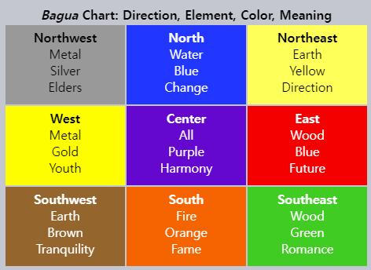
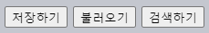
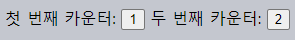
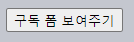
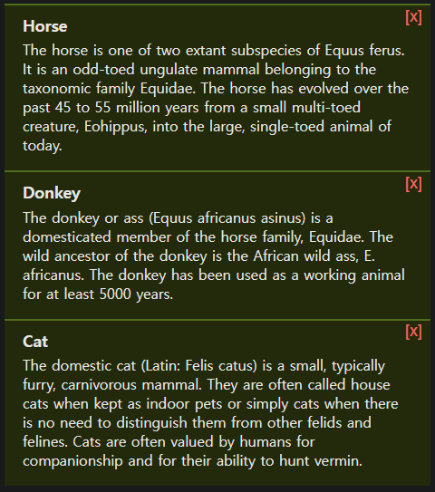
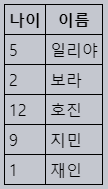
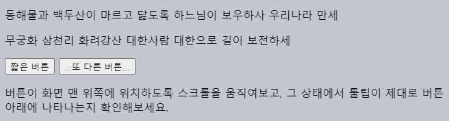

이벤트 위임
====

##### 강력한 이벤트 처리 패턴
- 캡처링 · 버블링 이용

##### 다수 요소 처리 시 유사 방식 사용
- 요소별 핸들러 X
  - 공통 조상 핸들러 1개
- `target` <sub>(이벤트 객체 프로퍼티)</sub>
  - 이벤트 발생 위치 파악

#### [팔괘도](https://en.wikipedia.org/wiki/Ba_gua) <sub>(Ba-Gua diagram)</sub>



```html
<table>
  <tr>
    <th colspan="3">
      <em>Bagua</em>
      Chart: Direction, Element, Color, Meaning
    </th>
  </tr>
  <tr>
    <td class="nw">
      <strong>Northwest</strong><br />
      Metal<br />Silver<br />Elders
    </td>
    <td class="n">…</td>
    <td class="ne">…</td>
  </tr>
  <tr>…</tr>
  <tr>…</tr>
</table>
```

##### 목표
- `<td>` <sub>(요소)</sub> 클릭 시 강조 효과 적용

##### `click` <sub>(이벤트)</sub> 핸들러 <sub>(`onclick`)</sub>
- 각 `<td>` <sub>(요소)</sub> X
- `<table>` <sub>(공통 조상 요소)</sub>
  - 공통 처리 핸들러 1개 할당

##### `<table>` <sub>(요소)</sub> 할당 핸들러
- 클릭 요소 감지 · 해당 칸 <sub>(`<td>` 요소)</sub> 강조
  - `target` <sub>(이벤트 객체 프로퍼티)</sub> 이용
```javascript
let selectedTd;

table.onclick = function(event) {

  // 이벤트 발생 위치 (요소)
  let target = event.target;

  // <td> 외 요소 무시
  if (target.tagName != 'TD') {
    return;
  }

  // 해당 칸 (<td> 요소) 강조
  highlight(target);
};

function highlight(td) {

  // 기존 강조된 칸 원상태 복구
  if (selectedTd) {
    selectedTd.classList.remove('highlight');
  }

  selectedTd = td;

  // 칸 (<td> 요소) 강조
  selectedTd.classList.add('highlight');
}
```

#### 개선점

##### `<td>` <sub>(요소)</sub> 내 중첩 요소 이벤트
- `target` <sub>(이벤트 객체 프로퍼티)</sub> 값
  - `<td>` <sub>(요소)</sub> X
  - 중첩 요소 <sub>(`<strong>` 등)</sub>

##### `td` <sub>(요소)</sub> 내 `<strong>` <sub>(요소)</sub> 클릭 시
- `target` <sub>(이벤트 객체 프로퍼티)</sub> 값
  - `<strong>` <sub>(요소)</sub>
```html
<td>
  <strong>Northwest</strong>
  …
</td>
```


##### `table.onclick` <sub>(핸들러)</sub>
- 이벤트 발생 위치 파악 필요 <sub>(중첩 요소 여부)</sub>
  - `target` <sub>(이벤트 객체 프로퍼티)</sub> 이용

##### 개선된 코드
```javascript
table.onclick = function(event) {

  /* 최근접 조상 <td> (요소) 검색
   검색 진행 방향
   - 이벤트 발생 요소 → 최상위 요소
   closest(css) (요소 메서드)
   - CSS 선택자 일치하는 최근접 조상 요소 반환
   */
  let td = event.target.closest('td');

  // event.target 부모 요소 중 <td> (요소) 無
  // - <td> (요소) 내부 X
  //   - 즉시 null 반환 (작업 중단)
  if (!td) {
    return;
  }

  /* 중첩 테이블 여부
   event.target
   - 현재 테이블 (팔괘도) 외부 <td> (요소) 가능성 有
     - 팔괘도 내 <td> (요소) 여부 확인
   */
  if (!table.contains(td)) {
    return;
  }

  // 칸 (<td> 요소) 강조
  highlight(td);
};
```

### 이벤트 위임 활용

#### 메뉴 구현

##### 메뉴 <sub>(요소)</sub>
- 저장하기 버튼
- 불러오기 버튼
- 검색하기 버튼

##### 기능 <sub>(메서드)</sub> 구현 객체
- `save`
  - 저장 기능
- `load`
  - 로드 기능
- `search`
  - 검색 기능

##### 버튼 · 기능 <sub>(메서드)</sub> 연결 방법 <sub>(2가지)</sub>
- a. 버튼별 독립 핸들러
- b. 메뉴 전체 핸들러 1개
  1. 버튼별 `data-action` <sub>(속성)</sub> 추가
     - 호출 메서드명 명시
  2. 핸들러
     - 속성값 읽고 메서드 실행
```html
<div id="menu">
  <button data-action="save">저장하기</button>
  <button data-action="load">불러오기</button>
  <button data-action="search">검색하기</button>
</div>

<script>
  class Menu {
    constructor(elem) {
      this._elem = elem;

      /* this.onClick (메서드) → this 바인딩
       바인딩 시
       - this → Menu (객체)
         - this[action] → menu[action]
       생략 시
       - this → elem (DOM 요소) 참조
         - this[action] → elem[action]
       */
      elem.onclick = this.onClick.bind(this);
    }

    // 버튼 기능 메서드
    save() { alert('저장하기'); }
    load() { alert('불러오기'); }
    search() { alert('검색하기'); }

    onClick(event) {
      let action = event.target.dataset.action;
      if (action) {
        this[action]();
      }
    };
  }

  new Menu(menu);
</script>
```



##### 장점
- 버튼별 핸들러 할당 코드 無 <sub>(코드량 ↓)</sub>
  - 버튼별 속성 추가 · 메서드명 명시
- 버튼 추가 · 제거 용이
  - 유연한 HTML 구조

#### CSS 클래스 vs `data` <sub>(속성)</sub>

##### CSS 클래스 사용
- `.action-save`
- `.action-load`
- `.action-search`
- 기타 등등

##### `data` <sub>(속성)</sub>
- 유연한 구조
- 의미론적 용이
- CSS 규칙 적용 가능

### '행동' 패턴

##### HTML '확장'
- 요소 내 선언적 방식 '행동' 추가
  - 특수 속성 · CSS 클래스 사용

#### 행동 패턴 구성 <sub>(2부분)</sub>

##### 1. 요소 커스텀 속성 추가
- 요소 행동 설명

##### 2. 전역 핸들러 <sub>(문서 전체 감지)</sub> 이벤트 추적
- 커스텀 속성 요소 이벤트 발생 시 작업 수행

#### 카운터 구현

##### `data-counter` <sub>(커스텀 속성)</sub>
- 클릭 시 숫자 증가 <sub>(요소 행동 부여)</sub>
```html
첫 번째 카운터: <input data-counter value="1" type="button">
두 번째 카운터: <input data-counter value="2" type="button">

<script>
  document.addEventListener('click', function(event) {

    // data-counter (커스텀 속성) 존재 시 실행
    if (event.target.dataset.counter != undefined) {
      event.target.value++;
    }
  });
</script>
```



##### 행동 부여 요소 <sub>(<… `data-counter`>)</sub>
- 생성 제한 無 <sub>(필요 시 추가 가능)</sub>

<br />

 **문서 레벨 핸들러 `addEventListener` 필수**

#### `document` <sub>(객체)</sub>

##### 핸들러 추가 시
- `addEventListener` <sub>(메서드)</sub> 사용
- `document.onclick` <sub>(HTML 속성)</sub> X
  - 충돌 가능 <sub>(핸들러 덮어쓰기)</sub>

##### 코드 내 여러 곳
- 다수 핸들러 추가 <sub>(일반적)</sub>

<br />

#### 토글러 구현

##### `data-toggle-id` <sub>(커스텀 속성)</sub>
- 클릭 시 특정 요소 표시 · 숨기기 <sub>(요소 행동 부여)</sub>
  - `<… id="커스텀 속성값">` <sub>(토글 대상 요소)</sub>
```html
<button data-toggle-id="subscribe-mail">
  구독 폼 보여주기
</button>

<form id="subscribe-mail" hidden>
  메일 주소: <input type="email">
</form>

<script>
  document.addEventListener('click', function(event) {
    let id = event.target.dataset.toggleId;

    if (!id) {
      return;
    }

    let elem = document.getElementById(id);
    elem.hidden = !elem.hidden;
  });
</script>
```



##### 특징 <sub>(JS 미니 프래그먼트 대안)</sub>
- 특정 기능 필요 요소 전체
  - '행동' 선언 <sub>(속성 명시)</sub>
  - 기능 구현 불필요 <sub>(편의성 ↑)</sub>
- 문서 레벨 핸들러 구현
  - 페이지 내 모든 요소 행동 적용 용이
- 다수 행동 조합 · 적용 가능

<br />

요약
====

#### 이벤트 위임

##### 주요 용도
- 다수 유사 요소 동일 핸들러 적용

##### 동작 알고리즘
1. 컨테이너
    - 핸들러 1개 추가
2. 이벤트 발생 요소 파악
    - `target` <sub>(이벤트 객체 프로퍼티)</sub> 사용
3. 요소 확인 후 이벤트 처리

##### 장점
- 다수 핸들러 X
  - 초기화 단순화
  - 메모리 절약
- 요소 추가 · 제거
  - 요소별 핸들러 수정 X <sub>(핸들러 無)</sub>
  - 속성 수정 <sub>(코드량 ↓)</sub>
- `innerHTML` 등 <sub>(유사 기능 스크립트)</sub> 사용 가능
  - 요소 그룹 추가 · 제거 <sub>(DOM 수정 용이)</sub>

##### 단점
- 이벤트 버블링 필수
  - 일부 이벤트 버블링 미발생
- 저레벨 핸들러
  - `stopPropagation()` 사용 불가능
- 컨테이너 수준 핸들러
  - 모든 하위 요소 이벤트 응답
    - CPU 작업 부하 ↑ <sub>(무시 가능 수준)</sub>

<br />

##  과제

### 이벤트 위임 사용해 메시지 숨기기

##### 메시지 목록
- 각 메시지 내 삭제 버튼 <sub>(`[x]`)</sub> 有

##### 참고
- 이벤트 핸들러 1개만 사용 <sub>(이벤트 위임)</sub>
  - 삭제 버튼 <sub>(`[x]`)</sub> 기능 구현



<br />


[정답](https://plnkr.co/edit/Gln3COwjRb6E7LA9?p=preview)

<hr />

### 트리 메뉴 구현하기

##### 트리 메뉴 작성
- 노드 클릭 시 자손 노드 표시 · 숨기기


##### 요구사항
- 이벤트 핸들러 1개만 사용 <sub>(이벤트 위임)</sub>
- 텍스트 노드 외부 <sub>(빈 공간)</sub> 클릭 무시

<br />


##### 1. 트리 내 모든 텍스트 `<span>` <sub>(요소)</sub> 감싸기
- `:hover` <sub>(CSS)</sub> 사용 가능
  - 마우스 오버 시 굵은 글씨 효과 적용
- `<span>` <sub>(요소)</sub> 너비 == 텍스트 너비
  - 텍스트에만 `click` <sub>(이벤트)</sub> 동작
  - 우측 빈 공간 無

##### 2. `tree` <sub>(루트 노드)</sub> 핸들러 <sub>(`click` 이벤트)</sub> 추가
- `<span>` <sub>(요소)</sub> 내 텍스트에만 동작

[정답](https://plnkr.co/edit/S9Y0B68rHv8DNbJx?p=preview)

<hr />

### 정렬 가능 테이블

##### 테이블 작성
- `<th>` <sub>(열 제목 요소)</sub>
  - 클릭 시 열 전체 정렬
  - 데이터 타입 정의 <sub>(`data-type` 커스텀 속성)</sub>
- 정렬 데이터 타입
  - 숫자 <sub>(`1번째 <th> 요소`)</sub>
  - 문자열 <sub>(`2번째 <th> 요소`)</sub>
  - 이 외 타입 X
- 정렬 함수
  - 타입 기준 정렬 수행
```html
<table id="grid">
  <thead>
    <tr>
      <th data-type="number">나이</th>
      <th data-type="string">이름</th>
    </tr>
  </thead>
  <tbody>
    <tr>
      <td>5</td>
      <td>일리야</td>
    </tr>
    <tr>
      <td>10</td>
      <td>보라</td>
    </tr>
    …
  </tbody>
</table>
```



##### 참고
- 정렬 시 테이블 크기 무관

<br />


[정답](https://plnkr.co/edit/44OZNPWoTdaMi1mR?p=preview)

<hr />

### 툴팁 보여주기

##### 툴팁 표시 코드 작성
- `data-tooltip` <sub>(속성)</sub>
  - 툴팁 표시 요소 내 명시
  - 속성값
    - 툴팁 내용
- 마우스 커서 오버 · 이탈 시
  - 툴팁 표시 · 제거
- 요소 하위 요소
  - 텍스트 노드

##### `data-tooltip` <sub>(속성)</sub> 예시
```html
<button data-tooltip="버튼 요소 길이보다 툴팁 길이가 훨씬 기네요.">짧은 버튼</button>
<button data-tooltip="두 줄짜리<br>툴팁">...또 다른 버튼...</button>
```



##### 요구사항
- 툴팁 · 요소 간격
  - `5px`
- 정렬
  - 요소 기준 중앙
- 위치
  - 요소 상단 <sub>(기본)</sub>
  - 요소 하단 <sub>(창 최상단 요소 위치)</sub>
- 크기
  - 창 크기 미만
- 내용
  - `data-tooltip` <sub>(속성)</sub> 값
    - HTML 가능

##### 필요 이벤트
- `mouseover`
  - 요소 외부 → 내부 포인터 이동
- `mouseout`
  - 요소 내부 → 외부 포인터 이동

##### 이벤트 핸들러 2개 사용 <sub>(이벤트 위임)</sub>
- `document` <sub>(객체)</sub>
- 마우스 포인터 이동 감지
  - `data-tooltip` <sub>(속성)</sub> 요소 내 · 외부

##### 참고
- 한 번에 1개 툴팁 표시

<br />


[정답](https://plnkr.co/edit/QEo1yOgcLdOZrUYn?p=preview)
