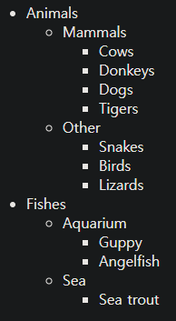

이벤트 위임
====

- 강력한 이벤트 핸들링 패턴
- 캡처링 · 버블링 이용

##### 다수 요소 대상 유사 방식 처리
- 요소별 핸들러 할당 X
- 공통 조상 핸들러 하나 할당
  - `event.target`
    - 이벤트 발생 위치 파악

#### ex\) [팔괘도](https://en.wikipedia.org/wiki/Ba_gua) <sub>(Ba-Gua diagram)</sub>


```html
<table>
  <tr>
    <th colspan="3"><em>Bagua</em> Chart: Direction, Element, Color, Meaning</th>
  </tr>
  <tr>
    <td class="nw"><strong>Northwest</strong><br>Metal<br>Silver<br>Elders</td>
    <td class="n">…</td>
    <td class="ne">…</td>
  </tr>
  <tr>… 2 more lines of this kind …</tr>
  <tr>… 2 more lines of this kind …</tr>
</table>
```

##### `<td>` <sub>(요소)</sub> 이벤트 처리
- 요소 클릭 시 해당 칸 강조
  - 갯수 무관
- 각 `<td>` <sub>(요소)</sub>
  - `onclick` <sub>(핸들러)</sub> 할당 X
- `<table>` <sub>(요소)</sub>
  - '모든 이벤트 잡아내는' 핸들러 할당

##### `<table>` <sub>(요소)</sub> 할당 핸들러
- 클릭 요소 감지 · 해당 칸 강조
  - `event.target` 이용
```javascript
let selectedTd;

table.onclick = function(event) {

  // 이벤트 발생 위치 (요소)
  let target = event.target;

  // 'TD' 외 요소 무시
  if (target.tagName != 'TD') return;

  // 해당 칸 강조
  highlight(target);
};

function highlight(td) {

  // 이미 강조된 칸
  // - 원상태 복구
  if (selectedTd) {
    selectedTd.classList.remove('highlight');
  }
  selectedTd = td;

  // td (요소) 강조
  selectedTd.classList.add('highlight');
}
```

#### 개선점

##### `<td>` <sub>(요소)</sub> 내 중첩 요소 발생 이벤트
- `event.target`
  - `<td>` <sub>(요소)</sub> X
  - 중첩 요소 <sub>(`<strong>` 등)</sub>
```html
<td>
  <strong>Northwest</strong>
  …
</td>
```

##### `td` <sub>(요소)</sub> 내 `<strong>` <sub>(요소)</sub> 클릭 시
- `event.target`
  - `<strong>` <sub>(요소)</sub>


##### `table.onclick` <sub>(핸들러)</sub>
- 이벤트 발생 위치 파악 <sub>(`<td>` 요소 내부 여부)</sub>
  - `event.target` 이용

##### 개선된 코드
```javascript
table.onclick = function(event) {

  /* elem.closest(selector) (메서드)
   최근접 조상 요소 반환
   - elem 상위 요소 중 selector 일치 조건
   이벤트 발생 요소 → 최상위 요소 (방향)
   - 최근접 <td> (요소) 검색
   */
  let td = event.target.closest('td');

  /* event.target ≠ <td> (요소)
   즉시 null 반환
   - 어떤 작업도 발생 X
   */
  if (!td) return;

  /* 중첩 테이블 존재 시
   event.target
   - 현재 테이블 외부 <td> (요소) 가능
   <td> (요소)
   - 팔괘도 내 위치 여부 확인
   */
  if (!table.contains(td)) return;

  // <td> (요소) 강조
  highlight(td);
};
```

### 이벤트 위임 활용하기

#### `Menu` 구현

##### 객체 <sub>(버튼 기능 메서드 구현)</sub>
- `save`
  - 저장하기 <sub>(버튼)</sub>
- `load`
  - 불러오기 <sub>(버튼)</sub>
- `search`
  - 검색하기 <sub>(버튼)</sub>

##### 메서드 · 버튼 연결 방법 <sub>(2가지)</sub>
1. 각 버튼 독립 핸들러 할당
2. 메뉴 전체 핸들러 하나 추가
    - 각 버튼 `data-action` <sub>(속성)</sub>
      - 호출 메서드 할당
   - 핸들러
     - 속성값 읽고 메서드 실행
```html
<div id="menu">
  <button data-action="save">저장하기</button>
  <button data-action="load">불러오기</button>
  <button data-action="search">검색하기</button>
</div>

<script>
  class Menu {
    constructor(elem) {
      this._elem = elem;

      /* this.onClick → this 바인딩
       바인딩 시
       - this → Menu (객체)
         - this[action] → menu[action]
       생략 시
       - this → elem (DOM 요소) 참조
         - this[action] → elem[action]
       */
      elem.onclick = this.onClick.bind(this);
    }

    save() { alert('저장하기'); }
    load() { alert('불러오기'); }
    search() { alert('검색하기'); }

    onClick(event) {
      let action = event.target.dataset.action;
      if (action) {
        this[action]();
      }
    };
  }

  new Menu(menu);
</script>
```


##### 장점
- 각 버튼 핸들러 할당 코드 X
  - 메서드 작성 · HTML 내 삽입 X
- 언제든 버튼 추가 · 제거 가능
  - 유연한 HTML 구조

#### `data` <sub>(속성)</sub> vs 클래스

##### `data` <sub>(속성)</sub>
- 의미론적으로 클래스보다 좀 더 나음

##### 속성 대신 클래스 사용 가능
- `.action-save`
- `.action-load`
- 기타 등등

##### CSS 규칙
- 적용 가능

### '행동' 패턴

##### 이벤트 위임
- 요소에 선언적 방식 '행동' 추가
  - 특별한 속성 · 클래스 사용

#### 행동 패턴 구성 <sub>(2부분)</sub>

##### 1. 요소 : 커스텀 속성 추가
- 요소 행동 설명

##### 2. 문서 전체 감지 핸들러
- 이벤트 추적
- 커스텀 속성 요소 이벤트 발생 시
  - 작업 수행

#### 카운터 구현하기
- `data-counter` <sub>(속성)</sub>
  - 행동 <sub>(버튼 클릭 시 숫자 증가)</sub> 부여
```html
첫 번째 카운터: <input type="button" value="1" data-counter>
두 번째 카운터: <input type="button" value="2" data-counter>

<script>
  document.addEventListener('click', function(event) {

    // 속성 존재 시 실행
    if (event.target.dataset.counter != undefined) {
      event.target.value++;
    }

  });
</script>
```


##### `data-counter` <sub>(속성)</sub> 요소
- 생성 제한 無
  - 필요 때마다 추가
- 새 행동 선언 <sub>(속성)</sub> 추가
  - HTML '확장'

<br />

 **문서 레벨 핸들러 : 항상 `addEventListener` 사용**

##### `document` <sub>(객체)</sub> 핸들러 할당
- `addEventListener` <sub>(메서드)</sub> 사용
- `document.onclick` X
  - 충돌 발생 가능
  - 새 핸들러
    - 이전 핸들러 덮어쓸 수 있음
- 코드 내 여기저기
  - 문서에 다수 핸들러 추가
    - 자연스러운 일

<br />

#### 토글러 구현

##### `data-toggle-id` <sub>(속성)</sub> 요소
- 클릭 시 해당 속성값 요소 토글
  - 보이기 · 숨기기
- `data-toggle-id` <sub>(속성)</sub> 추가 시
  - 요소 토글 가능
```html
<button data-toggle-id="subscribe-mail">
  구독 폼 보여주기
</button>

<form id="subscribe-mail" hidden>
  메일 주소: <input type="email">
</form>

<script>
  document.addEventListener('click', function(event) {
    let id = event.target.dataset.toggleId;
    if (!id) return;

    let elem = document.getElementById(id);

    elem.hidden = !elem.hidden;
  });
</script>
```


##### 행동 패턴 응용
- 특정 기능 필요 요소 전체
  - 기능 구현 불필요 <sub>(매우 편리)</sub>
  - '행동' 선언
- 문서 레벨 핸들러 구현 시
  - 페이지 내 모든 요소
    - 행동 쉽게 적용
- 한 요소
  - 다수 행동 조합해 적용
- JS 미니 프래그먼트 대안

<br />

요약
====

##### 이벤트 위임
- 유사 요소 동일 핸들러 적용

##### 동작 알고리즘
1. 컨테이너 하나
    - 핸들러 할당
2. 이벤트 발생 요소 파악
    - 핸들러 내 `event.target`
3. 요소 확인 후
    - 이벤트 처리

##### 장점
- 다수 핸들러 할당 X
  - 초기화 단순
  - 메모리 절약
- 요소 추가 · 제거 시
  - 해당 요소 할당 핸들러 수정 X
  - 속성 수정
    - 코드량 ↓
- DOM 수정 용이
  - `innerHTML` · 유사 기능 스크립트
    - 요소 덩어리 더하기 · 빼기 가능

##### 단점
- 이벤트 버블링 필수
  - 일부 이벤트 : 버블링 X
- 저레벨 할당 핸들러
  - `event.stopPropagation()` X
- 컨테이너 수준 할당 핸들러
  - 모든 하위 발생 이벤트 응답
    - CPU 작업 부하 ↑ <sub>(무시 가능 수준)</sub>

<br />

##  과제

### 이벤트 위임 사용해 메시지 숨기기

##### 메시지 목록
- 각 메시지 내 삭제 버튼 <sub>(`[x]`)</sub> 존재

##### 참고
- 이벤트 리스너 1개만 작성
  - 삭제 버튼 <sub>(`[x]`)</sub> 동작
- 이벤트 위임 사용


<br />


[정답](https://plnkr.co/edit/Gln3COwjRb6E7LA9?p=preview)

<hr />

### 트리 메뉴 구현하기

##### 트리 메뉴 구현
- 노드 클릭 시
  - 자손 노드 토글 <sub>(보이기 · 숨기기)</sub>



##### 요구사항
- 이벤트 핸들러 1개 사용
  - 이벤트 위임 사용
- 텍스트 노드 외부 <sub>(빈 곳)</sub> 클릭 시
  - 아무 일 발생 X

<br />


##### 1. 트리 내 모든 텍스트 : `<span>` <sub>(요소)</sub> 감싸기
- `:hover` <sub>(CSS)</sub> 적용
  - 마우스 오버 시 굵은 글씨 효과
- `<span>` <sub>(요소)</sub> 차지 너비 == 텍스트 너비
  - 텍스트에만 `click` <sub>(이벤트)</sub> 동작

##### 2. `tree` <sub>(루트 노드)</sub> 핸들러 추가
- `click` <sub>(이벤트)</sub> 처리 설정
  - `<span>` <sub>(요소)</sub> 감싼 텍스트에만 동작

[정답](https://plnkr.co/edit/S9Y0B68rHv8DNbJx?p=preview)

<hr />

### 정렬 기능 제공 표

##### 테이블 작성
- `<th>` <sub>(열 제목 요소)</sub>
  - 클릭 시 열 전체 정렬
  - 특정 데이터 타입 정의
- 정렬 데이터 타입
  - 숫자
  - 문자열
```html
<table id="grid">
  <thead>
    <tr>
      <th data-type="number">나이</th>
      <th data-type="string">이름</th>
    </tr>
  </thead>
  <tbody>
    <tr>
      <td>5</td>
      <td>일리야</td>
    </tr>
    <tr>
      <td>10</td>
      <td>보라</td>
    </tr>
    ...
  </tbody>
</table>
```


##### 참고
- 테이블 크기 관계 없이 동작

<br />


[샌드박스를 열어 정답을 확인해보세요.](https://plnkr.co/edit/44OZNPWoTdaMi1mR?p=preview)

<hr />

### 툴팁 보여주기

##### 툴팁 표시 코드 작성
- `data-tooltip` <sub>(속성)</sub> 요소
  - 마우스 커서
    - 오버 시
      - 툴팁 표시
    - 이탈 시
      - 툴팁 X
- 하위 요소
  - 텍스트만 존재

##### `data-tooltip` <sub>(속성)</sub> 값
```html
<button data-tooltip="버튼 요소 길이보다 툴팁 길이가 훨씬 기네요.">짧은 버튼</button>
<button data-tooltip="두 줄짜리<br>툴팁">...또 다른 버튼...</button>
```


##### 요구사항
- 툴팁 · 요소 간격
  - `5px`
- 정렬
  - 요소 기준 중앙
- 위치
  - 기본
    - 요소 상단
  - 요소: 창 최상단 위치 시
    - 요소 하단
- 크기
  - 창 크기 미만
- 내용
  - `data-tooltip` <sub>(속성)</sub> 값
    - HTML 가능

##### 필요 이벤트
- `mouseover`
  - 요소 안으로 포인터 이동
- `mouseout`
  - 요소 밖으로 포인터 이동

##### 이벤트 위임 사용
- 핸들러 2개 사용
  - `document` <sub>(요소)</sub>
- 마우스 포인터 안 · 밖 이동 감지
  - `data-tooltip` <sub>(속성)</sub> 요소

##### 참고
- 한 번에 1개 툴팁 표시

<br />


[정답](https://plnkr.co/edit/QEo1yOgcLdOZrUYn?p=preview)
