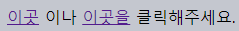
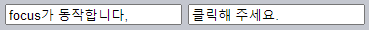
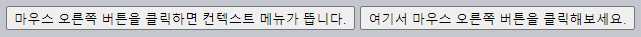
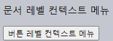
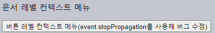
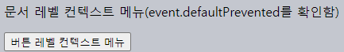
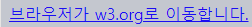
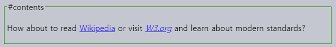
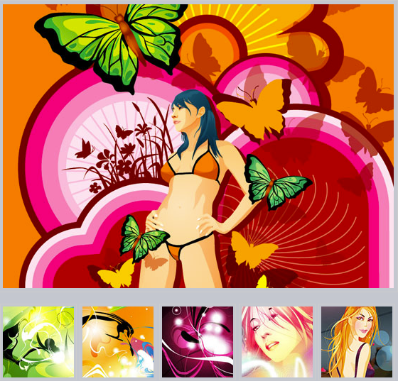

브라우저 기본 동작
====

##### 대다수 이벤트
- 발생 즉시 특정 동작 자동 수행 <sub>(브라우저)</sub>
  - 브라우저 기본 동작

##### 기본 동작 예시
- 링크 클릭
  - 해당 url 이동
- 폼 전송 버튼 클릭
  - 폼 서버 전송
- 마우스 버튼 누른 채로 글자 위 커서 이동
  - 글자 선택
- 기타 등등

##### 특정 상황
- 특정 동작 직접 구현
  - 브라우저 기본 동작 취소 필요

### 브라우저 기본 동작 취소

##### 브라우저 기본 동작 취소 방법 <sub>(2가지)</sub>
- a. `on<event>` <sub>(HTML 속성 · DOM 프로퍼티)</sub>
  - `preventDefault()` <sub>(이벤트 객체 메서드)</sub>
  - `false` 반환
- b. `addEventListener` <sub>(메서드)</sub>
  - `preventDefault()` <sub>(이벤트 객체 메서드)</sub>

##### 링크 <sub>(`<a>` 요소)</sub> 기본 동작 취소
- 클릭 시 해당 url 이동 X
```html
<!-- HTML 속성 -->
<a href="/" onclick="return false">이곳</a>을 클릭해주세요.
<a href="/" onclick="event.preventDefault()">이곳을</a> 클릭해주세요.
```



<br />

 **핸들러 `false` 반환 <sub>(예외 상황)</sub>**

##### 이벤트 핸들러 반환 값
- 보통 무시

##### `on<event>` <sub>(HTML 속성 · DOM 프로퍼티)</sub> 예외
- `false` 반환 시 기본 동작 취소

<br />

#### 메뉴 구현
```html
<ul id="menu" class="menu">
  <li>
    <a href="/html">HTML</a>
  </li>
  <li>
    <a href="/javascript">JavaScript</a>
  </li>
  <li>
    <a href="/css">CSS</a>
  </li>
</ul>
```


##### 각 항목 `<a>` <sub>(태그)</sub> 사용 <sub>(`<button>` 태그 X)</sub>
- '새 창에서 열기' 기능 <sub>(마우스 우측 버튼 메뉴)</sub>
  - `<button>` · `<span>` <sub>(태그)</sub> 불가능
- 검색 엔진 인덱싱 <sub>(색인)</sub> 중
  - `<a href="…">` <sub>(링크)</sub> 추적

##### `<a>` <sub>(요소)</sub> 브라우저 기본 동작 취소
```javascript
// 이벤트 위임 사용 (유연한 코드 구조)
// - 중첩 메뉴 추가 용이
// - CSS 적용 가능
menu.onclick = function(event) {
  let target = event.target;

  if (target.nodeName != 'A') {
    return;
  }

  let href = target.getAttribute('href');

  /* href 값 (url) 이용해 필요 작업 수행
   서버 데이터 읽어오기
   새 UI 생성
   기타 등등
   */
  alert( href );

  // 브라우저 동작 취소 (url 이동 X)
  // - 생략 시 기본 동작 수행 (url 이동)
  return false;
};
```

<br />

 **후속 이벤트**

#### 일부 이벤트 순차적 발생
- 1번째 이벤트 취소 시
  - 2번째 이벤트 미발생

##### `<input>` <sub>(필드)</sub> `mousedown` <sub>(이벤트)</sub>
- `focus` <sub>(이벤트)</sub> 유발
  - 앞 이벤트 <sub>(`mousedown`)</sub> 취소 시 미발생

##### `mousedown` <sub>(이벤트)</sub> 기본 동작 취소
- 1번째 필드 클릭 시
  - `focus` <sub>(이벤트)</sub> 발생
- 2번째 필드 클릭 시
  - `focus` <sub>(이벤트)</sub> 미발생
```html
<input value="focus가 동작합니다," onfocus="this.value=''">

<!-- mousedown (이벤트)
브라우저 기본 동작 취소
- return false
우회 방법
- 1번째 필드 포커스 중 Tab키 누르기
  - 2번째 필드 포커스 이동
-->
<input onmousedown="return false" onfocus="this.value=''" value="클릭해 주세요.">
```



<br />

### `passive` <sub>(`addEventListener` 옵션)</sub>

##### 브라우저 특정 정보 전달
- 핸들러 내 `preventDefault()` 호출 X
  - 브라우저 기본 동작 취소 X

#### 용도 <sub>(모바일 기기 이벤트)</sub>

##### `touchmove` <sub>(스크린 위 손가락 대고 이동)</sub> 등
- 기본 동작
  - 스크롤 발생
- `preventDefault()` 호출
  - 스크롤 취소

##### 스크롤 유발 이벤트 감지 <sub>(브라우저)</sub>
- 모든 핸들러 내 `preventDefault()`
  - 미호출 확인 시 스크롤 진행
    - 불필요 지연 발생
    - 화면 '덜덜 떨리는' 현상 발생

##### `passive: true` <sub>(옵션 설정)</sub>
- 브라우저 정보 전달
  - 핸들러 스크롤 <sub>(기본 동작)</sub> 취소 X
- 브라우저
  - 최대한 자연스럽게 스크롤
  - 이벤트 적절히 처리
- 일부 브라우저 <sub>(Firefox · Chrome 등)</sub>
  - `touch[start·move]` <sub>(이벤트)</sub> 기본값

### `defaultPrevented` <sub>(이벤트 객체 프로퍼티)</sub>

##### 기본 동작 취소 여부 <sub>(`boolean`)</sub>
- `true` <sub>(취소)</sub>
- `false` <sub>(유지)</sub>

#### 흥미로운 유스 케이스

##### `stopPropagation()` <sub>(이벤트 객체 메서드)</sub>
- 버블링 중단 <sub>(지양)</sub>

##### `defaultPrevented` <sub>(이벤트 객체 프로퍼티)</sub>
- 타 <sub>(상위)</sub> 이벤트 특정 정보 전달 가능
  - 이벤트 처리 완료 여부

##### `contextmenu` <sub>(이벤트)</sub>
- 마우스 우클릭 시 컨텍스트 메뉴 표시
  - 메뉴 외 표시 가능 <sub>(기본 동작 취소)</sub>
```html
<!-- 요소 자체 기본 동작 취소 -->
<button>
  마우스 우측 버튼을 클릭하면 컨텍스트 메뉴가 뜹니다.
</button>
<button oncontextmenu="alert('커스텀 메뉴가 뜨네요!'); return false">
  여기서 마우스 우측 버튼을 클릭해보세요.
</button>
```



```html
<!-- 문서 기본 동작 취소 -->
<p>문서 레벨 컨텍스트 메뉴</p>
<button id="elem">버튼 레벨 컨텍스트 메뉴</button>

<script>
  // 요소 우클릭 핸들러
  elem.oncontextmenu = function(event) {
    event.preventDefault();
    alert("버튼 컨텍스트 메뉴");
  };

  // 문서 우클릭 핸들러
  document.oncontextmenu = function(event) {
    event.preventDefault();
    alert("문서 컨텍스트 메뉴");
  };
</script>
```



##### 문서 기본 동작 취소 문제점
- `elem` <sub>(요소)</sub> 우클릭 시
  - `contextmenu` <sub>(이벤트)</sub> 2번 발생
    - `elem` <sub>(요소 · 버블링)</sub>
    - `document` <sub>(문서)</sub>

#### 해결

##### ⓐ `stopPropagation()` <sub>(이벤트 객체 메서드)</sub>
- `elem` <sub>(요소)</sub> 이벤트 버블링 중단
  - 외부 코드 클릭 정보 접근 불가능
```html
<p>문서 레벨 컨텍스트 메뉴</p>
<button id="elem">버튼 레벨 컨텍스트 메뉴(event.stopPropagation를 사용해 버그 수정)</button>

<script>
  elem.oncontextmenu = function(event) {
    event.preventDefault();

    // 요소 이벤트 버블링 중단
    event.stopPropagation();
    alert("버튼 컨텍스트 메뉴");
  };

  document.oncontextmenu = function(event) {
    event.preventDefault();
    alert("문서 컨텍스트 메뉴");
  };
</script>
```



##### ⓑ `defaultPrevented` <sub>(이벤트 객체 프로퍼티)</sub>
- `document` <sub>(문서 객체)</sub> 핸들러
  - 기본 동작 취소 여부 확인
```html
<p>문서 레벨 컨텍스트 메뉴(event.defaultPrevented를 확인함)</p>
<button id="elem">버튼 레벨 컨텍스트 메뉴</button>

<script>
  elem.oncontextmenu = function(event) {
    event.preventDefault();
    alert("버튼 컨텍스트 메뉴");
  };

  document.oncontextmenu = function(event) {

    // 기본 동작 취소 이벤트 미처리
    if (event.defaultPrevented) {
      return;
    }

    event.preventDefault();
    alert("문서 컨텍스트 메뉴");
  };
</script>
```



<br />

 **`stopPropagation` vs `preventDefault`**

##### 명백히 다른 메서드 <sub>(연관성 無)</sub>
- 버블링 중단 vs 기본 동작 취소

<br />

 **중첩 컨텍스트 메뉴 아키텍처**

##### 타 구현 방법
- `document.oncontextmenu` 전용 핸들러
  - 전역 객체 내 구현
  - 타 핸들러 저장
- 전역 객체
  - 모든 우클릭 이벤트 반응
  - 적절한 내부 핸들러 실행

##### 단점
- 컨텍스트 메뉴 관련 각 코드 조각
  - 해당 전역 객체 인지 필요
  - 자체 `contextmenu` 핸들러 X
    - 해당 전역 객체 의존

<br />

요약
====

#### 각 이벤트 대응 브라우저 기본 동작 <sub>(일부)</sub>

##### `mousedown`
- 마우스 이동 시작 위치 선택 시작

##### `<input type="checkbox">` <sub>(요소)</sub> `click`
- `input` <sub>(필드)</sub> 선택 · 해제

##### `submit` <sub>(폼 내 `<input type="submit">` 클릭 · Enter)</sub>
- 폼 서버 전송

##### `keydown` <sub>(키 누르기)</sub>
- 텍스트 박스 내 글자 추가
- 이 외 타 동작 수행

##### `contextmenu` <sub>(마우스 우클릭)</sub>
- 브라우저 컨텍스트 메뉴 표시

##### 기타 등등
- 이 외 다양한 기본 동작 수행

#### 브라우저 기본 동작 취소

##### a. `on<event>` <sub>(HTML 속성 · DOM 프로퍼티)</sub>
- `preventDefault()` <sub>(이벤트 객체 메서드)</sub>
- `return false`

##### b. `addEventListener` <sub>(메서드)</sub>
- `preventDefault()` <sub>(이벤트 객체 메서드)</sub>

#### `passive: true` <sub>(`addEventListener` 옵션)</sub>

##### 브라우저 특정 정보 전달
- 핸들러 내 `preventDefault()` 호출 X
  - 브라우저 기본 동작 취소 X

##### `touch[start·move]` <sub>(모바일 기기 이벤트)</sub> 처리 시 유용
- 스크롤 시작 시 모든 핸들러 처리 X

##### `defaultPrevented` <sub>(이벤트 객체 프로퍼티)</sub>
- 기본 동작 취소 여부 <sub>(`boolean`)</sub>
  - `true` <sub>(취소)</sub>
  - `false` <sub>(유지)</sub>

<br />

 **기본 동작 취소 남용 지양**

##### 브라우저 기본 동작 취소
- 자유롭게 요소 동작 변경 가능
  - `<a>` <sub>(링크)</sub> ↔ `<button>` <sub>(버튼)</sub>
  - 기타 등등

##### HTML 요소 의미 유지 필요
- ex\) `<a>` <sub>(링크)</sub>
  - 페이지 이동 동작
  - 버튼 동작 X
- 이점
  - '좋은 코드'
  - 접근성 측면 일조

##### `<a>` <sub>(링크 요소)</sub> 기본 동작 취소 주의점
- '새 창에서 열기' 기능 <sub>(마우스 우측 버튼 메뉴)</sub>
  - 많은 사용자들 사용
- `button` <sub>(`<a>` 링크 유사 요소)</sub>
  - 링크 관련 기능 미작동 <sub>('새 창에서 열기' 등)</sub>

<br />

##  과제

### `return false` 미작동

##### 미작동 이유
- 기본 동작 작동 이유 유추
```html
<script>
  function handler() {
    alert( "…" );
    return false;
  }
</script>

<a onclick="handler()" href="https://w3.org">브라우저가 w3.org로 이동합니다.</a>
```



##### 코드 수정
- 기본 동작 <sub>(url 이동)</sub> 취소

<br />


##### HTML 속성 핸들러 할당 과정
1. `on*` <sub>(속성)</sub> 값 읽기 <sub>(브라우저)</sub>
2. 속성값 내용 그대로 핸들러 생성

##### <`… onclick="handler()">` 생성 핸들러
- `onclick` <sub>(속성)</sub> 값
  - 핸들러 함수 본문 구성
- 핸들러 함수 본문
  - `handler` <sub>(함수)</sub> 호출
    - 반환 값 <sub>(`false`)</sub> 미사용
  - `false` 미반환
```javascript
function(event) {

  // 속성값 → 핸들러 함수 본문
  // - handler (함수) 반환 값 미사용
  // - false 미반환 (return false X)
  handler()
}
```

##### 링크 이동 취소
- `preventDefault()` <sub>(이벤트 객체 메서드)</sub>
- `return false`
```html
<script>
  function handler() {
    alert("…");
    event.preventDefault(); // ①
    return false;           // ②
  }
</script>

<!-- ③ handler 반환 값 (false) 반환 -->
<a onclick="return handler()" href="https://w3.org">w3.org</a>
```

<hr />

### 요소 내 링크 잡아내기

##### 기능 구현
- `<… id="contents">` <sub>(요소)</sub> 내 링크 클릭 시
  - 이동 여부 질문 표시
- 'No' 대답 시 이동 X <sub>(사이트 내 잔류)</sub>



##### 주의
- 요소 내 HTML 항시 동적 로드 · 재생성 가능
  - 모든 개별 링크 핸들러 설정 X
  - 이벤트 위임 사용
- 중첩 태그 존재 가능
  - `<… id="contents">` <sub>(요소)</sub>
  - `<a>` <sub>(링크 요소)</sub>
```html
<div id="contents">
  <span>…</span>
  <a href="…">
    <i>…</i>
  </a>
</div>
```

<br />


##### 이벤트 위임
1. `contents.onclick` <sub>(이벤트)</sub> 반응
2. `confirm` <sub>(함수)</sub>
    - 이동 여부 질문 표시
- url <sub>(`<a>` 요소)</sub>
  - `getAttribute('href')` 권장
  - `href` X

##### 타 방법 <sub>(이동 질문 X)</sub>
- 'logging' 요청 서버 전송
  - 사용자 떠난 위치 저장
- 내용 로드 후 현재 페이지 내 즉시 표시

[정답](https://plnkr.co/edit/uBMDMDDf8mIiCQRV?p=preview)

<hr />

### 이미지 갤러리

##### 이미지 갤러리 작성
- 섬네일 클릭 시 이미지 변경



##### 참고
- 이벤트 위임 사용

<br />


##### 상위 요소 핸들러 클릭 이미지 추적
- `<a>` <sub>(링크 요소)</sub> 클릭 시
  - `#largeImg` <sub>(요소)</sub> `src` <sub>(속성)</sub> 값 변경
    - 섬네일 `href` <sub>(속성)</sub> 값

[정답](https://plnkr.co/edit/0rOQcjAnTYfIt7Lm?p=preview)
