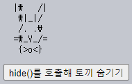
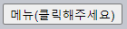

커스텀 이벤트 디스패치
====

##### JS
- 새 이벤트 직접 생성 가능
  - 내장 이벤트
  - 커스텀 이벤트

##### 내장 이벤트 <sub>(테스팅 자동화 용이)</sub>
- `click`
- `mousedown`
- 기타 등등

##### 커스텀 이벤트 <sub>(그래픽 컴포넌트 작성 시 사용)</sub>
- 표준 외 새 이벤트
- ex\) 메뉴 <sub>(JS 기반)</sub>
  - 루트 요소 커스텀 이벤트 생성
    - `open` <sub>(메뉴 열기)</sub>
    - `select` <sub>(항목 선택)</sub>
    - 기타 등등
  - 외부 코드
    - 핸들러 통해 동작 파악

### `Event` <sub>(클래스)</sub>

##### 내장 이벤트 클래스
- 계층 구조 형성
  - DOM 요소 클래스 유사
- 최상위
  - [`Event`](https://dom.spec.whatwg.org/#event) <sub>(클래스)</sub>

#### 생성자
```javascript
let event = new Event(type[, options]);
```

##### `type` <sub>(문자열)</sub>
- 이벤트명
  - 내장 이벤트 <sub>(`'click'` 등)</sub>
  - 커스텀 이벤트 <sub>(`'my-event'` 등)</sub>

##### `[options]` <sub>(객체)</sub>
- `bubbles` <sub>(`boolean`)</sub>
  - 이벤트 버블링 여부
  - `false` <sub>(기본값)</sub>
- `cancelable` <sub>(`boolean`)</sub>
  - 기본 동작 취소 가능 여부
  - `false` <sub>(기본값)</sub>

### `dispatchEvent(event)` <sub>(요소 메서드)</sub>

##### 요소 이벤트 실행 과정
1. 이벤트 객체 생성
2. 요소 `dispatchEvent(event)` 호출

##### `click` <sub>(이벤트)</sub> 생성 · 실행 <sub>(실제 버튼 클릭 X)</sub>
- 이벤트 핸들러 동작
```html
<button id="elem" onclick="alert('클릭!');">자동으로 클릭 되는 버튼</button>

<script>
  let event = new Event("click");
  elem.dispatchEvent(event);
</script>
```

<br />

 **`isTrusted` <sub>(이벤트 객체 프로퍼티)</sub>**

##### 사용자 행동 이벤트 유발 여부 <sub>(`boolean`)</sub>
- `true`
  - 사용자 행동 통해 이벤트 생성
- `false`
  - 스크립트 통해 이벤트 생성

<br />

### 커스텀 이벤트 버블링

##### 커스텀 이벤트 생성
- 이벤트명
  - `'hello'`
- 버블링 활성화
  - `{bubbles: true}`
- 이벤트 처리
  - `document` <sub>(객체)</sub>
```html
<h1 id="elem">Hello from the script!</h1>

<script>
  /* ① document (객체) 핸들러 설정
   addEventListener (메서드)
   - 커스텀 이벤트 핸들러 설정 시 사용
   on<event> (HTML 속성 · DOM 프로퍼티)
   - 내장 이벤트 전용
   - 커스텀 이벤트 미동작
     - ex) document.onhello
   */
  document.addEventListener("hello", function(event) {
    alert("Hello from " + event.target.tagName);
  });

  /* ② hello (커스텀 이벤트) 생성
   elem (요소)
   - 이벤트 디스패치 (발생)
   {bubbles: true} 명시적 설정 필요
   - 미설정 시 버블링 미발생
   */
  let event = new Event("hello", {bubbles: true});
  elem.dispatchEvent(event);

  // document (객체) 핸들러 동작
  // - "Hello from H1" 얼럿 창 출력
</script>
```

##### 내장 · 커스텀 이벤트
- 버블링 메커니즘 동일
  - 동일 이벤트 단계 <sub>(3가지)</sub> 有

### 다양한 이벤트

#### [UI 이벤트](https://www.w3.org/TR/uievents/) 섹션 <sub>(명세서)</sub>

##### 다양한 UI 이벤트 클래스 명시
- `UIEvent`
- `FocusEvent`
- `MouseEvent`
- `WheelEvent`
- `KeyboardEvent`
- 기타 등등

##### 생성 시 관련 내장 클래스 사용 필수 <sub>(`Event` 클래스 X)</sub>
- ex\) `new MouseEvent("click")`
  - 마우스 클릭 이벤트
- `new Event(…)`
  - 전용 표준 프로퍼티 無

##### `new MouseEvent("click")`
- 전용 표준 프로퍼티 설정
  - `clientX`
  - `clientY`
```javascript
let event = new MouseEvent("click", {
  bubbles: true,
  cancelable: true,
  clientX: 100,
  clientY: 100
});

alert(event.clientX); // 100
```

##### `new Event("click")`
- 전용 표준 프로퍼티 無
```javascript
let event = new Event("click", {
  bubbles: true,
  cancelable: true,
  clientX: 100, // 無
  clientY: 100  // 無
});

// 알 수 없는 프로퍼티
alert(event.clientX); // undefined

// 생성 후 직접 명시 가능
event.clientX = 100;
```

##### 브라우저 생성 UI 이벤트
- 정확한 이벤트 타입 준수 권장

##### UI 이벤트별 표준 프로퍼티 목록
- 명세서 확인
  - ex\) [`MouseEvent`](https://www.w3.org/TR/uievents/#mouseevent)

### 커스텀 이벤트

##### [`CustomEvent`](https://dom.spec.whatwg.org/#customevent) <sub>(클래스)</sub>
- `Event` <sub>(클래스)</sub> 유사
- 2번째 인수 <sub>(옵션 객체)</sub> 내 `detail` <sub>(프로퍼티)</sub>
  - 커스텀 이벤트 관련 정보 명시 · 전달
```html
<h1 id="elem">이보라님, 환영합니다!</h1>

<script>
  // 추가 정보
  // - 이벤트 함께 핸들러 전달
  elem.addEventListener("hello", function(event) {
    alert(event.detail.name);
  });

  elem.dispatchEvent(new CustomEvent("hello", {
    detail: {name: "보라"}
  }));
</script>
```

##### `detail` <sub>(객체형 프로퍼티)</sub>
- 모든 값 저장 가능
- 타 이벤트 전용 표준 프로퍼티 충돌 방지
  - `Event` 객체 내 추가 프로퍼티
    - 충돌 가능성 有
- `new CustomEvent` <sub>(생성자)</sub>
  - 코드 자체 '커스텀 이벤트' 설명

### 기본 동작

##### 대다수 이벤트
- 기본 동작 함께 실행
  - 링크 클릭
    - 해당 url 이동
  - 폼 전송 버튼 클릭
    - 폼 서버 전송
  - 기타 등등

##### 커스텀 이벤트
- 기본 동작 無
- 기본 동작 설정 가능
  - 이벤트 디스패치 코드 연계

##### `preventDefault()` <sub>(이벤트 객체 메서드)</sub>
- 기본 동작 취소

##### `dispatchEvent(event)` <sub>(요소 메서드)</sub>
- 기본 동작 취소 시 `false` 반환
- 이벤트 디스패치 코드
  - 반환 값 <sub>(`false`)</sub> 통해 취소 인지

#### 토끼 숨기기

##### 구성
- `<… id="rabbit">` <sub>(요소)</sub>
- `hide()` <sub>(함수)</sub>
  - `hide` <sub>(이벤트)</sub> 실행
  - 타 코드들에 이벤트 실행 여부 알림

##### `addEventListener('hide', …)`
- `hide` <sub>(이벤트)</sub> 처리 핸들러 설정

##### `preventDefault()` <sub>(이벤트 객체 메서드)</sub>
- `hide` <sub>(이벤트)</sub> 기본 동작 <sub>(토끼 숨기기)</sub> 취소
  - 화면 내 토끼 미제거
```html
<pre id="rabbit">
  |\   /|
   \|_|/
   /. .\
  =\_Y_/=
   {>o<}
</pre>
<button onclick="hide()">hide()를 호출해 토끼 숨기기</button>

<script>
  function hide() {

    // ① 커스텀 이벤트 생성
    let event = new CustomEvent("hide", {

      // 기본 동작 취소 기능 활성화
      // - 미설정 시 preventDefault() 미동작
      cancelable: true
    });

    // ③ 기본 동작 취소 시 실행
    if (!rabbit.dispatchEvent(event)) {
      alert('기본 동작이 핸들러에 의해 취소되었습니다.');

    // 기본 동작
    } else {
      rabbit.hidden = true;
    }
  }

  rabbit.addEventListener('hide', function(event) {
    if (confirm("preventDefault를 호출하시겠습니까?")) {

      // ② 기본 동작 취소
      event.preventDefault();
    }
  });
</script>
```



### 중첩 이벤트

##### 보통 큐 내 이벤트 처리 <sub>(선입선출)</sub>
- ex\) `click` <sub>(이벤트)</sub> 처리 중
1. 마우스 움직여 새 이벤트 <sub>(`mousemove`)</sub> 발생
2. `click` <sub>(이벤트)</sub> 처리 후
    - `mousemove` 핸들러 호출

#### 중첩 이벤트

##### 종류
- 이벤트 내 `dispatchEvent`
- 이벤트 핸들러 내 타 이벤트 생성 메서드 호출
- 기타 등등

##### 처리 시점
- 즉시 처리 <sub>(동기적)</sub>
- 새 <sub>(중첩)</sub> 이벤트 핸들러 호출 후
  - 현재 이벤트 처리 재개

##### `menu-open` <sub>(이벤트)</sub>
- `click` <sub>(이벤트)</sub> 처리 도중 발생
- 즉시 처리 <sub>(`click` 핸들러 처리 대기 X)</sub>
```html
<button id="menu">메뉴(클릭해주세요)</button>

<script>
  menu.onclick = function() {
    alert(1);

    // 중첩 이벤트 전파 · 처리
    // - 외부 코드 (onclick) 처리 도중 완료
    menu.dispatchEvent(new CustomEvent("menu-open", {
      bubbles: true
    }));

    alert(2);
  };

  // 중첩 이벤트 처리 시점
  // - 1 (출력) · 2 (출력) 사이
  document.addEventListener('menu-open', () => alert('중첩 이벤트'));

  // 얼럿 창 출력 순서
  // - 1 → 중첩 이벤트 → 2
</script>
```



##### 다양한 처리 순서 변경 방법
- a. 중첩 이벤트 생성 코드 위치 변경
  - ex\) `onclick` <sub>(핸들러)</sub> 끝부분
- b. 지연시간 0 `setTimeout` <sub>(메서드)</sub>
  - 중첩 이벤트 감싸기
- 기타 등등
```html
<button id="menu">Menu (click me)</button>

<script>
  menu.onclick = function() {
    alert(1);

    // 지연시간 0 setTimeout (메서드)
    // - 현재 코드 (onclick 핸들러) 종료 후 실행
    setTimeout(function() {
      menu.dispatchEvent(new CustomEvent("menu-open", {
        bubbles: true
      }));
    });

    alert(2);
  };

  // 중첩 이벤트 처리 시점
  // - 1 (출력) · 2 (출력) 이후
  document.addEventListener('menu-open', () => alert('중첩 이벤트'));

  // 얼럿 창 출력 순서
  // - 1 → 2 → 중첩 이벤트
</script>
```

<br />

요약
====

#### `Event` <sub>(범용적 클래스)</sub>

##### 생성자
```javascript
let event = new Event(type[, options]);
```
##### `name` <sub>(문자열)</sub>
- 이벤트명

##### `[options]` <sub>(객체)</sub>
- `bubbles` <sub>(`boolean`)</sub>
  - 이벤트 버블링 여부
  - `false` <sub>(기본값)</sub>
- `cancelable` <sub>(`boolean`)</sub>
  - 기본 동작 취소 가능 여부
  - `false` <sub>(기본값)</sub>

##### 네이티브 이벤트 클래스 <sub>(`MouseEvent` 등)</sub> 생성자
- 전용 표준 프로퍼티 有
  - ex\) `clientX` <sub>(`MouseEvent`)</sub>

#### `CustomEvent` <sub>(커스텀 이벤트 클래스)</sub>

##### 생성자 2번째 인수 <sub>(옵션 객체)</sub> 추가 프로퍼티 <sub>(객체)</sub>
- `detail` <sub>(객체 · 2번째 인수 내)</sub>
  - 커스텀 이벤트 관련 정보 명시 · 전달

#### 커스텀 이벤트명 → 내장 이벤트명

##### 사용 가능 <sub>(지양)</sub>
- 대다수 경우 설계 관점 나쁜 영향 有

##### 예외적 사용 경우
- 서드파티 라이브러리 동작 정상화
  - 유일한 상호작용 수단
- 테스팅 자동화
  - 내장 이벤트 실행 시
    - 사용자 동작 X
    - 코드 조작
