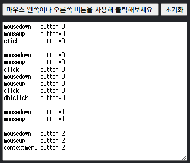
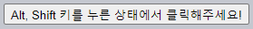
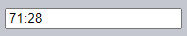
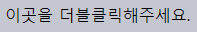
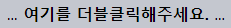
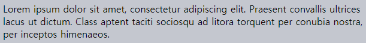
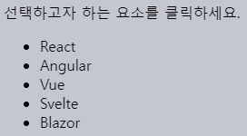

마우스 이벤트
====

##### 마우스 외 타 장치 내 발생 가능
- 핸드폰
- 태블릿
- 기타 등등

### 마우스 이벤트 종류 <sub>(일부)</sub>

##### `mouse[down·up]`
- 마우스 좌측 버튼 누르기 · 떼기

##### `mouse[over·out]`
- 마우스 커서 이동 <sub>(외부 ↔ 내부)</sub>

##### `mousemove`
- 마우스 이동

##### `click`
- 마우스 좌클릭
- `mouse[down·up]` <sub>(이벤트)</sub> 연달아 발생

##### `dblclick` <sub>(최근 사용 빈도 ↓)</sub>
- 마우스 더블 좌클릭

##### `contextmenu`
- 마우스 우클릭
- 특별 단축키
  - 동일 기능 수행 가능 <sub>(동일 이벤트 X)</sub>

### 마우스 이벤트 순서

##### 동작 1개 → 다수 이벤트 발생 가능
- ex\) 마우스 좌클릭
  1. `mousedown`
  2. `mouseup`
  3. `click`
- 실행 순서 결정
  - 내부 규칙

##### 버튼 클릭 이벤트 확인
- 모든 마우스 이벤트 기록 <sub>(하단 창)</sub>



### 마우스 버튼

#### `button` <sub>(프로퍼티)</sub>
- 클릭 연관 이벤트 프로퍼티
- 이벤트 발생 버튼 정보

|주요 값|버튼|
|:---:|---|
|`0`|좌 <sub>(주)</sub>|
|`1`|중 <sub>(보조)</sub>|
|`2`|우 <sub>(2번째 주)</sub>|
|`3`|X1 <sub>(뒤로)</sub>|
|`4`|X2 <sub>(앞으로)</sub>|

##### `click` · `contextmenu` <sub>(이벤트)</sub>
- 이벤트 발생 버튼 명확 <sub>(보통 프로퍼티 미사용)</sub>
  - 좌 <sub>(`click`)</sub>
  - 우 <sub>(`contextMenu`)</sub>

##### `mouse[down·up]` <sub>(이벤트)</sub>
- 프로퍼티 사용 필요
  - 모든 마우스 버튼 발생 가능

##### 대다수 마우스
- 좌 <sub>(`0`)</sub> · 우 <sub>(`2`)</sub> 버튼만 有

##### 터치 지원 기기
- 유사 이벤트 생성

##### [`buttons`](https://developer.mozilla.org/en-US/docs/Web/API/MouseEvent/buttons) <sub>(프로퍼티)</sub>
- 다수 버튼 한꺼번에 눌렀을 때
  - 해당 버튼들 정보 <sub>(정수)</sub> 저장
- 사용 빈도 ↓

<br />

 **구시대 `which` <sub>(이벤트 객체 非표준 프로퍼티)</sub>**

##### `which` <sub>(이벤트 객체 非표준 프로퍼티)</sub>
- 클릭 버튼 정보 저장
- 구식 코드 내 발견
- 현재 미지원 <sub>(사용 지양)</sub>

|값|버튼|
|:---:|:---:|
|`1`|좌|
|`2`|중|
|`3`|우|

<br />

### 보조키 <sub>(`shift` · `alt` · `ctrl` · `meta`)</sub>

##### 보조키 정보 프로퍼티
- 마우스 이벤트 발생 시 함께 누른 키 정보 저장

##### 보조키별 지원 프로퍼티 <sub>(`boolean`)</sub>

|프로퍼티|키|
|---|---|
|`shiftKey`|Shift|
|`altKey`|Alt · Opt <sub>(MacOS)</sub>|
|`ctrlKey`|Ctrl|
|`metaKey`|Cmd <sub>(MacOS)</sub>|

##### `onclick` <sub>(핸들러)</sub> 동작 조건 설정
- 동시 누르기
  - 마우스 좌측 버튼
  - Alt 키
  - Shift 키
```html
<button id="button">Alt, Shift 키를 누른 상태에서 클릭해주세요!</button>

<script>
  // 마우스 좌클릭
  button.onclick = function(event) {

    // Alt · Shift 키
    if (event.altKey && event.shiftKey) {
      '야호!';
    }
  };
</script>
```



<br />

 **MacOS <sub>(Ctrl → Cmd)</sub>**

##### Windows · Linux
- Alt · Shift · Ctrl 키 지원

##### MacOS
- Alt · Shift · Ctrl 키 지원
- Cmd 키 추가 지원
  - `metaKey` <sub>(프로퍼티)</sub>

##### 대다수 응용프로그램 단축키 조합
- Ctrl <sub>(Windows · Linux)</sub>
  - Ctrl + Enter
  - Ctrl + A
  - 기타 등등
- Cmd <sub>(MacOS)</sub>
  - Cmd + Enter
  - Cmd + A
  - 기타 등등

##### Mac 사용자 지원 프로그램
- ex\) Cmd 키 + `click` <sub>(이벤트)</sub>
  - Ctrl 키 + `click` <sub>(이벤트)</sub> 동일 효과

##### Ctrl 키 강제 <sub>(Ctrl 키 + 마우스 좌클릭)</sub>
- MacOS <sub>(마우스 우클릭 해석)</sub>
  - `contextMenu` <sub>(이벤트)</sub>
- Windows · Linux
  - `click` <sub>(이벤트)</sub>

##### 동일 경험 구현 <sub>(운영체제 무관)</sub>
- `ctrlKey` · `metaKey` <sub>(프로퍼티)</sub> 함께 사용
```javascript
if (event.ctrlKey || event.metaKey) {…}
```

<br />

 **모바일 장치**

##### 키보드 구성 기기
- 단축키 지원 시 사용자 경험 ↑

##### 키보드 부재 기기 多 <sub>(모바일 장치 등)</sub>
- 보조 키 부재 사용자 지원 방법 고려

<br />

### 이벤트 좌표

##### 마우스 이벤트 좌표 정보 <sub>(2가지)</sub>
1. `client[X·Y]` <sub>(클라이언트 좌표)</sub>
   - 창 좌상단 거리
   - 스크롤 영향 有
     - 스크롤 시 값 변화
2. `page[X·Y]` <sub>(페이지 좌표)</sub>
   - 문서 좌상단 거리
   - 스크롤 영향 無

##### 창 <sub>(500 x 500)</sub> 내 `client[X·Y]` 값 <sub>(마우스 커서 위치)</sub>
- 좌상단 모서리
  - `0` <sub>(스크롤 이동 시 변화 無)</sub>
- 정 가운데
  - `250` <sub>(스크롤 이동 시 변화 無)</sub>
- `position: fixed` <sub>(CSS)</sub> 유사

##### `input` <sub>(필드)</sub> 내 `client[X·Y]` 값 <sub>(마우스 커서 위치)</sub>
- `iframe` 기준 좌표 정보 계산 <sub>(`frame` 내 구현)</sub>
```html
<input onmousemove="this.value=event.clientX+':'+event.clientY" value="Mouse over me">
```



### `mousedown` <sub>(이벤트)</sub> · 선택 취소

##### 글자 위 마우스 더블클릭 → 글자 선택 <sub>(기본 동작)</sub>
- 사용자 경험 악영향 경우 有

##### `dblclick` <sub>(이벤트)</sub> 발생 시 경고 창 표시
- 부수효과 발생
  - 핸들러 실행 동시 글자 선택
```html
<span ondblclick="alert('dblclick')">이곳을 더블클릭해주세요.</span>
```



##### 마우스 좌측 버튼 누른 채 커서 이동 → 글자 선택 <sub>(기본 동작)</sub>
- 사용자 경험 악영향 경우 有
- 다양한 기본 동작 비활성화 방법 有
  - [Selection and Range](../06.%20Miscellaneous/02.%20Selection%20and%20Range.md) <sub>(챕터)</sub>

##### 글자 선택 <sub>(기본 동작 · 부수효과)</sub> 비활성화
- `mousedown` <sub>(이벤트)</sub> 기본 동작 비활성화
```html
…
<b ondblclick="alert('클릭!')" onmousedown="return false">
  여기를 더블클릭해주세요.
</b>
…
```



##### 취소된 기본 동작
- 더블클릭 <sub>(단어 선택 X)</sub>
- 드래그 <sub>(글자 선택 X)</sub>
- 우회 방법
  - `…` 부분부터 드래그 시작
    - 글자 선택 가능

<br />

 **복사 방지**

##### `oncopy` <sub>(이벤트)</sub> 기본 동작 비활성화
- 방문자 내용 복사 · 붙여넣기 방지
  - 콘텐츠 보호 목적
```html
<div oncopy="'불법 복제를 예방하기 복사 기능을 막아놓았습니다!';return false">
  Lorem ipsum dolor sit amet, consectetur adipiscing elit. Praesent convallis ultrices lacus ut dictum. Class aptent taciti sociosqu ad litora torquent per conubia nostra, per inceptos himenaeos.
</div>
```



##### 상자 내 글자 선택 후 복사 불가능
- `oncopy` <sub>(이벤트)</sub> 기본 기능 비활성화
- 우회 방법
  - 페이지 소스코드 보기

<br />

요약
====

#### 마우스 이벤트 프로퍼티

##### 버튼 관련
- `button[s]`

##### 보조키 관련 <sub>(`boolean`)</sub>
- `altKey`
- `ctrlKey`
- `shiftKey`
- `metaKey` <sub>(MacOS)</sub>
- Ctrl 키 조합 코드 작성 시
  - Cmd 키 <sub>(MacOS)</sub> 지원 권장
```javascript
// 모든 OS 사용자 지원
if (e.ctrlKey || e.metaKey) {…}
```

##### 좌표 관련
- `client[X·Y]` <sub>(클라이언트)</sub>
- `page[X·Y]` <sub>(페이지)</sub>

##### `mousedown` <sub>(이벤트)</sub> 기본 동작
- 글자 선택 수향
- 사용자 경험 악영향 시 비활성화 권장

<br />

##  과제

### 선택 가능한 목록

##### 요소 선택 가능 목록 작성
- 파일 관리 프로그램 유사

##### 요구사항
- 요소 클릭
  - 요소 선택 <sub>(`.selected` CSS 클래스 추가)</sub>
  - 나머지 요소들 선택 해제
- Ctrl · Cmd 키 + 요소 클릭 <sub>(중복 선택 기능)</sub>
  - 해당 요소 선택 · 해제
  - 나머지 요소들 선택 변화 無



##### 참고
- 목록 내 텍스트 항목 <sub>(중첩 태그 無)</sub>
- 클릭 기본 동작 <sub>(글자 선택)</sub> 취소

<br />


[정답](https://plnkr.co/edit/FJU208wBaHR7EFDt?p=preview)
