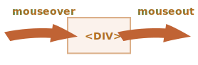
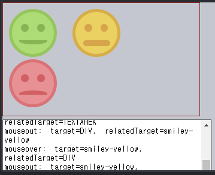
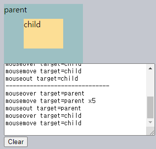
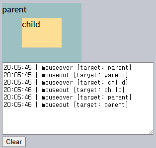
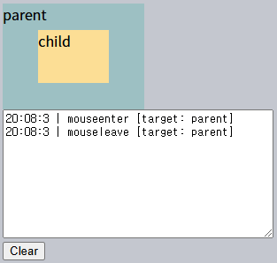
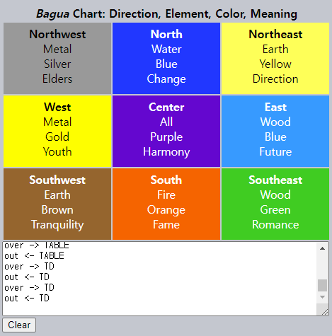
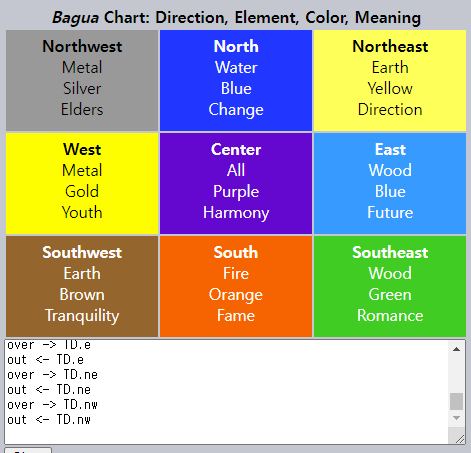
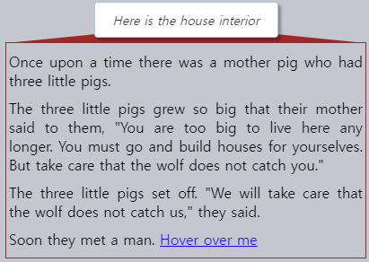
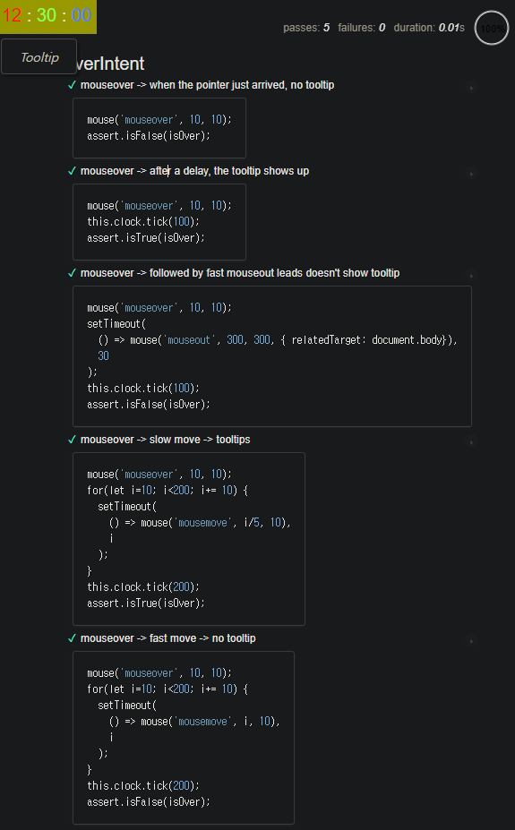

마우스 이동 이벤트
====

### `mouse[over·out]` <sub>(이벤트)</sub> · `relatedTarget` <sub>(프로퍼티)</sub>

##### `mouse[over·out]` <sub>(이벤트)</sub>
- 마우스 커서 이동 <sub>(외부 ↔ 내부)</sub>



##### `relatedTarget` <sub>(이벤트 객체 프로퍼티)</sub>
- 특정 이벤트 전용
  - `mouse[enter·leave·over·out]`
  - `drag[enter·leave]`
- `target` <sub>(이벤트 객체 프로퍼티)</sub> 보완

|이벤트 <sub>(`mouse·drag`)</sub>|`target`|진행 방향|`relatedTarget`|
|---|---|:---:|---|
|`[enter·over]`|현재 진입 요소|←|이전 이탈 요소|
|`[leave·out]`|현재 이탈 요소|→|새 진입 요소|

##### 얼굴 모양 요소
- 커서 이동 시 마우스 이벤트 표시
  - 하단 `textarea`
- 각 마우스 이벤트 정보
  - `target` <sub>(프로퍼티)</sub>
  - `relatedTarget` <sub>(프로퍼티)</sub>



```html
<!-- index.html -->
<!DOCTYPE HTML>
<html>

<head>
  <meta charset="utf-8">
  <link rel="stylesheet" href="style.css">
</head>

<body>
  <div id="container">
    <div class="smiley-green">
      <div class="left-eye"></div>
      <div class="right-eye"></div>
      <div class="smile"></div>
    </div>

    <div class="smiley-yellow">
      <div class="left-eye"></div>
      <div class="right-eye"></div>
      <div class="smile"></div>
    </div>

    <div class="smiley-red">
      <div class="left-eye"></div>
      <div class="right-eye"></div>
      <div class="smile"></div>
    </div>
  </div>

  <textarea id="log">Events will show up here!</textarea>

  <script src="script.js"></script>
</body>

</html>
```
```javascript
/* script.js */
container.onmouseover = container.onmouseout = handler;

function handler(event) {
  function str(el) {
    if (!el) {
      return "null"
    }

    return el.className || el.tagName;
  }

  log.value += event.type + ':  ' +
    'target=' + str(event.target) + ',  ' +
    'relatedTarget=' + str(event.relatedTarget) + "\n";
  log.scrollTop = log.scrollHeight;

  if (event.type == 'mouseover') {
    event.target.style.background = 'pink'
  }

  if (event.type == 'mouseout') {
    event.target.style.background = ''
  }
}
```
```css
/* style.css */
body,html { margin: 0; padding: 0; }
#container { border: 1px solid brown; padding: 10px; width: 330px; margin-bottom: 5px; box-sizing: border-box; }
#log { height: 120px; width: 350px; display: block; box-sizing: border-box; }
[class^="smiley-"] { display: inline-block; width: 70px; height: 70px; border-radius: 50%; margin-right: 20px; }
.smiley-green { background: #a9db7a; border: 5px solid #92c563; position: relative; }
.smiley-green .left-eye { width: 18%; height: 18%; background: #84b458; position: relative; top: 29%; left: 22%; border-radius: 50%; float: left; }
.smiley-green .right-eye { width: 18%; height: 18%; border-radius: 50%; position: relative; background: #84b458; top: 29%; right: 22%; float: right; }
.smiley-green .smile { position: absolute; top: 67%; left: 16.5%; width: 70%; height: 20%; overflow: hidden; }
.smiley-green .smile:after,.smiley-green .smile:before { content: ""; position: absolute; top: -50%; left: 0%; border-radius: 50%; background: #84b458; height: 100%; width: 97%; }
.smiley-green .smile:after { background: #84b458; height: 80%; top: -40%; left: 0%; }
.smiley-yellow { background: #eed16a; border: 5px solid #dbae51; position: relative; }
.smiley-yellow .left-eye { width: 18%; height: 18%; background: #dba652; position: relative; top: 29%; left: 22%; border-radius: 50%; float: left; }
.smiley-yellow .right-eye { width: 18%; height: 18%; border-radius: 50%; position: relative; background: #dba652; top: 29%; right: 22%; float: right; }
.smiley-yellow .smile { position: absolute; top: 67%; left: 19%; width: 65%; height: 14%; background: #dba652; overflow: hidden; border-radius: 8px; }
.smiley-red { background: #ee9295; border: 5px solid #e27378; position: relative; }
.smiley-red .left-eye { width: 18%; height: 18%; background: #d96065; position: relative; top: 29%; left: 22%; border-radius: 50%; float: left; }
.smiley-red .right-eye { width: 18%; height: 18%; border-radius: 50%; position: relative; background: #d96065; top: 29%; right: 22%; float: right; }
.smiley-red .smile { position: absolute; top: 57%; left: 16.5%; width: 70%; height: 20%; overflow: hidden; }
.smiley-red .smile:after,.smiley-red .smile:before { content: ""; position: absolute; top: 50%; left: 0%; border-radius: 50%; background: #d96065; height: 100%; width: 97%; }
.smiley-red .smile:after { background: #d96065; height: 80%; top: 60%; left: 0%; }
```

<br />

 **`relatedTarget == null` 가능**

##### `relatedTarget == null` 의미
- 창 외부 ↔ 요소 내부 <sub>(마우스 커서 이동)</sub>
- `null` 가능성 주의
  - ex\) `relatedTarget.tagName` 등

<br />

### 요소 이벤트 생략

##### `mousemove` <sub>(이벤트)</sub>
- 픽셀 단위 발생 X
- 수시로 마우스 위치 확인 <sub>(브라우저)</sub>
  - 마우스 이동 감지 시 이벤트 발생
- 마우스 아주 빠르게 이동 시
  - 일부 DOM 요소 이벤트 생략 가능

##### `#FROM` → `#TO` <sub>(마우스 빠르게 이동)</sub>
- 중간 요소 <sub>(`<div>` 3개)</sub> 이벤트 생략
- `mouseout` <sub>(이벤트)</sub>
  - `#FROM` <sub>(요소)</sub> 발생
- `mouseover` <sub>(이벤트)</sub>
  - `#TO` <sub>(요소)</sub> 발생


##### 성능 이점
- 수많은 중간 요소 존재 가능
  - 전부 이벤트 발생 시 성능 부담

##### 주의
- 요소 이벤트 생략 특징
  - 코딩 시 항상 인지 필수

##### 창 외부 → 문서 내 중첩 요소 <sub>(마우스 빠르게 이동)</sub>
- `relatedTarget == null`
  - 이전 이탈 요소 == 창 외부 <sub>(`null`)</sub>
  - 중간 요소 이벤트 생략


#### 빠른 마우스 이동 테스트

##### 중첩 요소 <sub>(2개)</sub>
- `<div id="parent">` <sub>(부모)</sub>
- `<div id="child">` <sub>(자식)</sub>

##### 마우스 빠르게 이동 · 요소 지나치기
- 이벤트 생략 가능 요소
  - `<div id="parent">`
  - `<div id="child">`
  - 둘 다

##### 외부 → `<div id="child">` → 외부 <sub>(빠르게 이동)</sub>
- 충분히 빠르게 이동 시
  - `<div id="parent">` 이벤트 생략



```html
<!-- index.html -->
<!doctype html>
<html>

<head>
  <meta charset="UTF-8">
  <link rel="stylesheet" href="style.css">
</head>

<body>
  <div id="parent">parent
    <div id="child">child</div>
  </div>

  <textarea id="text"></textarea>
  <input onclick="clearText()" value="Clear" type="button">

  <script src="script.js"></script>
</body>

</html>
```
```javascript
/* script.js */
let parent = document.getElementById('parent');
parent.onmouseover = parent.onmouseout = parent.onmousemove = handler;

function handler(event) {
  let type = event.type;

  while (type < 11) {
    type += ' ';
  }

  log(type + " target=" + event.target.id)

  return false;
}

function clearText() {
  text.value = "";
  lastMessage = "";
}

let lastMessageTime = 0;
let lastMessage = "";
let repeatCounter = 1;

function log(message) {
  if (lastMessageTime == 0) {
    lastMessageTime = new Date();
  }

  let time = new Date();

  if (time - lastMessageTime > 500) {
    message = '------------------------------\n' + message;
  }

  if (message === lastMessage) {
    repeatCounter++;

    if (repeatCounter == 2) {
      text.value = text.value.trim() + ' x 2\n';
    } else {
      text.value = text.value.slice(0, text.value.lastIndexOf('x') + 1) + repeatCounter + "\n";
    }

  } else {
    repeatCounter = 1;
    text.value += message + "\n";
  }

  text.scrollTop = text.scrollHeight;

  lastMessageTime = time;
  lastMessage = message;
}
```
```css
/* style.css */
#parent { background: #99C0C3; width: 160px; height: 120px; position: relative; }
#child { background: #FFDE99; width: 50%; height: 50%; position: absolute; left: 50%; top: 50%; transform: translate(-50%, -50%); }
textarea { height: 140px; width: 300px; display: block; }
```

<br />

 **`mouseout` <sub>(이벤트)</sub> → `mouseover` <sub>(이벤트)</sub>**

##### `mouseover` <sub>(이벤트)</sub> 발생 <sub>(새 요소 진입)</sub> 직전
- `mouseout` <sub>(이벤트)</sub> 반드시 발생 <sub>(이전 요소 이탈)</sub>

<br />

### `mouse[over·out]` <sub>(이벤트)</sub> · 부모 ↔ 자식 이동

##### 부모 요소 ↔ 자식 요소 <sub>(마우스 이동)</sub>

|마우스 이동|발생 이벤트|
|---|---|
|부모 → 자식|부모 `mouseout` <sub>(이탈)</sub>|
||자식 `mouseover` <sub>(진입)</sub>|
|부모 ← 자식|부모 `mouseover` <sub>(진입)</sub>|
||자식 `mouseout` <sub>(이탈)</sub>|

##### `#parent` <sub>(요소)</sub> ↔ `#child` <sub>(요소)</sub> 마우스 이동

|마우스 이동|발생 이벤트|
|---|---|
|`#parent` → `#child`|`#parent` `mouseout` <sub>(부모 이탈)</sub>|
||`#child` `mouseover` <sub>(자식 진입)</sub>|
|`#parent` ← `#child`|`#parent` `mouseover` <sub>(부모 진입)</sub>|
||`#child` `mouseout` <sub>(자식 이탈)</sub>|

```html
<div id="parent">
  <div id="child">…</div>
</div>
```


##### 마우스 커서 위치 <sub>(브라우저 로직)</sub>
- 항상 단일 요소 내부 <sub>(2가지 조건)</sub>
  - 최다 중첩
  - `z-index` <sub>(CSS)</sub> 최상위
- 부모 요소 ↔ 자식 요소 <sub>(이동)</sub>
  - `mouse[over·out]` <sub>(이벤트)</sub> 발생

##### 하위 요소 `mouse[over·out]` <sub>(이벤트)</sub>
- 버블링 발생
  - 상위 요소 핸들러 동작


##### `#parent` <sub>(요소)</sub> ↔ `#child` <sub>(요소)</sub> 마우스 이동

|마우스 이동|발생 이벤트|
|---|---|
|`#parent` → `#child`|`#parent` `mouseout` <sub>(부모 이탈)</sub>|
||`#child` `mouseover` <sub>(자식 진입 · 버블링)</sub><br />- `#parent` <sub>(부모)</sub> 핸들러 동작|
|`#parent` ← `#child`|`#parent` `mouseover` <sub>(부모 진입)</sub>|
||`#child` `mouseout` <sub>(자식 이탈 · 버블링)</sub><br />- `#parent` <sub>(부모)</sub> 핸들러 동작|

```html
<div id="parent" onmouseover="…" onmouseout="…">
  <div id="child">…</div>
</div>
```



```html
<!-- index.html -->
<!doctype html>
<html>

<head>
  <meta charset="UTF-8">
  <link rel="stylesheet" href="style.css">
</head>

<body>
  <div id="parent" onmouseover="mouselog(event)" onmouseout="mouselog(event)">parent
    <div id="child">child</div>
  </div>

  <textarea id="text"></textarea>
  <input type="button" onclick="text.value=''" value="Clear">

  <script src="script.js"></script>
</body>

</html>
```
```javascript
/* script.js */
function mouselog(event) {
  let d = new Date();

  text.value += `${d.getHours()}:${d.getMinutes()}:${d.getSeconds()} | ${event.type} [target: ${event.target.id}]\n`.replace(/(:|^)(\d\D)/, '$10$2');
  text.scrollTop = text.scrollHeight;
}
```
```css
/* style.css */
#parent { background: #99C0C3; width: 160px; height: 120px; position: relative; }
#child { background: #FFDE99; width: 50%; height: 50%; position: absolute; left: 50%; top: 50%; transform: translate(-50%, -50%); }
textarea { height: 140px; width: 300px; display: block; }
```

##### `#parent` <sub>(요소)</sub> 핸들러 2개 동작
- `#parent` → `#child`
  1. `mouseout`
  2. `mouseover` <sub>(버블링)</sub>
- `#parent` ← `#child`
  1. `mouseout` <sub>(버블링)</sub>
  2. `mouseover`
```javascript
parent.onmouseout = function(event) {
  /* event.target
   #parent → #child
   - parent element
   #parent ← #child (버블링)
   - child element
   */
};
parent.onmouseover = function(event) {
  /* event.target
   #parent → #child (버블링)
   - child element
   #parent ← #child
   - parent element
   */
};
```

##### 핸들러 내 `target` <sub>(이벤트 객체 프로퍼티)</sub> 미확인 시
- 착각 가능성 有
  - `#parent` 이탈 후 즉시 진입
- 실제
  - `#parent` → `#child`

##### 부모 요소 `onmouseout` 핸들러
- 자식 요소 이동 후 동작 불필요 시 방법 <sub>(2가지)</sub>
  - a. `relatedTarget` 확인
  - b. `mouse[enter·leave]` <sub>(이벤트)</sub>

### `mouse[enter·leave]` <sub>(이벤트)</sub>

##### `mouse[over·out]` 유사 · 차이 有 <sub>(2가지)</sub>
- a. 자식 요소 이동 시 미발생
- b. 버블링 미발생

##### 마우스 이동 시 이벤트 발생 여부
- `#parent` <sub>(요소)</sub> ↔ `#child` <sub>(요소)</sub>
  - 미발생
- 외부 ↔ `#parent` <sub>(요소)</sub>
  - 발생
```html
<div id="parent" onmouseenter="…" onmouseleave="…">
  <div id="child">…</div>
</div>
```



```html
<!-- index.html -->
<!doctype html>
<html>

<head>
  <meta charset="UTF-8">
  <link rel="stylesheet" href="style.css">
</head>

<body>
  <div id="parent" onmouseenter="mouselog(event)" onmouseleave="mouselog(event)">parent
    <div id="child">child</div>
  </div>

  <textarea id="text"></textarea>
  <input type="button" onclick="text.value=''" value="Clear">

  <script src="script.js"></script>
</body>

</html>
```
```javascript
/* script.js */
function mouselog(event) {
  let d = new Date();

  text.value += `${d.getHours()}:${d.getMinutes()}:${d.getSeconds()} | ${event.type} [target: ${event.target.id}]\n`.replace(/(:|^)(\d\D)/, '$10$2');
  text.scrollTop = text.scrollHeight;
}
```
```css
/* style.css */
#parent { background: #99C0C3; width: 160px; height: 120px; position: relative; }
#child { background: #FFDE99; width: 50%; height: 50%; position: absolute; left: 50%; top: 50%; transform: translate(-50%, -50%); }
textarea { height: 140px; width: 300px; display: block; }
```

### 이벤트 위임

##### `mouse[enter·leave]` <sub>(이벤트)</sub>
- 단순 · 쉬운 사용법
- 버블링 미발생
  - 이벤트 위임 불가능

##### `<table>` <sub>(요소)</sub> 내 셀 <sub>(`<td>` 요소)</sub> 간 커서 이동 이벤트
- 이벤트 위임 사용
  - 셀 <sub>(`<td>` 요소)</sub> 이벤트 처리 용이
- `mouse[enter·leave]` <sub>(이벤트)</sub>
  - 버블링 미발생 <sub>(이벤트 위임 불가능)</sub>
  - 각 `<td>` <sub>(요소)</sub> 핸들러만 처리 가능
  - `mouse[over·out]` <sub>(이벤트)</sub> 사용
```javascript
// 셀 (<td> 요소) 내 커서 진입 시 배경색 강조
table.onmouseover = function(event) {
  event.target.style.background = 'pink';
};

// 셀 (<td> 요소) 내 커서 이탈 시 배경색 원상태 복구
table.onmouseout = function(event) {
  event.target.style.background = '';
};
```



```html
<!-- index.html -->
<!DOCTYPE HTML>
<html>

<head>
  <meta charset="utf-8">
  <link rel="stylesheet" href="style.css">
</head>

<body>
  <table id="table">
    <tr>
      <th colspan="3"><em>Bagua</em> Chart: Direction, Element, Color, Meaning</th>
    </tr>
    <tr>
      <td class="nw"><strong>Northwest</strong>
        <br>Metal<br>Silver<br>Elders
      </td>
      <td class="n"><strong>North</strong>
        <br>Water<br>Blue<br>Change
      </td>
      <td class="ne"><strong>Northeast</strong>
        <br>Earth<br>Yellow<br>Direction
      </td>
    </tr>
    <tr>
      <td class="w"><strong>West</strong>
        <br>Metal<br>Gold<br>Youth
      </td>
      <td class="c"><strong>Center</strong>
        <br>All<br>Purple<br>Harmony
      </td>
      <td class="e"><strong>East</strong>
        <br>Wood<br>Blue<br>Future
      </td>
    </tr>
    <tr>
      <td class="sw"><strong>Southwest</strong>
        <br>Earth<br>Brown<br>Tranquility
      </td>
      <td class="s"><strong>South</strong>
        <br>Fire<br>Orange<br>Fame
      </td>
      <td class="se"><strong>Southeast</strong>
        <br>Wood<br>Green<br>Romance
      </td>
    </tr>
  </table>

  <textarea id="text"></textarea>

  <input type="button" onclick="text.value=''" value="Clear">

  <script src="script.js"></script>
</body>

</html>
```
```javascript
/* script.js */
table.onmouseover = function(event) {
  let target = event.target;
  target.style.background = 'pink';

  text.value += `over -> ${target.tagName}\n`;
  text.scrollTop = text.scrollHeight;
};

table.onmouseout = function(event) {
  let target = event.target;
  target.style.background = '';

  text.value += `out <- ${target.tagName}\n`;
  text.scrollTop = text.scrollHeight;
};
```
```css
/* style.css */
#text { display: block; height: 100px; width: 456px; }
#table th { text-align: center; font-weight: bold; }
#table td { width: 150px; white-space: nowrap; text-align: center; vertical-align: bottom; padding-top: 5px; padding-bottom: 12px; cursor: pointer; }
#table .nw { background: #999; }
#table .n { background: #03f; color: #fff; }
#table .ne { background: #ff6; }
#table .w { background: #ff0; }
#table .c { background: #60c; color: #fff; }
#table .e { background: #09f; color: #fff; }
#table .sw { background: #963; color: #fff; }
#table .s { background: #f60; color: #fff; }
#table .se { background: #0c3; color: #fff; }
#table .highlight { background: red; }
```

##### 셀 <sub>(`<td>` 요소)</sub> 마우스 이벤트 처리 <sub>(중첩 요소 X)</sub>
- 현재 강조 `<td>` <sub>(커서 위치 요소)</sub>
  - `currentElem` <sub>(변수)</sub> 저장
- `mouse[over·out]` <sub>(이벤트)</sub>
  - 현재 강조 `<td>` <sub>(요소)</sub> 발생 시 무시
```javascript
// 강조 <td> (요소) 저장
// - 현재 커서 위치
let currentElem = null;

table.onmouseover = function(event) {

  /* 커서 이동
   새 요소 진입 직전
   - 항상 이전 요소 이탈
   currentElem (변수) 값 有
   - 현재 강조 <td> (요소) 이탈 X
     - 중첩 요소 mouseover (이벤트) 무시
   */
  if (currentElem) {
    return;
  }

  // 커서 빠르게 이동 시 <td> (요소) 이벤트 생략 가능
  // - 외부 → <td> (요소) 내 중첩 요소
  //   - <td> (요소) 검색
  let target = event.target.closest('td');

  // <td> (요소) 외 (테이블 내 타 요소) 무시
  if (!target) {
    return;
  }

  /* 중첩 테이블 여부
   event.target
   - 현재 테이블 외부 <td> (요소) 가능성 有
     - 목표 테이블 외부 <td> (요소) 무시
   */
  if (!table.contains(target)) {
    return;
  }

  // 새 <td> (요소) 진입
  currentElem = target;
  onEnter(currentElem);
};

table.onmouseout = function(event) {

  /* <td> (요소) 외부
   onmouseout (이벤트) 무시
   - 테이블 내 타 요소 (<td> 요소 외) 간 이동
     - ex) <tr> (요소) → <tr> (요소)
   */
  if (!currentElem) {
    return;
  }

  /* 새 진입 요소 (현재 커서 위치) 저장
   - 테이블 내 타 요소
   - 중첩 요소
   - 타 <td> (요소)
   - 타 <td> (요소) 내 중첩 요소
   - 기타 등등
   */
  let relatedTarget = event.relatedTarget;

  // 상위 요소 체인 확인
  // - 강조 <td> (요소) 내 위치 (중첩 요소 이동) 시 무시
  while (relatedTarget) {
    if (relatedTarget == currentElem) {
      return;
    }

    relatedTarget = relatedTarget.parentNode;
  }

  // <td> (요소) 이탈
  onLeave(currentElem);
  currentElem = null;
};

/* 요소 진입 · 이탈 처리 함수 */
function onEnter(elem) {
  elem.style.background = 'pink';

  // textarea (요소) 내 출력
  text.value += `over -> ${currentElem.tagName}.${currentElem.className}\n`;
  text.scrollTop = 1e6;
}

function onLeave(elem) {
  elem.style.background = '';

  // textarea (요소) 내 출력
  text.value += `out <- ${elem.tagName}.${elem.className}\n`;
  text.scrollTop = 1e6;
}
```

#### 특징

##### a. 이벤트 위임 사용
- 테이블 내 셀 <sub>(`<td>` 요소)</sub> 이동 이벤트 처리
  - `mouse[over·out]` <sub>(이벤트)</sub>
  - `mouse[enter·leave]` <sub>(이벤트)</sub> X
    - 버블링 미발생

##### b. 중첩 요소 이동 제외
- 셀 <sub>(`<td>` 요소)</sub> 간 이동 이벤트만 처리



```html
<!-- index.html -->
…
```
```javascript
/* script.js */
// 현재 마우스 커서 위치 <td> (요소) 저장
let currentElem = null;

table.onmouseover = function(event) {
  if (currentElem) {
    return;
  }

  let target = event.target.closest('td');

  if (!target) {
    return;
  }

  if (!table.contains(target)) {
    return;
  }

  currentElem = target;
  onEnter(currentElem);
};

table.onmouseout = function(event) {
  if (!currentElem) {
    return;
  }

  let relatedTarget = event.relatedTarget;

  while (relatedTarget) {
    if (relatedTarget == currentElem) {
      return;
    }

    relatedTarget = relatedTarget.parentNode;
  }

  onLeave(currentElem);
  currentElem = null;
};

function onEnter(elem) {
  elem.style.background = 'pink';

  text.value += `over -> ${currentElem.tagName}.${currentElem.className}\n`;
  text.scrollTop = 1e6;
}

function onLeave(elem) {
  elem.style.background = '';

  text.value += `out <- ${elem.tagName}.${elem.className}\n`;
  text.scrollTop = 1e6;
}
```
```css
/* style.css */
…
```

<br />

요약
====

##### 마우스 <sub>(커서)</sub> 이동 이벤트
- `mousemove`
- `mouse[over·out]`
- `mouse[enter·leave]`

#### 특징

##### 매우 빠른 커서 이동
- 중간 요소 이벤트 생략 가능

##### `mouse[over·out·enter·leave]` <sub>(이벤트)</sub>
- `relatedTarget` <sub>(이벤트 객체 추가 프로퍼티)</sub>
  - `target` <sub>(이벤트 객체 프로퍼티)</sub> 보완
  - 이벤트 발생 전 · 후 요소 <sub>(↔ `target`)</sub>

##### `mouse[over·out]` <sub>(이벤트)</sub>
- 중첩 요소 이동 시 발생
- 단일 <sub>(최다 중첩)</sub> 요소 내부 커서 위치

##### `mouse[enter·leave]` <sub>(이벤트)</sub>
- 중첩 요소 이동 시 미발생
  - 외부 이동 시 발생
- 버블링 미발생

<br />

##  과제

### 향상된 툴팁 동작 <sub>([이벤트 위임](../02.%20Introduction%20to%20Events/03.%20Event%20delegation.md) 챕터 과제 개선)</sub>

##### 툴팁 표시 코드 작성
- `data-tooltip` <sub>(속성)</sub>
  - 툴팁 표시 요소 내 명시
  - 속성값
    - 툴팁 내용
- 마우스 커서 오버 · 이탈 시
  - 툴팁 표시 · 제거
- 요소 하위 요소
  - 텍스트 노드

##### 개선점
- 커서 위치 상 최다 중첩 요소 툴팁 표시

```html
<div data-tooltip="Here – is the house interior" id="house">
  <div data-tooltip="Here – is the roof" id="roof"></div>
  …
  <a data-tooltip="Read on…" href="https://en.wikipedia.org/wiki/The_Three_Little_Pigs">Hover over me</a>
</div>
```



##### 참고
- 한 번에 1개 툴팁 표시

<br />


[정답](https://plnkr.co/edit/zC13hPSR2naaiWtH?p=preview)

<hr />

### 똑똑한 툴팁

##### 함수 작성
- 요소 툴팁 표시
- 표시 시점
  - 커서 이동 중 X
  - 커서 이동 멈춘 후

##### 요소 내부 커서 이동 속도 계산 가능
- 느린 속도
  - 툴팁 표시
- 빠른 속도
  - 무시

#### `HoverIntent(options)` <sub>(객체)</sub> 작성 · 이용

##### `options` <sub>(객체)</sub>
- `elem`
  - 추적 대상 요소
- `over` <sub>(함수)</sub>
  - 요소 내부 커서 속도 ↓ · 멈춤 시 호출
- `out` <sub>(함수)</sub>
  - 요소 이탈 시 호출 <sub>(`over` 함수 호출 후)</sub>
```javascript
let tooltip = document.createElement('div');
tooltip.className = "tooltip";
tooltip.innerHTML = "Tooltip";

// 커서 추적 · 함수 (over · out) 호출
new HoverIntent({
  elem,
  over() {
    tooltip.style.left = elem.getBoundingClientRect().left + 'px';
    tooltip.style.top = elem.getBoundingClientRect().bottom + 5 + 'px';
    document.body.append(tooltip);
  },
  out() {
    tooltip.remove();
  }
});
```



##### 시계 <sub>(요소)</sub> 내부 커서 이동
- 느린 속도 · 멈춤
  - 툴팁 표시
- 빠른 속도
  - 무시

##### 참고
- 시계 <sub>(요소)</sub> 하위 요소 간 이동 무시

<br />


#### 알고리즘

##### 1. `onmouse[over·out]` 핸들러 설정
- `onmouse[enter·leave]`
  - 덜 보편적
  - 이벤트 위임 불가능

##### 2. 커서 진입
- `mousemove` <sub>(이벤트)</sub> 속도 계산 시작

##### 3. 커서 이동 속도 ↓
- `over` <sub>(함수)</sub> 실행

##### 4. 커서 이탈 · `over` <sub>(함수)</sub> 실행 종료
- `out` <sub>(함수)</sub> 실행

#### 커서 이동 속도 계산 방법

##### `100ms` 마다 계산 함수 실행
- 두 지점 <sub>(함수 실행 전 · 후)</sub> 거리 계산
  - 거리 · 속도 비례
- 현재 커서 좌표 정보 접근 불가능 <sub>(관련 기능 無)</sub>

##### `mousemove` <sub>(이벤트)</sub> 이용
- 이벤트 객체 프로퍼티
  - 현재 커서 좌표 정보 저장

##### `mousemove` 핸들러 설정
- 커서 좌표 추적 · 저장 · 비교 <sub>(`100ms` 간격)</sub>

[정답](https://plnkr.co/edit/OGDT0MB7ieupGZff?p=preview)
