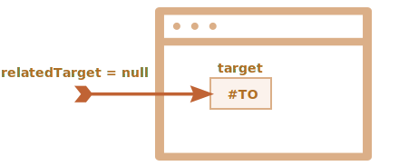

`mouse[over·out·enter·leave]` <sub>(마우스 이동)</sub>
=====================================================

### `mouse[over·out]` <sub>(이벤트)</sub> · `relatedTarget` <sub>(프로퍼티)</sub>

##### `mouse[over·out]` <sub>(이벤트)</sub>
- 마우스 포인터 이동
  - 요소 위 ↔ 바깥


##### `relatedTarget` <sub>(프로퍼티)</sub>
- `target` <sub>(프로퍼티)</sub> 보완

|`mouse-`|`target`|순서|`relatedTarget`|
|---|---|---|---|
|`-over`|현재 위 요소|←|이전 위 요소|
|`-out`|방금 떠난 요소<br /><sub>(이전 위 요소)</sub>|→|현재 위 요소|

##### 얼굴 모양 요소
- 마우스 이동 시
  - 마우스 이벤트 표시 <sub>(하단 `textarea`)</sub>
- 각 마우스 이벤트
  - `target` <sub>(프로퍼티)</sub>
  - `relatedTarget` <sub>(프로퍼티)</sub>


```html
<!-- index.html -->
<!DOCTYPE HTML>
<html>

<head>
  <meta charset="utf-8">
  <link rel="stylesheet" href="style.css">
</head>

<body>

  <div id="container">
    <div class="smiley-green">
      <div class="left-eye"></div>
      <div class="right-eye"></div>
      <div class="smile"></div>
    </div>

    <div class="smiley-yellow">
      <div class="left-eye"></div>
      <div class="right-eye"></div>
      <div class="smile"></div>
    </div>

    <div class="smiley-red">
      <div class="left-eye"></div>
      <div class="right-eye"></div>
      <div class="smile"></div>
    </div>
  </div>

  <textarea id="log">Events will show up here!
</textarea>

  <script src="script.js"></script>

</body>
</html>
```
```javascript
/* script.js */
container.onmouseover = container.onmouseout = handler;

function handler(event) {

  function str(el) {
    if (!el) return "null"
    return el.className || el.tagName;
  }

  log.value += event.type + ':  ' +
    'target=' + str(event.target) +
    ',  relatedTarget=' + str(event.relatedTarget) + "\n";
  log.scrollTop = log.scrollHeight;

  if (event.type == 'mouseover') {
    event.target.style.background = 'pink'
  }
  if (event.type == 'mouseout') {
    event.target.style.background = ''
  }
}
```
```css
/* style.css */
body,html { margin: 0; padding: 0; }
#container { border: 1px solid brown; padding: 10px; width: 330px; margin-bottom: 5px; box-sizing: border-box; }
#log { height: 120px; width: 350px; display: block; box-sizing: border-box; }
[class^="smiley-"] { display: inline-block; width: 70px; height: 70px; border-radius: 50%; margin-right: 20px; }
.smiley-green { background: #a9db7a; border: 5px solid #92c563; position: relative; }
.smiley-green .left-eye { width: 18%; height: 18%; background: #84b458; position: relative; top: 29%; left: 22%; border-radius: 50%; float: left; }
.smiley-green .right-eye { width: 18%; height: 18%; border-radius: 50%; position: relative; background: #84b458; top: 29%; right: 22%; float: right; }
.smiley-green .smile { position: absolute; top: 67%; left: 16.5%; width: 70%; height: 20%; overflow: hidden; }
.smiley-green .smile:after,.smiley-green .smile:before { content: ""; position: absolute; top: -50%; left: 0%; border-radius: 50%; background: #84b458; height: 100%; width: 97%; }
.smiley-green .smile:after { background: #84b458; height: 80%; top: -40%; left: 0%; }
.smiley-yellow { background: #eed16a; border: 5px solid #dbae51; position: relative; }
.smiley-yellow .left-eye { width: 18%; height: 18%; background: #dba652; position: relative; top: 29%; left: 22%; border-radius: 50%; float: left; }
.smiley-yellow .right-eye { width: 18%; height: 18%; border-radius: 50%; position: relative; background: #dba652; top: 29%; right: 22%; float: right; }
.smiley-yellow .smile { position: absolute; top: 67%; left: 19%; width: 65%; height: 14%; background: #dba652; overflow: hidden; border-radius: 8px; }
.smiley-red { background: #ee9295; border: 5px solid #e27378; position: relative; }
.smiley-red .left-eye { width: 18%; height: 18%; background: #d96065; position: relative; top: 29%; left: 22%; border-radius: 50%; float: left; }
.smiley-red .right-eye { width: 18%; height: 18%; border-radius: 50%; position: relative; background: #d96065; top: 29%; right: 22%; float: right; }
.smiley-red .smile { position: absolute; top: 57%; left: 16.5%; width: 70%; height: 20%; overflow: hidden; }
.smiley-red .smile:after,.smiley-red .smile:before { content: ""; position: absolute; top: 50%; left: 0%; border-radius: 50%; background: #d96065; height: 100%; width: 97%; }
.smiley-red .smile:after { background: #d96065; height: 80%; top: 60%; left: 0%; }
```

<br />

 **`relatedTarget` : `null` 가능**

##### `relatedTarget` <sub>(프로퍼티)</sub> == `null` 경우
- 창 바깥 ↔ 요소 위
- 에러 발생 주의
  - ex\) `relatedTarget.tagName`

<br />

### 요소 스킵하기

##### `mousemove` <sub>(이벤트)</sub>
- 픽셀 단위 이동 시 발생 X
- 마우스 위치 체크 <sub>(브라우저)</sub>
  - 일정 시간 간격
- 마우스 아주 빠르게 이동 시
  - 일부 DOM 요소 스킵 가능


##### `#FROM` → `#TO` <sub>(빠르게 이동)</sub>
- 중간 요소 <sub>(`<div>`)</sub> 스킵
- `mouseout` <sub>(이벤트)</sub>
  - `#FROM` <sub>(요소)</sub>
- `mouseover` <sub>(이벤트)</sub>
  - `#TO` <sub>(요소)</sub>

##### 성능 이점
- 수많은 중간 요소 존재 가능
  - 전부 이벤트 발생 시 성능 부담

##### 주의
- 스킵 가능 특징
  - 코딩 시 항상 인지

##### 창 바깥 → 페이지 내부 요소 <sub>(빠르게 이동)</sub>
- `relatedTarget` == `null`
  - 중간 요소 스킵



#### 빠른 이동 테스트

##### 중첩 요소 <sub>(2개)</sub>
- `<div id="parent">` 안
  - `<div id="child">`

##### 빠르게 요소 이동 · 지나치기
- 이벤트 발생 가능 요소
  - `<div id="parent">`
  - `<div id="child">`
  - 둘 다 스킵

##### 외부 → `<div id="child">` → 외부 <sub>(빠르게 이동)</sub>
- 충분히 빠르게 이동 시
  - `<div id="parent">` 스킵


```html
<!-- index.html -->
<!doctype html>
<html>

<head>
  <meta charset="UTF-8">
  <link rel="stylesheet" href="style.css">
</head>

<body>

  <div id="parent">parent
    <div id="child">child</div>
  </div>
  <textarea id="text"></textarea>
  <input onclick="clearText()" value="Clear" type="button">

  <script src="script.js"></script>

</body>

</html>
```
```javascript
/* script.js */
let parent = document.getElementById('parent');
parent.onmouseover = parent.onmouseout = parent.onmousemove = handler;

function handler(event) {
  let type = event.type;
  while (type < 11) type += ' ';

  log(type + " target=" + event.target.id)
  return false;
}

function clearText() {
  text.value = "";
  lastMessage = "";
}

let lastMessageTime = 0;
let lastMessage = "";
let repeatCounter = 1;

function log(message) {
  if (lastMessageTime == 0) lastMessageTime = new Date();

  let time = new Date();

  if (time - lastMessageTime > 500) {
    message = '------------------------------\n' + message;
  }

  if (message === lastMessage) {
    repeatCounter++;
    if (repeatCounter == 2) {
      text.value = text.value.trim() + ' x 2\n';
    } else {
      text.value = text.value.slice(0, text.value.lastIndexOf('x') + 1) + repeatCounter + "\n";
    }

  } else {
    repeatCounter = 1;
    text.value += message + "\n";
  }

  text.scrollTop = text.scrollHeight;

  lastMessageTime = time;
  lastMessage = message;
}
```
```css
/* style.css */
#parent { background: #99C0C3; width: 160px; height: 120px; position: relative; }
#child { background: #FFDE99; width: 50%; height: 50%; position: absolute; left: 50%; top: 50%; transform: translate(-50%, -50%); }
textarea { height: 140px; width: 300px; display: block; }
```

<br />

 **`mouseover` <sub>(이벤트)</sub> → `mouseout` <sub>(이벤트)</sub>**

##### `mouseover` <sub>(이벤트)</sub> 발생 <sub>(요소 위 진입)</sub> 시
- `mouseout` <sub>(이벤트)</sub> 반드시 발생 <sub>(요소 바깥 이동)</sub>

<br />

### `mouseout` <sub>(이벤트)</sub> · 자식 요소 떠나기

##### 부모 요소 → 자식 요소 이동 시
- 부모 요소
  - `mouseout` <sub>(이벤트)</sub> 발생

##### `#parent` <sub>(요소)</sub> → `#child` <sub>(요소)</sub>
- `#parent` <sub>(요소)</sub>
  - `mouseout` <sub>(이벤트)</sub> 발생
```html
<div id="parent">
  <div id="child">…</div>
</div>
```


##### 브라우저 로직
- 마우스 커서 위치 <sub>(어느 한 시점)</sub>
  - 단일 요소 위
  - `z-index` <sub>(CSS 프로퍼티)</sub> 기준
- 요소 간 커서 이동 시
  1. 이전 요소 떠나기
  2. 새 요소 진입

##### 하위 요소 `mouseover` <sub>(이벤트)</sub>
- 버블링 발생
  - 상위 요소 핸들러 동작


##### `#parent` <sub>(요소)</sub> → `#child` <sub>(요소)</sub>
1. `mouseout [target: parent]`
    - `#parent` <sub>(요소)</sub> 떠나기
2. `mouseover [target: child]`
    - `#child` <sub>(요소)</sub> 진입
    - 버블링 발생
      - `#parent` <sub>(요소)</sub> 핸들러 동작
```html
<div id="parent" onmouseover="…" onmouseout="…">
  <div id="child">…</div>
</div>
```


```html
<!-- index.html -->
<!doctype html>
<html>

<head>
  <meta charset="UTF-8">
  <link rel="stylesheet" href="style.css">
</head>

<body>

  <div id="parent" onmouseover="mouselog(event)" onmouseout="mouselog(event)">parent
    <div id="child">child</div>
  </div>

  <textarea id="text"></textarea>
  <input type="button" onclick="text.value=''" value="Clear">

  <script src="script.js"></script>

</body>

</html>
```
```javascript
/* script.js */
function mouselog(event) {
  let d = new Date();
  text.value += `${d.getHours()}:${d.getMinutes()}:${d.getSeconds()} | ${event.type} [target: ${event.target.id}]\n`.replace(/(:|^)(\d\D)/, '$10$2');
  text.scrollTop = text.scrollHeight;
}
```
```css
/* style.css */
#parent { background: #99C0C3; width: 160px; height: 120px; position: relative; }
#child { background: #FFDE99; width: 50%; height: 50%; position: absolute; left: 50%; top: 50%; transform: translate(-50%, -50%); }
textarea { height: 140px; width: 300px; display: block; }
```

##### `#parent` <sub>(요소)</sub> 핸들러 2개 동작
  - `mouseout`
  - `mouseover`
```javascript
parent.onmouseout = function(event) {
  // event.target
  // - parent element
};
parent.onmouseover = function(event) {
  // event.target
  // - child element (버블링)
};
```

##### 핸들러 내 `event.target` 미확인 시
- 착각 가능성 有
  - `#parent` → 외부 → `#parent`
- 실제
  - `#parent` → `#child`

##### 부모 요소 `onmouseout` 핸들러
- 자식 요소 이동 중 동작 불필요 시
  - `mouse[enter·leave]` <sub>(이벤트)</sub> 이용

### `mouse[enter·leave]` <sub>(이벤트)</sub>

##### `mouse[over·out]` 유사 · 차이점 有
1. 자손 요소 이동 시 미발생
2. 버블링 X

##### `mouse[enter·leave]` <sub>(이벤트)</sub> 발생 여부
- `#parent` <sub>(요소)</sub> ⇆ `#child` <sub>(요소)</sub>
  - 미발생
- 외부 ⇆ `#parent` <sub>(요소)</sub>
  - 발생
```html
<div id="parent" onmouseenter="…" onmouseleave="…">
  <div id="child">…</div>
</div>
```


```html
<!-- index.html -->
<!doctype html>
<html>

<head>
  <meta charset="UTF-8">
  <link rel="stylesheet" href="style.css">
</head>

<body>

  <div id="parent" onmouseenter="mouselog(event)" onmouseleave="mouselog(event)">parent
    <div id="child">child</div>
  </div>

  <textarea id="text"></textarea>
  <input type="button" onclick="text.value=''" value="Clear">

  <script src="script.js"></script>

</body>

</html>
```
```javascript
/* script.js */
function mouselog(event) {
  let d = new Date();
  text.value += `${d.getHours()}:${d.getMinutes()}:${d.getSeconds()} | ${event.type} [target: ${event.target.id}]\n`.replace(/(:|^)(\d\D)/, '$10$2');
  text.scrollTop = text.scrollHeight;
}
```
```css
/* style.css */
#parent { background: #99C0C3; width: 160px; height: 120px; position: relative; }
#child { background: #FFDE99; width: 50%; height: 50%; position: absolute; left: 50%; top: 50%; transform: translate(-50%, -50%); }
textarea { height: 140px; width: 300px; display: block; }
```

### 이벤트 위임

##### `mouse[enter·leave]` <sub>(이벤트)</sub>
- 단순 · 쉬운 사용법
- 버블링 X
  - 이벤트 위임 X

##### `<table>` <sub>(요소)</sub> 내 셀 마우스 이동 이벤트 처리
- 이벤트 위임 사용 시
  - 셀 이벤트 처리 용이
- `mouse[enter·leave]` <sub>(이벤트)</sub>
  - 버블링 X <sub>(이벤트 위임 X)</sub>
  - 각 `<td>` <sub>(요소)</sub> 핸들러만 처리 가능
  - `mouse[over·out]` <sub>(이벤트)</sub> 사용
```javascript
// 포인터 위치한 <td> (요소) 색 강조
table.onmouseover = function(event) {
  let target = event.target;
  target.style.background = 'pink';
};

table.onmouseout = function(event) {
  let target = event.target;
  target.style.background = '';
};
```


```html
<!-- index.html -->
<!DOCTYPE HTML>
<html>

<head>
  <meta charset="utf-8">
  <link rel="stylesheet" href="style.css">
</head>

<body>

  <table id="table">
    <tr>
      <th colspan="3"><em>Bagua</em> Chart: Direction, Element, Color, Meaning</th>
    </tr>
    <tr>
      <td class="nw"><strong>Northwest</strong>
        <br>Metal<br>Silver<br>Elders
      </td>
      <td class="n"><strong>North</strong>
        <br>Water<br>Blue<br>Change
      </td>
      <td class="ne"><strong>Northeast</strong>
        <br>Earth<br>Yellow<br>Direction
      </td>
    </tr>
    <tr>
      <td class="w"><strong>West</strong>
        <br>Metal<br>Gold<br>Youth
      </td>
      <td class="c"><strong>Center</strong>
        <br>All<br>Purple<br>Harmony
      </td>
      <td class="e"><strong>East</strong>
        <br>Wood<br>Blue<br>Future
      </td>
    </tr>
    <tr>
      <td class="sw"><strong>Southwest</strong>
        <br>Earth<br>Brown<br>Tranquility
      </td>
      <td class="s"><strong>South</strong>
        <br>Fire<br>Orange<br>Fame
      </td>
      <td class="se"><strong>Southeast</strong>
        <br>Wood<br>Green<br>Romance
      </td>
    </tr>
  </table>

  <textarea id="text"></textarea>

  <input type="button" onclick="text.value=''" value="Clear">

  <script src="script.js"></script>

</body>
</html>
```
```javascript
/* script.js */
table.onmouseover = function(event) {
  let target = event.target;
  target.style.background = 'pink';

  text.value += `over -> ${target.tagName}\n`;
  text.scrollTop = text.scrollHeight;
};

table.onmouseout = function(event) {
  let target = event.target;
  target.style.background = '';

  text.value += `out <- ${target.tagName}\n`;
  text.scrollTop = text.scrollHeight;
};
```
```css
/* style.css */
#text { display: block; height: 100px; width: 456px; }
#table th { text-align: center; font-weight: bold; }
#table td { width: 150px; white-space: nowrap; text-align: center; vertical-align: bottom; padding-top: 5px; padding-bottom: 12px; cursor: pointer; }
#table .nw { background: #999; }
#table .n { background: #03f; color: #fff; }
#table .ne { background: #ff6; }
#table .w { background: #ff0; }
#table .c { background: #60c; color: #fff; }
#table .e { background: #09f; color: #fff; }
#table .sw { background: #963; color: #fff; }
#table .s { background: #f60; color: #fff; }
#table .se { background: #0c3; color: #fff; }
#table .highlight { background: red; }
```

##### 테이블 셀 <sub>(`<td>` 요소)</sub> 간 이동 이벤트 처리
- 현재 강조된 셀 <sub>(`<td>` 요소)</sub>
  - `currentElem` <sub>(변수)</sub> 저장
- `mouse[over·out]` <sub>(이벤트)</sub> 발생 시
  - 아직 강조 셀 <sub>(`<td>` 요소)</sub> 내 위치 시 무시
```javascript
// <td> under the mouse right now (if any)
let currentElem = null;

table.onmouseover = function(event) {
  // before entering a new element, the mouse always leaves the previous one
  // if currentElem is set, we didn't leave the previous <td>,
  // that's a mouseover inside it, ignore the event
  if (currentElem) return;

  let target = event.target.closest('td');

  // we moved not into a <td> - ignore
  if (!target) return;

  // moved into <td>, but outside of our table (possible in case of nested tables)
  // ignore
  if (!table.contains(target)) return;

  // hooray! we entered a new <td>
  currentElem = target;
  onEnter(currentElem);
};

table.onmouseout = function(event) {
  // if we're outside of any <td> now, then ignore the event
  // that's probably a move inside the table, but out of <td>,
  // e.g. from <tr> to another <tr>
  if (!currentElem) return;

  // we're leaving the element – where to? Maybe to a descendant?
  let relatedTarget = event.relatedTarget;

  while (relatedTarget) {
    // go up the parent chain and check – if we're still inside currentElem
    // then that's an internal transition – ignore it
    if (relatedTarget == currentElem) return;

    relatedTarget = relatedTarget.parentNode;
  }

  // we left the <td>. really.
  onLeave(currentElem);
  currentElem = null;
};

// any functions to handle entering/leaving an element
function onEnter(elem) {
  elem.style.background = 'pink';

  // show that in textarea
  text.value += `over -> ${currentElem.tagName}.${currentElem.className}\n`;
  text.scrollTop = 1e6;
}

function onLeave(elem) {
  elem.style.background = '';

  // show that in textarea
  text.value += `out <- ${elem.tagName}.${elem.className}\n`;
  text.scrollTop = 1e6;
}
```

Once again, the important features are:
1. It uses event delegation to handle entering/leaving of any `<td>` inside the table. So it relies on `mouseover`/`out` instead of `mouseenter`/`leave` that don't bubble and hence allow no delegation.
2. Extra events, such as moving between descendants of `<td>` are filtered out, so that `onEnter`/`Leave` runs only if the pointer leaves or enters `<td>` as a whole.

Here's the full example with all details:

##### 결과


```html
<!-- index.html -->
<!DOCTYPE HTML>
<html>

<head>
  <meta charset="utf-8">
  <link rel="stylesheet" href="style.css">
</head>

<body>

  <table id="table">
    <tr>
      <th colspan="3"><em>Bagua</em> Chart: Direction, Element, Color, Meaning</th>
    </tr>
    <tr>
      <td class="nw"><strong>Northwest</strong>
        <br>Metal
        <br>Silver
        <br>Elders
      </td>
      <td class="n"><strong>North</strong>
        <br>Water
        <br>Blue
        <br>Change
      </td>
      <td class="ne"><strong>Northeast</strong>
        <br>Earth
        <br>Yellow
        <br>Direction
      </td>
    </tr>
    <tr>
      <td class="w"><strong>West</strong>
        <br>Metal
        <br>Gold
        <br>Youth
      </td>
      <td class="c"><strong>Center</strong>
        <br>All
        <br>Purple
        <br>Harmony
      </td>
      <td class="e"><strong>East</strong>
        <br>Wood
        <br>Blue
        <br>Future
      </td>
    </tr>
    <tr>
      <td class="sw"><strong>Southwest</strong>
        <br>Earth
        <br>Brown
        <br>Tranquility
      </td>
      <td class="s"><strong>South</strong>
        <br>Fire
        <br>Orange
        <br>Fame
      </td>
      <td class="se"><strong>Southeast</strong>
        <br>Wood
        <br>Green
        <br>Romance
      </td>
    </tr>

  </table>

  <textarea id="text"></textarea>

  <input type="button" onclick="text.value=''" value="Clear">

  <script src="script.js"></script>

</body>
</html>
```
```javascript
/* script.js */
// <td> under the mouse right now (if any)
let currentElem = null;

table.onmouseover = function(event) {
  // before entering a new element, the mouse always leaves the previous one
  // if currentElem is set, we didn't leave the previous <td>,
  // that's a mouseover inside it, ignore the event
  if (currentElem) return;

  let target = event.target.closest('td');

  // we moved not into a <td> - ignore
  if (!target) return;

  // moved into <td>, but outside of our table (possible in case of nested tables)
  // ignore
  if (!table.contains(target)) return;

  // hooray! we entered a new <td>
  currentElem = target;
  onEnter(currentElem);
};

table.onmouseout = function(event) {
  // if we're outside of any <td> now, then ignore the event
  // that's probably a move inside the table, but out of <td>,
  // e.g. from <tr> to another <tr>
  if (!currentElem) return;

  // we're leaving the element – where to? Maybe to a descendant?
  let relatedTarget = event.relatedTarget;

  while (relatedTarget) {
    // go up the parent chain and check – if we're still inside currentElem
    // then that's an internal transition – ignore it
    if (relatedTarget == currentElem) return;

    relatedTarget = relatedTarget.parentNode;
  }

  // we left the <td>. really.
  onLeave(currentElem);
  currentElem = null;
};

// any functions to handle entering/leaving an element
function onEnter(elem) {
  elem.style.background = 'pink';

  // show that in textarea
  text.value += `over -> ${currentElem.tagName}.${currentElem.className}\n`;
  text.scrollTop = 1e6;
}

function onLeave(elem) {
  elem.style.background = '';

  // show that in textarea
  text.value += `out <- ${elem.tagName}.${elem.className}\n`;
  text.scrollTop = 1e6;
}
```
```css
/* style.css */
#text { display: block; height: 100px; width: 456px; }
#table th { text-align: center; font-weight: bold; }
#table td { width: 150px; white-space: nowrap; text-align: center; vertical-align: bottom; padding-top: 5px; padding-bottom: 12px; cursor: pointer; }
#table .nw { background: #999; }
#table .n { background: #03f; color: #fff; }
#table .ne { background: #ff6; }
#table .w { background: #ff0; }
#table .c { background: #60c; color: #fff; }
#table .e { background: #09f; color: #fff; }
#table .sw { background: #963; color: #fff; }
#table .s { background: #f60; color: #fff; }
#table .se { background: #0c3; color: #fff; }
#table .highlight { background: red; }
```

Try to move the cursor in and out of table cells and inside them. Fast or slow – doesn't matter. Only `<td>` as a whole is highlighted, unlike the example before.

<br />

## 요약
We covered events `mouseover`, `mouseout`, `mousemove`, `mouseenter` and `mouseleave`.

These things are good to note:
- A fast mouse move may skip intermediate elements.
- Events `mouseover`/`out` and `mouseenter`/`leave` have an additional property: `relatedTarget`. That's the element that we are coming from/to, complementary to `target`.

Events `mouseover`/`out` trigger even when we go from the parent element to a child element. The browser assumes that the mouse can be only over one element at one time – the deepest one.

Events `mouseenter`/`leave` are different in that aspect: they only trigger when the mouse comes in and out the element as a whole. Also they do not bubble.

<br />

##  과제

### Improved tooltip behavior
Write JavaScript that shows a tooltip over an element with the attribute `data-tooltip`. The value of this attribute should become the tooltip text.

That's like the task [툴팁 보여주기](https://ko.javascript.info/task/behavior-tooltip), but here the annotated elements can be nested. The most deeply nested tooltip is shown.

Only one tooltip may show up at the same time.

For instance:
```html
<div data-tooltip="Here – is the house interior" id="house">
  <div data-tooltip="Here – is the roof" id="roof"></div>
  ...
  <a href="https://en.wikipedia.org/wiki/The_Three_Little_Pigs" data-tooltip="Read on…">Hover over me</a>
</div>
```

The result in iframe:


<br />


[샌드박스를 열어 정답을 확인해보세요.](https://plnkr.co/edit/zC13hPSR2naaiWtH?p=preview)

<hr />

### "Smart" tooltip
Write a function that shows a tooltip over an element only if the visitor moves the mouse to it, but not through it.

In other words, if the visitor moves the mouse to the element and stops there – show the tooltip. And if they just moved the mouse through, then no need, who wants extra blinking?

Technically, we can measure the mouse speed over the element, and if it's slow then we assume that it comes "over the element" and show the tooltip, if it's fast – then we ignore it.

Make a universal object new `HoverIntent(options)` for it.

Its `options`:
- `elem` – element to track.
- `over` – a function to call if the mouse came to the element: that is, it moves slowly or stopped over it.
- `out` – a function to call when the mouse leaves the element (if `over` was called).

An example of using such object for the tooltip:
```javascript
// a sample tooltip
let tooltip = document.createElement('div');
tooltip.className = "tooltip";
tooltip.innerHTML = "Tooltip";

// the object will track mouse and call over/out
new HoverIntent({
  elem,
  over() {
    tooltip.style.left = elem.getBoundingClientRect().left + 'px';
    tooltip.style.top = elem.getBoundingClientRect().bottom + 5 + 'px';
    document.body.append(tooltip);
  },
  out() {
    tooltip.remove();
  }
});
```

The demo:


If you move the mouse over the "clock" fast then nothing happens, and if you do it slow or stop on them, then there will be a tooltip.

Please note: the tooltip doesn't "blink" when the cursor moves between the clock subelements.

<br />


The algorithm looks simple:
1. Put `onmouseover`/`out` handlers on the element. Also can use `onmouseenter`/`leave` here, but they are less universal, won't work if we introduce delegation.
2. When a mouse cursor entered the element, start measuring the speed on `mousemove`.
3. If the speed is slow, then run `over`.
4. When we're going out of the element, and `over` was executed, run `out`.

But how to measure the speed?

The first idea can be: run a function every `100ms` and measure the distance between previous and new coordinates. If it's small, then the speed is small.

Unfortunately, there's no way to get "current mouse coordinates" in JavaScript. There's no function like `getCurrentMouseCoordinates()`.

The only way to get coordinates is to listen for mouse events, like `mousemove`, and take coordinates from the event object.

So let's set a handler on `mousemove` to track coordinates and remember them. And then compare them, once per `100ms`.

P.S. Please note: the solution tests use `dispatchEvent` to see if the tooltip works right.

[테스트 코드가 담긴 샌드박스를 열어 정답을 확인해보세요.](https://plnkr.co/edit/OGDT0MB7ieupGZff?p=preview)
