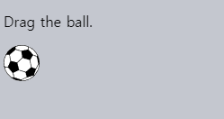
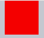
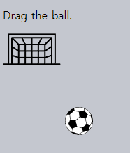
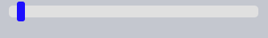

드래그 앤 드롭 · 마우스 이벤트
====

##### [드래그 앤 드롭 표준](https://html.spec.whatwg.org/multipage/dnd.html#dnd)
- 특수 이벤트
  - `dragstart`
  - `dragend`
  - 기타 등등
- 기타 설명 기술

#### `drag[start·end]` <sub>(이벤트)</sub>

##### 특수 드래그 앤 드롭 기능 제공
- 파일 드래그 <sub>(파일 관리 앱)</sub>
- 파일 드롭 <sub>(브라우저 화면)</sub>
  - 파일 내용 처리 가능

##### 한계 多
- 특정 영역 드래그 취소 불가능
- 수평 · 수직 드래그 불가능
- 부족한 모바일 환경 지원
- 기타 등등

##### 한계 극복
- 마우스 이벤트 활용

### 기본 알고리즘

##### 1. `mousedown` <sub>(이벤트)</sub>
- 이동 필요 요소 준비
  - 기존 요소 복사본 생성
  - 해당 요소 CSS 클래스 추가
  - 기타 등등

##### 2. `mousemove` <sub>(이벤트)</sub>
- `left ∙ top` <sub>(`position: absolute`)</sub> 변경

##### 3. `mouseup` <sub>(이벤트)</sub>
- 완료 관련 작업 수행

##### 공 <sub>(요소)</sub> 드래그
```javascript
ball.onmousedown = function(event) {

  // ① 공 (요소) 최상단 상 이동 준비
  // - position: absolute (CSS)
  // - zIndex (CSS) 수정
  ball.style.position = 'absolute';
  ball.style.zIndex = 1000;

  // 공 (요소) 위치 변경 (body 요소 기준 위치 지정)
  // - 현재 부모 요소 → body 요소
  document.body.append(ball);

  // 공 (요소) 위치 설정 함수
  function moveAt(pageX, pageY) {
    ball.style.left = pageX - ball.offsetWidth / 2 + 'px';
    ball.style.top = pageY - ball.offsetHeight / 2 + 'px';
  }

  // 공 (요소) → 포인터 (이동)
  moveAt(event.pageX, event.pageY);

  function onMouseMove(event) {
    moveAt(event.pageX, event.pageY);
  }

  // ② 공 (요소) 이동 (드래그)
  document.addEventListener('mousemove', onMouseMove);

  // ③ 공 (요소) 드롭 (불필요 핸들러 제거)
  ball.onmouseup = function() {
    document.removeEventListener('mousemove', onMouseMove);
    ball.onmouseup = null;
  };
};
```



##### 드래그 시 공 <sub>(요소)</sub> 순간이동 현상 발생
- 브라우저 자체 제공 기능 충돌 <sub>(이미지 · 요소)</sub>
  - 비활성화 필요
```javascript
ball.ondragstart = function() {
  return false;
};
```


##### `mousemove` <sub>(이벤트)</sub>
- `ball` <sub>(요소)</sub> 추적 X
  - 모든 픽셀 이벤트 자주 발생 X
  - 빠른 이동 시 포인터 점프 현상 발생
    - `document` <sub>(객체)</sub> 중간
    - 창 내 어딘가
    - 기타 등등
- `document` <sub>(객체)</sub> 추적
  - 포인터 점프 현상 방지

### 올바른 위치 지정

##### 공 <sub>(요소)</sub> 중앙 좌표 <sub>(드래그 중)</sub>
- 항상 포인터 위치 이동
```javascript
ball.style.left = pageX - ball.offsetWidth / 2 + 'px';
ball.style.top = pageY - ball.offsetHeight / 2 + 'px';
```

##### 부작용
- 공 <sub>(요소)</sub> 가장자리 `mousedown` <sub>(이벤트)</sub> 발생 시
  - 점프 현상 발생 <sub>(공 요소 중앙 → 포인터 위치)</sub>

##### 해결
- 요소 초기 이동 유지 <sub>(포인터 기준)</sub>
  - 점프 현상 방지
- ex\) 공 <sub>(요소)</sub> 가장자리 드래그 시작 시
  - 드래그 중 포인터 위치 <sub>(공 가장자리)</sub> 유지


#### 개선된 알고리즘

##### 1. 공 <sub>(요소)</sub> 클릭 <sub>(`mousedown` 이벤트 발생)</sub> 시
- `shift[X∙Y]` <sub>(변수)</sub>
  - 거리 <sub>(공 좌상단 모서리 ~ 포인터)</sub> 저장
  - 드래그 중 거리 유지 시 사용
```javascript
/* mousedown 핸들러 */
// 포인터 좌표 - 공 (요소) 좌상단 모서리 좌표 (거리 계산)
// - 공 (요소) 좌상단 모서리 ~ 포인터
let shiftX = event.clientX - ball.getBoundingClientRect().left;
let shiftY = event.clientY - ball.getBoundingClientRect().top;
```

##### 2. 공 <sub>(요소)</sub> 드래그 시
- 공 <sub>(요소)</sub> 이동 <sub>(포인터 기준 동일 위치)</sub>
  - 거리 <sub>(공 좌상단 모서리 ~ 포인터)</sub> 유지
```javascript
/* mousemove 핸들러 */
// 공 (요소) 이동 중 거리 유지
ball.style.left = event.pageX - shiftX + 'px';
ball.style.top = event.pageY - shiftY + 'px';
```

##### 개선된 코드
```javascript
ball.onmousedown = function(event) {

  // 거리 계산
  // - 공 (요소) 좌상단 모서리 ~ 포인터
  let shiftX = event.clientX - ball.getBoundingClientRect().left;
  let shiftY = event.clientY - ball.getBoundingClientRect().top;

  ball.style.position = 'absolute';
  ball.style.zIndex = 1000;

  document.body.append(ball);

  // 공 (요소) 위치 설정 함수
  // - 클릭 · 드래그 시 거리 유지
  function moveAt(pageX, pageY) {
 // ball.style.left = pageX - ball.offsetWidth / 2 + 'px';
    ball.style.left = pageX - shiftX + 'px';
 // ball.style.top = pageY - ball.offsetHeight / 2 + 'px';
    ball.style.top = pageY - shiftY + 'px';
  }

  moveAt(event.pageX, event.pageY);

  function onMouseMove(event) {
    moveAt(event.pageX, event.pageY);
  }

  document.addEventListener('mousemove', onMouseMove);

  ball.onmouseup = function() {
    document.removeEventListener('mousemove', onMouseMove);
    ball.onmouseup = null;
  };

};

// 브라우저 자체 드래그 기능 비활성화 (코드 충돌 방지)
ball.ondragstart = function() {
  return false;
};
```


### 잠재적 드롭 대상 <sub>(드롭 가능 요소)</sub>

##### 실생활 중 일반적인 드롭
- 드래그한 특정 요소
  - 타 요소 내 드롭
  - 어디서나 드롭 X
- '드래그 가능한' 요소
  - '드롭 가능한' 요소 내 드롭

##### 필수사항
- 요소 드롭 위치
  - 드래그 앤 드롭 작업 끝 부분
- 드롭 가능 여부 강조 표시
  - 드래그 후 포인터 위치 시

#### 잠재적 드롭 가능 요소

##### `mouse[over∙up]` 핸들러 미동작
- 드래그 중 드래그 가능 요소
    - 항상 다른 요소 상단 위치
- 최상단 <sub>(드래그 가능)</sub> 요소 이벤트 발생
  - 하단 <sub>(드롭 가능)</sub> 요소 이벤트 미발생

##### `<div>` <sub>(요소)</sub> 2개
- 빨간색 요소
  - 파란색 요소 전체 덮음
- 파란색 요소
  - 이벤트 처리 방법 無
```html
<style>
  div {
    width: 50px;
    height: 50px;
    position: absolute;
    top: 0;
  }
</style>

<div style="background: blue" onmouseover="alert('never works')"></div>
<div style="background: red" onmouseover="alert('over red!')"></div>
```



##### 드래그 중 공 <sub>(요소)</sub>
- 항상 타 요소 상단 위치
  - 이벤트 발생
- 하위 요소
  - 이벤트 미발생 <sub>(핸들러 미작동)</sub>
##### `document.elementFromPoint(clientX, clientY)` <sub>(메서드)</sub>
- 최다 중첩 <sub>(최상단)</sub> 요소 반환
  - 창 기준 좌표 위치
- `null` 반환
  - 창 외부 좌표

##### 마우스 이벤트 핸들러
- 포인터 위치 드롭 가능성 감지
```javascript
function onMouseMove(event) {
  …
  // 드래그 중인 (공) 요소 숨기기
  ball.hidden = true;

  // 최다 중첩 (일시 최상단) 요소 좌표
  // - 드롭 가능 요소 (공 요소 하단) 좌표
  let elemBelow = document.elementFromPoint(event.clientX, event.clientY);

  /* 드래그 중인 (공) 요소 숨기기 생략 시
   포인터 위치 최다 중첩 (최상단) 요소
   - 항상 드래그 중인 (공) 요소
   elemBelow (변수)
   - 공 (요소) 좌표
   - 드롭 가능 요소 좌표 X
   */

  // 드래그 중인 요소 표시
  ball.hidden = false;
  …
}
```

##### `onMouseMove` <sub>(함수)</sub> 확장 코드
- 포인터 위치 드롭 가능 요소 감지
```javascript
// 잠재적 드롭 가능 요소
// - 포인터 진입 시 강조 표시
let currentDroppable = null;

function onMouseMove(event) {
  moveAt(event.pageX, event.pageY);

  // 드래그 중인 공 (요소) 하단 최다 중첩 (최상단) 요소 좌표
  ball.hidden = true;
  let elemBelow = document.elementFromPoint(event.clientX, event.clientY);
  ball.hidden = false;

  /* 창 외부 위치 (client[X∙Y])
   elementFromPoint (메서드)
   - null 반환
   마우스 이벤트 창 외부 미발생
   - 창 외부 위치 드래그
   */
  if (!elemBelow) {
    return;
  }

  /* 잠재적 드롭 가능 요소 검색
   .droppable (CSS 클래스) 설정 가정
   - 타 로직 적용 가능
   검색 방향
   - 최다 중첩 요소 → 상위 (부모) 요소
   */
  let droppableBelow = elemBelow.closest('.droppable');

  // 드롭 가능 요소 진입 · 이탈 여부
  if (currentDroppable != droppableBelow) {

    /* 드롭 가능 요소 외부 위치 여부 (null)
     currentDroppable == null (빈 공간 등)
     - 이벤트 발생 (드래그) 전
     droppableBelow == null
     - 이벤트 발생 (드래그) 중
     */

    // 드래그 전 드롭 가능 요소 내부 위치
    // - 드롭 가능 요소 이탈 중
    if (currentDroppable) {

      // 포인터 이탈 처리 로직 (배경색 원상태 복구)
      leaveDroppable(currentDroppable);
    }

    currentDroppable = droppableBelow;

    // 드래그 중 드롭 가능 요소 내부 위치
    // - 드롭 가능 요소 진입 중
    if (currentDroppable) {

      // 포인터 진입 처리 로직 (배경색 강조)
      enterDroppable(currentDroppable);
    }
  }
}
```



```html
<!-- index.html -->
<!doctype html>
<html>

<head>
  <meta charset="UTF-8">
  <link rel="stylesheet" href="style.css">
</head>

<body>
  <p>Drag the ball.</p>
  
  

  <script>
    let currentDroppable = null;

    ball.onmousedown = function(event) {
      let shiftX = event.clientX - ball.getBoundingClientRect().left;
      let shiftY = event.clientY - ball.getBoundingClientRect().top;

      ball.style.position = 'absolute';
      ball.style.zIndex = 1000;

      document.body.append(ball);

      function moveAt(pageX, pageY) {
        ball.style.left = pageX - shiftX + 'px';
        ball.style.top = pageY - shiftY + 'px';
      }

      moveAt(event.pageX, event.pageY);

      function onMouseMove(event) {
        moveAt(event.pageX, event.pageY);

        ball.hidden = true;
        let elemBelow = document.elementFromPoint(event.clientX, event.clientY);
        ball.hidden = false;

        if (!elemBelow) {
          return;
        }

        let droppableBelow = elemBelow.closest('.droppable');

        if (currentDroppable != droppableBelow) {
          if (currentDroppable) {
            leaveDroppable(currentDroppable);
          }
          currentDroppable = droppableBelow;
          if (currentDroppable) {
            enterDroppable(currentDroppable);
          }
        }
      }

      document.addEventListener('mousemove', onMouseMove);

      ball.onmouseup = function() {
        document.removeEventListener('mousemove', onMouseMove);
        ball.onmouseup = null;
      };

    };

    function enterDroppable(elem) {
      elem.style.background = 'pink';
    }

    function leaveDroppable(elem) {
      elem.style.background = '';
    }

    ball.ondragstart = function() {
      return false;
    };
  </script>
</body>

</html>
```
```css
/* style.css */
#gate { cursor: pointer; margin-bottom: 100px; width: 83px; height: 46px; }
#ball { cursor: pointer; width: 40px; height: 40px; }
```

<br />

요약
====

#### 기본 알고리즘

##### 1. 이벤트 흐름 <sub>(`ondragstart` 핸들러 비활성화)</sub>
1. `ball.mousedown`
2. `document.mousemove`
3. `ball.mouseup`

##### 2. 드래그 시작
- `shift[X∙Y]` <sub>(변수)</sub>
  - 거리 <sub>(공 좌상단 모서리 ~ 포인터)</sub> 저장
  - 드래그 중 거리 유지 시 사용

##### 3. `document.elementFromPoint` <sub>(메서드)</sub>
- 최다 중첩 <sub>(최상단)</sub> 요소 반환
- 포인터 위치 드롭 가능성 감지 시 사용

#### 기본 알고리즘 확장

##### 드롭 시 작업 완료 동작 구현
- `mouseup` <sub>(이벤트)</sub> 내
  - 데이터 변경
  - 요소 이동
  - 기타 등등

##### 잠재적 드롭 가능 요소 강조
- 포인터 진입 · 이탈 시 수행

##### 드래그 제한
- 특정 영역 · 방향

##### `mouse[down·up]` <sub>(이벤트)</sub> 위임
- 넓은 영역 이벤트 핸들러 <sub>(`event.target` 검사)</sub>
  - 수백 개 요소 드래그 앤 드롭 관리

##### 기타 등등
- 다양한 기능 추가 가능

##### 프레임워크
- `DragZone` <sub>(클래스)</sub>
- `Droppable` <sub>(클래스)</sub>
- `Draggable` <sub>(클래스)</sub>
- 기타 클래스 등
  - 챕터 내용 유사 작업 수행

<br />

##  과제

### 슬라이더

##### 슬라이더 작성
- 조작 시 손잡이 드래그



#### 중요사항 <sub>(2가지)</sub>

##### a. 마우스 버튼 클릭 후 드래그 중
- 슬라이더 상 · 하단 <sub>(외부)</sub> 이동 가능
  - 슬라이더 정상 작동
##### b. 마우스 아주 빠르게 좌 · 우 이동 시
- 정확히 가장자리 손잡이 멈추기

<br />


#### 슬라이더 구성

##### 본체 <sub>(`<div>` 요소)</sub>
- 특정 배경색
- 손잡이

##### 손잡이 <sub>(`<div>` 요소)</sub>
- `position: relative`
  - 부모 요소 기준 좌표 설정
  - `position: absolute` 보다 편리

##### 수평 드래그 앤 드롭 구현
- 제한적 너비

[정답](https://plnkr.co/edit/lBpFSUdqUXAgYJEO?p=preview)

<hr />

### 필드에 수퍼히어로 드래그하기

##### 모든 수퍼히어로 요소
- `draggable` <sub>(CSS 클래스)</sub> 명시
  - 드래그 가능 설정

#### 요구사항 <sub>(4가지)</sub>

##### a. 이벤트 위임 사용
- 드래그 시작 추적
- `document` <sub>(객체)</sub>
  - `mousedown` <sub>(이벤트)</sub> 핸들러

##### b. 요소 드래그 중 창 최상단 · 최하단 도달
- 페이지 스크롤 동작
  - 드래그 이어짐

##### c. 수평 스크롤 無
- 과제 단순화

##### d. 드래그 가능 요소 자체 · 일부분
- 창 이탈 X <sub>(마우스 속도 무관)</sub>

[데모](https://ko.js.cx/task/drag-heroes/solution/)

<br />


##### `position` <sub>(CSS)</sub> 설정
- `fixed` <sub>(드래그 중)</sub>
  - 좌표 처리 용이
- `absolute` <sub>(드래그 완료)</sub>
  - 문서 내 요소 위치

##### 창 최상단 · 최하단 도달
- `window.scrollTo` 사용
  - 스크롤 동작

[정답](https://plnkr.co/edit/6cvMkqQmcmxvYnyL?p=preview)
