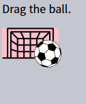

드래그 앤 드롭 · 마우스 이벤트
============================

##### [모던 HTML 표준 내용](https://html.spec.whatwg.org/multipage/dnd.html#dnd)
- 특수 이벤트
  - `dragstart`
  - `dragend`
  - 기타 등등
- 기타 등등

#### `drag[start·end]` <sub>(이벤트)</sub>

##### 특별한 드래그 앤 드롭 기능 제공
- 파일 드래그 <sub>(파일 관리 앱)</sub>
- 파일 드롭 <sub>(브라우저 화면)</sub>
  - 파일 내용 처리 가능

##### 한계 多
- 특정 영역 드래그 막기 X
- 수평 · 수직 드래그 X
- 부족한 모바일 환경 지원
- 기타 등등

##### 한계 극복
- 마우스 이벤트 활용

### 기본 알고리즘

##### 1. `mousedown` <sub>(이벤트)</sub>
- 움직임 필요 요소 준비
  - 기존 요소 복사본 생성
  - 해당 요소 클래스 추가
  - 기타 등등

##### 2. `mousemove` <sub>(이벤트)</sub>
- `position: absolute` 안
  - `left ∙ top` 변경

##### 3. `mouseup` <sub>(이벤트)</sub>
- 완료 관련 작업 수행

##### 공 드래그
```javascript
ball.onmousedown = function(event) {

  // (1)
  // absolute (속성) · zIndex (프로퍼티) 수정
  // - 공 이동 준비
  //   - 최상단 설정
  ball.style.position = 'absolute';
  ball.style.zIndex = 1000;

  // 요소 이동
  // - 현재 위치 부모 → body
  //   - body 기준 위치 지정
  document.body.append(ball);

  // 공 위치 설정
  // - page[X·Y] 좌표 중앙
  function moveAt(pageX, pageY) {
    ball.style.left = pageX - ball.offsetWidth / 2 + 'px';
    ball.style.top = pageY - ball.offsetHeight / 2 + 'px';
  }

  // 공 이동 (클릭 시점)
  // - 포인터 아래
  moveAt(event.pageX, event.pageY);

  function onMouseMove(event) {
    moveAt(event.pageX, event.pageY);
  }

  // (2)
  // 공 이동 (mousemove)
  // - 드래그 중
  document.addEventListener('mousemove', onMouseMove);

  // (3)
  // 공 드롭 (onmouseup)
  // - 불필요 핸들러 제거
  ball.onmouseup = function() {
    document.removeEventListener('mousemove', onMouseMove);
    ball.onmouseup = null;
  };

};
```


##### 드래그 시 복사된 공 <sub>(요소)</sub> 찍어 이동 현상 발생
- 브라우저 자체 제공 기능 자동 실행
  - 이미지 · 요소 대상
  - 코드 충돌
    - 비활성화 필요
```javascript
ball.ondragstart = function() {
  return false;
};
```


##### `mousemove` 추적
- `ball` <sub>(요소)</sub> X
- `document`
  - 첫 로드 시 마우스 위치
    - 항상 공 위
  - `mousemove` 넣기 가능

##### `mousemove` <sub>(이벤트)</sub>
- 모든 픽셀 대상 자주 트리거 X
- 빠른 이동 시 포인터 점프 현상 발생
  - `document` 중간
  - 윈도우 어딘가
  - 기타 등등
    - `document` 내 처리

### 올바른 위치 지정

##### 공 <sub>(요소)</sub> 중앙
- 항상 포인터 위치 이동
```javascript
ball.style.left = pageX - ball.offsetWidth / 2 + 'px';
ball.style.top = pageY - ball.offsetHeight / 2 + 'px';
```

##### 부작용
- 공 가장자리 `mousedown` <sub>(이벤트)</sub> 발생 시
  - 점프 현상 발생
    - 공 중앙 → 포인터 위치
- 요소 초기 이동 유지 <sub>(포인터 기준)</sub>
  - 점프 현상 방지
- ex\) 공 가장자리 드래그 시작 시
  - 드래그 중 포인터 위치 유지


#### 개선된 알고리즘

##### 1. 버튼 클릭 <sub>(`mousedown` 이벤트 발생)</sub> 시
- `shift[X∙Y]` <sub>(변수)</sub>
  - 거리 <sub>(공 좌상단 모서리 ~ 포인터)</sub> 저장
- 드래그 중 거리 유지
  - 포인터 좌표 - 공 좌상단 모서리 좌표
```javascript
// onmousedown
let shiftX = event.clientX - ball.getBoundingClientRect().left;
let shiftY = event.clientY - ball.getBoundingClientRect().top;
```

##### 2. 공 드래그 중 동일 위치 <sub>(포인터 기준)</sub> 공 이동
```javascript
// onmousemove
// - 공 포지션 고정
ball.style.left = event.pageX - shiftX + 'px';
ball.style.top = event.pageY - shiftY + 'px';
```

##### 최종 코드
```javascript
ball.onmousedown = function(event) {

  let shiftX = event.clientX - ball.getBoundingClientRect().left;
  let shiftY = event.clientY - ball.getBoundingClientRect().top;

  ball.style.position = 'absolute';
  ball.style.zIndex = 1000;
  document.body.append(ball);

  moveAt(event.pageX, event.pageY);

  // 공 위치 설정
  // - page[X·Y] 좌표 이동
  //   - 공 좌상단 모서리 ~ 포인터 클릭 거리
  function moveAt(pageX, pageY) {
    ball.style.left = pageX - shiftX + 'px';
    ball.style.top = pageY - shiftY + 'px';
  }

  function onMouseMove(event) {
    moveAt(event.pageX, event.pageY);
  }

  // 공 이동 (mousemove)
  // - 드래그 중
  document.addEventListener('mousemove', onMouseMove);

  // 공 드롭 (onmouseup)
  // - 불필요 핸들러 제거
  ball.onmouseup = function() {
    document.removeEventListener('mousemove', onMouseMove);
    ball.onmouseup = null;
  };

};

// 브라우저 자체 드래그 기능 비활성화
ball.ondragstart = function() {
  return false;
};
```


### 잠재적 드롭 대상 <sub>(드롭 가능)</sub>

##### 실생활 중 드롭
- 보통 한 요소 → 다른 요소에 드롭
  - 어디서나 드롭 X
- '드래그 가능한' 요소
  - '드롭 가능한' 요소에 드롭

##### 필수사항
- 요소 드롭될 위치
  - 드래그 앤 드롭 작업 끝 부분
- 드롭 가능 여부 강조 표시
  - 드롭 위치에 끌고 와 포인터 위치 시

##### 잠재적 드롭 요소
- `mouse[over∙up]` 핸들러 설정 시
  - 동작 X
- 드래그 중 드래그 가능 요소
  - 항상 다른 요소 위 위치
- 마우스 이벤트 내
  - 맨 위 요소
    - 이벤트 발생
  - 그 아래 요소
    - 이벤트 미발생

##### `<div>` <sub>(요소)</sub> 2개
- 빨강 요소
  - 파랑 요소 전체 덮음
- 파랑 요소
  - 이벤트 잡을 방법 X
```html
<style>
  div {
    width: 50px;
    height: 50px;
    position: absolute;
    top: 0;
  }
</style>
<div style="background:blue" onmouseover="alert('never works')"></div>
<div style="background:red" onmouseover="alert('over red!')"></div>
```


드래그할 수 있는 요소도 빨간색 요소가 파란색 요소를 덮은 예제와 같습니다. 공은 항상 다른 요소 위에 있어 이벤트가 발생합니다. 반면에 하위 요소에 설정한 어떠한 핸들러도 동작하지 않습니다.

그러므로 잠재적 드롭 가능한 요소에 핸들러를 넣는 처음에 생각했던 방법은 실제로 동작하지 않습니다. 실행되지 않을 것입니다.

그러면 무엇을 해야 할까요?

`document.elementFromPoint(clientX, clientY)`라는 메서드가 있습니다. 주어진 윈도우 기준 좌표에서 가장 많이 중첩된 요소를 반환합니다. (윈도우 밖의 좌표는 `null`)

다음과 같이 마우스 이벤트 핸들러에서 포인터 아래에 드롭 가능성을 감지할 수 있습니다.
```javascript
// 마우스 이벤트 핸들러에서
ball.hidden = true; // (*) 드래그하는 요소를 숨깁니다.

let elemBelow = document.elementFromPoint(event.clientX, event.clientY);
// elemBelow는 드롭 할 수 있는 공의 아래 요소입니다.

ball.hidden = false;
```

참고: `(*)`을 호출하기 전에 공을 숨겨야 합니다. 그렇지 않으면 공은 보통 포인터 아래의 맨 위 요소로 `elemBelow=ball`의 좌표를 가집니다. 그래서 공을 숨겼다가 다시 보여줍니다.

이 코드를 사용하면 언제든지 어떤 요소가 날아가는지 확인할 수 있습니다. 드롭이 발생했을 때 처리합니다.

'드롭 가능한' 요소를 찾기 위한 `onMouseMove` 확장 코드:
```javascript
// 즉시 날아가는 잠재적 드롭 가능한 요소
let currentDroppable = null;

function onMouseMove(event) {
  moveAt(event.pageX, event.pageY);

  ball.hidden = true;
  let elemBelow = document.elementFromPoint(event.clientX, event.clientY);
  ball.hidden = false;

  // 마우스 이벤트는 윈도우 밖으로 트리거 될 수 없습니다.(공을 윈도우 밖으로 드래그 했을 때)
  // clientX∙clientY가 윈도우 밖에 있으면, elementFromPoint는 null을 반환합니다.
  if (!elemBelow) return;

  // 잠재적으로 드롭 할 수 있는 요소를 'droppable' 클래스로 지정합니다.(다른 로직 가능)
  let droppableBelow = elemBelow.closest('.droppable');

  if (currentDroppable != droppableBelow) {
    // 들어오거나 날리거나...
    // 참고: 두 값 모두 null일 수 있습니다.
    //   currentDroppable=null 이벤트 전에 놓을 수 있는 요소 위에 있지 않다면(예: 빈 공간)
    //   droppableBelow=null 이벤트 동안 놓을 수 있는 요소 위에 있지 않다면

    if (currentDroppable) {
      // '날아가는 것'을 처리하는 로직(강조 제거)
      leaveDroppable(currentDroppable);
    }
    currentDroppable = droppableBelow;
    if (currentDroppable) {
      // '들어오는 것'을 처리하는 로직
      enterDroppable(currentDroppable);
    }
  }
}
```

아래 예시에서 공을 축구 골대 위로 드래그하면 골대가 강조 표시됩니다.

##### 결과



```html
<!-- index.html -->
<!doctype html>
<html>

<head>
  <meta charset="UTF-8">
  <link rel="stylesheet" href="style.css">
</head>

<body>

  <p>Drag the ball.</p>

  

  

  <script>
    let currentDroppable = null;

    ball.onmousedown = function(event) {

      let shiftX = event.clientX - ball.getBoundingClientRect().left;
      let shiftY = event.clientY - ball.getBoundingClientRect().top;

      ball.style.position = 'absolute';
      ball.style.zIndex = 1000;
      document.body.append(ball);

      moveAt(event.pageX, event.pageY);

      function moveAt(pageX, pageY) {
        ball.style.left = pageX - shiftX + 'px';
        ball.style.top = pageY - shiftY + 'px';
      }

      function onMouseMove(event) {
        moveAt(event.pageX, event.pageY);

        ball.hidden = true;
        let elemBelow = document.elementFromPoint(event.clientX, event.clientY);
        ball.hidden = false;

        if (!elemBelow) return;

        let droppableBelow = elemBelow.closest('.droppable');
        if (currentDroppable != droppableBelow) {
          if (currentDroppable) { // null when we were not over a droppable before this event
            leaveDroppable(currentDroppable);
          }
          currentDroppable = droppableBelow;
          if (currentDroppable) { // null if we're not coming over a droppable now
            // (maybe just left the droppable)
            enterDroppable(currentDroppable);
          }
        }
      }

      document.addEventListener('mousemove', onMouseMove);

      ball.onmouseup = function() {
        document.removeEventListener('mousemove', onMouseMove);
        ball.onmouseup = null;
      };

    };

    function enterDroppable(elem) {
      elem.style.background = 'pink';
    }

    function leaveDroppable(elem) {
      elem.style.background = '';
    }

    ball.ondragstart = function() {
      return false;
    };
  </script>

</body>
</html>
```
```css
/* style.css */
#gate { cursor: pointer; margin-bottom: 100px; width: 83px; height: 46px; }
#ball { cursor: pointer; width: 40px; height: 40px; }
```

이제 전체 프로세스가 진행되는 동안 `currentDroppable`변수에 날아가는 현재 드롭 대상이 있으며, 강조 혹은 다른 항목을 사용할 수 있습니다.

<br />

## 요약
드래그 앤 드롭 기본 알고리즘을 생각했습니다.
1. 이벤트 흐름: `ball.mousedown` → `document.mousemove` → `ball.mouseup`(`ondragstart`를 취소하는 걸 잊지 마세요)
2. 드래그 시작 시 요소를 기준으로 포인터의 초기 이동을 기억하고 (`shiftX`∙`shiftY`) 드래그하는 동안 유지합니다.
3. `document.elementFromPoint`를 사용해 포인터 아래의 드롭할 수 있는 요소를 감지합니다.

이 기반으로 많은 것을 둘 수 있습니다.
- `mouseup`에서 데이터를 변경하고, 요소를 이동하는 등 지적으로 드롭을 마칠 수 있습니다.
- 날아가는 요소를 강조할 수 있습니다.
- 특정 영역이나 방향으로 드래그하는 것을 제한할 수 있습니다.
- `mousedown`/`up`에 이벤트 위임을 사용할 수 있습니다. `event.target`을 확인하는 넓은 영역의 이벤트 핸들러는 수백 개의 요소에 대한 드래그 앤 드롭을 관리할 수 있습니다.
- 등등

`DragZone`, `Droppable`, `Draggable` 및 기타 클래스 등 아키텍처를 구축하는 프레임워크가 있습니다. 대부분은 앞서 드래그와 드롭에 대한 설명과 유사한 작업을 하므로 이해하기 쉽습니다. 때로는 제3의 솔루션 적용보다 쉽게 수행할 수 있습니다.

<br />

##  과제

### Slider
Create a slider:


Drag the blue thumb with the mouse and move it.

Important details:

When the mouse button is pressed, during the dragging the mouse may go over or below the slider. The slider will still work (convenient for the user).
If the mouse moves very fast to the left or to the right, the thumb should stop exactly at the edge.

<br />


As we can see from HTML/CSS, the slider is a `<div>` with a colored background, that contains a runner – another `<div>` with `position:relative`.

To position the runner we use `position:relative`, to provide the coordinates relative to its parent, here it's more convenient here than `position:absolute`.

Then we implement horizontal-only Drag'n'Drop with limitation by width.

[샌드박스를 열어 정답을 확인해보세요.](https://plnkr.co/edit/lBpFSUdqUXAgYJEO?p=preview)

<hr />

### Drag superheroes around the field
This task can help you to check understanding of several aspects of Drag'n'Drop and DOM.

Make all elements with class `draggable` – draggable. Like a ball in the chapter.

Requirements:
- Use event delegation to track drag start: a single event handler on `document` for `mousedown`.
- If elements are dragged to top/bottom window edges – the page scrolls up/down to allow further dragging.
- There is no horizontal scroll (this makes the task a bit simpler, adding it is easy).
- Draggable elements or their parts should never leave the window, even after swift mouse moves.

The demo is too big to fit it here, so here's the link.

<br />


To drag the element we can use `position:fixed`, it makes coordinates easier to manage. At the end we should switch it back to `position:absolute` to lay the element into the document.

When coordinates are at window top/bottom, we use `window.scrollTo` to scroll it.

More details in the code, in comments.

[샌드박스를 열어 정답을 확인해보세요.](https://plnkr.co/edit/6cvMkqQmcmxvYnyL?p=preview)
