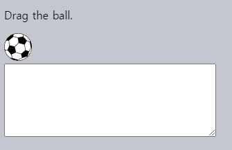

포인터 이벤트
============

##### 다양한 포인터 디바이스 입력 처리
- 마우스
- 팬 · 스타일러스
- 터치스크린
- 기타 등등

### 간략한 역사 훑기

#### 과거
- 오직 마우스 이벤트만 존재

#### 현대

##### 터치 디바이스
- 보편화
  - 스마트폰
  - 태블릿
  - 기타 등등
- 마우스 이벤트 생성
  - ex\) 스크린 터치 시
    - `mousedown` <sub>(이벤트)</sub> 생성
  - 기존 스크립트 호환 목적
- 더 다양한 동작 가능
  - 여러군데 동시 터치하기
  - 기타 등등

##### 터치 이벤트 도입
- `touch[start·end]`
- `touchmove`
- 기타 등등
  - 전용 프로퍼티 有

##### 여전히 부족
- 기타 다양한 포인터 디바이스 有
  - 팬
  - 스타일러스
  - 기타 등등
- 반복적인 코드량 증가
  - 이벤트 리스너 작성
    - 터치 이벤트
    - 마우스 이벤트
    - 기타 등등

##### 해결책
- 새 표준 포인터 이벤트 도입
  - 모든 포인터 디바이스 이벤트 담당

##### [Pointer Events Level 2](https://www.w3.org/TR/pointerevents2/) 스펙
- 대다수 주요 브라우저 지원

##### [Pointer Events Level 3](https://w3c.github.io/pointerevents/) 스펙
- 표준화 작업 중
- 높은 호환성 <sub>(Level 2)</sub>

##### 모던 브라우저 대상 개발 시
- 포인터 이벤트 사용
  - 마우스 · 터치 디바이스 입력 처리
- 마우스 · 터치 이벤트 사용 X

### 포인터 이벤트 타입

##### 포인터 이벤트 타입명
- 마우스 이벤트 타입명 유사

|포인터 이벤트|마우스 이벤트|
|---|---|
|`pointerdown`|`mousedown`|
|`pointerup`|`mouseup`|
|`pointermove`|`mousemove`|
|`pointerover`|`mouseover`|
|`pointerout`|`mouseout`|
|`pointerenter`|`mouseenter`|
|`pointerleave`|`mouseleave`|
|`pointercancel`|-|
|`gotpointercapture`|-|
|`lostpointercapture`|-|

<br />

 **마우스 이벤트 → 포인터 이벤트**

##### 마우스 이벤트 챕터 코드
- 마우스 이벤트 → 포인터 이벤트 대체
  - 실행 · 결과 확인
- 터치 디바이스 지원 향상
  - `touch-action: none` 필요 가능
    - CSS 코드

<br />

### 포인터 이벤트 프로퍼티

##### 마우스 이벤트 프로퍼티 동일
- `client[X·Y]`
- `target`
- 기타 등등

#### 추가 프로퍼티

##### `pointerId`
- 유일 식별자
  - 이벤트 발생 포인터
- 브라우저 생성
  - 다수 포인터 처리 가능
    - 터치스크린
    - 스타일러스
    - 멀티 터치
    - 기타 등등

##### `pointerType` <sub>(문자열)</sub>
- 포인터 디바이스 타입
  - `"mouse"`
  - `"pen"`
  - `"touch"`
  - 기타 등등
- 타입별 다른 동작 실행

##### `isPrimary` <sub>(`boolean`)</sub>
- `true`
  - 주요 포인터
- 멀티 터치 시
  - 첫 손가락 터치

#### 접촉 영역 · 압력 프로퍼티
- 일부 포인터 디바이스
  - 접촉 영역 · 압력 측정
    - ex\) 터치스크린 상 손가락 터치
- 대다수 디바이스 미지원
  - 드물게 사용
- [스펙](https://w3c.github.io/pointerevents/#pointerevent-interface)

##### `width` · `height`
- 포인터 터치 <sub>(디바이스)</sub> 영역 너비 · 높이
- 미지원 시 <sub>(마우스 등)</sub>
  - 항상 `1`

##### `pressure`
- 포인터 끝쪽 압력
  - `0` ~ `1`
- 미지원 시
  - `0.5` <sub>(터치)</sub>
  - `0` <sub>(터치 X)</sub>

##### `tangentialPressure`
- 정규화된 탄젠트 압력

##### `tilt[X·Y]` · `twist`
- 펜 전용
- 디바이스 표면 기준 펜 위치 모양

### 멀티 터치
- 마우스 이벤트 미지원

##### 디바이스 대상
- 여러 위치 동시 터치
- 특별한 제스처 취하기

##### 포인터 이벤트 지원
- `pointerId` · `isPrimary` <sub>(프로퍼티)</sub> 이용

#### 멀티 터치 과정

##### 1. 1번째 손가락 터치
- `pointerdown` <sub>(이벤트)</sub>
  - `isPrimary` <sub>(프로퍼티)</sub>
    - `true`
  - `pointerId` <sub>(프로퍼티)</sub>
    - 특정값

##### 2. n번째 손가락 터치 <sub>(1번째 터치 유지)</sub>
- `pointerdown` <sub>(이벤트)</sub>
  - `isPrimary` <sub>(프로퍼티)</sub>
    - `false`
  - `pointerId` <sub>(프로퍼티)</sub>
    - 손가락별 다른 값

#### `pointerId` <sub>(프로퍼티)</sub>

##### 할당 기준
- 디바이스 X
  - 각 손가락 터치
- ex\) 손가락 5개 동시 터치 시
  - `pointerdown` <sub>(이벤트)</sub> 5번 발생
    - 각 좌표
    - 각 `pointerId` <sub>(프로퍼티)</sub>

##### 1번째 손가락 터치 <sub>(`pointerdown` 이벤트)</sub>
- `isPrimary` <sub>(프로퍼티)</sub>
  - 항상 `true`

##### 다수 손가락 터치 추적
- 손가락 터치 후 떼기 시
  - `pointer[down·move·up]` <sub>(이벤트)</sub>
    - `pointerId` <sub>(프로퍼티)</sub> 값 동일

##### `pointer[down·up]` <sub>(이벤트)</sub> 기록 로깅


##### `pointerId` · `isPrimary` <sub>(프로퍼티)</sub> 값
- 터치스크린 디바이스 <sub>(폰 · 태블릿 등)</sub>
  - 다양한 값
- 단일 터치 디바이스 <sub>(마우스 등)</sub>
  - 항상 값 동일
    - `1`
    - `true`

### `pointercancel` <sub>(이벤트)</sub>

##### 진행중인 포인터 상호작용 중단 시 발생
- 포인터 디바이스 기기 자체
  - 물리적 사용 불가 상태 발생
- 디바이스 방향 변화
  - ex\) 태블릿 회전시키기
- 브라우저 자체 판단 <sub>(해당 포인터 상호작용)</sub>
  - 마우스 동작 간주
  - 줌 · 아웃 동작 간주
  - 기타 등등

### 공 <sub>(요소)</sub> 드래그 앤 드롭 구현

#### 사용자 동작 · 상응 이벤트 흐름

##### 1. 손가락으로 이미지 누름
- 드래그 전
- `pointerdown` <sub>(이벤트)</sub> 발생

##### 2. 이미지 드래그 <sub>(포인터 이동)</sub>
- 드래그 중
- `pointermove` <sub>(이벤트)</sub> 발생
  - 다수 발생 가능

##### 3. 브라우저 내장 드래그 앤 드롭 기능 작동
- 드래그 앤 드롭 프로세스 가져감
  - 드래그 <sub>(포인터 이동)</sub> 중단
    - `pointercancel` <sub>(이벤트)</sub> 발생
- 브라우저 : 드래그 앤 드롭 처리 담당
  - `pointermove` <sub>(이벤트)</sub> 더이상 발생 X

##### 포인터 상호작용 프로세스
- 브라우저에 뺏김
  - `pointercancel` <sub>(이벤트)</sub> 발생
  - `pointermove` <sub>(이벤트)</sub> 더이상 발생 X

Here's the drag'n'drop demo with loggin of pointer events (only `up`/`down`, `move` and `cancel`) in the `textarea`:



We'd like to implement the drag'n'drop on our own, so let's tell the browser not to take it over.

**Prevent the default browser action to avoid `pointercancel`.**

We need to do two things:
1. Prevent native drag'n'drop from happening:
    - We can do this by setting `ball.ondragstart = () => false`, just as described in the article 드래그 앤 드롭과 마우스 이벤트.
    - That works well for mouse events.
2. For touch devices, there are other touch-related browser actions (besides drag'n'drop). To avoid problems with them too:
    - Prevent them by setting `#ball { touch-action: none }` in CSS.
    - Then our code will start working on touch devices.

After we do that, the events will work as intended, the browser won't hijack the process and doesn't emit `pointercancel`.

This demo adds these lines:


As you can see, there's no `pointercancel` any more.

Now we can add the code to actually move the ball, and our drag'n'drop will work for mouse devices and touch devices.

### Pointer capturing
Pointer capturing is a special feature of pointer events.

The idea is very simple, but may seem quite odd at first, as nothing like that exists for any other event type.

The main method is:
- `elem.setPointerCapture(pointerId)` – binds events with the given `pointerId` to `elem`. After the call all pointer events with the same `pointerId` will have `elem` as the target (as if happened on `elem`), no matter where in document they really happened.

In other words, `elem.setPointerCapture(pointerId)` retargets all subsequent events with the given `pointerId` to `elem`.

The binding is removed:
- automatically when `pointerup` or `pointercancel` events occur,
- automatically when `elem` is removed from the document,
- when `elem.releasePointerCapture(pointerId)` is called.

**Pointer capturing can be used to simplify drag'n'drop kind of interactions.**

As an example, let's recall how one can implement a custom slider, described in the 드래그 앤 드롭과 마우스 이벤트.

We make a slider element with the strip and the "runner" (`thumb`) inside it.

Then it works like this:
1. The user presses on the slider `thumb` – `pointerdown` triggers.
2. Then they move the pointer – `pointermove` triggers, and we move the `thumb` along.
    - …As the pointer moves, it may leave the slider `thumb`: go above or below it. The `thumb` should move strictly horizontally, remaining aligned with the pointer.

So, to track all pointer movements, including when it goes above/below the `thumb`, we had to assign `pointermove` event handler on the whole `document`.

That solution looks a bit "dirty". One of the problems is that pointer movements around the document may cause side effects, trigger other event handlers, totally not related to the slider.

Pointer capturing provides a means to bind `pointermove` to `thumb` and avoid any such problems:
- We can call `thumb.setPointerCapture(event.pointerId)` in `pointerdown` handler,
- Then future pointer events until `pointerup`/`cancel` will be retargeted to `thumb`.
- When `pointerup` happens (dragging complete), the binding is removed automatically, we don't need to care about it.

So, even if the user moves the pointer around the whole document, events handlers will be called on `thumb`. Besides, coordinate properties of the event objects, such as `clientX`/`clientY` will still be correct – the capturing only affects `target`/`currentTarget`.

Here's the essential code:
```javascript
thumb.onpointerdown = function(event) {
  // retarget all pointer events (until pointerup) to thumb
  thumb.setPointerCapture(event.pointerId);
};

thumb.onpointermove = function(event) {
  // moving the slider: listen on the thumb, as all pointer events are retargeted to it
  let newLeft = event.clientX - slider.getBoundingClientRect().left;
  thumb.style.left = newLeft + 'px';
};

// note: no need to call thumb.releasePointerCapture,
// it happens on pointerup automatically
```

The full demo:


At the end, pointer capturing gives us two benefits:

1. The code becomes cleaner as we don't need to add/remove handlers on the whole `document` any more. The binding is released automatically.
2. If there are any `pointermove` handlers in the document, they won't be accidentally triggered by the pointer while the user is dragging the slider.

#### Pointer capturing events
There are two associated pointer events:
- `gotpointercapture` fires when an element uses `setPointerCapture` to enable capturing.
- `lostpointercapture` fires when the capture is released: either explicitly with `releasePointerCapture` call, or automatically on `pointerup`/`pointercancel`.

<br />

## 요약
Pointer events allow handling mouse, touch and pen events simultaneously, with a single piece of code.

Pointer events extend mouse events. We can replace `mouse` with `pointer` in event names and expect our code to continue working for mouse, with better support for other device types.

For drag'n'drops and complex touch interactions that the browser may decide to hijack and handle on its own – remember to cancel the default action on events and set `touch-events: none` in CSS for elements that we engage.

Additional abilities of pointer events are:
- Multi-touch support using `pointerId` and `isPrimary`.
- Device-specific properties, such as `pressure`, `width`/`height`, and others.
- Pointer capturing: we can retarget all pointer events to a specific element until `pointerup`/`pointercancel`.

As of now, pointer events are supported in all major browsers, so we can safely switch to them, especially if IE10- and Safari 12- are not needed. And even with those browsers, there are polyfills that enable the support of pointer events.
