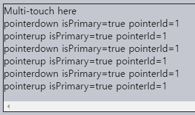
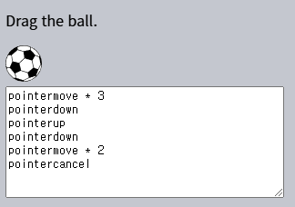
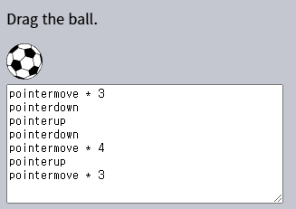
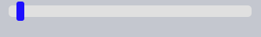

포인터 이벤트
====

##### 다양한 포인터 디바이스 입력 처리
- 마우스
- 팬 · 스타일러스
- 터치스크린
- 기타 등등

### 간략한 역사

##### 과거
- 오직 마우스 이벤트만 有

#### 현대

##### 터치 디바이스 대중화 <sub>(스마트폰 · 태블릿 등)</sub>
  - 기타 등등
- 마우스 이벤트 생성 <sub>(기존 스크립트 호환)</sub>
  - ex\) 스크린 터치 시
    - `mousedown` <sub>(이벤트)</sub> 생성
- 클릭 외 다양한 동작 가능
  - 다수 위치 동시 터치하기 <sub>(멀티 터치)</sub>
  - 기타 등등

##### 터치 이벤트 도입 <sub>(전용 프로퍼티 有)</sub>
- `touch[start·end]`
- `touchmove`
- 기타 등등

##### 여전히 부족
- 터치 외 다양한 디바이스 <sub>(고유 특징 有)</sub>
  - 팬
  - 스타일러스
  - 기타 등등
- 반복적인 코드량 ↑
  - 마우스 · 터치 이벤트 각각 작성

##### 새 표준 도입
- 포인터 이벤트
  - 모든 포인터 디바이스 담당

#### 명세

##### [Pointer Events Level 2](https://www.w3.org/TR/pointerevents2/)
- 대다수 주요 브라우저 지원

##### [Pointer Events Level 3](https://w3c.github.io/pointerevents/)
- 표준화 작업 진행 중
- 대대수 level 2 내용 호환

##### 모던 브라우저 대상 개발
- 마우스 · 터치 이벤트 사용 가능
- 포인터 이벤트 권장
  - 마우스 · 터치 디바이스 입력 처리 가능

### 포인터 이벤트 타입

##### 포인터 이벤트
- 마우스 이벤트 · 이름 유사
- 추가 이벤트 有

|포인터 이벤트|마우스 이벤트|
|---|---|
|`pointerdown`|`mousedown`|
|`pointerup`|`mouseup`|
|`pointermove`|`mousemove`|
|`pointerover`|`mouseover`|
|`pointerout`|`mouseout`|
|`pointerenter`|`mouseenter`|
|`pointerleave`|`mouseleave`|
|`pointercancel`|-|
|`gotpointercapture`|-|
|`lostpointercapture`|-|

<br />

 **마우스 · 터치 이벤트 → 포인터 이벤트 <sub>(교체)</sub>**

##### 기존 코드 <sub>(교체 후)</sub>
- 정상 동작

##### 터치 디바이스 지원 향상
- 터치 이벤트 비활성화 필요 가능
  - `touch-action: none` <sub>(CSS)</sub>

<br />

### [포인터 이벤트 프로퍼티](https://w3c.github.io/pointerevents/#pointerevent-interface)

##### 마우스 이벤트 프로퍼티 동일
- `client[X·Y]`
- `target`
- 기타 등등

#### 추가 프로퍼티

##### `pointerId` <sub>(브라우저 생성)</sub>
- 고유 식별자
  - 이벤트 발생 포인터
- 다수 포인터 처리 가능
  - 터치스크린
  - 스타일러스
  - 멀티 터치
  - 기타 등등

##### `pointerType` <sub>(문자열)</sub>
- 포인터 디바이스 타입
  - `"mouse"`
  - `"touch"`
  - `"pen"`
- 타입별 동작 구현 시 사용

##### `isPrimary` <sub>(`boolean`)</sub>
- 주요 포인터 여부
  - ex\) 첫 손가락 터치 <sub>(멀티 터치)</sub>

#### 접촉 영역 · 압력 프로퍼티

##### 일부 포인터 디바이스 지원
- 접촉 영역 · 압력 측정 기능 有
  - ex\) 터치스크린 상 손가락 터치 등

##### 대다수 디바이스 미지원
- 드물게 사용

##### `width` · `height`
- 포인터 <sub>(손가락 등)</sub> 터치 영역 너비 · 높이
- 미지원 <sub>(마우스 등)</sub> 시 항상 `1`

##### `pressure`
- 포인터 터치 부분 압력
  - `0` ~ `1`
- 미지원 시
  - `0.5` <sub>(터치)</sub>
  - `0` <sub>(터치 X)</sub>

##### `tangentialPressure`
- 정규화된 탄젠트 압력

##### `tilt[X·Y]` · `twist` <sub>(펜 전용)</sub>
- 디바이스 화면 기준 펜 기울기

### 멀티 터치

##### 마우스 이벤트 미지원 기능
- 다수 위치 동시 터치하기
- 특별한 제스처 취하기

##### 특정 포인터 프로퍼티 이용
- `pointerId`
- `isPrimary`

#### 멀티 터치 과정

##### 1. 1번째 손가락 터치
- `pointerdown` <sub>(이벤트)</sub> 발생
  - `isPrimary` <sub>(프로퍼티)</sub>
    - `true`
  - `pointerId` <sub>(프로퍼티)</sub>
    - 특정 값

##### 2. n번째 손가락 터치 <sub>(1번째 터치 유지)</sub>
- `pointerdown` <sub>(이벤트)</sub> 발생
  - `isPrimary` <sub>(프로퍼티)</sub>
    - `false`
  - `pointerId` <sub>(프로퍼티)</sub>
    - 터치별 특정 값

##### `pointerId` <sub>(프로퍼티)</sub> 할당 기준
- 개별 디바이스 X
  - 개별 손가락 터치
- ex\) 손가락 5개 동시 터치
  - `pointerdown` <sub>(이벤트)</sub> 5번 발생
    - 각 좌표 有
    - 각 `pointerId` <sub>(프로퍼티)</sub> 有

##### 1번째 터치 <sub>(`pointerdown` 이벤트)</sub>
- `isPrimary` <sub>(프로퍼티)</sub> 값
  - 항상 `true`

#### 다수 손가락 터치 추적 <sub>(`pointerId` 프로퍼티 이용)</sub>

##### 손가락 터치 후 떼기
- 다수 포인터 이벤트 연달아 발생
  - 동일 `pointerId` <sub>(프로퍼티)</sub> 값

##### 이벤트 발생 순서
1. `pointerdown`
2. `pointermove`
3. `pointerup`

##### `pointer[down·up]` <sub>(이벤트)</sub> 기록 로깅



##### `pointerId` · `isPrimary` <sub>(프로퍼티)</sub> 값
- 터치스크린 디바이스 <sub>(폰 · 태블릿 등)</sub>
  - 다양한 값
- 단일 터치 디바이스 <sub>(마우스 등)</sub>
  - 항상 특정 값
    - `1` <sub>(`pointerId`)</sub>
    - `true` <sub>(`isPrimary`)</sub>

### `pointercancel` <sub>(이벤트)</sub>

##### 진행중인 포인터 상호작용 중단 시 발생
- 포인터 디바이스 물리적 사용 불가능 상태
- 디바이스 방향 전환 <sub>(태블릿 회전 등)</sub>
- 브라우저 자체 처리
  - 마우스 동작 간주
  - 확재 · 축소 동작 간주
  - 기타 등등

### 공 <sub>(요소)</sub> 드래그 앤 드롭 구현

#### 사용자 동작 · 상응 이벤트 흐름

##### 1. 이미지 손가락 누르기 <sub>(드래그 전)</sub>
- `pointerdown` <sub>(이벤트)</sub> 발생

##### 2. 포인터 이동 <sub>(이미지 드래그)</sub> 시작 <sub>(드래그 시작)</sub>
- `pointermove` <sub>(이벤트)</sub> 발생 <sub>(1번 이상)</sub>

##### 3. 브라우저 내장 기능 작동
- 드래그 앤 드롭 프로세스 차지 · 동작 자체 처리
  - 브라우저 외부 드래그 가능
    - 메일 프로그램
    - 파일 관리자
    - 기타 등등
- `pointercancel` <sub>(이벤트)</sub> 발생
  - `pointermove` <sub>(이벤트)</sub> 발생 중단

##### 포인터 상호작용 제어 <sub>(브라우저)</sub>
- `pointercancel` <sub>(이벤트)</sub>
  - 드래그 앤 드롭 프로세스 시작 시 발생
- `pointermove` <sub>(이벤트)</sub>
  - 발생 중단

##### 드래그 앤 드롭 포인터 이벤트 로깅 ①
- 드래그 동작 無 <sub>(누르기 → 떼기)</sub>
  1. `pointerdown`
  2. `pointermove` <sub>(1번 이상)</sub>
  3. `pointerup`
- 드래그 동작 有 <sub>(누르기 → 드래그 → 떼기)</sub>
  1. `pointerdown`
  2. `pointermove` <sub>(1번 이상)</sub>
  3. `pointercancel`



##### 브라우저 내장 기능 비활성화 <sub>(`pointercancel` 방지)</sub>
1. 드래그 앤 드롭
```javascript
ball.ondragstart = () => false;
```
2. 터치 관련 <sub>(폰 · 태블릿 등)</sub>
```css
#ball {
  touch-action: none;
}
```

##### 드래그 앤 드롭 포인터 이벤트 로깅 ② <sub>(내장 기능 비활성화)</sub>
- `pointercancel` <sub>(이벤트)</sub> 미발생
  - 로깅 정상 동작



### 포인터 캡처링 <sub>(포인터 이벤트 특수 기능)</sub>

##### `setPointerCapture(pointerId)` <sub>(요소 메서드)</sub>
- 이벤트 <sub>(`pointerId`)</sub> → 요소 바인딩
```javascript
elem.setPointerCapture(pointerId);
```
- `pointerId` <sub>(이벤트)</sub> → `elem` <sub>(요소)</sub> 바인딩
- 특정 `pointerId` 이벤트 전체
  - `elem` <sub>(요소)</sub> 발생 <sub>(실제 발생 위치 무관)</sub>

#### 바인딩 제거

##### 자동
- `pointer[up·cancel]` <sub>(이벤트)</sub> 발생 시
- 문서 내 `elem` <sub>(요소)</sub> 제거 시

##### 수동
- 제거 메서드 호출 시
```javascript
elem.releasePointerCapture(pointerId);
```

##### 포인터 캡처링 용도
- 특정 상호작용 단순화
  - 드래그 앤 드롭
  - 기타 등등

### 이전 슬라이더 과제 <sub>([드래그 앤 드롭](./03.%20Drag'n'Drop%20with%20mouse%20events.md) · [마우스 이벤트](./01.%20Mouse%20events.md) 챕터)</sub>

##### 슬라이더 요소 구성
- 본체
- 손잡이

#### 동작 구현

##### 1. 손잡이 누르기
- `pointerdown` <sub>(이벤트)</sub> 발생

##### 2. 포인터 <sub>(손잡이)</sub> 이동
- `pointermove` <sub>(이벤트)</sub> 발생
- 포인터
  - 손잡이 요소 이탈 가능 <sub>(상 · 하단)</sub>
- 손잡이
  - 수평 <sub>(수직 X)</sub> 이동 <sub>(포인터 수직 정렬 유지)</sub>

##### 모든 포인터 이동 추적 <sub>(손잡이 상 · 하단 이탈 이동 포함)</sub>
- 문서 `pointermove` 핸들러 설정

##### 부작용
- 문서 내 포인터 이동 시
  - 타 이벤트 핸들러 <sub>(슬라이더 무관)</sub> 동작

#### 포인터 캡처링 사용

##### 이벤트 → 요소 바인딩
- `pointermove` <sub>(이벤트)</sub>
  - `thumb` <sub>(손잡이 요소)</sub> 바인딩
- 타 이벤트 핸들러 <sub>(슬라이더 무관)</sub> 동작 방지

##### 1. `pointerdown` 핸들러
- 바인딩 메서드 호출
```javascript
// event (이벤트) → thumb (손잡이 요소) 바인딩
thumb.setPointerCapture(event.pointerId);
```

##### 2. 이후 포인터 이벤트 <sub>(`pointer[up·cancel]` 발생 전)</sub>
- `thumb` <sub>(손잡이 요소)</sub> 발생

##### 3. `pointerup` <sub>(이벤트)</sub> 발생 <sub>(드래깅 완료)</sub>
- 바인딩 자동 제거

##### 문서 내 포인터 이동 이벤트 <sub>(손잡이 요소 클릭 후)</sub>
- 항상 `thumb` <sub>(손잡이 요소)</sub> 발생
  - 문서 `pointermove` 핸들러 동작
- 이벤트 객체 좌표 프로퍼티 <sub>(`client[X·Y]` 등)</sub>
  - 옳바른 값 저장
- 포인터 캡처링
  - `[currentT·t]arget` 에만 영향
```javascript
// 드래깅 시작
thumb.onpointerdown = function(event) {

  // 모든 포인터 이벤트 발생 대상 설정 (pointerup 이벤트 전까지)
  // - thumb (손잡이 요소)
  thumb.setPointerCapture(event.pointerId);
};

// 드래깅 중 (슬라이더 이동)
// thumb (손잡이 요소) 핸들러
// - 발생하는 모든 포인터 이벤트 처리
thumb.onpointermove = function(event) {
  let newLeft = event.clientX - slider.getBoundingClientRect().left;
  thumb.style.left = newLeft + 'px';
};

// 바인딩 제거 메서드 호출 불필요
// - pointerup (이벤트) 발생 시 자동 제거
```



#### 포인터 캡처링 이점

##### 1. 더 깔끔한 코드
- 문서 핸들러 불필요
- 바인딩 자동 제거

##### 2. 문서 내 타 `pointermove` 핸들러
- 슬라이더 드래깅 중 미작동 <sub>(부작용 無)</sub>

#### 포인터 캡처링 관련 이벤트

##### `gotpointercapture`
- 이벤트 바인딩 <sub>(`setPointerCapture` 호출)</sub> 시 발생
  - 요소 포인터 캡처링 적용

##### `lostpointercapture`
- 바인딩 제거 시 발생 <sub>(자동 · 수동 무관)</sub>

<br />

요약
====

#### 포인터 이벤트

##### 다수 포인터 디바이스 입력 동시 처리 <sub>(단일 코드)</sub>
- 마우스
- 터치
- 펜
- 기타 등등

##### 마우스 이벤트 확장 · 대체
- `mouse[*]` → `pointer[*]`
  - 이벤트 처리 동작 동일
  - 향상된 타 입력 디바이스 지원

For drag’n’drops and complex touch interactions that the browser may decide to hijack and handle on its own – remember to cancel the default action on events and set touch-events: none in CSS for elements that we engage.

#### 브라우저 자체 내장 기능

##### 이벤트 처리 프로세스 차지
- 자체적 이벤트 처리
  - 드래그 앤 드롭
  - 복잡한 터치 상호작용
  - 기타 등등

##### 내장 기능 비활성화 필요
1. 드래그 앤 드롭
```javascript
ball.ondragstart = () => false;
```
2. 터치 관련 <sub>(폰 · 태블릿 등)</sub>
```css
#elem {
  touch-action: none;
}
```

#### 추가 기능

##### 멀티 터치 지원
- 특정 프로퍼티 사용 필요
  - `pointerId`
  - `isPrimary`

##### 특정 디바이스 전용 프로퍼티 有
- `pressure`
- `width`
- `height`
- 기타 등등

##### 포인터 캡처링
- 이벤트 → 요소 바인딩
- `pointer[up·cancel]` <sub>(이벤트)</sub> 발생 시
  - 바인딩 자동 제거

##### 대다수 주요 브라우저 지원
- 마이그레이션 용이
- 일부 구식 브라우저 <sub>(IE 10 · Safari 12)</sub>
  - 폴리필 필요
