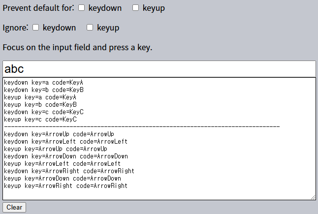

키보드 이벤트
====

##### 다양한 입력 방법 有 <sub>(현대 디바이스)</sub>
- 음성 인식 <sub>(주로 모바일 기기)</sub>
- 복사 · 붙여넣기 <sub>(마우스)</sub>
- 기타 등등

##### `<input>` <sub>(필드)</sub> 입력 추적
- 키보드 이벤트 <sub>(불충분)</sub>
- `input` <sub>(이벤트)</sub>
  - `<input>` <sub>(필드)</sub> 변화 추적
    - 입력 종류 무관
  - 대다수 경우 유용

##### 키보드 이벤트
- 키보드 동작 처리 <sub>(가상 키보드 포함)</sub>
  - 화살표키 누르기 · 떼기
  - 핫키 <sub>(조합)</sub>
  - 기타 등등

### 테스트



```html
<!-- index.html -->
<!DOCTYPE HTML>
<html>

<head>
  <meta charset="utf-8">
  <link rel="stylesheet" href="style.css">
</head>

<body>
  <form id="form" onsubmit="return false">

    Prevent default for:
    <label>
      <input type="checkbox" name="keydownStop" value="1" /> keydown
    </label>&nbsp;&nbsp;&nbsp;
    <label>
      <input type="checkbox" name="keyupStop" value="1" /> keyup
    </label>

    <p>
      Ignore:
      <label>
        <input type="checkbox" name="keydownIgnore" value="1" /> keydown
      </label>&nbsp;&nbsp;&nbsp;
      <label>
        <input type="checkbox" name="keyupIgnore" value="1" /> keyup
      </label>
    </p>

    <p>Focus on the input field and press a key.</p>

    <input type="text" placeholder="Press keys here" id="kinput" />

    <textarea id="area"></textarea>
    <input type="button" value="Clear" onclick="area.value = ''" />
  </form>

  <script src="script.js"></script>
</body>

</html>
```
```javascript
// script.js
kinput.onkeydown = kinput.onkeyup = kinput.onkeypress = handle;

let lastTime = Date.now();

function handle(e) {
  if (form.elements[e.type + 'Ignore'].checked) {
    return;
  }

  let text = e.type +
    ' key=' + e.key +
    ' code=' + e.code +
    (e.shiftKey ? ' shiftKey' : '') +
    (e.ctrlKey ? ' ctrlKey' : '') +
    (e.altKey ? ' altKey' : '') +
    (e.metaKey ? ' metaKey' : '') +
    (e.repeat ? ' (repeat)' : '') +
    "\n";

  if (area.value && Date.now() - lastTime > 250) {
    area.value += new Array(81).join('-') + '\n';
  }
  lastTime = Date.now();

  area.value += text;

  if (form.elements[e.type + 'Stop'].checked) {
    e.preventDefault();
  }
}
```
```css
/* style.css */
#kinput { font-size: 150%; box-sizing: border-box; width: 95%; }
#area { width: 95%; box-sizing: border-box; height: 250px; border: 1px solid black; display: block; }
form label { display: inline; white-space: nowrap; }
```

### `key[down·up]` <sub>(이벤트)</sub>

##### 키보드 동작 관련
- 키 누를 때 · 뗄 때 발생

#### `key · code` <sub>(이벤트 객체 프로퍼티)</sub>

##### `key`
- 눌린 키 문자
- 동일 키
  - 상이 값 가능

##### `code`
- 눌린 키 코드
- 동일 키
  - 동일 값

|키|`key`|`code`|
|:---:|---|---|
|Z|`z` <sub>(소문자)</sub>|`KeyZ`|
|shift + Z|`Z` <sub>(대문자)</sub>|`KeyZ`|

##### 언어 변경 <sub>(영어 → 한국어 등)</sub> 시 차이

|언어|키|`key`|`code`|
|:---:|:---:|---|---|
|영어|Z|`z` <sub>(소문자)</sub>|`KeyZ`|
|한글|Z|`ㅋ` <sub>(한글)</sub>|`KeyZ`|

<br />

 **키 코드**

##### 표준 키 코드 <sub>([UI 이벤트 코드 명세서](https://www.w3.org/TR/uievents-code/))</sub>

|키 종류|코드|
|---|---|
|문자 키|`"KeyA"`|
||`"Key…"`|
||`"Keyz"`|
|숫자 키|`"Digit0"`|
||`"Digit…"`|
||`"Digit9"`|
|특수 키|`"Enter"`|
||`"Backspace"`|
||`"Tab"`|
||기타 등등|

##### 타 키보드 레이아웃 내 키 코드
- [alphanumeric section](https://www.w3.org/TR/uievents-code/#key-alphanumeric-section) <sub>(명세서)</sub>

<br />

 **대 · 소문자 구분 <sub>(키 코드)</sub>**

##### 항상 대문자 시작
- ex\) Z 키
  - `"KeyZ"`
  - `"keyZ"` X <sub>(소문자 시작)</sub>

```javascript
// 정상 비교 동작 (대문자 시작)
if (event.code == "KeyZ") { … }

// 항상 false (소문자 시작)
if (event.code == "keyZ") { … }
```

<br />

##### 특수 키
- 보통 `key` == `code`

|키|`key`|`code`|
|:---:|---|---|
|F1|`"F1"`|`"F1"`|
|backspace|`"Backspace"`|`"Backspace"`|
|shift|`"Shift"`|`"Shift[Right·Left]"`|

### `key` vs `code`

#### `key`

##### 키 의미
- ex\) `"Shift"`

##### 언어 체계 따라 값 상이
- 영어
- 한국어
- 일어
- 기타 등등

##### 키보드 레이아웃 종속 문자 처리 용이
- `Key[A·a]`
- `Key[Q·q]`
- `Key[Z·z]`

#### `code`

##### 정확히 눌린 키
- ex\) `"Shift[Right·Left]"`

##### 키보드 레이아웃 따라 값 상이 가능 <sub>[목록](https://www.w3.org/TR/uievents-code/#table-key-code-alphanumeric-writing-system)</sub>
- 레이아웃
  - 미국 <sub>(QWERTY)</sub>
  - 독일 <sub>(QWERTZ)</sub>
  - 기타 등등
- 일부 키 코드 해당
  - `Key[A·a]`
  - `Key[Q·q]`
  - `Key[Z·z]`
- 특수 키 미해당
  - `"Shift[Right·Left]"`
  - `"Enter"`
  - `"Backspace"`
  - `"Tab"`
  - 기타 등등

##### `"KeyZ"` <sub>(키보드 레이아웃 차이)</sub>
- 미국 <sub>(QWERTY)</sub>
  - z 키


- 독일 <sub>(QWERTZ)</sub>
  - y 키


##### 핫키 동작 처리 용이 <sub>(물리적 키 위치 종속 · 언어 무관)</sub>
```javascript
document.addEventListener('keydown', function(event) {

  // 작업 되돌리기
  if (event.code == 'KeyZ' && (event.ctrlKey || event.metaKey)) {
    alert('Undo!')
  }
});
```

### 자동 반복

##### 충분히 긴 시간 동안 계속 키 누른 상태 유지 시 발생
- `keydown` <sub>(이벤트)</sub>
  - 계속 발생
- `keyup` <sub>(이벤트)</sub>
  - 키 뗄 때 한 번 발생
- `repeat` <sub>(이벤트 객체 프로퍼티)</sub>
  - `true`

### 기본 동작

##### 다양한 기본 동작 有
- 화면 내 문자 출력 <sub>(가장 기본적인 동작)</sub>
- 문자 삭제
  - delete 키
- 페이지 스크롤
  - page\[up·down\] 키
- '페이지 저장' 창 열기 <sub>(브라우저)</sub>
  - Ctrl + S 키
- 기타 등등

#### 기본 동작 취소

##### `keydown` <sub>(이벤트)</sub> 기본 동작 취소
- 대다수 기본 동작 전부 취소
- OS 기반 특수 키 취소 X
  - ex\) Alt + F4 <sub>(Windows)</sub>
    - 현재 브라우저 창 닫기

#### `<input>` <sub>(필드)</sub> 입력 문자 제한

##### 폰 번호 구성 문자 허용
- 숫자
- `'+'` · `'-'`
- `'('` · `')'`
```html
<script>
  function checkPhoneKey(key) {
    return (
      ('0' <= key && key <= '9') ||
      key == '+' ||
      key == '-' ||
      key == '(' ||
      key == ')'
    );
  }
</script>

<input onkeydown="return checkPhoneKey(event.key)" placeholder="Phone, please" type="tel">
```


##### 일부 특수 키 허용 <sub>(부작용 수정 · 편의성 ↑)</sub>
- `'←'` · `'→'`
- `'backspace'` · `'delete'`
- Ctrl + V 키
- 기타 등등
```html
<script>
  function checkPhoneKey(key) {
    return (
      (key >= '0' && key <= '9') ||
      key == '+' ||
      key == '-' ||
      key == '(' ||
      key == ')' ||
      key == 'ArrowLeft'  ||
      key == 'ArrowRight' ||
      key == 'Backspace'  ||
      key == 'Delete'     ||
      …
    );
  }
</script>

<input onkeydown="return checkPhoneKey(event.key)" placeholder="Phone, please" type="tel">
```


##### 개선점
- 마우스 우클릭 + 붙여넣기 방지
- 기타 등등

##### 대안
- `input` <sub>(이벤트)</sub> 추적 <sub>(필드 입력값 수정 시 발생)</sub>
  - 핸들러 내 다양한 동작 수행
    - 새 입력값 확인 · 강조 · 수정 등

### 레거시

##### deprecated 코드 <sub>(사용 지양)</sub>
- `keypress` <sub>(이벤트)</sub>
- `[key·char]Code` <sub>(이벤트 객체 프로퍼티)</sub>
- `which` <sub>(이벤트 객체 프로퍼티)</sub>

<br />

요약
====

#### 키보드 이벤트

##### 키 누를 때 발생
- 문자 키
- 숫자 키
- 특수 키

##### Fn 키 <sub>(주로 노트북 키보드)</sub>
- 키보드 이벤트 미발생
- 보통 저레벨 구현 <sub>(OS 하위 단계)</sub>

#### 이벤트 종류

##### `keydown`
- 키 누르기
- 긴 시간 키 누르기
  - 자동 반복 발생

##### `keyup`
- 키 떼기

#### 주요 이벤트 객체 프로퍼티

##### `key`
- 키 문자
  - `"A"`
  - `"z"`
  - `"1"`
  - 기타 등등
- 특수 키
  - 보통 `code` 값 동일
    - ex\) Shift 키 등

##### `code`
- 키 코드
  - `"KeyA"`
  - `"KeyZ"`
  - `"Digit0"`
  - `"ArrowLeft"`
  - 기타 등등
- 물리적 키보드 키 위치 기준
  - 항상 동일
  - 언어 무관
  - 키보드 레이아웃 무관

#### `input` <sub>(필드)</sub> 입력 추적

##### 키보드 이벤트
- 불안정
  - 다양한 입력 소스 처리 미흡
- 실제 키보드 동작 처리 시 사용
  - 핫키
  - 특수 키
  - 기타 등등

##### `input` · `change` <sub>(이벤트)</sub>
- 입력 · 수정 시 이벤트 발생
- 입력 종류 무관
  - 키보드 키
  - 복사 붙여넣기
  - 음성 인식
  - 기타 등등

<br />

##  과제

### 핫키 확장

##### `runOnKeys(f, c1, c2, …, cn)` <sub>(함수)</sub> 작성
- `c1`, `c2`, …, `cn` <sub>(코드)</sub> 키 동시 누를 때
  - `f` <sub>(함수형 인수)</sub> 실행
```javascript
// 'Q' · 'W' 키 동시 누르기 → alert (함수) 실행
// - 언어 무관
// - 대 · 소문자 구분 X
runOnKeys(
  () => alert("Hello!"),
  "KeyQ",
  "KeyW"
);
```

<br />


##### `Set` 사용
- `let pressed = new Set()`
  - 현재 누른 키 저장

#### 핸들러 설정 <sub>(2개)</sub>

##### `document.onkeydown`
- `Set` 내 누른 키 저장
- 키 누를 때마다 매번 확인
  - 모든 인수 키 눌림 여부

##### `document.onkeyup`
- `Set` 내 뗀 키 제거

[정답](https://plnkr.co/edit/BPG4XiITnq5D3FM5?p=preview)
