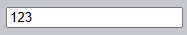

`key[down·up]` <sub>(키보드)</sub>
==========================

Before we get to keyboard, please note that on modern devices there are other ways to “input something”. For instance, people use speech recognition (especially on mobile devices) or copy/paste with the mouse.

So if we want to track any input into an `<input>` field, then keyboard events are not enough. There's another event named `input` to track changes of an `<input>` field, by any means. And it may be a better choice for such task. We'll cover it later in the chapter 이벤트: change, input, cut, copy, paste.

Keyboard events should be used when we want to handle keyboard actions (virtual keyboard also counts). For instance, to react on arrow keys Up and Down or hotkeys (including combinations of keys).

### Teststand
To better understand keyboard events, you can use the teststand below.

Try different key combinations in the text field.


```html
<!-- index.html -->
<!DOCTYPE HTML>
<html>

<head>
  <meta charset="utf-8">
  <link rel="stylesheet" href="style.css">
</head>

<body>

  <form id="form" onsubmit="return false">

    Prevent default for:
    <label>
      <input type="checkbox" name="keydownStop" value="1"> keydown</label>&nbsp;&nbsp;&nbsp;
    <label>
      <input type="checkbox" name="keyupStop" value="1"> keyup</label>

    <p>
      Ignore:
      <label>
        <input type="checkbox" name="keydownIgnore" value="1"> keydown</label>&nbsp;&nbsp;&nbsp;
      <label>
        <input type="checkbox" name="keyupIgnore" value="1"> keyup</label>
    </p>

    <p>Focus on the input field and press a key.</p>

    <input type="text" placeholder="Press keys here" id="kinput">

    <textarea id="area"></textarea>
    <input type="button" value="Clear" onclick="area.value = ''" />
  </form>
  <script src="script.js"></script>


</body>
</html>
```
```javascript
// script.js
kinput.onkeydown = kinput.onkeyup = kinput.onkeypress = handle;

let lastTime = Date.now();

function handle(e) {
  if (form.elements[e.type + 'Ignore'].checked) return;

  let text = e.type +
    ' key=' + e.key +
    ' code=' + e.code +
    (e.shiftKey ? ' shiftKey' : '') +
    (e.ctrlKey ? ' ctrlKey' : '') +
    (e.altKey ? ' altKey' : '') +
    (e.metaKey ? ' metaKey' : '') +
    (e.repeat ? ' (repeat)' : '') +
    "\n";

  if (area.value && Date.now() - lastTime > 250) {
    area.value += new Array(81).join('-') + '\n';
  }
  lastTime = Date.now();

  area.value += text;

  if (form.elements[e.type + 'Stop'].checked) {
    e.preventDefault();
  }
}
```
```css
/* style.css */
#kinput { font-size: 150%; box-sizing: border-box; width: 95%; }
#area { width: 95%; box-sizing: border-box; height: 250px; border: 1px solid black; display: block; }
form label { display: inline; white-space: nowrap; }
```

### `Keydown` and `keyup`
The `keydown` events happens when a key is pressed down, and then `keyup` – when it's released.

#### `event.code` and `event.key`
The `key` property of the event object allows to get the character, while the `code` property of the event object allows to get the “physical key code”.

For instance, the same key Z can be pressed with or without Shift. That gives us two different characters: lowercase `z` and uppercase `Z`.

The `event.key` is exactly the character, and it will be different. But `event.code` is the same:

|Key|`event.key`|`event.code`|
|---|---|---|
|Z|`z` (lowercase)|`KeyZ`|
|Shift+Z|`Z` (uppercase)|`KeyZ`|

If a user works with different languages, then switching to another language would make a totally different character instead of "`Z`". That will become the value of `event.key`, while `event.code` is always the same: `"KeyZ"`.

<br />

 **`“KeyZ”` and other key codes**

Every key has the code that depends on its location on the keyboard. Key codes described in the [UI Events code specification](https://www.w3.org/TR/uievents-code/).

For instance:
- Letter keys have codes `"Key<letter>"`: `"KeyA"`, `"KeyB"` etc.
- Digit keys have codes: `"Digit<number>"`: `"Digit0"`, `"Digit1"` etc.
- Special keys are coded by their names: `"Enter", "Backspace", "Tab"` etc.

There are several widespread keyboard layouts, and the specification gives key codes for each of them.

Read the [alphanumeric section of the spec](https://www.w3.org/TR/uievents-code/#key-alphanumeric-section) for more codes, or just press a key in the teststand above.

<br />

 **Case matters: `"KeyZ"`, not `"keyZ"`**

Seems obvious, but people still make mistakes.

Please evade mistypes: it's `KeyZ`, not `keyZ`. The check like `event.code=="keyZ"` won't work: the first letter of `"Key"` must be uppercase.

<br />

What if a key does not give any character? For instance, Shift or F1 or others. For those keys, `event.key` is approximately the same as `event.code`:

|Key|`event.key`|`event.code`|
|---|---|---|
|F1|`F1`|`F1`|
|Backspace|`Backspace`|`Backspace`|
|Shift|`Shift`|`ShiftRight` or `ShiftLeft`|

Please note that `event.code` specifies exactly which key is pressed. For instance, most keyboards have two Shift keys: on the left and on the right side. The `event.code` tells us exactly which one was pressed, and `event.key` is responsible for the “meaning” of the key: what it is (a “Shift”).

Let's say, we want to handle a hotkey: Ctrl+Z (or Cmd+Z for Mac). Most text editors hook the “Undo” action on it. We can set a listener on `keydown` and check which key is pressed.

There's a dilemma here: in such a listener, should we check the value of `event.key` or `event.code`?

On one hand, the value of `event.key` is a character, it changes depending on the language. If the visitor has several languages in OS and switches between them, the same key gives different characters. So it makes sense to check `event.code`, it's always the same.

Like this:
```javascript
document.addEventListener('keydown', function(event) {
  if (event.code == 'KeyZ' && (event.ctrlKey || event.metaKey)) {
    alert('Undo!')
  }
});
```

On the other hand, there's a problem with `event.code`. For different keyboard layouts, the same key may have different characters.

For example, here are US layout (“QWERTY”) and German layout (“QWERTZ”) under it (from Wikipedia):


For the same key, US layout has “Z”, while German layout has “Y” (letters are swapped).

Literally, `event.code` will equal `KeyZ` for people with German layout when they press Y.

If we check `event.code == 'KeyZ'` in our code, then for people with German layout such test will pass when they press Y.

That sounds really odd, but so it is. The [specification](https://www.w3.org/TR/uievents-code/#table-key-code-alphanumeric-writing-system) explicitly mentions such behavior.

So, `event.code` may match a wrong character for unexpected layout. Same letters in different layouts may map to different physical keys, leading to different codes. Luckily, that happens only with several codes, e.g. `keyA`, `keyQ`, `keyZ` (as we've seen), and doesn't happen with special keys such as `Shift`. You can find the list in the [specification](https://www.w3.org/TR/uievents-code/#table-key-code-alphanumeric-writing-system).

To reliably track layout-dependent characters, `event.key` may be a better way.

On the other hand, `event.code` has the benefit of staying always the same, bound to the physical key location, even if the visitor changes languages. So hotkeys that rely on it work well even in case of a language switch.

Do we want to handle layout-dependant keys? Then `event.key` is the way to go.

Or we want a hotkey to work even after a language switch? Then `event.code` may be better.

### Auto-repeat
If a key is being pressed for a long enough time, it starts to “auto-repeat”: the `keydown` triggers again and again, and then when it's released we finally get `keyup`. So it's kind of normal to have many `keydown` and a single `keyup`.

For events triggered by auto-repeat, the event object has `event.repeat` property set to `true`.

### Default actions
Default actions vary, as there are many possible things that may be initiated by the keyboard.

For instance:
- A character appears on the screen (the most obvious outcome).
- A character is deleted (Delete key).
- The page is scrolled (PageDown key).
- The browser opens the “Save Page” dialog (Ctrl+S)
- …and so on.

Preventing the default action on `keydown` can cancel most of them, with the exception of OS-based special keys. For instance, on Windows Alt+F4 closes the current browser window. And there's no way to stop it by preventing the default action in JavaScript.

For instance, the `<input>` below expects a phone number, so it does not accept keys except digits, `+`, `()` or `-`:
```html
<script>
function checkPhoneKey(key) {
  return (key >= '0' && key <= '9') || key == '+' || key == '(' || key == ')' || key == '-';
}
</script>
<input onkeydown="return checkPhoneKey(event.key)" placeholder="Phone, please" type="tel">
```



Please note that special keys, such as Backspace, Left, Right, Ctrl+V, do not work in the input. That's a side-effect of the strict filter `checkPhoneKey`.

Let's relax it a little bit:
```html<script>
function checkPhoneKey(key) {
  return (key >= '0' && key <= '9') || key == '+' || key == '(' || key == ')' || key == '-' ||
    key == 'ArrowLeft' || key == 'ArrowRight' || key == 'Delete' || key == 'Backspace';
}
</script>
<input onkeydown="return checkPhoneKey(event.key)" placeholder="Phone, please" type="tel">
```


Now arrows and deletion works well.

…But we still can enter anything by using a mouse and right-click + Paste. So the filter is not 100% reliable. We can just let it be like that, because most of time it works. Or an alternative approach would be to track the `input` event – it triggers after any modification. There we can check the new value and highlight/modify it when it's invalid.

### Legacy
In the past, there was a `keypress` event, and also `keyCode`, `charCode`, `which` properties of the event object.

There were so many browser incompatibilities while working with them, that developers of the specification had no way, other than deprecating all of them and creating new, modern events (described above in this chapter). The old code still works, as browsers keep supporting them, but there's totally no need to use those any more.

<br />

## 요약
Pressing a key always generates a keyboard event, be it symbol keys or special keys like Shift or Ctrl and so on. The only exception is Fn key that sometimes presents on a laptop keyboard. There's no keyboard event for it, because it's often implemented on lower level than OS.

Keyboard events:
- `keydown` – on pressing the key (auto-repeats if the key is pressed for long),
- `keyup` – on releasing the key.

Main keyboard event properties:
- `code` – the “key code” (`"KeyA"`, `"ArrowLeft"` and so on), specific to the physical location of the key on keyboard.
- `key` – the character (`"A"`, `"a"` and so on), for non-character keys, such as Esc, usually has the same value as `code`.

In the past, keyboard events were sometimes used to track user input in form fields. That's not reliable, because the input can come from various sources. We have `input` and `change` events to handle any input (covered later in the chapter 이벤트: change, input, cut, copy, paste). They trigger after any kind of input, including copy-pasting or speech recognition.

We should use keyboard events when we really want keyboard. For example, to react on hotkeys or special keys.

<br />

##  과제

### Extended hotkeys
Create a function `runOnKeys(func, code1, code2, ... code_n)` that runs `func` on simultaneous pressing of keys with codes `code1`, `code2`, …, `code_n`.

For instance, the code below shows `alert` when `"Q"` and `"W"` are pressed together (in any language, with or without CapsLock)
```javascript
runOnKeys(
  () => alert("Hello!"),
  "KeyQ",
  "KeyW"
);
```

<br />


We should use two handlers: `document.onkeydown` and `document.onkeyup`.

Let's create a set `pressed = new Set()` to keep currently pressed keys.

The first handler adds to it, while the second one removes from it. Every time on `keydown` we check if we have enough keys pressed, and run the function if it is so.

[샌드박스를 열어 정답을 확인해보세요.](https://plnkr.co/edit/BPG4XiITnq5D3FM5?p=preview)
