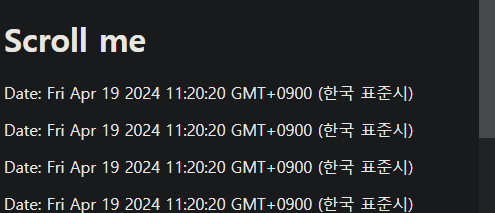
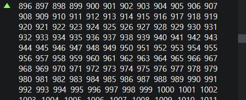
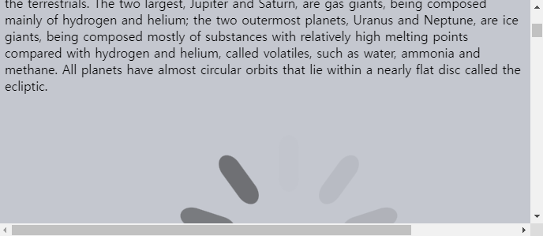
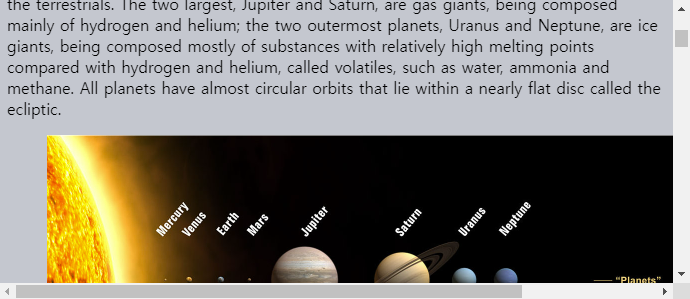

스크롤 이벤트
====

##### 페이지 · 요소 스크롤 추적 · 처리
- 추가 요소 <sub>(조작 버튼 · 정보 등)</sub> 표시 · 미표시
  - 문서 상 사용자 위치 기준
- 추가 데이터 로드
  - 페이지 최하단 스크롤 도달 시

##### 현재 스크롤 표시
```javascript
window.addEventListener('scroll', function() {
  document.getElementById('showScroll').innerHTML = window.pageYOffset + 'px';
});
```

##### 현재 스크롤 의미
- 창 스크롤 동작

##### 스크롤 이벤트 사용 가능 요소
- `window` <sub>(전역 객체)</sub>
- 스크롤 가능 요소

### 스크롤 방지

#### `preventDefault()` <sub>(이벤트 객체 메서드)</sub> 사용

##### `onscroll` <sub>(핸들러)</sub> 내 호출 X
1. 스크롤 실행
2. `onscroll` <sub>(이벤트)</sub> 발생 <sub>(핸들러 실행)</sub>
3. `preventDefault()` 호출
   - 메서드 효과 無 <sub>(스크롤 후 호출)</sub>

##### 스크롤 유발 이벤트 발생 시 호출
- `keydown` <sub>(이벤트)</sub>
  - page\[up·down\] 키
- 기타 등등

##### 스크롤 조작
- 다양한 방법 有
  - `overflow` <sub>(CSS)</sub> 권장

<br />

##  과제

### 무한 페이지

##### 무한 페이지 작성
- 최하단 스크롤 도달 시
  - 현재 일시 자동 추가
  - 스크롤 가능 공간 생성



#### 스크롤 중요 특징 <sub>(2가지)</sub>

##### 1. 탄력성
- 문서 최하단 스크롤 도달 시
  1. 빈 공간 잠깐 보임 <sub>(최하단 외부)</sub>
  2. 다시 가려짐 <sub>(원위치 이동)</sub>

##### 2. 부정확성
- 문서 최하단 스크롤 도달 시
  - 실제 문서 최하단 위치 X
  - 짧은 거리 <sub>(0 ~ 50px)</sub> 有

##### 문서 최하단 스크롤 도달 의미
- 문서 최하단 기준 일정 거리 <sub>(100px)</sub> 내 위치 도달

##### 참고
- 문서 최하단 도달 시 보통 특정 문구 표시
  - ex\) "더 보기" 등

<br />


#### 페이지 최하단 스크롤 도달 감지

##### 창 기준 좌표 사용
```javascript
// 문서 위치
// - <html> (태그)
// - document.documentElement
let html = document.documentElement;

// 창 기준 문서 좌표
let coordinate = html.getBoundingClientRect();
```

#### 높이 `2000px` 문서 좌표 <sub>(창 기준)</sub>

##### 최상단 스크롤 위치
```javascript
coordinate.top = 0;
coordinate.bottom = 2000;
```

##### `500px` 스크롤 내리기
```javascript
// 최상단에서 500px 멀어짐
coordinate.top = -500

// 최하단에 500px 가까워짐
coordinate.bottom = 1500
```

##### 최하단 스크롤 도달
```javascript
// 최상단에서 1400px 멀어짐
coordinate.top = -1400;

/* 최하단에 1400px 가까워짐
 더 이상 가까워지기 불가능
 - 최솟값 == 창 높이
   - html.clientHeight == 600;
 */
coordinate.bottom = 600;
```

##### 문서 최하단 스크롤 도달 <sub>(0 ~ 100px 이내)</sub> 감지
- `bottom` <sub>(좌표 프로퍼티)</sub> 값 범위
  - 600 ~ 700px <sub>(창 높이 600px 가정)</sub>
```javascript
function populate() {
  let html = document.documentElement;
  let coordinate = html.getBoundingClientRect();

  while (true) {

    // 창 기준 문서 바닥 좌표
    let bottom = coordinate.bottom;

    // 창 높이
    let height = html.clientHeight;

    // 문서 최하단 기준 100px 내 스크롤 미도달 시 작동 X
    if (bottom > height + 100) {
      break;
    }

    // 현재 일시 추가
    document.body.insertAdjacentHTML("beforeend", `<p>Date: ${new Date()}</p>`);
  }
}
```

[정답](https://plnkr.co/edit/38yuQHwUsUXCcsDv?p=preview)

<hr />

### 상위 이동 버튼

##### ▲ <sub>(위로 이동)</sub> 버튼 작성
- 페이지 스크롤 편의 도모

##### 작동 방식
- 창 높이 미만 스크롤 하단 이동
  - 표시 X
- 창 높이 이상 스크롤 하단 이동
  - 창 좌상단 표시
  - 다시 스크롤 상단 이동 <sub>(창 높이 미만)</sub>
    - 표시 X
- 버튼 클릭
  - 스크롤 최상단 이동



<br />


[정답](https://plnkr.co/edit/ILfuOH6te6alT8vQ?p=preview)

<hr />

### 이미지 로드

##### 이미지 로드 전 placeholder 표시
```html

```

##### 최초 문서 로드
- 모든 이미지
  - `placeholder.svg`

##### 스크롤 이미지 도달
- `data-src` <sub>(속성)</sub> 값 → `src` <sub>(속성)</sub> 할당
  - 이미지 로드 시작





##### 요구사항
- 페이지 로드 시
  - 첫 화면 내 이미지 즉시 로드 <sub>(스크롤 전)</sub>
- `data-src` <sub>(속성)</sub> 부재 이미지 <sub>(요소)</sub>
  - 작업 대상 X
- 이미지 로드 완료 후 다시 로드 X

##### 참고
- 기능 추가 가능
  - 이미지 미리 로드 <sub>(화면 높이 스크롤 전)</sub>
- 수평 스크롤 처리 X

<br />


##### `onscroll` <sub>(핸들러)</sub>
- 화면 내 이미지 진입 확인 · 표시

##### 페이지 로드 시 핸들러 즉시 한 번 실행 필요
- 첫 화면 내 이미지 감지 · 로드 <sub>(스크롤 전)</sub>

##### 핸들러 문서 내용 접근 활성화 방법 <sub>(2가지)</sub>
- a. 페이지 로드 완료 후 실행
- b. `<body>` <sub>(태그)</sub> 내 최하단 위치

##### 요소 화면 진입 확인 함수
```javascript
function isVisible(elem) {

  // 요소 좌표
  let coords = elem.getBoundingClientRect();

  // 창 높이
  let windowHeight = document.documentElement.clientHeight;

  // 요소 상 · 하단 경계 화면 진입 여부 확인
  let topVisible    = 0 < coords.top    && coords.top    < windowHeight;
  let bottomVisible = 0 < coords.bottom && coords.bottom < windowHeight;

  return topVisible || bottomVisible;
}

// 개선 함수 (이미지 미리 로드)
// - 현재 창 위치 기준 상 · 하단 1페이지 내 이미지
//   - 미리 로드
function isVisible2(elem) {

  // 요소 좌표
  let coords = elem.getBoundingClientRect();

  // 창 높이
  let windowHeight = document.documentElement.clientHeight;

  // 현재 창 위치 기준 상 · 하단 1페이지 포함 top · bottom (프로퍼티)
  let extendedTop    = -windowHeight;
  let extendedBottom = 2 * windowHeight;

  // 요소 상 · 하단 가시성 확인
  // - 창 내부 · 상 · 하단 1페이지 내 진입 여부
  let topVisible    = extendedTop < coords.top    && coords.top    < extendedBottom;
  let bottomVisible = extendedTop < coords.bottom && coords.bottom < extendedBottom;

  return topVisible || bottomVisible;
}
```

##### 요소 표시 함수
- `isVisible()` <sub>(함수)</sub> 사용
```javascript
function showVisible() {
  for (let img of document.querySelectorAll('img')) {
    let realSrc = img.dataset.src;

    // data-src (속성) 부재 시 생략
    if (!realSrc) {
      continue;
    }

    if (isVisible(img)) {
      img.src = realSrc;
      img.dataset.src = '';
    }
  }
}

showVisible();
window.onscroll = showVisible;
```

[정답](https://plnkr.co/edit/a3ixa5sPNqQeNulM?p=preview)
