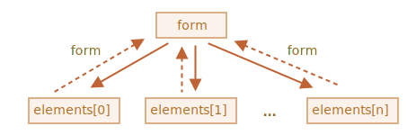

폼 프로퍼티 · 메서드
==================

### [폼 <sub>(`form`)</sub>](https://html.spec.whatwg.org/multipage/forms.html) 요소 탐색

##### `document.forms` <sub>(기명 컬렉션)</sub>
- 이름 · 순서 有
    문서 내 폼 접근
```javascript
// 폼 (이름 : my)
document.forms.my;

// 문서 내 1번째 폼
document.forms[0];
```

##### `form.elements` <sub>(기명 컬렉션)</sub>
- 폼 내 요소 얻기
```html
<form name="my">
  <input name="one" value="1">
  <input name="two" value="2">
</form>

<script>
  // 폼 얻기
  // - <form name="my"> 요소
  let form = document.forms.my;

  // 폼 내 요소 얻기
  // - <input name="one"> 요소
  let elem = form.elements.one;

  alert(elem.value); // 1
</script>
```

##### 폼 내 다수 동일명 요소
- `form.elements[name]`
  - 컬렉션
```html
<form>
  <input type="radio" name="age" value="10">
  <input type="radio" name="age" value="20">
</form>

<script>
let form = document.forms[0];
let ageElems = form.elements.age;

alert(ageElems[0]); // [object HTMLInputElement]
</script>
```

##### 폼 요소 탐색 프로퍼티
- 태그 구조 의존 X
- `form.elements`
  - 폼 조작 요소들 접근
  - 태그 깊이 무관

<br />

 **`fieldset` <sub>(하위 폼 기능)</sub>**

##### `<fieldset>` <sub>(요소)</sub>
- 폼 내 다수 존재 가능
- `elements` <sub>(프로퍼티)</sub> 지원
  - 내부 폼 조작 요소 접근
```html
<body>
  <form id="form">
    <fieldset name="userFields">
      <legend>info</legend>
      <input name="login" type="text">
    </fieldset>
  </form>

  <script>
    // <input name="login">
    alert(form.elements.login);

    let fieldset = form.elements.userFields;

    // HTMLFieldSetElement
    alert(fieldset);

    // form · fieldset (요소)
    // - 이름 사용해 <input> (요소) 접근
    // true
    alert(fieldset.elements.login == form.elements.login);
  </script>
</body>
```

<br />

 **축약형 <sub>(`form.name`)</sub>**

##### 축약형
- `form[index·name]`
```javascript
form.elements.login == form.login;
```

##### 특징
- 요소 `name` <sub>(속성)</sub> 변경 후
  - 이전 이름 계속 인식
```html
<form id="form">
  <input name="login">
</form>

<script>
  // true
  // - 동일 <input> (요소)
  alert(form.elements.login == form.login);

  // <input> (요소) name (속성) 변경
  form.login.name = "username";

  // form.elements
  // - name (속성) 변경 반영
  alert(form.elements.login);    // undefined
  alert(form.elements.username); // input

  // form
  // - 새 · 전 이름 모두 인식
  alert(form.username == form.login); // true
</script>
```

##### 폼 요소명 변경
- 드물게 발생
  - 보통 특징 때문에 문제 발생 X

<br />

### `element.form` <sub>(역참조)</sub>

##### `element.form`
- 모든 요소
  - 폼 접근 <sub>(역참조)</sub> 가능



```html
<form id="form">
  <input type="text" name="login">
</form>

<script>
  // 폼 → 요소
  let login = form.login;

  // 요소 → 폼
  alert(login.form); // HTMLFormElement
</script>
```

### 폼 요소

#### `input` · `textarea`

##### `input`
- `value` <sub>(문자열)</sub>
- `checked` <sub>(`boolean`)</sub>

##### `textarea`
- `value` <sub>(문자열)</sub>
```javascript
input.value = "New value";

// 체크박스 · 라디오 버튼
input.checked = true;

textarea.value = "New text";
```

<br />

 **`textarea` 내 값 : `innerHTML` X · `value` 사용**

##### `textarea.innerHTML`
- 페이지 첫 로드 당시 HTML 만 저장
  - 최신값 X

<br />

#### `select` · `option`

##### [`<select>`](https://html.spec.whatwg.org/multipage/forms.html#the-select-element)
1. `options`
    - `<option>` <sub>(하위 요소)</sub> 컬렉션
2. `value`
    - 현재 선택된 `<option>` 값
3. `selectedIndex`
    - 현재 선택된 `<option>` 번호 <sub>(인덱스)</sub>

##### `<select>` 값 설정 방법 <sub>(3가지)</sub>
1. 조건 해당 `<option>` <sub>(하위 요소)</sub> 검색 후
    - `option.selected` <sub>(속성)</sub> → `true` 설정
2. `select.value`
    - 원하는 값 설정
3. `select.selectedIndex`
    - 원하는 `option` 번호 <sub>(인덱스)</sub> 설정
- 확실한 방법
  - ①
- 더 편리한 방법
  - ② · ③
```html
<select id="select">
  <option value="apple">Apple</option>
  <option value="pear">Pear</option>
  <option value="banana">Banana</option>
</select>

<script>
  /* 실행 결과 전부 동일 */

  // ①
  select.options[2].selected = true;

  // ②
  select.value = 'banana';

  // ③
  select.selectedIndex = 2;
</script>
```

##### `multiple` <sub>(속성)</sub> <sub>(`<select>`)</sub>
- `option` 다중 선택 가능
- 드물게 사용
- 반드시 1번째 값 설정 방법 사용
  - `<option>` <sub>(하위 요소)</sub>
    - `selected` <sub>(프로퍼티)</sub> 추가 · 제거
- select.options <sub>(컬렉션)</sub>
  - 선택된 다수 option
```html
<select id="select" multiple>
  <option value="blues" selected>Blues</option>
  <option value="rock" selected>Rock</option>
  <option value="classic">Classic</option>
</select>

<script>
  // 선택한 값 전체
  let selected = Array.from(select.options)
    .filter(option => option.selected)
    .map(option => option.value);

  alert(selected); // blues,rock
</script>
```

#### [`Option`](https://html.spec.whatwg.org/multipage/form-elements.html#the-option-element) 생성자
- 드물게 사용

##### `<option>` <sub>(요소)</sub> 생성
```javascript
option = new Option(text, value, defaultSelected, selected);
```
- `text`
  - 내부 텍스트
- `value`
  - 값
- `defaultSelected`
  - `selected`<sub>(속성)</sub> 생성 여부
- `selected`
  - 선택 여부

##### `defaultSelected` vs `selected`
- `defaultSelected`
  - HTML 속성 설정
  - `getAttribute('selected')` 접근 가능
- `selected`
  - `option` 선택 여부 결정 <sub>(더 중요)</sub>
- 대개 둘 다 동일 값 설정

```javascript
// <option value="value">Text</option> 생성
let option1 = new Option("Text", "value");

// <option value="value" selected>Text</option> 생성
// - 선택된 상태
let option2 = new Option("Text", "value", true, true);
```

##### 생성자 생성 `Option` <sub>(요소)</sub> 프로퍼티
- `selected`
  - 선택 여부
- `index`
  - 해당 요소 순서
- `text`
  - 사용자 표시 텍스트

### 참고 자료
- [명세서](https://html.spec.whatwg.org/multipage/forms.html)

<br />

## 요약
폼 탐색하기
- `document.forms`
  - `document.forms[name/index]`로 폼에 접근할 수 있습니다.
- `form.elements`
  - 폼 요소는 `form.elements[name/index]` 또는 `form[name/index]`로 접근합니다. `elements` 프로퍼티는 `<fieldset>`에도 똑같이 작동합니다.
- `element.form`
  - 요소는 `form` 프로퍼티에서 자신이 속한 폼을 참조합니다.

각 요소의 값은 `input.value`, `textarea.value`, `select.value` 등으로 접근할 수 있습니다. 체크박스와 라디오 버튼에서는 `input.checked`를 사용할 수 있습니다.

`<select>`에서는 인덱스 `select.selectedIndex`나 `option` 컬렉션 `select.options`을 통해 값을 구할 수도 있습니다.

지금까지는 폼 관련 기본을 다뤘습니다. 이 튜토리얼에서 앞으로 더 많은 예시를 만날 것입니다.

다음 챕터에서는 어느 요소에서든 발생할 수 있지만 대부분 폼에서 처리되는 `focus`와 `blur` 이벤트를 다루겠습니다.

<br />

##  과제

### `select`에 옵션 추가하기
아래에 `<select>`가 있습니다.
```html
<select id="genres">
  <option value="rock">Rock</option>
  <option value="blues" selected>Blues</option>
</select>
```

자바스크립트를 사용하여 아래 항목을 수행하는 코드를 작성해봅시다.

1. 선택한 옵션의 값과 텍스트를 표시하세요.
2. `<option value="classic">Classic</option>`라는 옵션을 추가하세요.
3. 추가한 옵션을 선택하세요.

모든 항목을 올바르게 수행했다면 얼럿창에 `blues`가 출력됩니다.

<br />


단계별 해답입니다.
```html
<select id="genres">
  <option value="rock">Rock</option>
  <option value="blues" selected>Blues</option>
</select>

<script>
  // 1)
  let selectedOption = genres.options[genres.selectedIndex];
  alert( selectedOption.value );

  // 2)
  let newOption = new Option("Classic", "classic");
  genres.append(newOption);

  // 3)
  newOption.selected = true;
</script>
```
