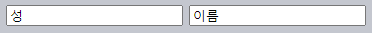

`focus` · `blur` <sub>(이벤트)</sub>
====

##### 포커스 설정
- 폼 요소 클릭
- Tab 키 눌러 해당 폼 요소 이동
- `autofocus` <sub>(속성)</sub> 설정
  - 페이지 로드 후 자동 포커스
- 기타 등등

##### 포커스 의미
- _'여기에 데이터 입력할 준비하라'_
- 요소 포커스 설정 순간 작업
  - 요구사항 충족 초기화 코드 실행 가능

##### 요소 포커스 해제 <sub>(`blur`)</sub>
- 다른 폼 요소 클릭
- Tab 키 눌러 다음 폼 요소 · 필드 이동
- 기타 등등

##### 포커스 해제 의미
- '데이터 입력 완료되었다'
- 포커스 해제 순간 작업
  - 데이터 확인
  - 서버 요청 전송 <sub>(데이터 저장)</sub>
  - 기타 등등

### `focus` · `blur` <sub>(이벤트)</sub>
- 요소 포커스 설정 · 해제 시 발생

##### 입력 필드 값 검증
- `blur` 핸들러
  - 필드 내 입력 이메일 확인
  - 부정확한 입력 시
    - 에러 표시
- `focus` 핸들러
  - 에러 메시지 숨기기
  - 이메일 재확인 X
    - `blur` 핸들러 담당
```html
<style>
  .invalid { border-color: red; }
  #error { color: red }
</style>

이메일: <input type="email" id="input">

<div id="error"></div>

<script>
input.onblur = function() {

  // 이메일 유효성 확인
  // - `@` 유무 여부
  if (!input.value.includes('@')) {
    input.classList.add('invalid');
    error.innerHTML = '올바른 이메일 주소를 입력하세요.'
  }
};

input.onfocus = function() {
  if (this.classList.contains('invalid')) {

    // 사용자 새 값 입력 위해 <input> (필드) 다시 선택
    // - 에러 메시지 제거
    this.classList.remove('invalid');
    error.innerHTML = "";
  }
};
</script>
```


#### 모던 HTML

##### 다양한 속성 사용해 입력값 검증 가능 <sub>(속성만으로 검증)</sub>
- `required`
- `pattern`
- 기타 등등

##### JS 사용 이유
- 좀 더 유연
- 추가 동작 가능
  - 입력값 자동 서버 전송
  - 기타 등등

### `focus` · `blur` <sub>(메서드)</sub>
- 요소 포커스 설정 · 해제

##### 입력값 검증
- 방문자 잘못된 이메일 입력 시
  - 사이트에 잡아놓기
```html
<style>
  .error {
    background: red;
  }
</style>

이메일: <input type="email" id="input">
<input type="text" style="width:220px" placeholder="이메일 형식이 아닌 값을 입력하고 여기에 포커스를 주세요.">

<script>
  input.onblur = function() {

    // 잘못된 이메일 형식
    // - `@` 빠짐
    if (!this.value.includes('@')) {

      // 에러 출력
      this.classList.add("error");

      // input (필드) 포커스
      input.focus();

    } else {
      this.classList.remove("error");
    }
  };
</script>
```


##### 대다수 브라우저 정상 동작
- [Firefox 제외](https://bugzilla.mozilla.org/show_bug.cgi?id=53579)

##### 잘못된 이메일 입력 후 `<input>` <sub>(필드)</sub> 벗어나기 시도
- Tab 키 · 다른 곳 클릭 시
  - `onblur` 핸들러 동작
    - 입력 필드 포커스 재설정

##### `onblur` <sub>(이벤트)</sub>
- 요소 포커스 해제 후 발생
- 핸들러 내 `preventDefault()` 호출
  - 포커스 해제 취소 X

<br />

 **JS 유발 포커스 해제**

#### JS 자체 포커스 해제 경우 有

##### `alert` <sub>(함수)</sub>
- 자기 자신 포커스 설정
  - 기존 요소 포커스 해제 <sub>(`blur` 이벤트)</sub>
- 함수 종료 후
  - 기존 요소 포커스 재설정 <sub>(`focus` 이벤트)</sub>

##### DOM 내 요소 제거 · 추가
- DOM 요소 제거 시
  - 포커스 해제 <sub>(`blur` 이벤트)</sub>
- 추후 DOM 내 요소 재삽입 시
  - 포커스 재설정 X
- `focus` · `blur` 핸들러
  - 오작동 가능성 有

##### 이벤트 사용 시 주의
- 사용자 유발 포커스 이벤트 추적 시
  - JS 유발 포커스 이벤트 주의

<br />

### 모든 요소 포커스하기 <sub>(`tabindex`)</sub>

##### 대다수 요소 <sub>(브라우저별 상이)</sub>
- 포커스 기본 미지원

#### `focus` · `blur` <sub>(이벤트 · 메서드)</sub> 지원 여부

##### 사용자 · 웹페이지 상호작용 요소 지원
- `<button>`
- `<input>`
- `<select>`
- `<a>`
- 기타 등등

##### 표시 용도 요소 기본 미지원 <sub>(`tabindex` 속성 사용)</sub>
- `<div>`
- `<span>`
- `<table>`
- 기타 등등

##### `tabindex` <sub>(속성)</sub>
- 포커스 설정 기능 활성화
  - 요소 종류 무관
- 값 <sub>(숫자)</sub>
  - Tab 키 눌러 요소 이동 시 순서

##### `tabindex` <sub>(속성)</sub> 요소 이동 순서 <sub>(Tab 키 눌러 이동)</sub>
1. `<… tabindex="1">`
2. `<… tabindex="2">`
3. `<… tabindex="n">`
4. `<input …>` <sub>(상호작용 요소)</sub>
5. `<a …>` <sub>(상호작용 요소)</sub>
6. …

##### `tabindex` <sub>(속성)</sub> 부재 상호작용 요소 순서
- 기본 순서
  - 문서 내 위치 순서 따라 이동

##### `<… tabindex="0">` <sub>(요소)</sub>
- `tabindex` <sub>(속성)</sub> 부재 동일
- 용도
  - 포커스 설정 기능 활성화
  - 기본 순서 유지

##### `<… tabindex="-1">` <sub>(요소)</sub>
- JS 전용 포커스 설절 기능 활성화
  - Tab 키 눌러 이동
    - 무시
  - `elem.focus()` <sub>(메서드)</sub>
    - 포커스 설정

##### 1번째 항목 클릭 후 Tab 키 누르기
```html
첫 번째 항목을 클릭하고 Tab 키를 눌러보면서 포커스 된 요소 순서를 눈여겨보세요.
참고로 탭을 많이 누르면 예시 밖으로 포커스가 이동하니, 주의하세요.
<ul>
  <li tabindex="1">일</li>
  <li tabindex="0">영</li>
  <li tabindex="2">이</li>
  <li tabindex="-1">음수 일</li>
</ul>

<style>
  li { cursor: pointer; }
  :focus { outline: 1px dashed green; }
</style>
```


##### 포커스 이동 순서 <sub>(Tab 키 눌러 이동)</sub>
1. `<li tabindex="1">일</li>`
2. `<li tabindex="2">이</li>`
3. `<li tabindex="0">영</li>`

##### `<li>` <sub>(요소)</sub>
- 포커스 설정 불가능 요소
- `tabindex` <sub>(속성)</sub> 사용
  - 포커스 설정 기능 활성화
- 포커스 된 요소 스타일 적용
  - `:focus` <sub>(가상 클래스)</sub>

<br />

 **`elem.tabIndex` <sub>(프로퍼티)</sub> 사용 가능**

##### JS 사용해 `tabIndex` <sub>(프로퍼티)</sub> 추가
- `tabindex` <sub>(속성)</sub> 동일 효과

<br />

### `focus[in·out]` <sub>(이벤트)</sub> · 이벤트 위임

##### `focus` · `blur` <sub>(이벤트)</sub>
- 버블링 X

##### `<form>` <sub>(요소)</sub> 설정 `onfocus` 핸들러
- 작동 X
```html
<!--
핸들러
  - 폼 내 요소 포커스 설정 시 클래스 추가
-->
<form onfocus="this.className='focused'">
  <input type="text" name="surname" value="성">
  <input type="text" name="name" value="이름">
</form>

<style> .focused { outline: 1px solid red; } </style>
```



##### `form.onfocus` <sub>(핸들러)</sub> 동작 X
- `<input>` <sub>(요소)</sub> 포커스 설정 시
  - 해당 입력 필드에만 `focus` <sub>(이벤트)</sub> 발생
  - 버블링 X

#### 이벤트 위임 설정 방법 <sub>(2가지)</sub>

##### 1. 캡처링 이용
- `focus` · `blur` <sub>(이벤트)</sub>
  - 버블링 X
  - 캡처링 발생
```html
<form id="form">
  <input type="text" name="surname" value="성">
  <input type="text" name="name" value="이름">
</form>

<style> .focused { outline: 1px solid red; } </style>

<script>
  // 캡처링 단계 핸들러 작동 설정
  // - 마지막 인수 전달
  //   - true
  form.addEventListener("focus", () => form.classList.add('focused'), true);
  form.addEventListener("blur", () => form.classList.remove('focused'), true);
</script>
```


##### 2. `focus[in·out]` <sub>(이벤트)</sub> 이용
- `focus` · `blur` <sub>(이벤트)</sub> 동일
- 버블링 발생
- `on<event>` <sub>(HTML 속성 · DOM 프로퍼티)</sub> X
  - `addEventListener` <sub>(메서드)</sub> 사용
```html
<form id="form">
  <input type="text" name="surname" value="성">
  <input type="text" name="name" value="이름">
</form>

<style> .focused { outline: 1px solid red; } </style>

<script>
  form.addEventListener("focusin", () => form.classList.add('focused'));
  form.addEventListener("focusout", () => form.classList.remove('focused'));
</script>
```


<br />

요약
====

#### `focus` · `blur` <sub>(이벤트)</sub>
- 요소 포커스 설정 · 해제 시 발생

##### 주의
- 버블링 X
- 이벤트 위임
  1. 캡처링 사용
  2. `focus[in·out]` <sub>(이벤트)</sub> 사용
- 대다수 요소
  - 포커스 기본 미지원
  - `tabindex` <sub>(속성)</sub> 사용
- 현재 포커스 설정된 요소
  - `document.activeElement`

<br />

##  과제

### 수정 가능한 `div` <sub>(요소)</sub>

##### `<div>` <sub>(요소)</sub> 작성
- 클릭 시 변화
  - `<div>` → `<textarea>`

##### 변화된 `textarea` <sub>(요소)</sub>
- `<div>` <sub>(요소)</sub> 내 HTML 수정 가능
- Enter 키 누르기 · 포커스 해제 시 변화
  - `<textarea>` → `<div>`
  - 요소 내 콘텐츠 유지

<br />


[정답](https://plnkr.co/edit/pE9UdaOM7XbZMDGJ?p=preview)

<hr />

### 클릭해서 TD 수정하기

#### 테이블 작성

##### 셀 클릭 시
- 셀 내 `textarea` <sub>(요소)</sub> 표시
  - 셀 내 콘텐츠 <sub>(HTML)</sub> 수정 가능
  - 크기 == 기존 `cell` 크기

##### 셀 수정 시
- 완료 · 취소 버튼
  - 셀 하단 노출
  - 수정 종료 · 취소 기능

##### 한 번에 하나의 셀만 수정 가능
- `<td>` <sub>(셀)</sub> 수정 중
  - 다른 셀 `click` <sub>(이벤트)</sub> 무시

##### 테이블 내 더 많은 셀 추가 가능
- 이벤트 위임 사용


<br />


1. 셀 클릭 시 내부 요소 교체
  - `innerHTML` → `<textarea>` <sub>(요소)</sub>
    - 기존 셀 크기 동일
    - 테두리 <sub>(border)</sub> X
    - 크기 지정
      - JS
      - CSS
2. `textarea.value`
    - `td.innerHTML` 동일 값 설정
3. `textarea` <sub>(요소)</sub> 포커스 설정
4. 완료 · 취소 버튼
    - 셀 하단 노출
    - 적절한 핸들러 설정

[정답](https://plnkr.co/edit/1rSs9d9UycDyeUYn?p=preview)

<hr />

### 키보드로 쥐 움직이기

##### 화살표 키로 쥐 움직이기
- `#mouse` <sub>(쥐 요소)</sub>
  - 포커스 설정 시 이동 가능

[데모](https://ko.js.cx/task/keyboard-mouse/solution/)

##### 참고
1. `#mouse` <sub>(쥐 요소)</sub> 외
    - 이벤트 핸들러 설정 X
2. HTML · CSS 수정 X
    - 작성 예정 JS 코드
      - 모든 요소 대상 동작 <sub>(범용성)</sub>

<br />


##### `#mouse` <sub>(쥐 요소)</sub> 설정
1. `mouse.onclick` 핸들러 설정
2. `position: fixed` <sub>(CSS)</sub> 값 설정
3. `mouse.onkeydown` 핸들러 설정
    - 화살표 키 입력 처리

##### `keydown` <sub>(이벤트)</sub>
- 포커스 설정된 요소에만 발생 필요
  - `tabindex` <sub>(속성)</sub> 추가
- HTML 수정 X
  - 속성값 추가 X
  - 프로퍼티 <sub>(`mouse.tabIndex`)</sub> 사용

##### 참고
- `mouse.[onclick → onfocus]` 핸들러
  - 정상 동작

[정답](https://plnkr.co/edit/yxSbp0d8yIP13Ex6?p=preview)
