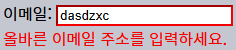
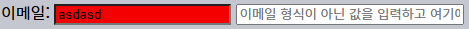
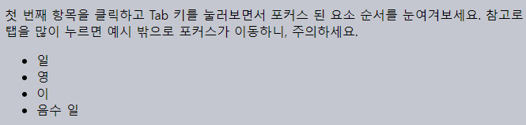
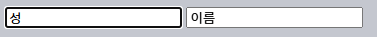
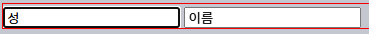
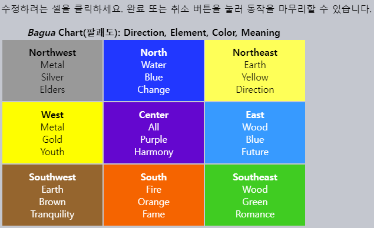

`focus` · `blur` <sub>(이벤트)</sub>
====

#### 포커스 설정

##### 종류
- 요소 클릭
- Tab 키 눌러 해당 폼 요소 이동
- `autofocus` <sub>(속성)</sub> 설정
  - 페이지 로드 후 자동 포커스 설정
- 기타 등등

##### 의미
- _'여기에 데이터 입력할 준비하라'_

##### 수행 가능 작업
- 초기화 코드 <sub>(요구사항 충족)</sub> 실행

#### 포커스 해제

##### 종류
- 타 요소 클릭
- Tab 키 눌러 다음 폼 요소 이동
- 기타 등등

##### 의미
- _'데이터 입력 완료되었다'_

##### 수행 가능 작업
- 데이터 확인
- 서버 요청 전송 <sub>(데이터 저장)</sub>
- 기타 등등

### `focus` · `blur` <sub>(이벤트)</sub>

##### 포커스 관련
- 요소 포커스 설정 · 해제 시 발생

##### 입력 필드 값 검증
- `blur` 핸들러
  - 필드 내 입력 이메일 유효성 검사
  - 부적절한 입력 시 에러 표시
- `focus` 핸들러
  - 에러 표시 제거
  - 이메일 재확인 X <sub>(`blur` 핸들러 담당)</sub>
```html
<style>
  .invalid { border-color: red; }
  #error { color: red }
</style>

이메일: <input type="email" id="input">

<div id="error"></div>

<script>
  input.onblur = function() {

    // 이메일 유효성 검사
    // - `@` 유무 여부
    if (!input.value.includes('@')) {
      input.classList.add('invalid');
      error.innerHTML = '올바른 이메일 주소를 입력하세요.'
    }
  };

  input.onfocus = function() {

    // 새 값 입력 위해 <input> (필드) 다시 선택
    // - 에러 표시 제거
    if (this.classList.contains('invalid')) {
      this.classList.remove('invalid');
      error.innerHTML = "";
    }
  };
</script>
```



##### 모던 HTML 검증
- 다양한 속성 사용 <sub>(JS 코드 無)</sub>
  - `required`
  - `pattern`
  - 기타 등등

##### JS 검증
- 좀 더 유연
- 추가 동작 가능
  - 입력값 자동 서버 전송
  - 기타 등등

### `focus` · `blur` <sub>(메서드)</sub>

##### 포커스 관련 동작
- 요소 포커스 설정 · 해제

##### 입력값 검증
- 잘못된 이메일 입력 시
  - 사이트 떠나기 방지
- 대다수 브라우저 정상 동작 <sub>([Firefox](https://bugzilla.mozilla.org/show_bug.cgi?id=53579) 제외)</sub>
```html
<style>
  .error {
    background: red;
  }
</style>

이메일: <input type="email" id="input">
<input type="text" style="width:220px" placeholder="이메일 형식이 아닌 값을 입력하고 여기에 포커스를 주세요.">

<script>
  input.onblur = function() {

    // 이메일 유효성 검사
    // - `@` 유무 여부
    if (!this.value.includes('@')) {

      // 에러 표시
      this.classList.add("error");

      // <input> (필드) 포커스 설정
      input.focus();

    } else {
      // - 에러 표시 제거
      this.classList.remove("error");
    }
  };
</script>
```



##### 잘못된 이메일 입력 후 `<input>` <sub>(필드)</sub> 벗어나기 시도
- Tab 키 · 타 요소 클릭 시 `blur` 핸들러 동작
    - `<input>` <sub>(필드)</sub> 포커스 재설정

##### `blur` <sub>(이벤트)</sub>
- 요소 포커스 해제 후 발생
- 핸들러 내 `preventDefault()` 호출
  - 포커스 해제 취소 불가능

<br />

 **JS 유발 포커스 해제**

#### JS 자체 포커스 해제 경우 有

##### `alert` <sub>(함수)</sub>
- 자기 자신 포커스 설정
  - 기존 요소 포커스 해제 <sub>(`blur` 이벤트)</sub>
- 종료 시 자기 자신 포커스 해제
  - 기존 요소 포커스 재설정 <sub>(`focus` 이벤트)</sub>

##### DOM 내 요소 제거 · 추가
- DOM 요소 제거 시
  - 포커스 해제 <sub>(`blur` 이벤트)</sub>
- 추후 DOM 요소 재삽입 시
  - 포커스 재설정 X

##### 이벤트 사용 시 주의 <sub>(핸들러 오작동 가능성 有)</sub>
- 사용자 유발 포커스 이벤트 추적 시
  - JS 유발 포커스 이벤트 주의

<br />

### 모든 요소 포커스 설정 <sub>(`tabindex`)</sub>

##### 대다수 요소 <sub>(브라우저별 상이)</sub>
- 포커스 기본 미지원

#### `focus` · `blur` <sub>(이벤트 · 메서드)</sub> 지원 여부

##### 상호작용 <sub>(사용자 ↔ 웹페이지)</sub> 요소 지원
- `<button>`
- `<input>`
- `<select>`
- `<a>`
- 기타 등등

##### 표시 용도 요소 미지원 <sub>(`tabindex` 속성 사용)</sub>
- `<div>`
- `<span>`
- `<table>`
- 기타 등등

#### `tabindex` <sub>(HTML 속성)</sub>

##### 포커스 설정 기능 활성화
- 요소 종류 무관

##### 속성값 <sub>(숫자)</sub>
- Tab 키 눌러 요소 이동 시 순서

##### 요소 이동 순서 <sub>(Tab 키 눌러 이동)</sub>
1. `<… tabindex="1">`
2. `<… tabindex="2">`
3. `<… tabindex="…">`
4. `<… tabindex="n">`
5. `<input …>` <sub>(상호작용 요소)</sub>
6. `<a …>` <sub>(상호작용 요소)</sub>
7. …

##### 속성 부재 상호작용 요소 순서
- 기본 순서 <sub>(문서 내 위치)</sub>

##### `<… tabindex="0">` <sub>(요소)</sub>
- 포커스 설정 기능 활성화
- 기본 순서 <sub>(문서 내 위치)</sub> 유지

##### `<… tabindex="-1">` <sub>(요소)</sub>
- JS 전용 포커스 설정 기능 활성화
  - Tab 키 눌러 이동 시 무시
  - `focus()` <sub>(메서드)</sub> 호출 시 포커스 설정

##### 1번째 항목 클릭 후 Tab 키 누르기
```html
첫 번째 항목을 클릭하고 Tab 키를 눌러보면서 포커스 된 요소 순서를 눈여겨보세요.
참고로 탭을 많이 누르면 예시 밖으로 포커스가 이동하니, 주의하세요.
<ul>
  <li tabindex="1">일</li>
  <li tabindex="0">영</li>
  <li tabindex="2">이</li>
  <li tabindex="-1">음수 일</li>
</ul>

<style>
  li { cursor: pointer; }
  :focus { outline: 1px dashed green; }
</style>
```



##### 포커스 이동 순서 <sub>(Tab 키 눌러 이동)</sub>
1. `<li tabindex="1">일</li>`
2. `<li tabindex="2">이</li>`
3. `<li tabindex="0">영</li>`

##### `<li>` <sub>(요소)</sub>
- 포커스 설정 불가능 요소
- `tabindex` <sub>(속성)</sub> 사용
  - 포커스 설정 기능 활성화
- 포커스 설정 요소 스타일 적용
  - `:focus` <sub>(CSS 가상 클래스)</sub>

<br />

 **`tabIndex` <sub>(요소 프로퍼티)</sub> 사용 가능**

##### JS 사용해 `tabIndex` <sub>(프로퍼티)</sub> 추가
- `tabindex` <sub>(HTML 속성)</sub> 동일 효과

<br />

### `focus[in·out]` <sub>(이벤트)</sub> · 이벤트 위임

##### `focus` · `blur` <sub>(이벤트)</sub>
- 버블링 미발생

##### `<form>` <sub>(요소)</sub> `onfocus` <sub>(핸들러)</sub> 미작동
- `<input>` <sub>(요소)</sub> 포커스 설정 시
  - 해당 폼 요소에만 `focus` <sub>(이벤트)</sub> 발생
  - 버블링 미발생
```html
<!-- 폼 내 요소 포커스 설정 시 클래스 추가 -->
<form onfocus="this.className='focused'">
  <input type="text" name="surname" value="성">
  <input type="text" name="name" value="이름">
</form>

<style> .focused { outline: 1px solid red; } </style>
```



#### 이벤트 위임 적용 방법 <sub>(2가지)</sub>

##### 1. 캡처링 이용
- `focus` · `blur` <sub>(이벤트)</sub>
  - 버블링 미발생
  - 캡처링 발생
```html
<form id="form">
  <input type="text" name="surname" value="성">
  <input type="text" name="name" value="이름">
</form>

<style> .focused { outline: 1px solid red; } </style>

<script>
  // 캡처링 단계 핸들러 설정
  // - 마지막 인수 true 전달
  form.addEventListener("focus", () => form.classList.add('focused'), true);
  form.addEventListener("blur", () => form.classList.remove('focused'), true);
</script>
```



##### 2. `focus[in·out]` <sub>(이벤트)</sub> 이용
- `focus` · `blur` <sub>(이벤트)</sub> 동일 기능
- 버블링 발생
- `on<event>` <sub>(HTML 속성 · DOM 프로퍼티)</sub> X
  - `addEventListener` <sub>(메서드)</sub> 필수
```html
<form id="form">
  <input type="text" name="surname" value="성">
  <input type="text" name="name" value="이름">
</form>

<style> .focused { outline: 1px solid red; } </style>

<script>
  form.addEventListener("focusin", () => form.classList.add('focused'));
  form.addEventListener("focusout", () => form.classList.remove('focused'));
</script>
```


<br />

요약
====

#### `focus` · `blur` <sub>(이벤트)</sub>

##### 포커스 관련
- 요소 포커스 설정 · 해제 시 발생

##### 주의
- 버블링 미발생
- 이벤트 위임 적용 방법
  1. 캡처링 사용
  2. `focus[in·out]` <sub>(이벤트)</sub> 사용
- 대다수 요소 포커스 기본 미지원
  - `tabindex` <sub>(속성)</sub> 사용 필요
- 현재 포커스 설정된 요소
  - `document.activeElement`

<br />

##  과제

### 수정 가능한 `div` <sub>(요소)</sub>

##### `<div>` <sub>(요소)</sub> 작성
- 클릭 시 변화
  - `<div>` → `<textarea>`

##### 변화된 `textarea` <sub>(요소)</sub>
- `<div>` <sub>(요소)</sub> 내용 <sub>(HTML)</sub> 수정 가능
- Enter 키 누르기 · 포커스 해제 시 변화
  - `<textarea>` → `<div>`
  - 수정된 요소 내용 유지

<br />


[정답](https://plnkr.co/edit/pE9UdaOM7XbZMDGJ?p=preview)

<hr />

### 클릭 후 TD 수정

#### 테이블 작성

##### 셀 클릭 시 내부 `textarea` <sub>(요소)</sub> 표시
- 셀 내용 <sub>(HTML)</sub> 수정 가능
- 기존 셀 크기 설정

##### 셀 수정 시 완료 · 취소 버튼 표시
- 셀 하단 위치
- 수정 종료 · 취소 기능 수행

##### 한 번에 하나의 셀만 수정 가능
- 수정 중 타 셀 `click` <sub>(이벤트)</sub> 무시

##### 테이블 내 더 많은 셀 추가 가능
- 이벤트 위임 사용



<br />


1. 셀 클릭 시 내부 요소 교체
   - `innerHTML` → `<textarea>`
     - 기존 셀 크기 설정 <sub>(JS · CSS)</sub>
     - 테두리 無
2. `textarea.value`
   - `td.innerHTML` 동일 값 설정
3. `textarea` <sub>(요소)</sub> 포커스 설정
4. 완료 · 취소 버튼 표시 <sub>(셀 하단)</sub>
   - 적절한 핸들러 설정

[정답](https://plnkr.co/edit/1rSs9d9UycDyeUYn?p=preview)

<hr />

### 쥐 이동 <sub>(키보드 이용)</sub>

##### 화살표 키 사용해 쥐 이동
- `#mouse` <sub>(쥐 요소)</sub>
  - 포커스 설정 시 이동 가능

[데모](https://ko.js.cx/task/keyboard-mouse/solution/)

##### 참고
1. `#mouse` <sub>(쥐 요소)</sub> 외 타 요소
   - 이벤트 핸들러 설정 X
2. HTML · CSS 수정 X
   - 모든 요소 대상 동작 <sub>(범용성)</sub> 필수

<br />


##### `#mouse` <sub>(쥐 요소)</sub>
1. `onclick` <sub>(핸들러)</sub>
   - `position: fixed` <sub>(CSS)</sub> 설정
2. `onkeydown` <sub>(핸들러)</sub>
   - 화살표 키 입력 처리

##### `keydown` <sub>(이벤트)</sub>
- 포커스 설정된 요소에만 발생 필요
  - `tabindex` <sub>(속성)</sub> 추가
- HTML 수정 <sub>(속성값)</sub> X
  - 프로퍼티 <sub>(`tabIndex`)</sub> 사용

##### 참고
- `onclick → onfocus` <sub>(핸들러)</sub>
  - 정상 동작

[정답](https://plnkr.co/edit/yxSbp0d8yIP13Ex6?p=preview)
