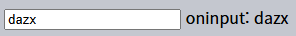

다양한 이벤트 <sub>(`change` · `input` · `cut` · `copy` · `paste`)</sub>
=======================================

### `change` <sub>(이벤트)</sub>
- 요소 변경 완료 시 발생

##### 텍스트 입력 요소 <sub>(예외)</sub>
- 입력 필드 내 글자 입력 중 발생 X
- 포커스 이동 시 발생
  - 버튼 클릭
  - Tab 키 누르기
  - 기타 등등
```html
<input type="text" onchange="alert(this.value)">
<input type="button" value="버튼">
```


##### `select` · `input` <sub>(체크박스 · 라디오)</sub>
- 선택 값 변경 직후 발생
```html
<select onchange="alert(this.value)">
  <option value="">선택하세요.</option>
  <option value="1">옵션 1</option>
  <option value="2">옵션 2</option>
  <option value="3">옵션 3</option>
</select>
```


### `input` <sub>(이벤트)</sub>
- 값 수정 시 발생

##### 입력 방법 무관
- 키보드
- 마우스
- 음성 인식
- 기타 등등

##### 텍스트 입력 요소
```html
<input type="text" id="input"> oninput: <span id="result"></span>
<script>
  input.oninput = function() {
    result.innerHTML = input.value;
  };
</script>
```



##### 값 미변경 동작 시 발생 X
- ⇦ · ⇨ 키 누르기
- 기타 등등

<br />

 **`oninput` 막기 X**

##### `input` <sub>(이벤트)</sub>
- 값 수정되자마자 발생
- `preventDefault()` <sub>(메서드)</sub>
  - 효과 X

<br />

### `cut` · `copy` · `paste` <sub>(이벤트)</sub>
- 값 잘라내기 · 복사하기 · 붙여넣기 시 발생

##### [`ClipboardEvent`](https://www.w3.org/TR/clipboard-apis/#clipboard-event-interfaces) <sub>(클래스)</sub> 하위 클래스 <sub>(3가지)</sub>
- 동작 대상 데이터 접근

##### 기본 동작 막기
- `preventDefault()` <sub>(메서드)</sub>

##### 잘라내기 · 복사하기 · 붙여넣기 동작 막기
- 모든 동작들 중단
  - 중단된 이벤트 얼럿창 출력
```html
<input type="text" id="input">
<script>
  input.oncut = input.oncopy = input.onpaste = function(event) {
    alert(event.type + ' - ' + event.clipboardData.getData('text/plain'));
    return false;
  };
</script>
```


##### 잘라내기 · 복사하기 · 붙여넣기 동작 대상 데이터
- 모든 데이터 가능
  - 텍스트
  - 파일 <sub>(OS 파일 매니저)</sub>
  - 기타 등등

##### 메서드 목록
- [명세서](https://www.w3.org/TR/clipboard-apis/#dfn-datatransfer) 참조
  - 클립보드 내 읽기 · 쓰기
  - 다양한 데이터 타입 처리

##### 클립보드 <sub>(전역 OS 레벨)</sub>
- 대다수 브라우저
  - 클립보드 읽기 · 쓰기 접근 제한 <sub>(보안)</sub>
    - 특정 사용자 동작 범위

##### 모든 브라우저 <sub>(Firefox 제외)</sub>
- 커스텀 클립보드 이벤트 생성 X
  - `dispatchEvent` X

<br />

## 요약

##### 데이터 변경 시 실행 이벤트

|이벤트|발생 시점|특이사항|
|---|---|---|
|`change`|값 변경||
||포커스 해제|텍스트 입력 요소 <sub>(예외)</sub>|
|`input`|텍스트 입력|즉시 실행<br /><sub>(기본 동작 막기 X)</sub>|
|`cut` · `copy` · `paste`|잘라내기 · 복사하기 · 붙여넣기|기본 동작 막기 가능|
|||`clipboardData` <sub>(프로퍼티)</sub><br /><sub>(클립보드 저장 데이터 읽기 · 쓰기)</sub>|

<br />

##  과제

### 예금 계산기

##### 인터페이스 작성
- 예금 잔고 · 이자율 입력 시
  - 주어진 기간 후 잔고 결과 표시

##### 데모


##### 입력값 변경 → 출력값 즉시 변경
- 공식
```javascript
/*
 initial
 - 계산 전 잔고
 interest
 - 이자율
 - ex) 0.05 (연 5%)
 years
 - 예금 유치 기간 (연 단위)
 */
let result = Math.round(initial * (1 + interest * years));
```
<br />


[정답](https://plnkr.co/edit/Ee0bB2KTxbLFQ8eQ?p=preview)
