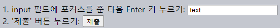
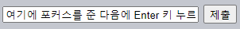
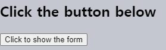

`submit` <sub>(이벤트 · 메서드)</sub>
=====================

##### `submit` <sub>(이벤트)</sub>
- 폼 제출 시 발생
  - 서버 전송 전 내용 검즌
  - 전송 취소
  - 기타 등등

##### form.submit()` <sub>(메서드)</sub>
- JS 로 폼 전송
  - 폼 동적 생성 후 전송

### `submit` <sub>(이벤트)</sub>

##### 폼 전송 방법 <sub>(2가지)</sub>
1. `<input type="[submit·image]">` 클릭
2. `input` <sub>(필드)</sub> Enter 키 누르기
- 폼 내 `submit` <sub>(이벤트)</sub> 발생

##### 이벤트 핸들러
- 보통 데이터 체크 수행
- 에러 존재 시
  1. 에러 출력
  2. `preventDefault()` 호출 <sub>(서버 전송 X)</sub>

##### 폼에서 내 동작 각각 수행
1. 텍스트 필드 이동해 Enter 키 누르기
2. `<input type="submit">` 클릭
- `alert` 창 표시
- 폼 전송 X
  - `return false`
```html
<form onsubmit="alert('submit!');return false">
  1. input 필드에 포커스를 준 다음 Enter 키 누르기: <input type="text" value="text"><br>
  2. '제출' 버튼 누르기: <input type="submit" value="제출">
</form>
```



<br />

 **`submit`과 `click`의 관계**

`input` 필드에서 Enter 키를 눌러 폼을 전송하면 `<input type="submit">`에 있는 `click` 이벤트가 트리거 됩니다.

클릭을 하지 않았는데도 `click` 이벤트가 트리거 되니까 좀 이상해 보이긴 하네요.

데모를 살펴봅시다.
```html
<form onsubmit="return false">
 <input type="text" size="30" value="여기에 포커스를 준 다음에 Enter 키 누르기">
 <input type="submit" value="제출" onclick="alert('클릭 이벤트가 트리거 되었습니다!')">
</form>
```



<br />

### `submit` 메서드
`form.submit()`을 호출하면 자바스크립트로 직접 폼을 서버에 전송할 수 있습니다.

`form.submit()` 메서드가 호출된 다음엔 `submit` 이벤트는 생성되지 않습니다. 개발자가 `form.submit()`을 호출했다면 스크립트에서 이미 필요한 모든 조치를 했다고 가정하기 때문입니다.

이런 `submit` 메서드의 특징은 다음과 같이 폼을 직접 만들고 전송하길 원할 때 응용할 수 있습니다.
```javascript
let form = document.createElement('form');
form.action = 'https://google.com/search';
form.method = 'GET';

form.innerHTML = '<input name="q" value="테스트">';

// 폼을 제출하려면 반드시 폼이 문서 안에 있어야 합니다.
document.body.append(form);

form.submit();
```

<br />

##  과제

### Modal form
Create a function `showPrompt(html, callback)` that shows a form with the message `html`, an input field and buttons `OK`/`CANCEL`.
- A user should type something into a text field and press Enter or the OK button, then `callback(value)` is called with the value they entered.
- Otherwise if the user presses Esc or CANCEL, then `callback(null)` is called.

In both cases that ends the input process and removes the form.

Requirements:
- The form should be in the center of the window.
- The form is modal. In other words, no interaction with the rest of the page is possible until the user closes it.
- When the form is shown, the focus should be inside the `<input>` for the user.
- Keys Tab/Shift+Tab should shift the focus between form fields, don't allow it to leave for other page elements.

Usage example:
```javascript
showPrompt("Enter something<br>...smart :)", function(value) {
  alert(value);
});
```

A demo in the iframe:



P.S. The source document has HTML/CSS for the form with fixed positioning, but it's up to you to make it modal.

<br />


A modal window can be implemented using a half-transparent `<div id="cover-div">` that covers the whole window, like this:
```css
#cover-div {
  position: fixed;
  top: 0;
  left: 0;
  z-index: 9000;
  width: 100%;
  height: 100%;
  background-color: gray;
  opacity: 0.3;
}
```

Because the `<div>` covers everything, it gets all clicks, not the page below it.

Also we can prevent page scroll by setting `body.style.overflowY='hidden'`.

The form should be not in the `<div>`, but next to it, because we don't want it to have `opacity`.

[샌드박스를 열어 정답을 확인해보세요.](https://plnkr.co/edit/oYjYoJzvYtxvjEAr?p=preview)
