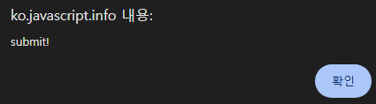

`submit` <sub>(이벤트 · 메서드)</sub>
====

### `submit` <sub>(이벤트)</sub>
- 폼 제출 시 발생

##### 용도
- 서버 전송 전 내용 검증
- 전송 취소
- 기타 등등

##### 폼 전송 방법 <sub>(2가지 · 폼 `submit` 이벤트 발생)</sub>
- a. 특정 `input` <sub>(필드)</sub> 클릭
  - `<input type="submit">`
  - `<input type="image">`
- b. `input` <sub>(필드)</sub> Enter 키 누르기

##### 이벤트 핸들러
- 데이터 유효성 검사
- 에러 존재 시 출력 후 기본 동작 비활성화
  - 서버 전송 X <sub>(`preventDefault()` 메서드)</sub>

##### 폼 내 동작 테스트
1. 텍스트 필드 이동 후 Enter 키 누르기
2. `<input type="submit">` <sub>(요소)</sub> 클릭
```html
<!-- 경고 창 표시 · 폼 미전송 (return false) -->
<form onsubmit="'submit!';return false">
  1. input 필드에 포커스를 준 다음 Enter 키 누르기: <input type="text" value="text"><br>
  2. '제출' 버튼 누르기: <input type="submit" value="제출">
</form>
```




<br />

 **`submit` · `click` <sub>(이벤트 관계)</sub>**

##### `input` <sub>(필드)</sub> Enter 키 눌러 폼 전송
- `<input type="submit">` <sub>(요소)</sub>
  - `click` <sub>(이벤트)</sub> 발생
```html
<form onsubmit="return false">
 <input type="text" size="30" value="여기에 포커스를 준 다음에 Enter 키 누르기">
 <input type="submit" value="제출" onclick="alert('클릭 이벤트가 실행되었습니다!')">
</form>
```


<br />

### `submit()` <sub>(메서드)</sub>
- JS 이용해 폼 전송

##### 용도
- 폼 동적 생성 후 전송

##### `submit()` 호출
- `submit` <sub>(이벤트)</sub> 미발생
  - 스크립트 내 모든 필요 조치 완료 가정

##### 폼 동적 생성 후 전송
```javascript
let form = document.createElement('form');
form.action = 'https://google.com/search';
form.method = 'GET';
form.innerHTML = '<input name="q" value="테스트">';

// 폼 제출 전 문서 내 위치 필수
document.body.append(form);

form.submit(); // 폼 전송
```

<br />

##  과제

### 모달 폼

#### `showPrompt(html, callback)` <sub>(함수)</sub> 작성

##### 폼 표시
- 메시지 <sub>(`html`)</sub>
- `input` <sub>(필드)</sub> 1개
- 제출 · 취소 버튼

#### 동작

##### a. 값 입력
1. `input` <sub>(필드)</sub> 텍스트 입력
2. Enter 키 누르기 · 제출 버튼 클릭
   1. `callback(value)` 호출
   2. `value` <sub>(입력값)</sub> 전송

##### b. Esc 키 누르기 · 취소 버튼 클릭
- `callback(null)` 호출

##### c. 마무리
- 입력 프로세스 종료 후 폼 제거

##### 요구사항
- 폼 위치
  - 창 정중앙
- 모달 창 내 폼 표시
  - 모달 창 외부 요소 상호작용 X
- 폼 표시 후
  - `<input>` <sub>(필드)</sub> 포커스 설정
- <sub>(Shift +)</sub> Tab 키 누르기
  - 폼 요소 간 포커스 이동
  - 모달 창 외부 요소 포커스 이동 X
```javascript
showPrompt("Enter something<br> … smart :)", function(value) {
  value;
});
```

##### 데모


##### 참고
- 제공 소스코드 <sub>(HTML · CSS)</sub>
  - 폼 위치 고정 <sub>(수정 가능)</sub>

<br />


##### 모달 창 구현
- `<div id="cover-div">` <sub>(요소)</sub>
  - 반투명
  - 창 전체 크기
```css
#cover-div {
  position: fixed;
  top: 0;
  left: 0;
  z-index: 9000;
  width: 100%;
  height: 100%;
  background-color: gray;
  opacity: 0.3;
}
```

##### 모달 창 전체 크기 설정
- 모든 `click` <sub>(이벤트)</sub> 처리
- 모달 창 외부 <sub>(문서)</sub>
  - 클릭 불가능 <sub>(`click` 이벤트 미발생)</sub>

##### 페이지 스크롤 방지
```javascript
body.style.overflowY='hidden';
```

##### `<form>` <sub>(요소)</sub> 위치
- `<div>` <sub>(모달 창 요소)</sub> 옆 <sub>(내부 X)</sub>
  - 모달 창 반투명 효과 미적용

[정답](https://plnkr.co/edit/oYjYoJzvYtxvjEAr?p=preview)
