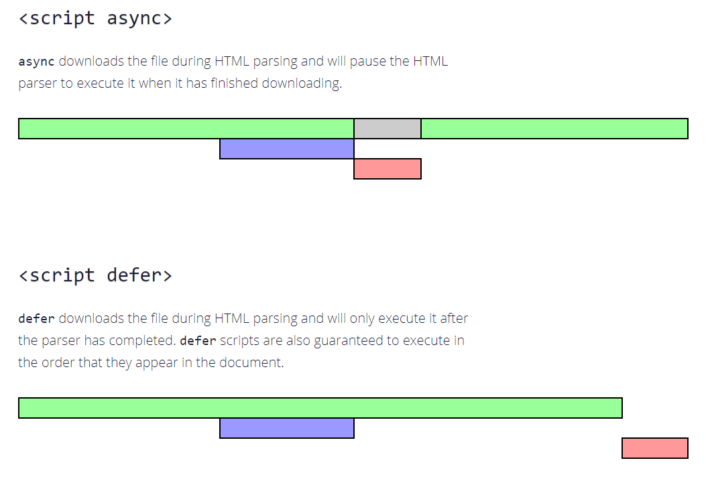

`defer` · `async` 스크립트
====

##### 모던 웹 브라우저 상 대다수 스크립트
- HTML 대비 '무거움' <sub>(큰 용량)</sub>
  - 다운로드 · 처리 시간 ↑

##### HTML 파싱 중 `<script [src="…"]>` <sub>(태그)</sub> 도달 시
- 스크립트 먼저 처리 <sub>(실행 · 로드)</sub>
  - DOM 생성 일시 중단

#### 중요 이슈 <sub>(부작용)</sub> 발생 <sub>(2가지)</sub>

##### 1. 스크립트 하단 DOM 요소 접근 불가능 <sub>(스크립트 내)</sub>
- 다양한 동작 수행 불가능
  - DOM 요소 핸들러 설정
  - 기타 등등

##### 2. 페이지 상단 대용량 스크립트 병목 현상
- 스크립트 의해 페이지 '막힘'
- 스크립트 로드 · 실행 완료 전 하단 내용 미표시
```html
<p>…스크립트 상단 내용…</p>

<script src="https://javascript.info/article/script-async-defer/long.js?speed=1"></script>

<!-- 스크립트 다운로드 및 실행 완료 전까지 하단 내용 미표시 -->
<p>…스크립트 하단 내용…</p>
```

##### 페이지 최하단 스크립트 위치 <sub>(이슈 우회)</sub>
- 스크립트 상단 요소 접근 가능
- 페이지 내용 정상 출력
```html
<body>
  …스크립트 상단 내용…

  <!-- 문서 내 최하단 스크립트 위치 -->
  <script src="https://javascript.info/article/script-async-defer/long.js?speed=1"></script>
</body>
```

##### 대용량 HTML 문서 <sub>(우회 부작용)</sub>
- 문서 전체 로드 후 스크립트 로드
  - 페이지 로드 속도 ↓

### `defer` <sub>(속성)</sub>

#### 지연 <sub>(`defer`)</sub> 스크립트

##### 백그라운드 다운로드 수행
- HTML 파싱 · 페이지 생성 중단 X

##### 스크립트 실행 지연
- 페이지 구성 <sub>(DOM 생성)</sub> 완료 대기
```html
<p>…스크립트 상단 내용…</p>

<!-- defer (속성) 추가 -->
<script defer src="https://javascript.info/article/script-async-defer/long.js?speed=1"></script>

<!-- 즉시 표시 -->
<p>…스크립트 하단 내용…</p>
```

##### 실행 시점
- DOM 준비 완료 <sub>(트리 완성)</sub> 후
- `DOMContentLoaded` <sub>(이벤트)</sub> 발생 전
```html
<p>…스크립트 상단 내용…</p>

<script>
  document.addEventListener('DOMContentLoaded', function() {
    "`defer` 스크립트가 실행된 후, DOM이 준비되었습니다!";
  });
</script>

<script defer src="https://javascript.info/article/script-async-defer/long.js?speed=1"></script>

<p>…스크립트 하단 내용…</p>
```
1. 페이지 내용 즉시 출력 <sub>(DOM 트리 완성)</sub>
2. 지연 스크립트 실행
3. `DOMContentLoaded` <sub>(이벤트)</sub>
   - 지연 스크립트 실행 대기

##### 지연 스크립트 간 실행 순서
- HTML 추가 순서 <sub>(일반 스크립트 순서 동일)</sub>
  - 상대순
  - 요소순
```html
<!-- long.js (긴 스크립트) 먼저 실행 -->
<script defer src="https://javascript.info/article/script-async-defer/long.js"></script>

<!-- small.js (짧은 스크립트) 다음 실행 -->
<script defer src="https://javascript.info/article/script-async-defer/small.js"></script>
```

<br />

 **소용량 스크립트 선다운로드 · 후실행**

##### 브라우저 성능 고려
- 페이지 내 스크립트들 확인 후
  - 병렬적 다운로드 실행
- 다운로드 완료 순서
  1. 소용량 <sub>(`small.js`)</sub>
  2. 대용량 <sub>(`long.js`)</sub>
- 실행 순서 <sub>(문서 추가 순서 · 명세서 정의)</sub>
  1. 대용량 <sub>(`long.js`)</sub>
  2. 소용량 <sub>(`small.js`)</sub>

<br />

 **외부 스크립트만 `defer` <sub>(속성)</sub> 유효**

##### `src` <sub>(속성)</sub> 부재 `<script>`
- `defer` <sub>(속성)</sub> 무시

<br />

### `async` <sub>(속성)</sub>

#### 비동기 <sub>(`async`)</sub> 스크립트

##### 특징
- 별개 동작 <sub>(페이지 로드 무관)</sub>

##### 백그라운드 다운로드 수행
- HTML 파싱 · 페이지 생성 중단 X

##### 스크립트 실행 지연 X
- 다운로드 완료 시 즉시 실행 <sub>(HTML 파싱 중단)</sub>

##### `DOMContentLoaded` <sub>(이벤트)</sub> · 비동기 스크립트
- 각자 별개 실행 <sub>(서로 대기 X)</sub>
- 이벤트 먼저 발생 경우
  1. 페이지 구성 완료
  2. 비동기 스크립트 다운로드 완료
- 비동기 스크립트 먼저 실행 경우
  1. 비동기 스크립트 다운로드 완료
     - 소용량 · 캐싱 처리
  2. 페이지 구성 완료

##### 타 스크립트 · 비동기 스크립트
- 각자 별개 실행 <sub>(서로 대기 X)</sub>

##### 비동기 스크립트 간 실행 순서
- 다운로드 완료 순서
```html
<p>…스크립트 상단 내용…</p>

<script>
  document.addEventListener('DOMContentLoaded', () => "DOM이 준비 되었습니다!");
</script>

<!-- 다수 비동기 스크립트 별개 실행 (다운로드 완료 시 먼저 실행) -->
<script async src="https://javascript.info/article/script-async-defer/long.js"></script>
<script async src="https://javascript.info/article/script-async-defer/small.js"></script>

<p>…스크립트 하단 내용…</p>
```
1. 페이지 내용 즉시 출력 <sub>(DOM 트리 완성)</sub>
2. `DOMContentLoaded` <sub>(이벤트)</sub>
   - 비동기 스크립트 전 · 후 발생 가능
     - 상황 따라 상이
     - 정확한 순서 예측 불가능
3. 다수 비동기 스크립트
   - 각자 별개 실행 <sub>(서로 대기 X)</sub>
   - 다운로드 완료 시 먼저 실행
     - _'load-first order'_

#### 유용한 상황

##### 독립 서드파티 스크립트 → 개발 중인 스크립트 <sub>(통합)</sub>
- 각각 독립적인 역할 수행 <sub>(서드파티 스크립트)</sub>
  - 방문자 수 카운터
  - 광고 관련 기능
  - 기타 등등
- 비동기 스크립트 · 개발 중인 스크립트
  - 별개 실행 <sub>(의존성 無)</sub>
```html
<!-- Google Analytics -->
<script async src="https://google-analytics.com/analytics.js"></script>
```

### 동적 스크립트

##### 문서 내 스크립트 동적 추가
```javascript
let script = document.createElement('script');
script.src = "/article/script-async-defer/long.js";

// 외부 스크립트
// - 문서 내 요소 추가 직후 다운로드 시작
document.body.append(script);
```

##### 특징 <sub>(비동기 스크립트 유사)</sub>
- 동적 스크립트 · 타 요소 · 이벤트 등
  - 각자 별개 실행 <sub>(서로 대기 X)</sub>
- 다운로드 완료 시 먼저 실행
  - _'load-first order'_

##### 스크립트 2개 동적 생성 후 추가
- `async`<sub>(프로퍼티)</sub>
  - 비동기 설정 여부
  - `true` <sub>(기본값)</sub>
- 실행 순서 <sub>(문서 추가 순서)</sub>
  1. `long.js`
  2. `small.js`
```javascript
function loadScript(src) {
  let script = document.createElement('script');
  script.src = src;
  script.async = false; // 비동기 미설정

  document.body.append(script);
}

// 실행 순서 (문서 추가 순서)
// 1. long.js
// 2. small.js
loadScript("/article/script-async-defer/long.js");
loadScript("/article/script-async-defer/small.js");
```

<br />

요약
====

### 지연 <sub>(`defer`)</sub> vs 비동기 <sub>(`async`)</sub>

##### 공통점 <sub>(병렬 다운로드)</sub>
- 다운로드 시 페이지 렌더링 중단 X
  - 사용자 대기시간 ↓
  - 페이지 내용 빠르게 표시

##### 차이점

||실행 순서|실행 시점|
|:---:|---|---|
|지연|문서 내 순서|문서 다운로드 · 파싱 완료 후|
|||`DOMContentLoaded` <sub>(이벤트)</sub> 전|
|비동기|다운로드 완료 순서|다운로드 완료 시 <sub>(문서 다운로드 여부 무관)</sub>|
|||스크립트 먼저 실행 경우 <sub>(문서 다운로드 완료 전)</sub><br />- 소용량 · 캐싱 처리<br />- 대용량 HTML 문서|

<br />

 **스크립트 다운로드 중 페이지 정상 동작 필수**

##### 지연 <sub>(`defer`)</sub> 스크립트 주의점
- 스크립트 실행 전 페이지 화면 출력
  - 그래픽 관련 컴포넌트 준비 X
- 적용 영역
  - 로딩 표시자 표시
  - 관련 버튼 비활성화

<br />

#### 실무

##### 지연 <sub>(`defer`)</sub> 적용
- DOM 전체 필요 스크립트
- 실행 순서 중요 스크립트

##### 비동기 <sub>(`async`)</sub> 적용
- 독립적인 동작 스크립트
  - 방문자 수 카운터
  - 광고 관련 기능
  - 기타 등등
- 실행 순서 무관 스크립트



