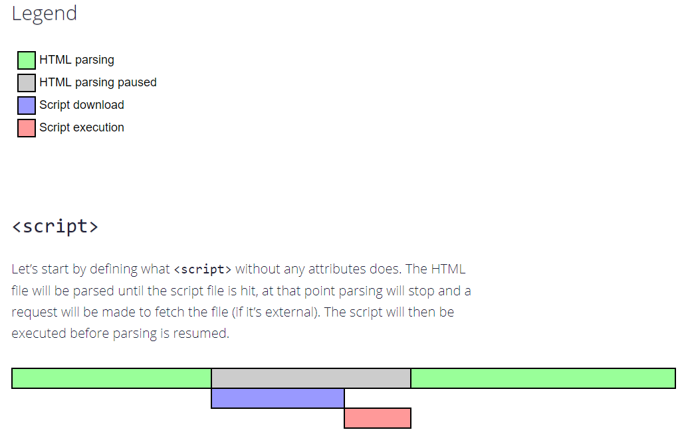

`defer` · `async` 스크립트
====

##### 모던 웹브라우저 상 대다수 스크립트
- HTML 보다 '무거움' <sub>(큰 용량)</sub>
  - 다운로드 · 처리 시간 ↑

##### HTML 파싱 중 `<script [src="…"]>` <sub>(태그)</sub> 도달 시
- 스크립트 먼저 처리 <sub>(실행 · 로드)</sub>
  - DOM 생성 일시 중단

#### 중요 이슈 <sub>(부작용)</sub> 발생 <sub>(2가지)</sub>

##### 1. 스크립트 하단 DOM 요소 접근 불가능 <sub>(스크립트 내)</sub>
- 다양한 동작 수행 불가능
  - DOM 요소 핸들러 설정
  - 기타 등등

##### 2. 페이지 상단 대용량 스크립트 병목 현상
- 스크립트 의해 페이지 '막힘'
- 스크립트 로드 · 실행 완료 전 하단 내용 미표시
```html
<p> … 스크립트 상단 콘텐츠 … </p>

<script src="https://javascript.info/article/script-async-defer/long.js?speed=1"></script>

<!-- 스크립트 다운로드 및 실행 완료 전까지 하단 내용 미표시 -->
<p> … 스크립트 하단 콘텐츠 … </p>
```

##### 페이지 최하단 스크립트 위치 <sub>(이슈 우회)</sub>
- 스크립트 상단 요소 접근 가능
- 페이지 콘텐츠 정상 출력
```html
<body>
  … 스크립트 상단 콘텐츠들 …

  <!-- 문서 내 최하단 스크립트 위치 -->
  <script src="https://javascript.info/article/script-async-defer/long.js?speed=1"></script>
</body>
```

##### 대용량 HTML 문서 <sub>(우회 부작용)</sub>
- 문서 전체 로드 후 스크립트 로드
  - 페이지 로드 속도 ↓

### `defer` <sub>(속성)</sub>

#### 지연 <sub>(`defer`)</sub> 스크립트

##### 백그라운드 다운로드 수행
- HTML 파싱 · 페이지 생성 중단 X
- 스크립트 실행 지연 <sub>(페이지 구성 완료 전까지)</sub>
```html
<p> … 스크립트 상단 콘텐츠 … </p>

<!-- defer (속성) 추가 -->
<script defer src="https://javascript.info/article/script-async-defer/long.js?speed=1"></script>

<!-- 즉시 표시 -->
<p> … 스크립트 하단 콘텐츠 … </p>
```

##### 실행 시점
- DOM 준비 완료 <sub>(트리 완성)</sub> 후
- `DOMContentLoaded` <sub>(이벤트)</sub> 발생 전

##### 실행 순서
- DOM 트리 완성 · 지연 스크립트 실행 후
1. 페이지 콘텐츠
    - 즉시 출력 <sub>(DOM 트리 완성)</sub>
2. 지연 스크립트 실행
3. `DOMContentLoaded` <sub>(이벤트)</sub>
    - 지연 스크립트 실행 대기
```html
<p> … 스크립트 상단 콘텐츠 … </p>

<script>
  document.addEventListener('DOMContentLoaded', function() {
    alert("`defer` 스크립트가 실행된 후, DOM이 준비되었습니다!");
  });
</script>

<script defer src="https://javascript.info/article/script-async-defer/long.js?speed=1"></script>

<p> … 스크립트 하단 콘텐츠 … </p>
```

##### 지연 스크립트 간 실행 순서
- HTML 추가 순서 <sub>(≒ 일반 스크립트)</sub>
  - 상대순
  - 요소순

##### 앞쪽 긴 스크립트 · 뒤쪽 짧은 스크립트
- 짧은 스크립트
  - 긴 스크립트 실행 대기
```html
<script defer src="https://javascript.info/article/script-async-defer/long.js"></script>
<script defer src="https://javascript.info/article/script-async-defer/small.js"></script>
```

<br />

 **용량 작은 스크립트 : 먼저 다운로드 · 나중 실행**

##### 브라우저 : 성능 고려
- 페이지 내 스크립트들 확인 후
  - 병렬적 다운로드 실행
- 다운로드 완료 순서
  1. 작은 파일 <sub>(`small.js`)</sub>
  2. 큰 파일 <sub>(`long.js`)</sub>
- 실행 순서 <sub>(문서 추가 순서 · 명세서 정의)</sub>
  1. 큰 파일 <sub>(`long.js`)</sub>
  2. 작은 파일 <sub>(`small.js`)</sub>

<br />

 **`defer` <sub>(속성)</sub> : 외부 스크립트만 유효**

##### `src` <sub>(속성)</sub> 부재 `<script>`
- `defer` <sub>(속성)</sub> 무시

<br />

### `async` <sub>(속성)</sub>

#### 비동기 <sub>(`async`)</sub> 스크립트
- 페이지와 완전히 독립적으로 동작

##### 백그라운드 다운로드 수행
- HTML 파싱 중단 X
- 페이지 생성 막기 X

##### 스크립트 실행 지연 X
- 다운로드 완료 시 즉시 실행

##### 스크립트 실행 중
- HTML 파싱 중단

#### `DOMContentLoaded` <sub>(이벤트)</sub> · 비동기 스크립트
- 서로 대기 X

##### 이벤트 먼저 발생 시 순서 <sub>(비동기 스크립트 다운로드 전)</sub>
1. 페이지 구성 완료
2. 비동기 스크립트 다운로드 완료

##### 이벤트 나중 발생 시 순서 <sub>(비동기 스크립트 실행 후)</sub>
1. 비동기 스크립트 <sub>(짧은 코드)</sub>
    - 다운로드 완료
    - 캐싱 처리
2. 페이지 구성 완료

##### 타 스크립트 · 비동기 스크립트
- 서로 대기 X

##### 다수 비동기 <sub>(`async`)</sub> 스크립트
- 실행 순서
  - 다운로드 완료 순서 <sub>(제각각)</sub>
```html
<p> … 스크립트 앞 콘텐츠 … </p>

<script>
  document.addEventListener('DOMContentLoaded', () => alert("DOM이 준비 되었습니다!"));
</script>

<script async src="https://javascript.info/article/script-async-defer/long.js"></script>
<script async src="https://javascript.info/article/script-async-defer/small.js"></script>

<p> … 스크립트 뒤 콘텐츠 … </p>
```

##### 1. 콘텐츠 바로 출력
- 비동기 스크립트 다운로드
  - 페이지 로드 막기 X

##### 2. `DOMContentLoaded` <sub>(이벤트)</sub>
- 비동기 스크립트 전 · 후 실행 가능
  - 상황 따라 상이
  - 정확한 순서 예측 X

##### 3. 비동기 스크립트
- 서로 대기 X
- 다운로드 완료 시 먼저 실행
  - 'load-first order'

#### 유용한 상황

##### 서드파티 스크립트 → 현재 개발 중인 스크립트 <sub>(통합)</sub>
- 각각 독립적인 역할 수행 <sub>(서드파티 스크립트)</sub>
  - 방문자 수 카운터
  - 광고 관련 스크립트
  - 기타 등등
- 비동기 스크립트 · 개발 중인 스크립트
  - 서로 의존 X
```html
<!-- Google Analytics -->
<script async src="https://google-analytics.com/analytics.js"></script>
```

### 동적 스크립트

##### 스크립트 동적 추가
```javascript
let script = document.createElement('script');
script.src = "/article/script-async-defer/long.js";

// 스크립트 관련 요소
// - 문서 내 추가 즉시 다운로드 시작
document.body.append(script);
```

##### 특징 <sub>(비동기 스크립트 유사)</sub>
- 동적 스크립트 · 타 요소 · 이벤트 등
  - 서로 대기 X
- 다운로드 완료 시 먼저 실행
  - 'load-first order'

##### 스크립트 2개 동적 생성 후 추가
- 비동기 설정 해제
  - `script.async = false`
- 실행 순서 <sub>(문서 추가 순서)</sub>
  1. `long.js`
  2. `small.js`
```javascript
function loadScript(src) {
  let script = document.createElement('script');
  script.src = src;

  // 비동기 설정 해제
  script.async = false;
  document.body.append(script);
}

// 실행 순서 (문서 추가 순서)
// 1. long.js
// 2. small.js
loadScript("/article/script-async-defer/long.js");
loadScript("/article/script-async-defer/small.js");
```

<br />

요약
====

#### 지연 <sub>(`defer`)</sub> vs 비동기 <sub>(`async`)</sub> 스크립트

##### 공통점
- 다운로드 시 페이지 렌더링 중단 X
  - 대기시간 ↓
  - 페이지 콘텐츠 빠르게 준비 <sub>(로드)</sub>

##### 차이

||실행 순서|실행 시점|
|---|---|---|
|지연<br /><sub>(`defer`)</sub>|문서 내 추가 순|- HTML 문서 다운로드 · 파싱 완료 후<br />- `DOMContentLoaded` <sub>(이벤트)</sub> 발생 전|
|비동기<br /><sub>(`async`)</sub>|다운로드 완료 순<br /><sub>(load-first order)</sub>|다운로드 완료 후<br /><sub>(HTML 문서 다운로드 완료 전 · 후)</sub><br />- 스크립트 크기 少<br />- 캐싱 처리<br />- HTML 문서 길이 大|

<br />

 **페이지 동작 : 스크립트 다운로드 완료 여부 무관**

##### 지연 <sub>(`defer`)</sub> 스크립트 주의
- 스크립트 실행 전 페이지 화면 출력
  - 그래픽 관련 컴포넌트 준비 X
- 지연 스크립트 적용 영역
  - 로딩 인디케이터 표시
  - 관련 버튼 비활성화

<br />

#### 실무

##### 지연 <sub>(`defer`)</sub>
- DOM 전체에서 필요한 스크립트
- 실행 순서 중요

##### 비동기 <sub>(`async`)</sub>
- 독립적인 동작 스크립트
  - 방문자 수 카운터
  - 광고 관련 스크립트
  - 기타 등등
- 실행 순서 무관




