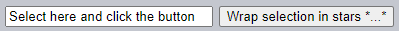
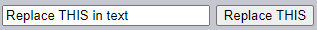
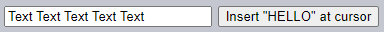

`Selection` · `Range`
===================

### [`Range`](https://dom.spec.whatwg.org/#ranges)

##### 경계점
- `Range` 시작점 · 끝점

##### 구성
- 부모 DOM 노드
  - 상대적 offset <sub>(`Range` 시작점 ~ )</sub>
- ex\) 요소
  - 자식 숫자
- ex\) 텍스트
  - 텍스트 내 위치

##### `Range` 생성 · 선택 경계점 설정
```Javascript
let range = new Range();
range.setStart(node, offset);
range.setEnd(node, offset);
```

#### 선택하기 <sub>(HTML 조각)</sub>
```html
<p id="p">Example: <i>italic</i> and <b>bold</b></p>
```


##### `"Example: <i>italic</i>"` 선택하기
- `<p>` <sub>(요소)</sub> 첫 2개 자식 요소


```html
<p id="p">Example: <i>italic</i> and <b>bold</b></p>

<script>
  let range = new Range();

  // Range 시작점 설정
  // - 1번째 자식 노드
  //   - "Example: "
  range.setStart(p, 0);

  // Range 끝점 설정
  // - 3번째 자식 노드 (미포함 → 2번째 자식 노드)
  //   - " and " (미포함)
  //   - "<i>italic</i>"
  range.setEnd(p, 2);

  // toString (메서드)
  // - 내부 콘텐츠 반환 (텍스트 · 태그 제거)
  alert(range); // Example: italic

  // 문서 Selection 대상 Range 적용
  document.getSelection().addRange(range);
</script>
```

##### 테스트 코드 <sub>(다양한 변수 적용)</sub>
```html
<p id="p">Example: <i>italic</i> and <b>bold</b></p>

From <input id="start" type="number" value=1> – To <input id="end" type="number" value=4>
<button id="button">Click to select</button>
<script>
  button.onclick = () => {
    let range = new Range();

    range.setStart(p, start.value);
    range.setEnd(p, end.value);

    // apply the selection, explained later
    document.getSelection().removeAllRanges();
    document.getSelection().addRange(range);
  };
</script>
```


##### `1` ~ `4` 선택하기
- `"<i>italic</i> and <b>bold</b>"`


##### 두 메서드 <sub>(`set[Start·End]`)</sub> 전달 노드
- 타 노드 전달 가능
  - 관련 없는 두 노드 사이 <sub>(`Range`)</sub> 설정
- 끝점 위치
  - 항상 시작점 다음

##### 텍스트 노드 부분선택하기


- 상대적 offset 설정

```html
<p id="p">Example: <i>italic</i> and <b>bold</b></p>

<script>
  let range = new Range();

  // Range 시작점 설정
  // - 1번째 자식 노드 내 3번째 글자
  //   - "Example: "
  //        ^
  range.setStart(p.firstChild, 2);


  // Range 끝점 설정
  // - <b> (자식 노드) 내 4번째 글자 (미포함 → 3번째 글자)
  //   - "bold"
  //         ^ (미포함)
  //        ^  (실제)
  range.setEnd(p.querySelector('b').firstChild, 3);

  alert(range); // ample: italic and bol

  window.getSelection().addRange(range);
</script>
```


#### `Range` <sub>(객체)</sub> 프로퍼티

##### `start[Container·Offset]`
- 범위 시작점 노드 · offset
  - `<p>` <sub>(요소)</sub> 1번째 텍스트 노드 · `2`

##### `end[Container·Offset]`
- 범위 끝점 노드 · offset
  - `<b>` <sub>(요소)</sub> 1번째 텍스트 노드 · `3`

##### `collapsed` <sub>(`boolean`)</sub>
- 시작점 · 끝점 동일 여부 <sub>(빈 범위)</sub>
  - `false`

##### `commonAncestorContainer`
- 최근접 공통 조상 <sub>(`Range` 내 모든 노드)</sub>
  - `<p>` <sub>(요소)</sub>

### `Range` 메서드

#### 시작점 · 끝점 설정

##### `set[Start·End](node, offset)`
- `node` 내 `offset` 위치

##### `set[Start·End]Before(node)`
- `node` 직전 위치

##### `set[Start·End]After(node)`
- `node` 직후 위치

##### `node` 타입 · `offset`
- 텍스트 노드
  - 문자
- 요소 노드
  - 자식 노드

#### 기타

##### `selectNode(node)`
- `node` 전체 범위 설정

##### `selectNodeContents(node)`
- `node` 내 콘텐츠 전체 범위 설정

##### `collapse(toStart)`
- `start = end` 설정
  - 시작점 · 끝점 동일 <sub>(빈 범위)</sub>

##### `cloneRange()`
- `Range` <sub>(객체)</sub> 복제
  - 시작점 · 끝점 동일

#### 범위 내 콘텐츠 조작

##### `deleteContents()`
- 문서 내 범위 설정 콘텐츠 제거

##### `extractContents()`
- 범위 설정 콘텐츠
  1. 문서 내 제거
  2. 반환 <sub>(`DocumentFragment` 형태)</sub>

##### `cloneContents()`
- 범위 설정 콘텐츠
  1. 복제
  2. 반환 <sub>(`DocumentFragment` 형태)</sub>

##### `insertNode(node)`
- 범위 시작점에 `node` 삽입

##### `surroundContents(node)`
- `ndoe` 로 범위 설정 콘텐츠 감싸기
  - 여닫는 태그 필수 <sub>(범위 내 모든 요소)</sub>
  - 태그 일부 X

##### 메서드 테스트 코드
```html
Click buttons to run methods on the selection, "resetExample" to reset it.

<p id="p">Example: <i>italic</i> and <b>bold</b></p>

<p id="result"></p>
<script>
  let range = new Range();

  // Each demonstrated method is represented here:
  let methods = {
    deleteContents() {
      range.deleteContents()
    },
    extractContents() {
      let content = range.extractContents();
      result.innerHTML = "";
      result.append("extracted: ", content);
    },
    cloneContents() {
      let content = range.cloneContents();
      result.innerHTML = "";
      result.append("cloned: ", content);
    },
    insertNode() {
      let newNode = document.createElement('u');
      newNode.innerHTML = "NEW NODE";
      range.insertNode(newNode);
    },
    surroundContents() {
      let newNode = document.createElement('u');
      try {
        range.surroundContents(newNode);
      } catch(e) { alert(e) }
    },
    resetExample() {
      p.innerHTML = `Example: <i>italic</i> and <b>bold</b>`;
      result.innerHTML = "";

      range.setStart(p.firstChild, 2);
      range.setEnd(p.querySelector('b').firstChild, 3);

      window.getSelection().removeAllRanges();
      window.getSelection().addRange(range);
    }
  };

  for(let method in methods) {
    document.write(`<div><button onclick="methods.${method}()">${method}</button></div>`);
  }

  methods.resetExample();
</script>
```


##### 상세 메서드 리스트 참조
- [명세서](https://dom.spec.whatwg.org/#interface-range)
- [MDN 메뉴얼](https://developer.mozilla.org/en-US/docs/Web/API/Range).

### `Selection`

##### 설정 범위 선택 객체
- `window.getSelection()`
- `document.getSelection()`

##### [명세서](https://www.w3.org/TR/selection-api/)
- 0개 이상 범위 지원

##### 실제
- 모든 브라우저 <sub>(Firefox 제외)</sub>
  - 단일 범위 지원
- Firefox
  - 다수 범위 지원
    - Ctrl <sub>(Cmd)</sub> + click

##### Firefox
- 범위 3개 선택


##### 일부 메서드명
- 다수 범위 암시
  - 실제 1개 범위 지원 <sub>(Firefox 제외)</sub>

### `Selection` <sub>(객체)</sub> 프로퍼티

||시작점|끝점|
|---|:---:|:---:|
|`Range`|`start`|`end`|
|`Selection`|`anchor`|`focus`|

#### 주요 프로퍼티

##### `[anchor·focus]Node`
- 선택 시작점 · 끝점 노드

##### `[anchor·focus]Offset`
- 선택 시작점 · 끝점 offset <sub>(`anchorNode` 내)</sub>

##### `isCollapsed`
- 선택 개체 유무 <sub>(빈 범위)</sub> · 존재 여부

##### `rangeCount`
- 선택 내 범위 개수
- 모든 브라우저 <sub>(Firefox 제외)</sub>
  - 최대 `1`

<br />

 **`Selection` 시작점 ← 끝점 <sub>(역방향)</sub>**

##### 다양한 콘텐츠 선택 방법
- 마우스
- 핫키
- 누르기 <sub>(모바일 디바이스)</sub>
- 기타 등등

#### 마우스 선택
- 양방향 동일 선택 가능

##### 정방향
- 시작점 <sub>(`anchor`)</sub> → 끝점 <sub>(`focus`)</sub> 
  - `"Example"` → `"italic"`


##### 역방향 <sub>(끝점 이후 시작점)</sub>
- 시작점 <sub>(`focus`)</sub> ← 끝점 <sub>(`anchor`)</sub>
  - `"Example"` ← `"italic"`


##### `Range` <sub>(객체)</sub>
- 항상 정방향
  - 시작점 <sub>(`start`)</sub> → 끝점 <sub>(`end`)</sub>

<br />

### `Selection` 이벤트

##### `elem.onselectstart`
- `elem` <sub>(요소)</sub> 대상 선택 시작 시 발생
  - ex\) 마우스 버튼 누른 채 이동 시작
- 기본 동작 막기
  - 선택 시작 X

##### `document.onselectionchange`
- 선택 변경 시 발생
- `document` <sub>(객체)</sub> 전용

#### 선택 추적 데모
- 선택 변경 시
  - 선택 경계 동적 표시
```html
<p id="p">Select me: <i>italic</i> and <b>bold</b></p>

From <input id="from" disabled> – To <input id="to" disabled>
<script>
  document.onselectionchange = function() {
    let {anchorNode, anchorOffset, focusNode, focusOffset} = document.getSelection();

    from.value = `${anchorNode && anchorNode.data}:${anchorOffset}`;
    to.value = `${focusNode && focusNode.data}:${focusOffset}`;
  };
</script>
```

### 선택 얻기 데모

#### 선택 전체 얻기

##### 텍스트
`document.getSelection().toString()`

##### DOM 노드
1. 내부 범위 얻기
    - 1번째 범위 <sub>(Firefox 제외)</sub>
2. `cloneContents()` <sub>(메서드)</sub> 호출
```html
<p id="p">Select me: <i>italic</i> and <b>bold</b></p>

Cloned: <span id="cloned"></span>
<br>
As text: <span id="astext"></span>

<script>
  document.onselectionchange = function() {
    let selection = document.getSelection();

    cloned.innerHTML = astext.innerHTML = "";

    // 범위 내 DOM 노드 복제 (다수 범위 지원 코드)
    for (let i = 0; i < selection.rangeCount; i++) {
      cloned.append(selection.getRangeAt(i).cloneContents());
    }

    // 선택 텍스트 얻기
    astext.innerHTML += selection;
  };
</script>
```

### `Selection` 메서드

#### 범위 추가 · 제거

##### `getRangeAt(n)`
- `n` 번째 범위 얻기
- 모든 브라우저 <sub>(Firefox 제외)</sub>
  - `0` 만 사용

##### `addRange(range)`
- 선택 내 범위 추가
- 모든 브라우저 <sub>(Firefox 제외)</sub>
  - 선택 내 연관 범위 존재 시 호출 무시

##### `removeRange(range)`
- 선택 내 범위 제거

##### `removeAllRanges()`
- 모든 범위 제거

##### `empty()`
- `removeAllRanges` 별칭

##### 범위 직접 설정 메서드 <sub>(`Range` 사용 X)</sub>

##### `collapse(node, offset)`
- 선택 범위 교체
  - `start = end = offset` 설정
  - `node` 대상

##### `setPosition(node, offset)`
- `collapse` 별칭

##### `collapseTo[Start·End]()`
- 선택 시작점 · 끝점에 빈 범위 설정

##### `extend(node, offset)`
- 선택 시작점 이동 <sub>(`offset` 위치)</sub>
  - `node` 대상

##### `setBaseAndExtent(an, ao, fn, fo)`
- 선택 내 범위 교체
  - 범위 내 모든 콘텐츠 선택

||`node`|`offset`|
|:---:|:---:|:---:|
|시작점<br /><sub>(`anchor`)</sub>|`an`|`ao`|
|끝점<br /><sub>(`offset`)</sub>|`fn`|`fo`|


##### `selectAllChildren(node)`
- 모든 `node` 자식 요소 선택

##### `deleteFromDocument()`
- 문서 내 선택 콘텐츠 제거

##### `containsNode(node, allowPartialContainment = false)`
- 선택 내 `node` 포함 여부 확인
- 2번째 인수
  - 부분 포함 여부

##### 선택 내 범위 조작 시
- `Range` <sub>(객체)</sub> 사용 불필요
  - `Selection` <sub>(객체)</sub> 메서드 사용

##### `<p>` <sub>(요소)</sub> 문단 내 모든 콘텐츠 선택
```html
<p id="p">Select me: <i>italic</i> and <b>bold</b></p>

<script>
  // <p> (요소) 내 1번째 ~ 마지막 자식 전부 선택
  document.getSelection().setBaseAndExtent(p, 0, p, p.childNodes.length);
</script>
```
- `Range` <sub>(객체)</sub> 사용 <sub>(동일 기능)</sub>
```html
<p id="p">Select me: <i>italic</i> and <b>bold</b></p>

<script>
  let range = new Range();

  // <p> (태그) 선택
//range.selectNode(p);

  // <p> (태그) 내 모든 콘텐츠 선택
  range.selectNodeContents(p);

  // 기존 선택 제거
  document.getSelection().removeAllRanges();

  document.getSelection().addRange(range);
</script>
```

<br />

 **선택 전 먼저 기존 선택 제거하기**

##### 기존 선택 설정 시
1. 기존 범위 제거
    - `removeAllRanges()`
2. 새 범위 설정
- 기존 범위 미제거 시
  - 새 범위 무시 <sub>(Firefox 제외)</sub>
- 범위 교체 메서드 <sub>(`setBaseAndExtent` 등)</sub>
  - 기존 범위 제거 무관

<br />

### 폼 컨트롤 선택

##### 폼 요소 <sub>(`input` · `textarea` 등)</sub>
- [전용 선택 API](https://html.spec.whatwg.org/#textFieldSelection) 제공
  - `Selection` · `Range` <sub>(객체)</sub> X
- `input` 값
  - 순수 텍스트
  - HTML X
    - 선택 · 범위 객체 불필요

#### 프로퍼티

##### `input.selectionStart` <sub>(쓰기 가능)</sub>
- 선택 시작점 위치

##### `input.selectionEnd` <sub>(쓰기 가능)</sub>
- 선택 끝점 위치

##### `input.selectionDirection`
- 선택 방향
  - 'forward' <sub>(정방향)</sub>
  - 'backward' <sub>(역방향)</sub>
  - 'none'(마우스 더블 클릭 선택 등)

#### 이벤트

##### `input.onselect`
- 요소 선택 시 발생

#### 메서드

##### `input.select()`
- selects everything in the text control (can be `textarea` instead of `input`),

##### `input.setSelectionRange(start, end, [direction])`
- change the selection to span from position `start` till `end`, in the given direction (optional).

##### `input.setRangeText(replacement, [start], [end], [selectionMode])`
- replace a range of text with the new text.
- Optional arguments `start` and `end`, if provided, set the range start and end, otherwise user selection is used.
- The last argument, `selectionMode`, determines how the selection will be set after the text has been replaced. The possible values are:
  - `"select"` – the newly inserted text will be selected.
  - `"start"` – the selection range collapses just before the inserted text (the cursor will be immediately before it).
  - `"end"` – the selection range collapses just after the inserted text (the cursor will be right after it).
  - `"preserve"` – attempts to preserve the selection. This is the default.

#### 선택 추적
For example, this code uses `onselect` event to track selection:
```html
<textarea id="area" style="width:80%;height:60px">
Selecting in this text updates values below.
</textarea>
<br>
From <input id="from" disabled> – To <input id="to" disabled>

<script>
  area.onselect = function() {
    from.value = area.selectionStart;
    to.value = area.selectionEnd;
  };
</script>
```


Please note:
- `onselect` triggers when something is selected, but not when the selection is removed.
- `document.onselectionchange` event should not trigger for selections inside a form control, according to the [spec](https://w3c.github.io/selection-api/#dfn-selectionchange), as it's not related to `document` selection and ranges. Some browsers generate it, but we shouldn't rely on it.

#### Example: moving cursor
We can change `selectionStart` and `selectionEnd`, that sets the selection.

An important edge case is when `selectionStart` and `selectionEnd` equal each other. Then it's exactly the cursor position. Or, to rephrase, when nothing is selected, the selection is collapsed at the cursor position.

So, by setting `selectionStart` and `selectionEnd` to the same value, we move the cursor.

For example:
```html
<textarea id="area" style="width:80%;height:60px">
Focus on me, the cursor will be at position 10.
</textarea>

<script>
  area.onfocus = () => {
    // zero delay setTimeout to run after browser "focus" action finishes
    setTimeout(() => {
      // we can set any selection
      // if start=end, the cursor it exactly at that place
      area.selectionStart = area.selectionEnd = 10;
    });
  };
</script>
```


#### Example: modifying selection
To modify the content of the selection, we can use `input.setRangeText()` method. Of course, we can read `selectionStart`/`End` and, with the knowledge of the selection, change the corresponding substring of `value`, but `setRangeText` is more powerful and often more convenient.

That's a somewhat complex method. In its simplest one-argument form it replaces the user selected range and removes the selection.

For example, here the user selection will be wrapped by `*...*`:
```html
<input id="input" style="width:200px" value="Select here and click the button">
<button id="button">Wrap selection in stars *...*</button>

<script>
button.onclick = () => {
  if (input.selectionStart == input.selectionEnd) {
    return; // nothing is selected
  }

  let selected = input.value.slice(input.selectionStart, input.selectionEnd);
  input.setRangeText(`*${selected}*`);
};
</script>
```



With more arguments, we can set range `start` and `end`.

In this example we find `"THIS"` in the input text, replace it and keep the replacement selected:
```html
<input id="input" style="width:200px" value="Replace THIS in text">
<button id="button">Replace THIS</button>

<script>
button.onclick = () => {
  let pos = input.value.indexOf("THIS");
  if (pos >= 0) {
    input.setRangeText("*THIS*", pos, pos + 4, "select");
    input.focus(); // focus to make selection visible
  }
};
</script>
```



#### Example: insert at cursor
If nothing is selected, or we use equal `start` and `end` in `setRangeText`, then the new text is just inserted, nothing is removed.

We can also insert something "at the cursor" using `setRangeText`.

Here's a button that inserts `"HELLO"` at the cursor position and puts the cursor immediately after it. If the selection is not empty, then it gets replaced (we can detect it by comparing `selectionStart!=selectionEnd` and do something else instead):
```html
<input id="input" style="width:200px" value="Text Text Text Text Text">
<button id="button">Insert "HELLO" at cursor</button>

<script>
  button.onclick = () => {
    input.setRangeText("HELLO", input.selectionStart, input.selectionEnd, "end");
    input.focus();
  };
</script>
```



### Making unselectable
To make something unselectable, there are three ways:

1. Use CSS property `user-select: none`.
```html
<style>
#elem {
  user-select: none;
}
</style>
<div>Selectable <div id="elem">Unselectable</div> Selectable</div>
```

This doesn't allow the selection to start at `elem`. But the user may start the selection elsewhere and include `elem` into it.

Then `elem` will become a part of `document.getSelection()`, so the selection actually happens, but its content is usually ignored in copy-paste.

2. Prevent default action in `onselectstart` or `mousedown` events.
```html
<div>Selectable <div id="elem">Unselectable</div> Selectable</div>

<script>
  elem.onselectstart = () => false;
</script>
```

This prevents starting the selection on `elem`, but the visitor may start it at another element, then extend to `elem`.

That's convenient when there's another event handler on the same action that triggers the select (e.g. `mousedown`). So we disable the selection to avoid conflict, still allowing `elem` contents to be copied.

3. We can also clear the selection post-factum after it happens with `document.getSelection().empty()`. That's rarely used, as this causes unwanted blinking as the selection appears-disappears.

### References
- [DOM spec: Range](https://dom.spec.whatwg.org/#ranges)
- [Selection API](https://www.w3.org/TR/selection-api/#dom-globaleventhandlers-onselectstart)
- [HTML spec: APIs for the text control selections](https://html.spec.whatwg.org/multipage/form-control-infrastructure.html#textFieldSelection)

<br />

## 요약
We covered two different APIs for selections:
1. For document: `Selection` and `Range` objects.
2. For `input`, `textarea`: additional methods and properties.

The second API is very simple, as it works with text.

The most used recipes are probably:

1. Getting the selection:
```Javascript
let selection = document.getSelection();

let cloned = /* element to clone the selected nodes to */;

// then apply Range methods to selection.getRangeAt(0)
// or, like here, to all ranges to support multi-select
for (let i = 0; i < selection.rangeCount; i++) {
  cloned.append(selection.getRangeAt(i).cloneContents());
}
```

2. Setting the selection:
```Javascript
let selection = document.getSelection();

// directly:
selection.setBaseAndExtent(...from...to...);

// or we can create a range and:
selection.removeAllRanges();
selection.addRange(range);
```

And finally, about the cursor. The cursor position in editable elements, like `<textarea>` is always at the start or the end of the selection. We can use it to get cursor position or to move the cursor by setting `elem.selectionStart` and `elem.selectionEnd`.
