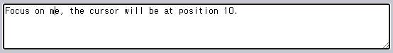
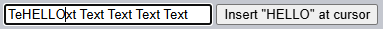

 `Selection` · `Range`
====

### [`Range`](https://dom.spec.whatwg.org/#ranges) <sub>(객체)</sub>

#### 범위 경계점 <sub>(시작점 · 끝점)</sub>

##### offset 설정 <sub>(부모 DOM 노드 기준)</sub>
- 요소
  - 자식 노드 숫자
- 텍스트
  - 텍스트 내 위치

##### `Range` <sub>(객체)</sub> 생성 · 경계점 설정
```javascript
let range = new Range();
range.setStart(node, offset);
range.setEnd(node, offset);
```

#### 선택하기 <sub>(HTML 조각)</sub>
```html
<p id="p">Example: <i>italic</i> and <b>bold</b></p>
```


##### `Example: <i>italic</i>`


- `<p>` <sub>(요소)</sub> 내 첫 2개 자식 노드
  - `Example:` <sub>(텍스트 노드)</sub>
  - `<i>italic</i>` <sub>(요소)</sub>

```html
<p id="p">Example: <i>italic</i> and <b>bold</b></p>

<script>
  let range = new Range();

  // 범위 시작점 설정
  // - 1번째 자식 노드
  //   - "Example: "
  range.setStart(p, 0);

  // 범위 끝점 설정 (끝점 제외)
  // - 2번째 자식 노드
  //   - "<i>italic</i>"
  //   - " and " X (제외)
  range.setEnd(p, 2);

  // toString (메서드) 호출
  // - 내부 내용 반환 (태그 제거)
  range; // Example: italic

  // 문서 Selection 범위 적용
  document.getSelection().addRange(range);
</script>
```

#### 테스트 코드 <sub>(다양한 변수 적용 가능)</sub>
```html
<p id="p">Example: <i>italic</i> and <b>bold</b></p>

From <input id="start" type="number" value=1> – To <input id="end" type="number" value=4>
<button id="button">Click to select</button>

<script>
  button.onclick = () => {
    let range = new Range();
    range.setStart(p, start.value);
    range.setEnd(p, end.value);

    // 문서 Selection 범위 적용
    document.getSelection().removeAllRanges();
    document.getSelection().addRange(range);
  };
</script>
```


##### `<i>italic</i> and <b>bold</b>`


- `<p>` <sub>(요소)</sub> 내 미지막 3개 자식 노드
  - `<i>italic</i>` <sub>(요소)</sub>
  - `and` <sub>(텍스트 노드)</sub>
  - `<b>bold</b>` <sub>(요소)</sub>

##### offset 기준 <sub>(부모 DOM 노드)</sub>
- 상이 노드 설정 가능
  - 무관한 두 노드 사이 범위 설정
- 끝점 위치
  - 시작점 이전 설정 불가능

#### 텍스트 노드 부분선택 <sub>(텍스트 노드 기준 offset)</sub>

##### `ample: <i>italic</i> and <b>bol`


- `<p>` <sub>(요소)</sub> 1번째 자식 <sub>(텍스트)</sub> 노드 3번째 위치
- `<b>` <sub>(요소)</sub> 1번째 자식 <sub>(텍스트)</sub> 노드 3번째 위치
```html
<p id="p">Example: <i>italic</i> and <b>bold</b></p>

<script>
  let range = new Range();

  /* 범위 시작점 설정
   <p> (요소) 내 1번째 자식 (텍스트) 노드 내 3번째 글자
   - "Example: "
      012345678
        ^
   */
  range.setStart(p.firstChild, 2);

  /* 범위 끝점 설정 (끝점 제외)
   <b> (요소) 내 1번째 자식 (텍스트) 노드 내 3번째 글자
   - "bold"
      0123
        ^
         ^ X (제외)
   */
  range.setEnd(p.querySelector('b').firstChild, 3);

  range; // ample: italic and bol

  // 문서 Selection 범위 적용
  window.getSelection().addRange(range);
</script>
```

#### 프로퍼티


##### `start[Container·Offset]`
- 범위 시작점 노드 · offset
- `<p>` <sub>(요소)</sub> 1번째 자식 <sub>(텍스트)</sub> 노드 3번째 위치
    - `2`

##### `end[Container·Offset]`
- 범위 끝점 노드 · offset
- `<b>` <sub>(요소)</sub> 1번째 자식 <sub>(텍스트)</sub> 노드 3번째 위치
    - `3`

##### `collapsed` <sub>(`boolean`)</sub>
- 빈 범위 <sub>(시작점 · 끝점 동일)</sub> 여부
  - `false`

##### `commonAncestorContainer`
- 최근접 공통 조상 <sub>(범위 내 모든 노드 대상)</sub>
  - `<p>` <sub>(요소)</sub>

### 메서드

#### 시작점 · 끝점 설정

##### `set[Start·End](node, offset)`
- `node` 내 `offset` 위치

##### `set[Start·End]Before(node)`
- `node` 직전 위치

##### `set[Start·End]After(node)`
- `node` 직후 위치

#### 기타

##### `selectNode[Contents](node)`
- `node` 자체 · 내용 전체 범위 설정

##### `collapse(toStart)`
- 빈 범위 <sub>(시작점 · 끝점 동일 위치)</sub> 설정
- `toStart` <sub>(`boolean`)</sub>
  - 시작점 기준 여부

##### `cloneRange()`
- 범위 <sub>(시작점 · 끝점)</sub> 복제

#### 범위 내 내용 조작

##### `deleteContents()`
- 범위 내용 제거

##### `[extract·clone]Contents()`
- 범위 내용 제거 · 복제 후 반환
  - `DocumentFragment`

##### `insertNode(node)`
- 시작점 위치 `node` 삽입

##### `surroundContents(node)`
- 범위 내용 감싸기 <sub>(`node`)</sub>
- 온전한 <sub>(여닫는)</sub> 태그 쌍 필수 <sub>(범위 내 모든 요소)</sub>
   - ex\) `<i>abc` X

##### 메서드 테스트 코드
```html
Click buttons to run methods on the selection, "resetExample" to reset it.

<p id="p">Example: <i>italic</i> and <b>bold</b></p>
<p id="result"></p>

<script>
  let range = new Range();

  let methods = {
    deleteContents() {
      range.deleteContents()
    },

    extractContents() {
      let content = range.extractContents();
      result.innerHTML = "";
      result.append("extracted: ", content);
    },

    cloneContents() {
      let content = range.cloneContents();
      result.innerHTML = "";
      result.append("cloned: ", content);
    },

    insertNode() {
      let newNode = document.createElement('u');
      newNode.innerHTML = "NEW NODE";
      range.insertNode(newNode);
    },

    surroundContents() {
      let newNode = document.createElement('u');

      try {
        range.surroundContents(newNode);
      } catch(e) {
        e;
      }
    },

    resetExample() {
      p.innerHTML = `Example: <i>italic</i> and <b>bold</b>`;
      result.innerHTML = "";

      range.setStart(p.firstChild, 2);
      range.setEnd(p.querySelector('b').firstChild, 3);

      window.getSelection().removeAllRanges();
      window.getSelection().addRange(range);
    }
  };

  for (let method in methods) {
    document.write(`<div><button onclick="methods.${method}()">${method}</button></div>`);
  }

  methods.resetExample();
</script>
```


##### 메서드 목록
- [명세서](https://dom.spec.whatwg.org/#interface-range)
- [매뉴얼](https://developer.mozilla.org/en-US/docs/Web/API/Range)

### `Selection` <sub>(객체)</sub>

#### 문서 내 범위 <sub>(`Range` 객체)</sub> 선택

##### 객체 얻기
- `window.getSelection()`
- `document.getSelection()`

##### 범위 지원 개수
- 이론 <sub>([명세서](https://www.w3.org/TR/selection-api/))</sub>
  - 다수 <sub>(0개 이상)</sub> 범위 지원
- 실제
  - Firefox 만 다수 범위 지원
  - Firefox 외 단일 범위 지원

##### 범위 3개 선택 <sub>(Firefox)</sub>
- Ctrl <sub>(Cmd)</sub> + 클릭


##### 일부 메서드명 다수 범위 사용 암시
- 실제 단일 범위 지원 <sub>(Firefox 외)</sub>

### 프로퍼티

##### 시작점 · 끝점 <sub>(`Range` vs `Selection`)</sub>

||시작점|끝점|
|---|:---:|:---:|
|`Range`|`start`|`end`|
|`Selection`|`anchor`|`focus`|

#### 주요 프로퍼티

##### `[anchor·focus]Node`
- 선택 시작점 · 끝점 노드

##### `[anchor·focus]Offset`
- 선택 시작점 · 끝점 offset <sub>(`anchorNode` 내)</sub>

##### `isCollapsed`
- 빈 범위 선택 여부
- 선택 유무 여부

##### `rangeCount`
- 내부 범위 개수
- 보통 최대 `1` <sub>(Firefox 외)</sub>

<br />

 **역방향 <sub>(시작점 ← 끝점)</sub> 선택 가능**

##### 다양한 내용 선택 방법 有
- 마우스
- 핫키
- 탭 <sub>(모바일 디바이스)</sub>
- 기타 등등

##### 마우스 등
- 양방향 <sub>(시작점 ↔ 끝점)</sub> 선택 가능

##### 정방향
- 시작점 <sub>(`anchor`)</sub> → 끝점 <sub>(`focus`)</sub>
  - `"Example"` → `"italic"`


##### 역방향 <sub>(끝점 이후 시작점)</sub>
- 시작점 <sub>(`focus`)</sub> ← 끝점 <sub>(`anchor`)</sub>
  - `"Example"` ← `"italic"`


##### `Range` <sub>(객체)</sub>
- 항상 정방향 <sub>(역방향 불가능)</sub>
  - 시작점 <sub>(`start`)</sub> → 끝점 <sub>(`end`)</sub>

<br />

### 이벤트

##### `selectstart` <sub>(요소)</sub>
- 요소 선택 시작 시 발생
  - ex\) 마우스 버튼 누른 채 이동 시작
- 기본 동작 취소
  - 선택 시작 방지

##### `selectionchange` <sub>(`document` 객체 전용)</sub>
- 선택 변화 시 발생

#### `Selection` 추적 데모

##### 선택 변화 시 경계 동적 표시
```html
<p id="p">Select me: <i>italic</i> and <b>bold</b></p>
From <input id="from" disabled> – To <input id="to" disabled>

<script>
  document.onselectionchange = function() {
    let {anchorNode, anchorOffset, focusNode, focusOffset} = document.getSelection();

    from.value = `${anchorNode && anchorNode.data}:${anchorOffset}`;
    to.value = `${focusNode && focusNode.data}:${focusOffset}`;
  };
</script>
```

#### `Selection` <sub>(전체)</sub> 얻기 데모

##### 텍스트
`document.getSelection().toString()`

##### DOM 노드
1. 내부 범위 접근
   - 1번째 범위 <sub>(Firefox 외)</sub>
2. `cloneContents()` <sub>(메서드)</sub> 호출
```html
<p id="p">Select me: <i>italic</i> and <b>bold</b></p>
Cloned: <span id="cloned"></span>
<br>
As text: <span id="astext"></span>

<script>
  document.onselectionchange = function() {
    let selection = document.getSelection();

    cloned.innerHTML = astext.innerHTML = "";

    /* 범위 내 DOM 노드 복제 */

    // 단일 범위 (대다수 브라우저)
    // - getRangeAt(0)
    cloned.append(selection.getRangeAt(0).cloneContents());

    // 다수 범위 (Firefox)
    for (let i = 0; i < selection.rangeCount; i++) {
      cloned.append(selection.getRangeAt(i).cloneContents());
    }

    // Selection 텍스트
    astext.innerHTML += selection;
  };
</script>
```

### 메서드

#### 범위 <sub>(`Range` 객체)</sub> 추가 · 제거

##### `getRangeAt(i)`
- `i` 번째 범위 얻기
- 보통 `0` 만 사용 <sub>(Firefox 외)</sub>

##### `addRange(range)`
- 내부 범위 추가
- 보통 내부 범위 존재 시 호출 무시 <sub>(Firefox 외)</sub>

##### `removeRange(range)`
- 내부 범위 제거

##### `removeAllRanges()`
- 모든 내부 범위 제거

##### `empty()`
- `removeAllRanges` 별칭

#### 범위 직접 설정 <sub>(`Range` 객체 미사용)</sub>

##### `collapse(node, offset)`
- 기존 범위 → 빈 범위 <sub>(시작점 · 끝점 동일 위치)</sub> 교체
  - `node` 내 `offset` 위치

##### `setPosition(node, offset)`
- `collapse` 별칭

##### `collapseTo[Start·End]()`
- 빈 범위 <sub>(시작점 · 끝점 동일 위치)</sub> 설정
  - 시작점 · 끝점 기준

##### `extend(node, offset)`
- 끝점 <sub>(`focus`)</sub> 이동
  - `node` 내 `offset` 위치

##### `setBaseAndExtent(anchorNode, anchorOffset, focusNode, focusOffset)`
- 기존 범위 → 새 범위 교체
  - `anchor[Node·Offset]` <sub>(시작점)</sub>
  - `focus[Node·Offset]` <sub>(끝점)</sub>
- 새 범위 내용 선택 상태

##### `selectAllChildren(node)`
- `node` 내 모든 자식 요소 선택

##### `deleteFromDocument()`
- 선택 내용 제거

##### `containsNode(node, allowPartialContainment)`
- 내부 `node` 포함 여부 확인
- `allowPartialContainment` <sub>(`boolean`)</sub>
  - 부분적인 포함 여부
  - `false` <sub>(기본값)</sub>

##### 선택 범위 조작
- `Selection` <sub>(객체)</sub> 메서드 사용
  - `Range` <sub>(객체)</sub> 사용 불필요

##### `<p>` <sub>(요소)</sub> 문단 내 모든 내용 선택
- `Selection` <sub>(객체)</sub> 메서드 사용
```html
<p id="p">Select me: <i>italic</i> and <b>bold</b></p>

<script>
  // <p> (요소) 내 1번째 ~ 마지막 (모든) 자식 노드 선택
  document.getSelection().setBaseAndExtent(p, 0, p, p.childNodes.length);
</script>
```
- `Range` <sub>(객체)</sub> 사용 <sub>(동일 기능)</sub>
```html
<p id="p">Select me: <i>italic</i> and <b>bold</b></p>

<script>
  let range = new Range();

  // <p> (태그) 자체 전체 범위 설정
  range.selectNode(p);

  // <p> (태그) 내용 전체 범위 설정
  range.selectNodeContents(p);

  // 기존 선택 제거
  document.getSelection().removeAllRanges();

  document.getSelection().addRange(range);
</script>
```

<br />

 **새 선택 전 기존 선택 제거 필수**

##### 기존 범위
- 새 범위 설정 시 제거 필수
  - `removeAllRanges()`
- 미제거 시 보통 새 범위 무시 <sub>(Firefox 외)</sub>
- 범위 변경 메서드 <sub>(`setBaseAndExtent` 등)</sub>
  - 기존 범위 유무 무관

<br />

### 폼 요소 선택

##### 폼 요소 <sub>(`input` · `textarea` 등)</sub>
- [전용 선택 API](https://html.spec.whatwg.org/#textFieldSelection) 제공
  - `Selection` · `Range` <sub>(객체)</sub> X
- 입력값
  - 순수 텍스트 <sub>(선택 · 범위 객체 불필요)</sub>

#### 프로퍼티

##### `selection[Start·End]` <sub>(값 쓰기 가능)</sub>
- 시작점 · 끝점 위치

##### `selectionDirection` <sub>(방향)</sub>
- `'forward'` <sub>(정방향)</sub>
- `'backward'` <sub>(역방향)</sub>
- `'none'` <sub>(마우스 더블클릭 선택 등)</sub>

#### 이벤트

##### `select`
- 선택 시 발생

#### 메서드

##### `select()`
- 텍스트 폼 요소 내 전부 선택
  - `input`
  - `textarea`

##### `setSelectionRange(start, end, [direction])`
- 선택 변경
- `start`
  - 시작점
- `end`
  - 끝점
- `[direction]`
  - 방향

##### `setRangeText(replacement, [start], [end], [selectionMode])`
- 기존 범위 내용 <sub>(텍스트)</sub> → 새 내용 <sub>(텍스트)</sub> 교체
- `[start]` · `[end]`
  - 시작점 · 끝점 위치
  - 임의 선택 <sub>(기본값)</sub>
- `[selectionMode]` <sub>(교체 후 선택 설정)</sub>
  - `'select'`
    - 새 내용 <sub>(텍스트)</sub>
  - `'start'`
    - 새 내용 <sub>(텍스트)</sub> 직전 <sub>(빈 범위)</sub>
  - `'end'`
    - 새 내용 <sub>(텍스트)</sub> 직후 <sub>(빈 범위)</sub>
  - `'preserve'` <sub>(기본값)</sub>
     - 기존 선택 유지

### 예제

#### 선택 추적

##### `select` <sub>(이벤트)</sub> 사용
```html
<textarea id="area" style="width: 80%; height: 60px">
Selecting in this text updates values below.
</textarea>
<br>
From <input id="from" disabled> – To <input id="to" disabled>

<script>
  area.onselect = function() {
    from.value = area.selectionStart;
    to.value = area.selectionEnd;
  };
</script>
```


#### 참고

##### `select` <sub>(이벤트)</sub>
- 선택 시 발생
- 선택 제거 시 미발생

##### `selectionchange` <sub>(이벤트 · `document` 객체 전용)</sub>
- [폼 요소 내 선택 시 미발생](https://w3c.github.io/selection-api/#dfn-selectionchange)
  - `document` <sub>(객체)</sub> 선택 · 범위 X
  - 일부 브라우저 발생 허용 <sub>(사용 지양)</sub>

#### 커서 이동

##### `selection[Start·End]` <sub>(프로퍼티)</sub>
- 시작점 · 끝점 위치 설정
- 두 점 동일 위치 설정 <sub>(빈 범위 · 미선택)</sub>
  - 커서 이동
```html
<textarea id="area" style="width: 80%; height: 60px">
Focus on me, the cursor will be at position 10.
</textarea>

<script>
  area.onfocus = () => {

    // 지연시간 0 setTimeout (메서드)
    // - 브라우저 포커스 설정 후 실행
    setTimeout(() => {

      // 시작점 · 끝점 동일 값 설정
      // - 커서 이동 (미선택)
      area.selectionStart = area.selectionEnd = 10;
    });
  };
</script>
```



#### 선택 수정

##### `selection[Start·End]` <sub>(프로퍼티)</sub>
- 번거로운 사용법

##### `setRangeText` <sub>(메서드)</sub>
- 유용성 · 편리성 ↑
- 1번째 인수만 전달
  - 임의 선택 내용 교체 후 선택 제거
- 2 · 3번째 인수 전달
  - 시작점 · 끝점 위치 설정

##### 임의 선택 텍스트 감싸기 <sub>(`*…*`)</sub>
- 1번째 인수만 전달
```html
<input id="input" style="width: 200px" value="Select here and click the button">
<button id="button">Wrap selection in stars *…*</button>

<script>
  button.onclick = () => {

    // 미선택 상태 생략
    if (input.selectionStart == input.selectionEnd) {
      return;
    }

    let selected = input.value.slice(input.selectionStart, input.selectionEnd);
    input.setRangeText(`*${selected}*`);
  };
</script>
```


##### `"THIS"` 검색 · 교체 <sub>(감싸기)</sub> 후 새 텍스트 선택
- 2 · 3번째 인수 전달
```html
<input id="input" style="width: 200px" value="Replace THIS in text">
<button id="button">Replace THIS</button>

<script>
  button.onclick = () => {
    let pos = input.value.indexOf("THIS");

    if (0 <= pos) {
      input.setRangeText("*THIS*", pos, pos + 4, "select");

      // 화면 내 선택 상태 표시
      input.focus();
    }
  };
</script>
```


#### 커서 위치 삽입

##### `setRangeText` <sub>(메서드)</sub>
- 미선택 · 빈 범위 <sub>(시작점 · 끝점 동일 위치)</sub>
  - 새 내용 <sub>(텍스트)</sub> 삽입
  - 제거 동작 無

##### `"HELLO"` 추가 버튼
- 커서 위치 추가 후
  - 커서 위치 재설정 <sub>(`"HELLO"` 직후)</sub>
- 기존 선택 존재 시
  - 내부 내용 교체
```javascript
// 기존 선택 유무 여부 확인
selectionStart != selectionEnd
```
```html
<input id="input" style="width: 200px" value="Text Text Text Text Text">
<button id="button">Insert "HELLO" at cursor</button>

<script>
  button.onclick = () => {
    input.setRangeText(
      "HELLO",
      input.selectionStart,
      input.selectionEnd,
      "end");
    input.focus();
  };
</script>
```





### 선택 불가능 설정 <sub>(3가지 방법)</sub>

##### 1. `user-select: none` <sub>(CSS)</sub>
- 해당 요소 선택 시작 방지
- 타 요소 선택 시작 시 해당 요소 포함 가능
  - `document.getSelection()` 내 포함
    - 선택 상태
    - 보통 내용 복사 · 붙여넣기 무시
```html
<style>
  #elem {
    user-select: none;
  }
</style>

<div>Selectable <div id="elem">Unselectable</div> Selectable</div>
```

##### 2. 기본 동작 취소 <sub>(`selectstart` · `mousedown` 이벤트)</sub>
- 해당 요소 선택 시작 방지
- 타 요소 선택 시작 시 해당 요소 포함 가능
- 선택 유발 이벤트 핸들러 다수 설정 시 유용
  - ex\) `mousedown` <sub>(이벤트)</sub> 등
- 선택 비활성화 <sub>(충돌 방지)</sub>
  - 내용 복사 가능
```html
<div>Selectable <div id="elem">Unselectable</div> Selectable</div>

<script>
  elem.onselectstart = () => false;
</script>
```

##### 3. 선택 시 즉시 제거 <sub>(사용 빈도 ↓)</sub>
- 까빡임 발생 <sub>(부작용)</sub>
```javascript
document.getSelection().empty();
```

##### 참고
- [`Range` DOM 명세](https://dom.spec.whatwg.org/#ranges)
- [`Selection` API](https://www.w3.org/TR/selection-api/#dom-globaleventhandlers-onselectstart)
- [텍스트 폼 요소 선택 API](https://html.spec.whatwg.org/multipage/form-control-infrastructure.html#textFieldSelection) <sub>(HTML 명세)</sub>

<br />

요약
====

#### 선택 API

##### 1. 문서
- `Range` <sub>(객체)</sub>
- `Selection` <sub>(객체)</sub>

##### 2. 폼 요소 <sub>(`input` · `textarea` 등)</sub>
- 추가 메서드 · 프로퍼티
  - 단순한 사용법 <sub>(순수 텍스트 처리)</sub>

#### 주요 용도

##### 1. 선택 접근
```javascript
let selection = document.getSelection();

let cloned = /* 선택 내용 복제 */;

/* 범위 내 DOM 노드 복제 */

// 단일 범위 (대다수 브라우저)
// - getRangeAt(0)
cloned.append(selection.getRangeAt(0).cloneContents());

// 다수 범위 (Firefox)
for (let i = 0; i < selection.rangeCount; i++) {
  cloned.append(selection.getRangeAt(i).cloneContents());
}
```

##### 2. 선택 설정
```javascript
let selection = document.getSelection();

// 범위 직접 설정
selection.setBaseAndExtent(…, from, to, …);

// 범위 생성 후 전달
selection.removeAllRanges();
selection.addRange(range);
```

##### 편집 가능 요소 <sub>(`<textarea>` 등)</sub> 내 커서 위치
- 항상 시작점 · 끝점 동일 위치
  - 커서 위치 얻기
  - 커서 이동 <sub>(`selection[Start·End]` 사용)</sub>
