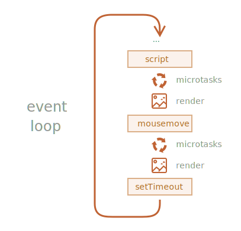

이벤트 루프 · 매크로 · 마이크로태스크
====

##### JS 실행 흐름 <sub>(브라우저 · Node.js)</sub>
- 이벤트 루프 기반

### 이벤트 루프

##### JS 내 태스크 루프
1. 태스크 진입 대기 <sub>(idle 상태)</sub>
2. 태스크 진입 시 처리
3. 처리 태스크 無 → ① 번

##### JS 엔진 알고리즘 일반화
1. 처리 태스크 有
   - 선진입 태스크부터 순차적 처리
2. 처리 태스크 無
   - idle 상태
   - 새 태스크 추가 → ① 번

##### JS 엔진 특징
- 대다수 시간 idle 상태
- 스크립트 · 핸들러 · 이벤트 활성화 시 동작

##### JS 엔진 활성화 태스크 종류
- 외부 스크립트 <sub>(`<script src="…">`)</sub> 로드 시
  - 해당 스크립트 실행
- 사용자 마우스 이동 시
  - `mousemove` 이벤트 발생 · 핸들러 실행
- `setTimeout` <sub>(메서드)</sub> 설정 시간 도달 시
  - 콜백 실행
- 기타 등등

##### JS 엔진
- 태스크 집합 순차 처리
- 새 태스크 추가 대기
  - CPU 자원 소비 X <sub>(idle 상태)</sub>

##### 매크로태스크 큐 <sub>(V8 용어)</sub>
- 엔진 바쁠 때 새 태스크 추가 시 큐 내 추가


##### 엔진 `script` 바쁘게 처리 중
1. 사용자 마우스 이동 <sub>(`mousemove` 이벤트 발생)</sub>
   - 큐 내 태스크 추가 <sub>(2번째)</sub>
2. `setTimeout` <sub>(메서드)</sub> 설정 시간 도달
   - 큐 내 태스크 추가 <sub>(3번째)</sub>

##### 큐 내 태스크 순차적 <sub>(추가 순서)</sub> 처리
1. `script`
2. `mousemove` <sub>(이벤트)</sub> · 핸들러
3. `setTimeout` <sub>(메서드)</sub> 핸들러

#### 엔진 태스크 처리 중 렌더링 발생 X

##### 1. 태스크 처리 소모 시간 ↓
- 처리 완료 직후 DOM 변경 화면 반영

##### 2. 태스크 처리 소모 시간 ↑
- 새 추가 태스크 처리 X <sub>(대기)</sub>
  - ex\) 기존 태스크 처리 중 이벤트 발생 등
- 복잡한 계산 수행 · 무한 루프 <sub>(프로그래밍 에러)</sub>
  - '응답 없는 페이지' 경고 창 표시
    - 페이지 전체 · 태스크 취소 유도

### 사용 사례 1 <sub>(CPU 소모 큰 태스크 쪼개기)</sub>

#### 코드 강조 기능

##### 필요 작업
- 강조 필요 위치 분석
- 색 변경 요소 생성 · 추가
- 기타 등등

##### 코드 강조 태스크 수행 중 <sub>(엔진 바빠짐)</sub>
- 새 태스크 처리 중단 <sub>(지연 · 멈춤 현상 발생)</sub>
  - 사용자 이벤트 처리
  - DOM 관련 작업
  - 기타 등등

##### 무거운 태스크 → 다수 조각 쪼개기 <sub>(지연 발생 예방)</sub>
- 지연시간 0 `setTimeout` <sub>(메서드)</sub>
  - 100줄 씩 순차 실행

#### 숫자 <sub>(1 ~ 1000000000)</sub> 카운트

##### 태스크 쪼개기 전
- 코드 실행 시 엔진 중단 <sub>(몇 초간)</sub>
  - 코드 실행 후 마우스 우클릭 시 지연 발생
- 숫자 카운팅 종료 후 ~ 경고 창 출력 전
  - 모든 사용자 이벤트 처리 X <sub>(대기)</sub>
- 저사양 기기 경고 표시 가능 <sub>(브라우저)</sub>
  - 'the script takes too long'
```javascript
let i = 0;
let start = Date.now();

function count() {

  // CPU 소모 큰 무거운 작업
  for (let j = 0; j < 1e9; j++) {
    i++;
  }

  "처리에 걸린 시간: " + (Date.now() - start) + "ms";
}

count();
```

##### 태스크 쪼개기 <sub>(작은 시차 有)</sub>
- 중첩 `setTimeout` <sub>(메서드)</sub> 사용
- 코드 실행 중 타 기능 정상 수행 <sub>(브라우저)</sub>
```javascript
let i = 0;
let start = Date.now();

function count() {

  // 태스크 쪼개서 일부 처리
  do {
    i++;
  } while (i % 1e6 != 0);

  if (i == 1e9) {
    "처리에 걸린 시간: " + (Date.now() - start) + "ms";
  } else {

    // 태스크 미완료 시 재스케줄링
    setTimeout(count);
  }
}

count();
```
1. 1번째 카운팅
   - `i = 1 … 1000000`
2. 2번째 카운팅
   - `i = 1000001 … 2000000`
3. …
4. n번째 카운팅 <sub>(마지막)</sub>
   - `i = 999000001 … 1000000000`

##### 1번째 카운팅 중 새 태스크 발생 시 큐 내 추가 · 처리 대기
- 해당 태스크 처리 시점
  - 1번째 카운팅 완료 후
  - 2번째 카운팅 시작 전

##### 부분 카운팅 실행 도중 '환기' <sub>(이벤트 루프 실행)</sub>
- 무거운 태스크 · 사용자 이벤트 모두 정상 처리

##### 개선된 태스크 쪼개기 <sub>(시차 단축)</sub>
- `setTimeout`<sub>(메서드)</sub> 앞부분 이동
- 코드 실행 후 카운트 미완료 시
  - 부분 카운팅 시작 전 재스케줄링
```javascript
let i = 0;
let start = Date.now();

function count() {

  // 스케줄링 코드 앞부분 이동
  if (i < 1e9 - 1e6) {

    // 재스케줄링
    setTimeout(count);
  }

  do {
    i++;
  } while (i % 1e6 != 0);

  if (i == 1e9) {
    "처리에 걸린 시간: " + (Date.now() - start) + "ms";
  }
}

count();
```

##### 지연시간 0 `setTimeout` <sub>(메서드)</sub> 최소 지연시간 제약
- 5번째 중첩 `setTimeout` <sub>(메서드)</sub> 이후
  - 최소 지연시간 제약 적용 <sub>(브라우저)</sub>
    - 코드상 지연시간
      - 0ms
    - 실제 지연시간
      - 4ms 이상
- 카운팅 전 스케줄링 실행
  - 카운팅 중 최소 지연시간 소모
    - 시차 단축

### 사용 사례 2 <sub>(진행 막대)</sub>

##### 브라우저 렌더링 동작 방식
- 현재 작업 중인 태스크 종료 후 <sub>(작업 시간 무관)</sub>
  - DOM 변경분 렌더링 실행
- '중간' 상태 <sub>(미완성)</sub> 화면 노출 방지

##### 반복문 카운트 변수 <sub>(`i`)</sub> 화면 렌더링
- 함수 실행 도중 화면 변화 無
  - 마지막 상태 <sub>(`1000000`)</sub> 만 출력
```html
<div id="progress"></div>

<script>
  function count() {
    for (let i = 0; i < 1e6; i++) {
      i++;
      progress.innerHTML = i;
    }
  }

  count();
</script>
```

##### 표시자 <sub>(작업 진척 상태 표시)</sub>
- 태스크 쪼개기 <sub>(`setTimeout` 메서드)</sub>
  - 하위 태스크 처리 도중 상태 변화 표시
```html
<div id="progress"></div>

<script>
  let i = 0;

  function count() {

    // 태스크 쪼개서 일부 처리
    do {
      i++;
      progress.innerHTML = i;
    } while (i % 1e3 != 0);

    if (i < 1e7) {
      setTimeout(count);
    }
  }

  count();
</script>
```

### 사용 사례 3 <sub>(이벤트 처리 종료 후 작업)</sub>

##### 특정 동작 지연 <sub>(모든 핸들러 처리 대기)</sub>
- 지연시간 0 `setTimeout` <sub>(메서드)</sub> 이용
```javascript
menu.onclick = function() {
  …

  // 커스텀 이벤트 생성
  // - 클릭 메뉴 내 항목 정보 보유
  let customEvent = new CustomEvent("menu-open", {
    bubbles: true
  });

  // 비동기 디스패칭 (커스텀 이벤트)
  // - 마지막 처리
  setTimeout(() => menu.dispatchEvent(customEvent));
};
```

### 매크로태스크 · 마이크로태스크

##### 태스크 종류 <sub>(2가지)</sub>
- 매크로태스크 <sub>(macrotask)</sub>
- 마이크로태스크 <sub>(microtask)</sub>

##### 마이크로태스크 <sub>(코드로만 생성 가능)</sub>
- `Promise` <sub>(객체 · 주요 생성 코드)</sub>
  - 핸들러 == 마이크로태스크
    - `then(…)`
    - `catch(…)`
    - `finally(…)`
- `await` <sub>(`Promise` 객체 처리 문법)</sub>
- `queueMicrotask(func)` <sub>(표준 API)</sub>
  - 큐 내 `func` <sub>(함수)</sub> 추가

#### 마이크로태스크 큐 처리 순서 <sub>(JS 엔진)</sub>

##### 매크로태스크 1개 처리 직후 <sub>(다음 매크로태스크 · 렌더링 전)</sub>
1. 매크로태스크 1개 처리
2. 마이크로태스크 큐 내 태스크 전부 처리
3. 렌더링 실행
4. 다음 매크로태스크 1개 처리
5. 마이크로태스크 큐 내 태스크 전부 처리
6. 렌더링 실행
5. …
```javascript
setTimeout(() => "timeout");

Promise.resolve()
  .then(() => "promise");

"code";
```

#### 경고 창 출력 순서

##### 1. `"code"`
- 일반적인 동기 호출
  - 가장 먼저 매크로태스크 큐 진입

##### 2. `"promise"`
- `then` 핸들러
  - 마이크로태스크 큐 진입
  - 현재 코드 <sub>(`"code"`)</sub> 후 실행

##### 3. `"timeout"`
- `setTimeout` <sub>(메서드)</sub> 내 콜백 실행
  - 매크로태스크 큐 2번째 진입

#### 처리 순서 정리

##### 매크로태스크 처리 순서


1. `script`
2. `mousemove` <sub>(이벤트)</sub> · 핸들러
3. `setTimeout` <sub>(메서드)</sub> 핸들러

##### 매크로 · 마이크로태스크 처리 순서



1. `script`
2. 마이크로태스크 큐
3. 렌더링
4. `mousemove` <sub>(이벤트)</sub> · 핸들러
5. 마이크로태스크 큐
6. 렌더링
7. `setTimeout` <sub>(메서드)</sub> 핸들러
8. 마이크로태스크 큐
9. 렌더링
10. …

##### 마이크로태스크 처리 시점
- 렌더링 실행 전
- 다음 매크로태스크 1개 실행 전

##### 모든 마이크로태스크 동일 환경 내 처리 <sub>(처리 순서 덕분)</sub>
- 앱 환경 변화 작업 영향 無
  - 마우스 좌표 변경
  - 네트워크 통신 의한 데이터 변경
  - 기타 등등

#### `queueMicrotask` <sub>(함수)</sub>

##### 커스텀 함수 스케줄링 <sub>(비동기 실행)</sub>
- 현재 코드 실행 종료 후
- 새 이벤트 핸들러 처리 전
- 렌더링 실행 전

##### 진행 막대 <sub>(사용 사례 2)</sub>
- `queueMicrotask` <sub>(함수)</sub> 사용 <sub>(`setTimeout` X)</sub>
  - 코드 재스케줄링
  - 카운팅 종료 시 숫자 렌더링 <sub>(≒ 동기 코드)</sub>
```html
<div id="progress"></div>

<script>
  let i = 0;

  function count() {

    do {
      i++;
      progress.innerHTML = i;
    } while (i % 1e3 != 0);

    if (i < 1e6) {
   // setTimeout(count);
      queueMicrotask(count);
    }
  }

  count();
</script>
```

<br />

요약
====

##### [이벤트 루프 알고리즘](https://html.spec.whatwg.org/multipage/webappapis.html#event-loop-processing-model) 요약
1. 매크로태스크 큐
   - 가장 오래된 태스크 1개 실행
2. 마이크로태스크 큐
   - 모든 태스크 실행
   - 오래된 순서대로 처리
3. 렌더링
   - 필요 시 처리
4. 매크로태스크 큐
   - 비어있으면 새 태스크 추가 대기
5. → ① 번

### 태스크 스케줄링

#### 매크로태스크

##### 방법
- 지연시간 0 `setTimeout` <sub>(메서드)</sub>

##### 특징
- 복잡한 큰 태스크 1개 쪼개기
  - 다수 작은 하위 태크스
- 하위 태스크 처리 도중
  - 사용자 이벤트 처리
  - 작업 진척 상태 화면 표시
  - 기타 등등
- 특정 작업 지연 스케줄링
  - 이벤트 완전 처리 <sub>(버블링 종료)</sub> 후

#### 마이크로태스크

##### 방법
- `Promise` <sub>(객체)</sub> 핸들러 <sub>(`await` 포함)</sub>
- `queueMicrotask(f)` <sub>(함수)</sub>

##### 특징
- UI 변화 <sub>(렌더링)</sub> · 네트워크 이벤트 처리 등
  - 모든 마이크로태스크 처리
    - 도중 미발생 · 직후 발생
- 함수 비동기 처리 <sub>(`queueMicrotask` 함수)</sub>
  - 앱 상태 일관성 보장
    - 처리 순서 덕분

<br />

 **웹 워커**

##### [웹 워커](https://html.spec.whatwg.org/multipage/workers.html)
- 무거운 연산 <sub>(이벤트 루프 중단 가능)</sub> 처리 가능
- 코드 병렬 실행
  - 별도 백그라운드 스레드
- 메인 스레드 메시지 교환 가능
- 고유 변수 · 자체 이벤트 루프 보유
  - 메인 스레드 무관
- 주 용도 <sub>(DOM 접근 불가능)</sub>
  - 다수 CPU 코어 동시 사용 연산

<br />

[참조글](https://dev.to/lydiahallie/javascript-visualized-event-loop-3dif)


<br />

##  과제

### 실행 순서

##### 코드 출력 결과 예측
```javascript
1;
setTimeout(() => 2);
Promise.resolve().then(() => 3);
Promise.resolve().then(() => setTimeout(() => 4));
Promise.resolve().then(() => 5);
setTimeout(() => 6);
7;
```

<br />


##### `1735264`
```javascript
/* 즉시 실행
 매크로태스크 큐
 -
 마이크로태스크 큐
 -
 */
1;

/* 매크로태스크 추가
 매크로태스크 큐
 - 2
 마이크로태스크 큐
 -
 */
setTimeout(() => 2);

/* 마이크로태스크 추가
 매크로태스크 큐
 - 2
 마이크로태스크 큐
 - 3
 */
Promise.resolve().then(() => 3);

/* 마이크로태스크 추가
 매크로태스크 큐
 - 2
 마이크로태스크 큐
 - 3
 - setTimeout(() => 4)
 */
Promise.resolve().then(() => setTimeout(() => 4));

/* 마이크로태스크 추가
 매크로태스크 큐
 - 2
 마이크로태스크 큐
 - 3
 - setTimeout(() => 4)
 - 5
 */
Promise.resolve().then(() => 5);

/* 매크로태스크 추가
 매크로태스크 큐
 - 2
 - 6
 마이크로태스크 큐
 - 3
 - setTimeout(() => 4)
 - 5
 */
setTimeout(() => 6);

/* 즉시 실행
 매크로태스크 큐
 -
 마이크로태스크 큐
 -
 */
7;

/* 실행 ①
 매크로태스크 큐
 - [ ] 2
 - [ ] 6
 - [ ] 4 <──────────────┐
 마이크로태스크 큐         │
 - [①] 3                │
 - [②] setTimeout(() => 4)
 - [③] 5
 */

/* 실행 ②
 매크로태스크 큐
 - [④] 2
 - [⑤] 6
 - [⑥] 4
 마이크로태스크 큐
 - [①] 3
 - [②] setTimeout(() => 4)
 - [③] 5
 */
```

#### 순서

##### 1. 일반 코드 즉시 실행 <sub>(큐 사용 X)</sub>
1. `1` 실행
   - `1`
2. `7` 실행
   - `7`

##### 2. 마이크로태스크 큐 <sub>(주요 코드 흐름 종료 후)</sub>
1. `3` 실행
   - `3`
2. `setTimeout(() => 4)` 실행
   - 매크로태스크 큐 순서
     1. `2`
     2. `6`
     3. `4`
3. `5` 실행
   - `5`

##### 3. 매크로태스크 큐 <sub>(마이크로태스크 큐 처리 후)</sub>
1. `2` 실행
   - `2`
2. `6` 실행
   - `6`
3. `4` 실행
   - `4`
