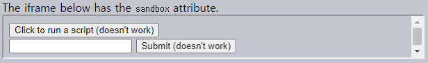
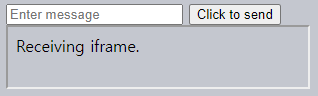

창 사이 상호작용
====

##### 동일 오리진 정책
- 각 창 · 프레임 접근 방지
  - 사용자 보호 목적 <sub>(정보 절도 등)</sub>

### 동일 오리진

##### 주소 상 특정 구성 동일
- 프로토콜
- 도메인
- 포트

##### 동일 오리진 url 예시
- `http://site.com`
- `http://site.com/`
- `http://site.com/my/page.html`

##### 상이 오리진 url 예시 <sub>(`http://site.com`)</sub>
- `http://www.site.com`
  - `www.` <sub>(도메인)</sub> 상이
- `http://site.org`
  - `.org` <sub>(도메인)</sub> 상이
- `https://site.com`
  - `https` <sub>(프로토콜)</sub> 상이
- `http://site.com:8080`
  - `8080` <sub>(포트)</sub> 상이

#### 동일 오리진 정책

##### `window` <sub>(창 객체)</sub> 참조 접근 가능 여부
- `window.open` 호출 결과
- `<iframe>` <sub>(요소)</sub> 내부
- 기타 등등

##### 동일 오리진
- 모든 접근 가능

##### 상이 오리진
- 내부 내용 접근 X
  - 변수
  - 문서
  - 기타 등등
- 유일한 접근 예외
  - `location` <sub>(프로퍼티)</sub>
    - 수정 가능 <sub>(리다이렉팅)</sub>
    - 읽기 X

#### `iframe`
- `<iframe>` <sub>(태그)</sub>
  - 별도 삽입 창
- 고유 JS 환경 보유
  - `window` <sub>(전역 객체)</sub>
  - `document` <sub>(객체)</sub>

#### 접근 프로퍼티

##### `contentWindow`
- `iframe` 내 `window` <sub>(전역 객체)</sub>

##### `contentDocument`
- `iframe` 내 `document` <sub>(객체)</sub>
- `contentWindow.document` 축약형

##### 삽입 창 접근 시 오리진 확인 <sub>(브라우저)</sub>
- 동일
  - 자유롭게 접근
- 상이
  - 접근 불가능 <sub>(`location` 제외)</sub>

##### 상이 오리진 `iframe` 읽기 · 쓰기
```html
<iframe src="https://example.com" id="iframe"></iframe>

<script>
  iframe.onload = function() {

    // iframe 내 window (전역 객체) 참조 얻기
    // - 정상 동작
    let iframeWindow = iframe.contentWindow;
    try {

      // iframe 내 document (객체) 참조 얻기
      // - 에러 발생
      let doc = iframe.contentDocument;
    } catch(e) {
      e; // Security Error
    }

    try {
      // iframe 내 페이지 url 얻기
      // - 에러 발생
      let href = iframe.contentWindow.location.href;
    } catch(e) {
      e; // Security Error
    }

    // iframe 내 페이지 주소 (location 프로퍼티) 값 수정
    // - 해당 url 내용 로드
    //   - 정상 동작
    iframe.contentWindow.location = '/';

    // 핸들러 제거
    // - 페이지 이동 (location 프로퍼티 값 수정) 후 실행 방지
    iframe.onload = null;
  };
</script>
```

##### 상이 오리진 창 접근 예외 <sub>(2가지)</sub>
1. 창 내 `window` <sub>(전역 객체)</sub> 참조 얻기
    - `iframe.contentWindow`
2. `window.location` <sub>(주소 프로퍼티)</sub> 값 수정
    - 리다이렉팅

<br />

 **`onload` vs `contentWindow.onload`**

##### 본질 동일
- `iframe.onload`
  - `<iframe>` <sub>(요소)</sub>
- `iframe.contentWindow.onload`
  - 삽입 창 객체

##### 발생 시점
- 삽입 창 <sub>(모든 자원 포함)</sub> 로드 완료

##### 차이
- `iframe.onload`
  - 상이 오리진 접근 가능
- `iframe.contentWindow.onload`
  - 상이 오리진 접근 불가능

<br />

### 서브도메인 창 <sub>(`document.domain`)</sub>

##### 도메인 다른 두 url
- 상이 오리진

##### 공통 서브도메인 공유
- 전체 도메인 차이 무시 가능 <sub>(동일 오리진 취급)</sub>
  - 창 사이 상호작용 목적
- ex\) `site.com`
  - `john.site.com`
  - `peter.site.com`

##### 양측 창 특정 코드 실행 필요
- 코드 실행 후 제한 없이 상호작용 가능
```javascript
document.domain = 'site.com';
```

### `iframe` 내 `document` 함정

##### `iframe` <sub>(동일 오리진)</sub> 내 `document` 접근 시 주의
- 크로스 오리진 무관
- `iframe` <sub>(요소)</sub> 생성 후 즉시 `document` 보유
  - 로드 완료 후의 `document` 와 상이

##### `document` <sub>(생성 직후)</sub>  ≠ `document` <sub>(로드 완료 후)</sub>
- 생성 직후 `document` 관련 작업 시 비정상 동작
  - ex\) 설정한 이벤트 핸들러 미작동 등
```html
<iframe src="/" id="iframe"></iframe>

<script>
  let oldDoc = iframe.contentDocument;

  iframe.onload = function() {
    let newDoc = iframe.contentDocument;

    // 두 document 상이
    oldDoc == newDoc; // false
  };
</script>
```

##### 실제 `document`
- `iframe.onload` 발생 시 접근 가능
  - 모든 자원 로드 완료 이후 <sub>(대기시간 ↑)</sub>

##### `setInterval` <sub>(메서드)</sub> 내 확인
- `iframe.onload` 보다 빨리 접근 가능
```html
<iframe src="/" id="iframe"></iframe>

<script>
  let oldDoc = iframe.contentDocument;

  // 매 100ms 마다 확인
  let timer = setInterval(() => {
    let newDoc = iframe.contentDocument;
    if (newDoc == oldDoc) {
      return;
    }

    "New document is here!";

    clearInterval(timer);
  }, 100);
</script>
```

### `window.frames` <sub>(컬렉션)</sub>
- `iframe` 내 `window` <sub>(창 객체)</sub> 그룹

##### 접근 방법
- 인덱스
  - `window.frames[0]`
- 이름 <sub>(`name` 속성값)</sub>
  - `window.frames.iframeName`
```html
<iframe src="/" style="height: 80px" name="win" id="iframe"></iframe>

<script>
  // true
  iframe.contentWindow == frames[0];

  // true
  iframe.contentWindow == frames.win;
</script>
```

##### 중첩 `iframe`
- `window` <sub>(창 객체)</sub> 계층 형성

##### 중첩 관련 프로퍼티 <sub>(`window` 객체)</sub>
- `frames` <sub>(중첩 `iframe`)</sub>
  - 자식 `window` <sub>(창 객체)</sub> 컬렉션
- `parent`
  - 부모 <sub>(외부)</sub> `window` <sub>(창 객체)</sub> 참조
- `top`
  - 최상위 부모 `window` <sub>(창 객체)</sub> 참조
```javascript
// true
window.frames[0].parent === window;
```

##### 현재 `document` 위치 확인 <sub>(`iframe` 내 위치 여부)</sub>
- `top` <sub>(프로퍼티)</sub> 확인
```javascript
if (window == top) {
  'The script is in the topmost window, not in a frame';
} else {
  'The script runs in a frame!';
}
```

### `sandbox` <sub>(`iframe` 속성)</sub>

##### `iframe` 내 특정 동작 실행 방지
- 신뢰할 수 없는 코드 실행 방지
- `iframe` 샌드박스화
  - 상이 오리진 취급
  - 다수 제한 적용

##### `sandbox` <sub>(속성)</sub> 적용
- 빈 속성값 <sub>(기본값 · 가장 엄격한 제한 적용)</sub>
  - 상이 오리진 정책 <sub>(상이 오리진 취급)</sub>
    - `src` <sub>(속성)</sub> 내 동일 오리진 무시
    - 암시적인 내부 스크립트 제한
  - 기타 등등
- 제한 완화
  - 완화 목록 <sub>(문자열 · 공백 구분)</sub> 할당
```html
<iframe sandbox="allow-forms allow-popups">…</iframe>
<iframe sandbox>…</iframe>
```

#### 제한사항 목록 <sub>([매뉴얼](https://developer.mozilla.org/en-US/docs/Web/HTML/Element/iframe))</sub>

##### `allow-same-origin`
- 동일 오리진 정책 허용
  - 크로스 오리진 상호작용 가능

##### `allow-top-navigation`
- `parent.location` 값 수정 허용

##### `allow-forms`
- `iframe` 내 폼 제출 허용

##### `allow-scripts`
- `iframe` 내 스크립트 실행 허용

##### `allow-popups`
- `iframe` 내 `window.open` 실행 허용

##### `sandbox` <sub>(속성)</sub> 기본값 <sub>(빈 속성값)</sub> 적용 <sub>(기본 제한)</sub>
- `iframe` 내 JS 코드 · 폼 미작동
```html
<iframe sandbox src="…">
```

##### 결과



```html
<!-- index.html -->
<!doctype html>
<html>

<head>
  <meta charset="UTF-8">
</head>

<body>
  <div>The iframe below has the <code>sandbox</code> attribute.</div>
  <iframe sandbox src="sandboxed.html" style="height: 60px; width: 90%"></iframe>
</body>

</html>
```
```html
<!-- sandboxed.html -->
<!doctype html>
<html>

<head>
  <meta charset="UTF-8">
</head>

<body>
  <button onclick="alert(123)">Click to run a script (doesn't work)</button>

  <form action="http://google.com">
    <input type="text">
    <input type="submit" value="Submit (doesn't work)">
  </form>
</body>

</html>
```

<br />

 **주의**

##### `sandbox` <sub>(속성)</sub> 목적
- 제한 추가 <sub>(완화 X)</sub>
  - ex\) 상리 오리진 `iframe`
    - 동일 오리진 제한 완화 X

<br />

### 창 사이 메시지 전달

##### `postMessage` 인터페이스
- 창 사이 메시지 전달 담당
- 오리진 무관 <sub>(동일 오리진 정책 미적용)</sub>
  - ex\) `a.com` ↔ `b.com`

##### 양측 특정 상응 JS 함수 호출 동의 · 실제 호출 필요
- 사용자 안전 보장

#### [`postMessage`](https://developer.mozilla.org/en-US/docs/Web/API/Window/postMessage) <sub>(메서드)</sub>

##### 메시지 전달
- 메시제 수신 `window` <sub>(창 객체)</sub>
  - `postMessage` <sub>(메서드)</sub> 호출
```javascript
newWin.postMessage(data, targetOrigin);
```

##### `data` <sub>(1번째 인수)</sub>
- 전송 데이터
  - 모든 객체 가능
- 깊은 복제 <sub>(_"structured cloning algorithm"_)</sub>
- IE <sub>(예외)</sub>
  - 문자열만 가능
    - `JSON.stringify` 필요

##### `targetOrigin` <sub>(2번째 인수 · 문자열)</sub>
- 메시지 수신 창 오리진
  - 오리진 제한 기능 <sub>(안전 보장 목적)</sub>
- 상이 오리진 `window` <sub>(창 객체)</sub>
  - `location` <sub>(주소 프로퍼티)</sub> 읽기 X
    - 불러올 사이트 확인 X
    - 사용자 떠날 가능성 有
- 데이터 수신 가능 사이트 한정
  - 민감한 데이터 송 · 수신 시 중요

##### `win` <sub>(메시지 수신 `window` 창 객체)</sub>
- 오리진 확인 후 조건 부합 시 데이터 수신
  - ex\) `"http://example.com"`
```html
<iframe src="http://example.com" name="example">

<script>
  let win = window.frames.example;

  win.postMessage("message", "http://example.com");
</script>
```
- 오리진 미확인 <sub>(항상 데이터 수신)</sub>
  - `"*"`
```html
<iframe src="http://example.com" name="example">

<script>
  let win = window.frames.example;

  win.postMessage("message", "*");
</script>
```

#### `onmessage` <sub>(이벤트 핸들러)</sub>

##### 메시지 수신
- 메시지 수신 창
  - `message` <sub>(이벤트)</sub> 핸들러 설정

##### `message` <sub>(이벤트)</sub> 발생 시점
- `postMessage` <sub>(메서드)</sub> 호출 후
  - `targetOrigin` 확인 성공

#### 이벤트 객체 특수 프로퍼티

##### `data`
- 전송 <sub>(`postMessage`)</sub> 데이터

##### `origin`
- 메시지 전달 창 오리진
  - ex\) `"http://javascript.info"`

##### `source`
- 메시지 전달 `window` <sub>(창 객체)</sub> 참조
- `source.postMessage(…)`
  - 메시지 전달 창에 메시지 보내기

##### 이벤트 핸들러 설정
- `addEventListener` <sub>(메서드)</sub> 사용
- `window.onmessage` X
```javascript
window.addEventListener("message", function(event) {

  // 특정 도메인 외 무시
  if (event.origin != 'http://javascript.info') {
    return;
  }

  "received: " + event.data;

  // 메시제 전달 창에 응답 메시지 보내기
  // event.source.postMessage(…);
});
```

##### 결과



```html
<!-- index.html -->
<!doctype html>
<html>

<head>
  <meta charset="UTF-8">
</head>

<body>
  <form id="form">
    <input type="text" placeholder="Enter message" name="message">
    <input type="submit" value="Click to send">
  </form>

  <iframe
    src="iframe.html"
    id="iframe"
    style="display: block; height: 60px">
  </iframe>

  <script>
    form.onsubmit = function() {
      iframe.contentWindow.postMessage(this.message.value, '*');
      return false;
    };
  </script>
</body>

</html>
```
```html
<!-- iframe.html -->
<!doctype html>
<html>

<head>
  <meta charset="UTF-8">
</head>

<body>
  Receiving iframe.
  <script>
    window.addEventListener('message', function(event) {
      `Received ${event.data} from ${event.origin}`;
    });
  </script>
</body>

</html>
```

<br />

요약
====

##### 타 창 메서드 호출 · 내용 접근
- 타 `window` <sub>(창 객체)</sub> 참조 필요

#### 팝업 창 `window` <sub>(창 객체)</sub> 참조

##### `window.open` <sub>(메서드)</sub>
- 새 팝업 창 `window` <sub>(창 객체)</sub> 생성 후 참조 반환

##### `window.opener` <sub>(프로퍼티)</sub>
- 팝업 생성 창 `window` <sub>(창 객체)</sub> 참조

#### `iframe`

##### `window.frames` <sub>(컬렉션)</sub>
- 중첩 `window` <sub>(창 객체)</sub> 그룹

##### `window.[parent·top]`
- 부모 · 최상위 `window` <sub>(창 객체)</sub> 참조

##### `iframe.contentWindow`
- `<iframe>` <sub>(요소)</sub> 내 `window` <sub>(창 객체)</sub>

#### 창 오리진 <sub>(도메인 · 프로토콜 · 포트)</sub>

##### 동일 오리진 창 대상 가능 작업
- 대다수 작업

##### 상이 오리진 창 대상 가능 작업
- `location` <sub>(주소 프로퍼티)</sub> 값 수정
- 메시지 전달 <sub>(`postMessage` 메서드)</sub>

#### 오리진 예외

##### 공통 서브도메인
1. 공통 서브도메인 공유
    - `a.site.com`
    - `b.site.com`
2. 양 측 `document.domain` <sub>(프로퍼티)</sub> 설정
    - 동일 오리진 취급
```javascript
// 서브도메인 값 할당
document.domain = 'site.com'
```

##### `sandbox` <sub>(`iframe` 속성)</sub>
- 상이 오리진 상태 강제
- `allow-same-origin` <sub>(속성값)</sub>
  - 상이 오리진 상태 무효화 <sub>(동일 오리진 취급)</sub>
  - 신뢰할 수 없는 동일 사이트 내 코드
    - 실행 가능

### `postMessage` 인터페이스

##### 두 창 사이 메시지 전달 담당
- 오리진 동일 여부 무관

#### 과정

##### 1. 전달 창 내 수신 창 `postMessage` <sub>(메서드)</sub> 호출
```javascript
targetWin.postMessage(data, targetOrigin);
```

##### 2. `targetOrigin` <sub>(`postMessage` 2번째 인수)</sub> 값
- 특정 오리진 <sub>(`'http://javascript.info'` 등)</sub>
  - 오리진 확인
- `'*'`
  - 오리진 미확인

##### 3. `message` <sub>(이벤트 · 추가 프로퍼티 有)</sub> 발생 <sub>(전달 대상 창)</sub>
- `origin`
  - 메시지 전달 창 오리진
    - ex\) `"http://my.site.com"`
- `source`
  - 메시지 전달 창 `window` <sub>(창 객체)</sub> 참조
- `data`
  - 전송 데이터
    - 모든 객체 가능
  - IE <sub>(예외)</sub>
    - 문자열만 가능
- 이벤트 핸들러 설정
  - 메시지 수신
  - `addEventListener` <sub>(메서드)</sub> 사용
