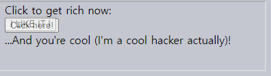
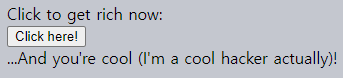
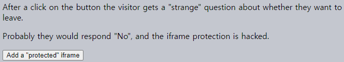
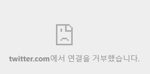
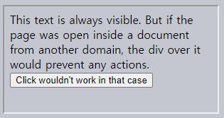

The clickjacking attack
====

##### 악의적 페이지
- 사용자 대신 특정 사이트 클릭

##### 다수 사이트 피해 당한 후 강화
- Twitter
- Facebook
- Paypal
- 기타 등등

### 개념

##### Facebook 사례
1. A visitor is lured to the evil page. It doesn't matter how.
2. The page has a harmless-looking link on it (like "get rich now" or "click here, very funny").
3. Over that link the evil page positions a transparent `<iframe>` with `src` from facebook.com, in such a way that the "Like" button is right above that link. Usually that's done with `z-index`.
4. In attempting to click the link, the visitor in fact clicks the button.

### The demo
Here's how the evil page looks. To make things clear, the `<iframe>` is half-transparent (in real evil pages it's fully transparent):
```html
<style>
iframe { /* iframe from the victim site */
  width: 400px;
  height: 100px;
  position: absolute;
  top:0; left:-20px;
  opacity: 0.5; /* in real opacity:0 */
  z-index: 1;
}
</style>

<div>Click to get rich now:</div>

<!-- The url from the victim site -->
<iframe src="/clickjacking/facebook.html"></iframe>

<button>Click here!</button>

<div>…And you're cool (I'm a cool hacker actually)!</div>
```

##### 결과



```html
<!-- index.html -->
<!doctype html>
<html>

<head>
  <meta charset="UTF-8">
</head>

<body>
  <style>
    iframe {
      width: 400px;
      height: 100px;
      position: absolute;
      top: 5px;
      left: -14px;
      opacity: 0.5;
      z-index: 1;
    }
  </style>

  <div>Click to get rich now:</div>

  <!-- The url from the victim site -->
  <iframe src="facebook.html"></iframe>

  <button>Click here!</button>

  <div>…And you're cool (I'm a cool hacker actually)!</div>
</body>

</html>
```
```html
<!-- facebook.html -->
<!DOCTYPE HTML>
<html>

<body style="margin: 10px; padding: 10px">
  <input type="button" onclick="alert('Like pressed on facebook.html!')" value="I LIKE IT !">
</body>

</html>
```

Here we have a half-transparent `<iframe src="facebook.html">`, and in the example we can see it hovering over the button. A click on the button actually clicks on the iframe, but that's not visible to the user, because the iframe is transparent.

As a result, if the visitor is authorized on Facebook ("remember me" is usually turned on), then it adds a "Like". On Twitter that would be a "Follow" button.

Here's the same example, but closer to reality, with `opacity:0` for `<iframe>`:

##### 결과



```html
<!-- index.html -->
<!doctype html>
<html>

<head>
  <meta charset="UTF-8">
</head>

<body>
  <style>
    iframe {
      width: 400px;
      height: 100px;
      position: absolute;
      top: 5px;
      left: -14px;
      opacity: 0;
      z-index: 1;
    }
  </style>

  <div>Click to get rich now:</div>

  <!-- The url from the victim site -->
  <iframe src="facebook.html"></iframe>

  <button>Click here!</button>

  <div>…And you're cool (I'm a cool hacker actually)!</div>
</body>

</html>
```
```html
<!-- facebook.html -->
<!DOCTYPE HTML>
<html>

<body style="margin: 10px; padding: 10px">
  <input type="button" onclick="alert('Like pressed on facebook.html!')" value="I LIKE IT !">
</body>

</html>
```

All we need to attack – is to position the `<iframe>` on the evil page in such a way that the button is right over the link. So that when a user clicks the link, they actually click the button. That's usually doable with CSS.

<br />

 **Clickjacking is for clicks, not for keyboard**

The attack only affects mouse actions (or similar, like taps on mobile).

Keyboard input is much difficult to redirect. Technically, if we have a text field to hack, then we can position an iframe in such a way that text fields overlap each other. So when a visitor tries to focus on the input they see on the page, they actually focus on the input inside the iframe.

But then there's a problem. Everything that the visitor types will be hidden, because the iframe is not visible.

People will usually stop typing when they can't see their new characters printing on the screen.

<br />

### Old-school defences (weak)
The oldest defence is a bit of JavaScript which forbids opening the page in a frame (so-called "framebusting").

That looks like this:
```javascript
if (top != window) {
  top.location = window.location;
}
```

That is: if the window finds out that it's not on top, then it automatically makes itself the top.

This not a reliable defence, because there are many ways to hack around it. Let's cover a few.

#### Blocking top-navigation
We can block the transition caused by changing `top.location` in `beforeunload` event handler.

The top page (enclosing one, belonging to the hacker) sets a preventing handler to it, like this:
```javascript
window.onbeforeunload = function() {
  return false;
};
```

When the `iframe` tries to change `top.location`, the visitor gets a message asking them whether they want to leave.

In most cases the visitor would answer negatively because they don't know about the iframe – all they can see is the top page, there's no reason to leave. So `top.location` won't change!

In action:

##### 결과



```html
<!-- index.html -->
<!doctype html>
<html>

<head>
  <meta charset="UTF-8">

  <style>
    iframe {
      width: 400px;
      height: 100px;
      position: absolute;
      top: 0;
      left: -20px;
      opacity: 0;
      z-index: 1;
    }
  </style>

  <script>
    function attack() {

      window.onbeforeunload = function() {
        window.onbeforeunload = null;
        return "Want to leave without learning all the secrets (he-he)?";
      };

      document.body.insertAdjacentHTML('beforeend', '<iframe src="iframe.html">');
    }
  </script>
</head>

<body>
  <p>After a click on the button the visitor gets a "strange" question about whether they want to leave.</p>

  <p>Probably they would respond "No", and the iframe protection is hacked.</p>

  <button onclick="attack()">Add a "protected" iframe</button>
</body>

</html>
```
```html
<!-- iframe.html -->
<!doctype html>
<html>

<head>
  <meta charset="UTF-8">
</head>

<body>
  <div>Changes top.location to javascript.info</div>

  <script>
    top.location = 'https://javascript.info';
  </script>
</body>

</html>
```

#### Sandbox attribute
One of the things restricted by the `sandbox` attribute is navigation. A sandboxed iframe may not change `top.location`.

So we can add the iframe with `sandbox="allow-scripts allow-forms"`. That would relax the restrictions, permitting scripts and forms. But we omit `allow-top-navigation` so that changing `top.location` is forbidden.

Here's the code:
```html
<iframe sandbox="allow-scripts allow-forms" src="facebook.html"></iframe>
```

There are other ways to work around that simple protection too.

### `X-Frame-Options`
The server-side header `X-Frame-Options` can permit or forbid displaying the page inside a frame.

It must be sent exactly as HTTP-header: the browser will ignore it if found in HTML `<meta>` tag. So, `<meta http-equiv="X-Frame-Options"…>` won't do anything.

The header may have 3 values:
- `DENY`
  - Never ever show the page inside a frame.
- `SAMEORIGIN`
  - Allow inside a frame if the parent document comes from the same origin.
- `ALLOW-FROM domain`
  - Allow inside a frame if the parent document is from the given domain.

For instance, Twitter uses `X-Frame-Options: SAMEORIGIN`.

Here's the result:
```html
<iframe src="https://twitter.com"></iframe>
```



Depending on your browser, the `iframe` above is either empty or alerting you that the browser won't permit that page to be navigating in this way.

### Showing with disabled functionality
The `X-Frame-Options` header has a side-effect. Other sites won't be able to show our page in a frame, even if they have good reasons to do so.

So there are other solutions… For instance, we can "cover" the page with a `<div>` with styles `height: 100%; width: 100%;`, so that it will intercept all clicks. That `<div>` is to be removed if `window == top` or if we figure out that we don't need the protection.

Something like this:
```html
<style>
  #protector {
    height: 100%;
    width: 100%;
    position: absolute;
    left: 0;
    top: 0;
    z-index: 99999999;
  }
</style>

<div id="protector">
  <a href="/" target="_blank">Go to the site</a>
</div>

<script>
  // there will be an error if top window is from the different origin
  // but that's ok here
  if (top.document.domain == document.domain) {
    protector.remove();
  }
</script>
```

The demo:

##### 결과



```html
<!-- index.html -->
<!doctype html>
<html>

<head>
  <meta charset="UTF-8">
</head>

<body>
  <iframe src="iframe.html"></iframe>
</body>

</html>
```
```html
<!-- iframe.html -->
<!doctype html>
<html>

<head>
  <meta charset="UTF-8">

  <style>
    #protector {
      height: 100%;
      width: 100%;
      position: absolute;
      left: 0;
      top: 0;
      z-index: 99999999;
    }
  </style>
</head>

<body>
  <div id="protector">
    <a href="/" target="_blank">Go to the site</a>
  </div>

  <script>
    if (top.document.domain == document.domain) {
      protector.remove();
    }
  </script>

  This text is always visible.

  But if the page was open inside a document from another domain, the div over it would prevent any actions.

  <button onclick="alert(1)">Click wouldn't work in that case</button>
</body>

</html>
```

### `Samesite` cookie attribute
The `samesite` cookie attribute can also prevent clickjacking attacks.

A cookie with such attribute is only sent to a website if it's opened directly, not via a frame, or otherwise. More information in the chapter 쿠키와 document.cookie.

If the site, such as Facebook, had `samesite` attribute on its authentication cookie, like this:
```javascript
Set-Cookie: authorization=secret; samesite
```

…Then such cookie wouldn't be sent when Facebook is open in iframe from another site. So the attack would fail.

The `samesite` cookie attribute will not have an effect when cookies are not used. This may allow other websites to easily show our public, unauthenticated pages in iframes.

However, this may also allow clickjacking attacks to work in a few limited cases. An anonymous polling website that prevents duplicate voting by checking IP addresses, for example, would still be vulnerable to clickjacking because it does not authenticate users using cookies.

<br />

요약
====
Clickjacking is a way to "trick" users into clicking on a victim site without even knowing what's happening. That's dangerous if there are important click-activated actions.

A hacker can post a link to their evil page in a message, or lure visitors to their page by some other means. There are many variations.

From one perspective – the attack is "not deep": all a hacker is doing is intercepting a single click. But from another perspective, if the hacker knows that after the click another control will appear, then they may use cunning messages to coerce the user into clicking on them as well.

The attack is quite dangerous, because when we engineer the UI we usually don't anticipate that a hacker may click on behalf of the visitor. So vulnerabilities can be found in totally unexpected places.
- It is recommended to use `X-Frame-Options: SAMEORIGIN` on pages (or whole websites) which are not intended to be viewed inside frames.
- Use a covering `<div>` if we want to allow our pages to be shown in iframes, but still stay safe.
