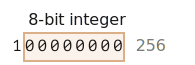
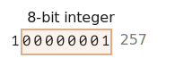

`ArrayBuffer` <sub>(객체)</sub> · 이진 배열
====

##### 웹 개발 시 이진 데이터 처리 작업
- 파일 처리
  - 생성
  - 업 · 다운로드
  - 기타 등등
- 이미지 처리
- 기타 등등

##### 다양한 관련 클래스
- `ArrayBuffer`
- `Uint8Array`
- `DataView`
- `Blob`
- `File`
- 기타 등등

##### JS 이진 데이터 구현 방식
- 타 언어 대비 다소 특이

### `ArrayBuffer` <sub>(객체)</sub>
- 기본 이진 데이터 처리 객체
  - 고정 · 연속된 메모리 공간 참조

##### 생성
```javascript
// 16byte 할당 (연속된 메모리 공간)
// - 0 채움
let buffer = new ArrayBuffer(16);
buffer.byteLength; // 16
```

<br />

 **`ArrayBuffer` <sub>(객체)</sub> ≠ 배열 <sub>(`Array` · `[…]`)</sub>**

##### 배열과 매우 다른 특징
- 고정 길이 <sub>(증감 X)</sub>
- 고정 메모리 공간
- 개별 byte 접근 시
  - 뷰 객체 필요
  - 인덱스 <sub>(`buffer[i]`)</sub> X

<br />

##### 메모리 공간 참조
- 일련의 byte 저장

#### 뷰 객체

##### `ArrayBuffer` <sub>(객체)</sub> 조작 시 사용
- 내부 저장 데이터 해석 <sub>(데이터 저장 X)</sub>
  - 안경 역할

|뷰 객체|byte|취급|범위||
|---|:---:|---|---|---|
|`Uint8Array`|1|정수|0 ~ 255|8bit 양의 정수|
|`Uint16Array`|2|정수|0 ~ 65535|16bit 양의 정수|
|`Uint32Array`|4|정수|0 ~ 4294967295|32bit 양의 정수|
|`Float64Array`|8|부동소수점 숫자|5.0 x 10<sup>-324</sup> ~ 1.8 x 10<sup>308</sup>||

##### `ArrayBuffer(16)` <sub>(16byte)</sub>


#### `ArrayBuffer` <sub>(객체)</sub> vs 뷰 객체

##### `ArrayBuffer` <sub>(객체)</sub>
- 이진 데이터 저장 <sub>(핵심 객체)</sub>

##### 뷰 객체
- 이진 데이터 조작 · 작업
  - 값 쓰기
  - 순회
  - 기타 등등
```javascript
// byte 길이 (16)
let buffer = new ArrayBuffer(16);

// 32bit (4byte) 정수 일련
// - 버퍼 취급
let view = new Uint32Array(buffer);

// 정수 1개당 byte 크기
Uint32Array.BYTES_PER_ELEMENT; // 4

// 정수 최대 개수
view.length; // 4

// byte 최대 개수
view.byteLength; // 16

// 값 쓰기
view[0] = 123456;

// 순회
for (let num of view) {
  num; // 123456, 0, 0, 0
}
```

### [`TypedArray`](https://tc39.es/ecma262/#sec-typedarray-objects)

##### 뷰 객체 통용 용어
- 가상 용어 <sub>(실체 X)</sub>
  - 생성자 X
  - 뷰 객체 의미
- `new TypedArray` <sub>(가상)</sub>
  - `new Int8Array` <sub>(실제)</sub>
  - `new Uint8Array` <sub>(실제)</sub>
  - 기타 등등

##### 뷰 객체 표현 시 유용 <sub>(공통 부모 클래스 역할)</sub>
- 다양한 뷰 객체
  - 다수 공통 메서드 · 프로퍼티 공유

##### 일반 배열 유사
- 인덱스 사용
- 이터러블 <sub>(객체)</sub>

#### 생성자 <sub>(5가지)</sub>
- 전달 인수 따라 동작 상이
```javascript
new TypedArray(buffer, [byteOffset], [length]);
new TypedArray(object); // 배열 · 유사 배열 객체
new TypedArray(typedArray);
new TypedArray(length);
new TypedArray();
```

##### 1. `new TypedArray(buffer, [byteOffset], [length])`
- `buffer` <sub>(`ArrayBuffer` 객체)</sub>
  - 뷰 객체 기반
- `[byteOffset]` <sub>(숫자)</sub>
  - 뷰 취급 범위 시작 지점
  - `0` <sub>(기본값)</sub>
- `[length]` <sub>(숫자)</sub>
  - 뷰 취급 범위 길이
  - `buffer` 길이 <sub>(기본값)</sub>

##### 2. `new TypedArray(object)`
- `object` <sub>(배열 · 유사 배열 객체)</sub>
  - 길이 · 내용 복사
```javascript
let arr = new Uint8Array([0, 1, 2, 3]);
arr.length; // 4
arr[1];     // 1
```

##### 3. `new TypedArray(typedArray)`
- `typedArray` <sub>(뷰 객체)</sub>
  - 길이 · 내용 복사
- 새 뷰 객체 맞춰 내용 타입 변경
```javascript
let arr16 = new Uint16Array([1, 1000]);
let arr8 = new Uint8Array(arr16);
arr8[0]; // 1
arr8[1]; // 232, 8bit 초과
```

##### 4. `new TypedArray(length)`
- `length` <sub>(숫자)</sub>
  - 뷰 객체 길이
```javascript
// 정수 4개 길이
let arr = new Uint16Array(4);

// 정수당 byte
Uint16Array.BYTES_PER_ELEMENT; // 2

// byte 길이
arr.length * arr.BYTES_PER_ELEMENT; // 4 * 2

// byte 길이
arr.byteLength; // 8
```

##### 5. `new TypedArray()`
- 뷰 객체 길이
  - `0`

##### 생성자별 `ArrayBuffer` <sub>(객체)</sub> 생성 여부
- ①
  - 미생성
- ② ~ ⑤
  - 내부 자동 생성

##### 내부 `ArrayBuffer` <sub>(객체)</sub> 접근 프로퍼티
- `buffer`
- `byteLength` <sub>(길이)</sub>

##### 뷰 객체 자유롭게 변경 가능
```javascript
let arr8 = new Uint8Array([0, 1, 2, 3]);
let arr16 = new Uint16Array(arr8.buffer);
```

#### 뷰 객체 구분

##### 양의 정수
- `Uint[8·16·32]Array` <sub>(8 · 16 · 32bit)</sub>
- `Uint8ClampedArray` <sub>(8bit)</sub>
  - 생성 시 내용 타입 고정
  - 초과 → `255`
  - 음수 → `0`

##### 정수
- `Int[8·16·32]Array` <sub>(8 · 16 · 32bit)</sub>

##### 부동소수점 숫자
- `Float[32·64]Array` <sub>(32 · 64bit)</sub>

<br />

 **단일 타입 X**

##### 뷰 객체 ≠ 자료형
- ex\) `Int8Array`
  - 객체형
  - `int` X
  - `int8` X
- 내부 요소 개별 타입 명시 X
  - 뷰 객체 유형 명시

<br />

#### 범위 초과

##### 범위 초과 값 추가
- 에러 발생 X
- 초과 bit 잘림

##### `Uint8Array` 내 `256` <sub>(숫자)</sub> 저장
- `Uint8Array` <sub>(뷰 객체)</sub>
  - 값당 8bit 저장 <sub>(0 ~ 255)</sub>
- 범위 초과 숫자
  - 최우측 8bit 저장
- 나머지 bit
  - 잘림
- `256` <sub>(저장 · 숫자)</sub>
  - `100000000` <sub>(9bit)</sub>
- `0` <sub>(저장 결과 · 숫자)
  - `00000000` <sub>(8bit)</sub>



##### `Uint8Array` 내 `257` <sub>(숫자)</sub> 저장
- `257` <sub>(저장 · 숫자)</sub>
  - `100000001` <sub>(9bit)</sub>
- `1` <sub>(저장 결과 · 숫자)</sub>
  - `00000001` <sub>(8bit)</sub>



##### `%` <sub>(나머지 연산)</sub> 적용 값 동일
```javascript
n % 256
```

##### `Uint8Array` 내 `256` · `257` <sub>(범위 초과 숫자)</sub>
```javascript
let uint8array = new Uint8Array(16);

let num = 256;

num.toString(2); // 100000000 (2진수)

uint8array[0] = 256;
uint8array[1] = 257;

uint8array[0]; // 0
uint8array[1]; // 1
```

##### `Uint8ClampedArray` <sub>(뷰 객체)</sub>
- 범위 초과 숫자
  - `255` 저장
- 음수
  - `0` 저장
- 이미지 처리 시 유용

### `TypedArray` 메서드

#### 일반 배열 메서드 구현 <sub>(예외 有)</sub>

##### 일반 배열 기능 구현
- 순회
- `map` <sub>(메서드)</sub>
- `slice` <sub>(메서드)</sub>
- `find` <sub>(메서드)</sub>
- `reduce` <sub>(메서드)</sub>
- 기타 등등

#### 예외
- `splice` <sub>(메서드)</sub> X <sub>(요소 제거 X)</sub>
  - 데이터 저장 X
  - 고정된 연속 메모리 주소
  - `0` 할당 가능
- `concat` <sub>(메서드)</sub> X

#### 추가 메서드

##### `set(fromArr, [offset])`
- 내부 요소 복사
- `fromArr` <sub>(뷰 객체)</sub>
  - 내용 · 길이 복사 대상
- `[offset]`
  - 복사 시작 위치
  - `0` <sub>(기본값)</sub>

##### `subarray([begin, end])`
- 새 뷰 객체 생성 <sub>(동일 타입)</sub>
  - `begin` ~ (`end` - 1)
- `slice` <sub>(메서드)</sub> 유사
- 내부 요소 복사 X

### [`DataView`](https://developer.mozilla.org/en-US/docs/Web/JavaScript/Reference/Global_Objects/DataView)
- 특수 뷰 객체
  - 강력한 유연성
  - 타입 고정 X
- 데이터 접근
  - 모든 위치 · 타입 가능

#### `TypedArray` vs `DataView`

||포맷 설정 시점|데이터 접근 방법|
|---|---|---|
|`TypedArray`|생성자 호출 <sub>(객체 생성)</sub>|인덱스 <sub>(모든 뷰 객체 공통)</sub>|
|`DataView`|메서드 호출|메서드 호출|

#### 문법
```javascript
new DataView(buffer, [byteOffset], [byteLength])
```

##### `buffer` <sub>(`ArrayBuffer` 객체)</sub>
- 자동 생성 X <sub>(기존 객체 필요)</sub>

##### `[byteOffset]`
- 뷰 시작점 <sub>(byte)</sub>
- `0` <sub>(기본값)</sub>

##### `[byteLength]`
- 뷰 길이 <sub>(byte)</sub>
- `buffer` 길이 <sub>(기본값)</sub>

##### `buffer` <sub>(내부 `ArrayBuffer` 객체)</sub> 내 숫자 추출
- 다양한 타입 추출
```javascript
// 1bit 숫자 (0 ~ 255) 4개 (4byte)
let buffer = new Uint8Array([255, 255, 255, 255]).buffer;

let dataView = new DataView(buffer);

// 8bit (1byte) 숫자 (0 위치)
dataView.getUint8(0); // 255

// 16bit (2byte) 숫자 (0 위치)
dataView.getUint16(0); // 65535 (최댓값)

// 32bit (4byte) 숫자 (0 위치)
dataView.getUint32(0); // 4294967295 (최댓값)

// 0 (4byte · 숫자) 설정
// - 모든 byte 적용
dataView.setUint32(0, 0);
```

##### 용도
- 다양한 타입 데이터 저장 <sub>(동일 버퍼 내)</sub>
  - 16bit 정수
  - 32bit 부동소수점 숫자
  - 기타 등등

<br />

요약
====

#### `ArrayBuffer` <sub>(객체)</sub>

##### 핵심 객체
- 연속된 고정 메모리 주소 참조
- 내부 데이터 접근 시 뷰 객체 필요

#### `TypedArray` <sub>(뷰 객체)</sub>

##### 양의 정수
- `Uint[8·16·32]Array` <sub>(8 · 16 · 32bit)</sub>
- `Uint8ClampedArray` <sub>(8bit)</sub>
  - 타입 고정
  - 초과 → `255`
  - 음수 → `0`

##### 정수
- `Int[8·16·32]Array` <sub>(8 · 16 · 32bit)</sub>

##### 부동소수점 숫자
- `Float[32·64]Array` <sub>(32 · 64bit)</sub>

##### `DataView` <sub>(특수 뷰 객체)</sub>
- 다양한 포맷 적용 가능 <sub>(고정 X)</sub>
  - 메서드 호출 시 포맷 결정
    - ex\) `getUint8(offset)`

##### `buffer` <sub>(프로퍼티)</sub>
- 내부 `ArrayBuffer` <sub>(객체)</sub>
  - 뷰 객체 실제 작업 대상
- 새 뷰 객체 생성 시 전달 가능

##### 추가 용어 <sub>(이진 데이터 작업)</sub>
- `ArrayBufferView` <sub>(가상 뷰 객체)</sub>
- `BufferSource` <sub>(가상 이진 데이터 처리 객체)</sub>
  - `ArrayBuffer` <sub>(객체)</sub>
  - `ArrayBufferView` <sub>(가상 뷰 객체)</sub>


<br />

##  과제

### 타입 지정된 배열 연결

##### `concat(arrays)` <sub>(함수)</sub> 작성
- `arrays`
  - 다수 `Uint8Array` <sub>(뷰 객체)</sub>
- 배열 연결 · 단일 배열 반환

<br />


```javascript
function concat(arrays) {

  // 각 배열 길이 총합
  let totalLength = arrays.reduce((acc, value) => acc + value.length, 0);

  if (!arrays.length) {
    return null;
  }

  let result = new Uint8Array(totalLength);

  // 각 배열 요소 복사
  // - 다음 Uint8Array (뷰 객체) 내 요소들 바로 이어 저장
  let length = 0;
  for (let array of arrays) {
    result.set(array, length);
    length += array.length;
  }

  return result;
}
```

[정답](https://plnkr.co/edit/Zt57Tk01OcRqG8mR?p=preview)
