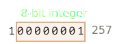

`ArrayBuffer` <sub>(객체)</sub> · 이진 배열
==========================

##### 이진 데이터 처리 <sub>(웹 개발)</sub>
- 파일 처리
  - 생성
  - 업로드
  - 다운로드
  - 기타 등등
- 이미지 처리

##### 다양한 관련 클래스
- `ArrayBuffer`
- `Uint8Array`
- `DataView`
- `Blob`
- `File`
- 기타 등등

##### JS 이진 데이터 구현 방식
- 다소 특이 <sub>(타 언어 대비)</sub>
  - 큰 문제 X

### `ArrayBuffer` <sub>(객체)</sub>
- 기본 이진 객체
  - 고정 · 연속된 메모리 공간 참조

##### 생성
```javascript
// 연속된 메모리 공간 (16바이트) 할당
// - 0 채움
let buffer = new ArrayBuffer(16);
alert(buffer.byteLength); // 16
```

<br />

 **`ArrayBuffer` ≠ 배열**

##### 배열 <sub>(`Array`)</sub> X
- 고정 길이 <sub>(증감 X)</sub>
- 고정 메모리 공간
- 개별 바이트 접근 시
  - 뷰 객체 필요
  - 인덱스 X <sub>(`buffer[index]`)</sub>

<br />

##### 메모리 공간 참조
- 내부 저장 데이터
  - 일련의 바이트

#### 뷰 객체

##### `ArrayBuffer` <sub>(객체)</sub> 조작 시 사용
- `ArrayBuffer` <sub>(객체)</sub> 저장 데이터 해석
  - 안경 역할
  - 데이터 저장 X

|뷰 객체|byte|취급|범위||
|---|---|---|---|---|
|`Uint8Array`|1|정수|0 ~ 255|"8-bit unsigned integer"|
|`Uint16Array`|2|정수|0 ~ 65535|"16-bit unsigned integer"|
|`Uint32Array`|4|정수|0 ~ 4294967295|"32-bit unsigned integer"|
|`Float64Array`|8|부동소수점 숫자|5.0 x 10<sup>-324</sup> ~ 1.8 x 10<sup>308</sup>||

##### `ArrayBuffer(16)` <sub>(16바이트)</sub>

|크기|개수|바이트|
|:---:|:---:|:---:|
|小|16|1|
|中|8|2|
|大|4|4|
|高정밀도|2|8|


#### `ArrayBuffer` <sub>(객체)</sub> vs 뷰 객체

##### `ArrayBuffer` <sub>(객체)</sub>
- 이진 데이터 저장 <sub>(핵심 객체)</sub>

##### 뷰 객체
- 이진 데이터 조작 · 작업
  - 값 쓰기
  - 순회
  - 기타 등등

```javascript
// 길이 16
let buffer = new ArrayBuffer(16);

// 버퍼 취급
// - 32비트 (4바이트) 정수 일련
let view = new Uint32Array(buffer);

// 정수 1개 당 바이트 크기 (4)
alert(Uint32Array.BYTES_PER_ELEMENT);

// 정수 최대 개수 (4)
alert(view.length);

// 바이트 최대 개수 (16)
alert(view.byteLength);

// 값 쓰기
view[0] = 123456;

// 순회
for(let num of view) {
  alert(num); // 123456, 0, 0, 0
}
```

### [`TypedArray`](https://tc39.es/ecma262/#sec-typedarray-objects)

##### 뷰 객체
- 공통 메서드 · 프로퍼티 有

##### 뷰 객체 통용 용어
- 가상 용어 <sub>(실체 X)</sub>
  - 생성자 X
  - 뷰 객체 의미
- `new TypedArray`
  - `new Int8Array`
  - `new Uint8Array`
  - 기타 등등

##### 일반 배열 유사
- 인덱스 사용
- 이터러블 <sub>(객체)</sub>

#### 생성자 <sub>(`Int8Array` 등)</sub>

##### 인수 종류 <sub>(5가지)</sub>
- 종류 따라 동작 상이
```javascript
new TypedArray(buffer, [byteOffset], [length]);
new TypedArray(object); // 배열 · 유사 배열 객체
new TypedArray(typedArray);
new TypedArray(length);
new TypedArray();
```

##### 1. `new TypedArray(buffer, [byteOffset], [length])`
- `buffer`
  - `ArrayBuffer` <sub>(객체)</sub>
  - 뷰 객체 기반
- `byteOffset` <sub>(선택)</sub>
  - 뷰 취급 범위 시작 지점
  - `0` <sub>(기본값)</sub>
- `length` <sub>(선택)</sub>
  - 뷰 취급 범위 길이
  - `buffer` 길이 <sub>(기본값)</sub>

##### 2. `new TypedArray(object)`
- `object`
  - 배열
  - 유사 배열 객체
- 길이 · 내용 복사
```javascript
let arr = new Uint8Array([0, 1, 2, 3]);
alert( arr.length ); // 4
alert( arr[1] ); // 1
```

##### 3. `new TypedArray(typedArray)`
- `typedArray`
  - 타 뷰 객체
- 길이 · 내용 복사
  - 새 뷰 객체 맞춰 내용 타입 변경
```javascript
let arr16 = new Uint16Array([1, 1000]);
let arr8 = new Uint8Array(arr16);
alert( arr8[0] ); // 1
alert( arr8[1] ); // 232, 8비트 초과
```

##### 4. `new TypedArray(length)`
- `length`
  - 뷰 객체 길이
- 바이트 길이
  - `length` * `TypedArray.BYTES_PER_ELEMENT`
```javascript
let arr = new Uint16Array(4); // 정수 4개 길이
alert( Uint16Array.BYTES_PER_ELEMENT ); // 정수당 2바이트
alert( arr.byteLength ); // 8 (4 * 2)
```

##### 5. `new TypedArray()`
- 길이
  - `0`

##### 생성 시 `ArrayBuffer` 명시 X
- 내부 자동 생성
  - ② ~ ⑤
- 미생성
  - ①

##### `ArrayBuffer` <sub>(객체)</sub> 접근 프로퍼티
- `buffer`
  - `ArrayBuffer` <sub>(객체)</sub>
- `byteLength`
  - `ArrayBuffer` <sub>(객체)</sub> 길이

##### 뷰 객체 자유롭게 변경 가능
```javascript
let arr8 = new Uint8Array([0, 1, 2, 3]);
let arr16 = new Uint16Array(arr8.buffer);
```

#### 뷰 객체 <sub>(`TypedArray`)</sub>

##### 양의 정수
- `Uint[8·16·32]Array` <sub>(8 · 16 · 32비트)</sub>
- `Uint8ClampedArray` <sub>(8비트)</sub>
  - 할당 시 고정

##### 정수
- `Int[8·16·32]Array` <sub>(8 · 16 · 32 비트)</sub>

##### 부동소수점 숫자
- `Float[32·64]Array` <sub>(32 · 64비트)</sub>

<br />

 **단일 타입 X <sub>(`int8` 등)</sub>**

##### `Int8Array`
- 자료형 X
  - `int`
  - `int8`
- 개별 요소 타입 명시 X
  - 뷰 객체 종류 명시

<br />

#### 범위 초과

##### 범위 초과 값 추가 시
- 에러 발생 X
- 초과 비트 잘림

##### `Uint8Array` 내 `256` 추가
- `Uint8Array`
  - 값당 8비트 제공 <sub>(0 ~ 255)</sub>
- 범위 초과 숫자
  - 최우측 8비트 저장
- 나머지 비트
  - 잘림
- `256`
  - `100000000` <sub>(9비트)</sub>
- 결과
  - `0`


##### `Uint8Array` 내 `257` 추가
- `257`
  - `100000001` <sub>(9비트)</sub>
- 결과
  - `1`



```javascript
// 나머지 연산 적용 결과값 동일
n % 256
```

##### `Uint8Array`
```javascript
let uint8array = new Uint8Array(16);

let num = 256;
alert(num.toString(2)); // 100000000 (이진법)

uint8array[0] = 256;
uint8array[1] = 257;

alert(uint8array[0]); // 0
alert(uint8array[1]); // 1
```

##### `Uint8ClampedArray`
- 범위 초과 숫자
  - `255`
- 음수
  - `0`
- 이미지 처리 유용

### `TypedArray` 메서드

#### 일반 배열 메서드 구현 <sub>(예외 有)</sub>

##### 일반 배열 기능
- 순회
- `map`
- `slice`
- `find`
- `reduce`

##### 예외
- `splice` X <sub>(요소 삭제 X)</sub>
  - 뷰 객체
    - 데이터 저장 X
    - 고정된 연속 메모리 주소
    - `0` 할당 가능
- `concat` X

#### 추가 메서드

##### `arr.set(fromArr, [offset])`
- copies all elements from `fromArr` to the `arr`, starting at position `offset` (0 by default).

##### `arr.subarray([begin, end])`
- creates a new view of the same type from `begin` to `end` (exclusive). That's similar to `slice` method (that's also supported), but doesn't copy anything – just creates a new view, to operate on the given piece of data.

These methods allow us to copy typed arrays, mix them, create new arrays from existing ones, and so on.

### `DataView`
[`DataView`](https://developer.mozilla.org/en-US/docs/Web/JavaScript/Reference/Global_Objects/DataView) is a special super-flexible "untyped" view over `ArrayBuffer`. It allows to access the data on any offset in any format.
- For typed arrays, the constructor dictates what the format is. The whole array is supposed to be uniform. The i-th number is `arr[i]`.
- With `DataView` we access the data with methods like `.getUint8(i)` or `.getUint16(i)`. We choose the format at method call time instead of the construction time.

The syntax:
```javascript
new DataView(buffer, [byteOffset], [byteLength])
```
- `buffer` – the underlying `ArrayBuffer`. Unlike typed arrays, `DataView` doesn't create a buffer on its own. We need to have it ready.
- `byteOffset` – the starting byte position of the view (by default 0).
- `byteLength` – the byte length of the view (by default till the end of `buffer`).

For instance, here we extract numbers in different formats from the same buffer:
```javascript
// binary array of 4 bytes, all have the maximal value 255
let buffer = new Uint8Array([255, 255, 255, 255]).buffer;

let dataView = new DataView(buffer);

// get 8-bit number at offset 0
alert( dataView.getUint8(0) ); // 255

// now get 16-bit number at offset 0, it consists of 2 bytes, together interpreted as 65535
alert( dataView.getUint16(0) ); // 65535 (biggest 16-bit unsigned int)

// get 32-bit number at offset 0
alert( dataView.getUint32(0) ); // 4294967295 (biggest 32-bit unsigned int)

dataView.setUint32(0, 0); // set 4-byte number to zero, thus setting all bytes to 0
```

`DataView` is great when we store mixed-format data in the same buffer. For example, when we store a sequence of pairs (16-bit integer, 32-bit float), `DataView` allows to access them easily.

<br />

## 요약
`ArrayBuffer` is the core object, a reference to the fixed-length contiguous memory area.

To do almost any operation on `ArrayBuffer`, we need a view.
- It can be a `TypedArray`:
  - `Uint8Array`, `Uint16Array`, `Uint32Array` – for unsigned integers of 8, 16, and 32 bits.
  - `Uint8ClampedArray` – for 8-bit integers, "clamps" them on assignment.
  - `Int8Array`, `Int16Array`, `Int32Array` – for signed integer numbers (can be negative).
  - `Float32Array`, `Float64Array` – for signed floating-point numbers of 32 and 64 bits.
- Or a `DataView` – the view that uses methods to specify a format, e.g. `getUint8(offset)`.

In most cases we create and operate directly on typed arrays, leaving `ArrayBuffer` under cover, as a "common discriminator". We can access it as `.buffer` and make another view if needed.

There are also two additional terms, that are used in descriptions of methods that operate on binary data:
- `ArrayBufferView` is an umbrella term for all these kinds of views.
- `BufferSource` is an umbrella term for `ArrayBuffer` or `ArrayBufferView`.

We'll see these terms in the next chapters. `BufferSource` is one of the most common terms, as it means "any kind of binary data" – an `ArrayBuffer` or a view over it.

Here's a cheatsheet:


<br />

##  과제

### title
타입이 지정된 배열 연결하기
주어진 `Uint8Array`의 배열을 하나의 배열로 연결하여 반환하는 함수 `concat(arrays)`를 작성하십시오.

<br />


```javascript
function concat(arrays) {
  // sum of individual array lengths
  let totalLength = arrays.reduce((acc, value) => acc + value.length, 0);

  if (!arrays.length) return null;

  let result = new Uint8Array(totalLength);

  // for each array - copy it over result
  // next array is copied right after the previous one
  let length = 0;
  for(let array of arrays) {
    result.set(array, length);
    length += array.length;
  }

  return result;
}
```

[테스트 코드가 담긴 샌드박스를 열어 정답을 확인해보세요.](https://plnkr.co/edit/Zt57Tk01OcRqG8mR?p=preview)
