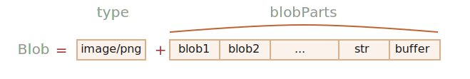

`Blob` <sub>(객체)</sub>
====

##### ECMA 표준
- `ArrayBuffer` <sub>(객체)</sub>
- `TypedArray` <sub>(뷰 객체)</sub>

##### [File API](https://www.w3.org/TR/FileAPI/)
- `Blob` <sub>(브라우저 전용 고차원 객체)</sub>

### `Blob` <sub>(객체)</sub>

##### 구성
- `type` <sub>(추가 문자열)</sub>
  - 보통 MIME-type
- `blobParts` <sub>(타 개체 일련)</sub>
  - `Blob` <sub>(객체)</sub>
  - 문자열
  - `BufferSource` <sub>(가상 이진 처리 객체)</sub>



##### 생성자
```javascript
new Blob(blobParts, options)
```

##### `blobParts` <sub>(배열)</sub>
- `Blob` <sub>(객체)</sub>
- 문자열
- `BufferSource` <sub>(가상 이진 데이터 처리 객체)</sub>

##### `options` <sub>(객체)</sub>
- `type` <sub>(문자열)</sub>
  - `Blob` <sub>(객체)</sub> 타입
  - 보통 MIME-type <sub>(`'image/png'` 등)</sub>
- `endings` <sub>(문자열)</sub>
  - 각 OS별 "end-of-line" 변경 여부
    - `\r\n`
    - `\n`
  - `'transparent'` <sub>(기본값)</sub>
    - 미변경
  - `'native'`
    - 변경
```javascript
// Blob (객체) 생성
// - 문자열
let blob = new Blob(
  ["<html>…</html>"],
  {type: 'text/html'}
);
```
```javascript
// Blob (객체) 생성
// - TypedArray (뷰 객체) · 문자열
let hello = new Uint8Array([72, 101, 108, 108, 111]);
let blob = new Blob(
  [hello, ' ', 'world'],
  {type: 'text/plain'}
);
```

#### `Blob` <sub>(객체)</sub> 추출

##### `slice` <sub>(메서드)</sub>
- `Array.slice` <sub>(배열 메서드)</sub> 유사
- 음수 가능
```javascript
blob.slice([byteStart], [byteEnd], [contentType]);
```
- `[byteStart]`
  - 시작 바이트
  - `0` <sub>(기본값)</sub>
- `[byteEnd]`
  - 끝 바이트 <sub>(제외)</sub>
  - 마지막 요소 <sub>(기본값)</sub>
- `[contentType]`
  - 새 `Blob` <sub>(객체)</sub> 타입
  - 기존 타입 <sub>(기본값)</sub>

<br />

 **`Blob` <sub>(객체)</sub> 수정 불가**

##### 내용 수정 불가능
- 부분 추출
- 새 객체 생성 후 결합

##### JS 문자열 동작 유사
- 문자 변경 X
- 새 문자열 생성

<br />

### url 용도 `Blob` <sub>(객체)</sub>

##### `Blob` <sub>(객체)</sub>
- url 역할 수행
- url 사용 요소 내 url 대신 사용 가능
  - `<a>`
  - ``
  - 기타 등등

##### `type` <sub>(옵션 · 문자열)</sub>
- `Blob` <sub>(객체)</sub> 업 · 다운로드 가능화
- 네트워크 요청 시
  - 옵션 값 → `Content-Type` <sub>(헤더)</sub> 값

##### `Blob` <sub>(객체)</sub> 다운로드
- 링크 클릭 시 `Blob` <sub>(동적 생성 객체)</sub> 다운로드
  - `"Hello, world!"` <sub>(다운로드 파일 내용)</sub>
```html
<!-- <a download="…">
download (속성)
- 탐색 대신 다운로드 실행
-->
<a download="hello.txt" href='#' id="link">Download</a>

<script>
  let blob = new Blob(
    ["Hello, world!"],
    {type: 'text/plain'}
  );
  link.href = URL.createObjectURL(blob);
</script>
```

##### `Blob` <sub>(객체)</sub> 다운로드
- 링크 동적 생성
- 코드 내 링크 클릭 실행
- `Blob` <sub>(동적 생성 객체)</sub> 다운로드
  - `"Hello, world!"` <sub>(다운로드 파일 내용)</sub>
```javascript
let link = document.createElement('a');
link.download = 'hello.txt';

let blob = new Blob(
  ['Hello, world!'],
  {type: 'text/plain'}
);
link.href = URL.createObjectURL(blob);
link.click();

URL.revokeObjectURL(link.href);
```

#### `URL.createObjectURL(object)`

- 고유 url 생성

##### `object`
- url 생성 대상
  - `File` <sub>(객체)</sub>
  - `Blob` <sub>(객체)</sub>
  - `MediaSource` <sub>(객체)</sub>
```
/* url 형태 */
blob:<origin>/<uuid>
blob:https://javascript.info/1e67e00e-860d-40a5-89ae-6ab0cbee6273
```
- 브라우저 내 매핑 <sub>(url → `Blob` 객체)</sub> 저장
  - `Blob` <sub>(객체)</sub> 접근
- 현재 문서 내에서만 유효 <sub>(문서 열려있는동안)</sub>
- url 사용 요소 <sub>(`` · `<a>` 등)</sub>
  - `Blob` <sub>(객체)</sub> 참조 가능

##### 부작용
- 브라우저 내 매핑 <sub>(url → `Blob` 객체)</sub> 저장 시
  - 해당 `Blob` <sub>(객체)</sub> 메모리 내 상주
    - 매핑 자체 제거 <sub>(브라우저)</sub> 불가능

##### 내부 매핑 자동 제거
- 문서 떠날 때 <sub>(`unload` 이벤트)</sub> 발생
- 매핑 제거된 `Blob` <sub>(객체)</sub>
  - 도달 불가능 상태
- 장시간 구동 앱
  - 매핑 유지 문제 발생

#### `URL.revokeObjectURL(url)`

##### 내부 매핑 참조 제거
- 매핑 제거된 `Blob` <sub>(객체)</sub>
  - 도달 불가능 상태 <sub>(매핑 외 참조 無)</sub>

### `Blob` <sub>(객체)</sub> → base64 <sub>(인코딩)</sub>

##### `Blob` <sub>(객체)</sub> → base64 <sub>(인코딩)</sub> 문자열
- `URL.createObjectURL` 대안
- 이진 데이터 → ASCII 코드 <sub>(0 ~ 64)</sub>
  - 매우 안전하게 읽기 가능한 문자
  - 데이터 url 내 사용 가능

##### [데이터 url](https://developer.mozilla.org/en-US/docs/Web/HTTP/Basics_of_HTTP/Data_URLs)
- 일반 url 같이 어디에나 사용 가능
```
/* url 형태 */
data:[<mediatype>][;base64],<data>
```

##### 웃는 얼굴 기호
- 데이터 url 디코딩 후 이미지 표시 <sub>(브라우저)</sub>
```html

```

##### 변환 작업 <sub>(`Blob` 객체 → base64 인코딩 문자열)</sub>
- `FileReader` <sub>(내장 객체)</sub> 사용
  - 다양한 포맷으로 `Blob` <sub>(객체)</sub> 읽기

##### `Blob` <sub>(객체)</sub> 다운로드
- base64 <sub>(인코딩)</sub> 문자열 사용
```javascript
let link = document.createElement('a');
link.download = 'hello.txt';

let blob = new Blob(
  ['Hello, world!'],
  {type: 'text/plain'}
);
let reader = new FileReader();

// Blob (객체) → base64 (인코딩) 문자열
reader.readAsDataURL(blob);

reader.onload = function() {

  // 데이터 url
  link.href = reader.result;
  link.click();
};
```

#### `createObjectURL` vs 인코딩 문자열 변환

##### `URL.createObjectURL(blob)`
- 내부 매핑 <sub>(url → `Blob` 객체)</sub> 제거 필요
- `Blob` <sub>(객체)</sub> 직접 접근
  - 인 · 디코딩 X
- 단순 · 속도 ↑

##### `Blob` <sub>(객체)</sub> → 데이터 url <sub>(base64 인코딩 문자열)</sub>
- 내부 매핑 X
- 용량 큰 `Blob` <sub>(객체)</sub> 인코딩 시
  - 성능 · 메모리 손실

### 이미지 → `Blob` <sub>(객체)</sub>

##### `Blob` <sub>(객체)</sub> 생성 가능 대상
- 이미지
- 이미지 일부
- 스크린샷
- 기타 등등

##### `<canvas>` <sub>(이미지 작업 요소)</sub>
1. [`drawImage`](https://developer.mozilla.org/en-US/docs/Web/API/CanvasRenderingContext2D/drawImage) <sub>(메서드)</sub>
   - `<canvas>` <sub>(요소)</sub> 내 이미지 그리기
2. [`toBlob(cb, format, quality)`](https://developer.mozilla.org/en-US/docs/Web/API/HTMLCanvasElement/toBlob) <sub>(메서드)</sub>
   - `Blob` <sub>(객체)</sub> 생성 후 콜백 <sub>(`cb`)</sub> 실행
```javascript
// 임의 이미지 선택
let img = document.querySelector('img');

// <canvas> (요소) 크기 설정
// - 이미지 동일 크기
let canvas = document.createElement('canvas');
canvas.width = img.clientWidth;
canvas.height = img.clientHeight;

let context = canvas.getContext('2d');

// 이미지 복사 (이미지 자르기 가능)
// - 이후 다양한 작업 수행
//   - ex) context.rotate() 등
context.drawImage(img, 0, 0);

// 수행 완료 시 콜백 실행 (비동기)
canvas.toBlob(function(blob) {

  // blob 준비 완료 시 다운로드
  let link = document.createElement('a');
  link.download = 'example.png';

  link.href = URL.createObjectURL(blob);
  link.click();

  // 내부 매핑 참조 제거
  // - 가비지 컬렉터 대상
  URL.revokeObjectURL(link.href);
}, 'image/png');
```

##### `async` · `await` 사용 코드
```javascript
let blob = await new Promise(resolve => canvas.toBlob(resolve, 'image/png'));
```

##### [`html2canvas`](https://github.com/niklasvh/html2canvas) <sub>(라이브러리)</sub>
- 페이지 스크린샷 생성
- 페이지 탐색 후 `<canvas>` <sub>(요소)</sub> 내 그리기

### `Blob` <sub>(객체)</sub> → `ArrayBuffer` <sub>(객체)</sub>

##### `Blob` <sub>(객체)</sub> 생성자 <sub>(`new Blob`)</sub>
- 거의 모든 타입 전달 가능
  - `BufferSource` <sub>(가상 이진 처리 객체)</sub>
  - 기타 등등

##### 저수준 처리 필요 시
- `ArrayBuffer` <sub>(객체)</sub> 변환
  - `FileReader` <sub>(내장 객체)</sub> 사용
```javascript
let fileReader = new FileReader();

// Blob (객체) → ArrayBuffer (객체)
fileReader.readAsArrayBuffer(blob);

fileReader.onload = function(event) {
  let arrayBuffer = fileReader.result;
};
```

<br />

요약
====

#### `BufferSource` vs `Blob`

##### `BufferSource` <sub>(가상 이진 데이터 처리 객체)</sub>
- 이진 데이터

##### [`Blob`](https://www.w3.org/TR/FileAPI/#dfn-Blob) <sub>(객체)</sub>
- 이진 데이터 <sub>(타입 有)</sub>
  - 업 · 다운로드 용이

##### 웹 요청 관련 기능 <sub>(`XMLHttpRequest` · `fetch` 등)</sub>
- 이진 데이터 타입 관련 작업 네이티브하게 수행
  - `Blob` <sub>(객체)</sub>
  - 기타 등등

#### `Blob` <sub>(객체)</sub> ↔ 저수준 이진 데이터 타입 <sub>(변환)</sub>

##### `TypedArray` <sub>(뷰 객체)</sub> → `Blob` <sub>(객체)</sub>
- `Blob` <sub>(객체)</sub> 생성자 <sub>(`new Blob`)</sub>

##### `Blob` <sub>(객체)</sub> → `ArrayBuffer` <sub>(객체)</sub>
1. `FileReader` <sub>(내장 객체)</sub> 사용해 변환
2. 뷰 객체 생성 <sub>(저수준 이진 처리 필요 시)</sub>
