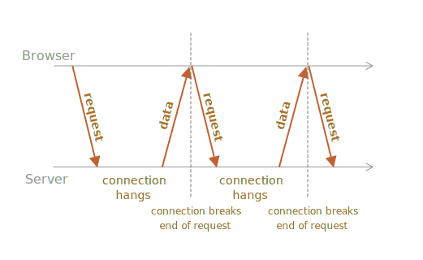
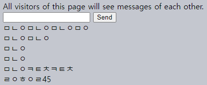

롱 폴링
====

#### 폴링

##### 단순 지속적인 서버 연결 유지 기능 구현 가능
- 특정 프로토콜 의존 X
  - 웹소켓
  - SSE <sub>(server-sent events)</sub>
  - 기타 등등
- 낮은 구현 난이도
- 다양한 용도

### 일반 폴링 <sub>(Regular Polling)</sub>

##### 아주 간단히 서버 내 최신 정보 수신 가능
- ex\)
  - 클라이언트
    - 10초마다 최신 정보 요청
  - 서버
    1. 클라이언트 접속 인지
    2. 메시지 패킷 전송

#### 단점

##### 1. 메시지 전송 시 지연 발생
- 최대 10초
- 요청들 사이

##### 2. 서버 매 10초마다 요청 수신
- 서버 내 메시지 유무 여부 무관
- 사용자 상태 무관
  - 타 작업 중
  - 휴면
  - 기타 등등
- 성능 측면 큰 부담

##### 소규모 서비스 시 유용
- 보통 개선 필요

### 롱 폴링 <sub>(Long polling)</sub>

##### 일반 폴링 개선 버전
- 낮은 구현 난이도
- 메시지 전송 시 지연 발생 X

##### 진행과정
1. 요청 전송 <sub>(클라이언트 → 서버)</sub>
2. 서버 연결 유지 <sub>(클라이언트 … 서버)</sub>
   - 전송할 메시지 생길때까지
3. 서버 내 전송할 메시지 등장 <sub>(클라이언트 ← 서버)</sub>
   - 메시지 함께 응답 전송
4. 즉시 새 요청 전송 <sub>(클라이언트 → 서버)</sub>

##### 일반적인 사용 상황
- 요청 전송 후 서버 연결 유지 <sub>(브라우저)</sub>
- 응답 <sub>(메시지)</sub> 수신 시 재연결 실행



##### 문제 <sub>(네트워크 에러 등)</sub> 발생해 연결 종료 시
- 즉시 새 요청 전송 <sub>(브라우저)</sub>

##### `subscribe` <sub>(롱 폴링 구현 · 클라이언트 측 구독 함수)</sub>
- 요청 전송 <sub>(`fetch` 메서드)</sub> 후 응답 대기
- 응답 처리 후 새 요청 전송
```javascript
async function subscribe() {
  let response = await fetch("/subscribe");

  // 502 (연결 시간 종료 에러) 발생 경우
  // - 장시간 연결 유지
  // - 서버 · Proxy 연결 종료
  if (response.status == 502) {

    // 재연결 실행
    await subscribe();

  // 에러 발생
  } else if (response.status != 200) {

    // 에러 출력
    showMessage(response.statusText);

    // 1초 내 재연결 실행
    await new Promise(resolve => setTimeout(resolve, 1000));
    await subscribe();

  } else {

    // 응답 (메시지) 수신 · 출력
    let message = await response.text();
    showMessage(message);

    // 다음 응답 (메시지) 위해 재연결 실행
    await subscribe();
  }
}

subscribe();
```

<br />

 **서버 다수 연결 유지 처리 필수**

##### 일반적인 서버 아키텍쳐
- 다수 연결 유지 처리
  - 문제없이 정상 동작 필수

#### 일부 특정 서버 아키텍쳐

##### 연결 1개당 프로세스 1개 실행
- 연결 수 ↑ → 프로세스 수 ↑
- 각 프로세스 메모리 일부 사용
  - 자원 소모 多

##### 특정 언어 기반 벡엔드 <sub>(PHP · Ruby 등)</sub>
- 해당 문제 자주 발생

##### Node.js 기반 백엔드
- 해당 문제 발생 X

##### 언어 자체 문제 X
- 대다수 모던 언어 <sub>(PHP · Ruby 등)</sub>
  - 올바른 백엔드 구현 기능 제공
- 적절한 서버 아키텍쳐 설계 권장
  - 다수 동시 연결 유지 처리 가능

<br />

### 채팅 프로그램 데모

##### 결과



```html
<!-- index.html -->
<!DOCTYPE html>
<html>

<head>
  <script src="browser.js"></script>
</head>

<body>
  All visitors of this page will see messages of each other.

  <form name="publish">
    <input type="text" name="message" />
    <input type="submit" value="Send" />
  </form>

  <div id="subscribe"></div>

  <script>
    new PublishForm(document.forms.publish, 'publish');

    // 임의 url 인수 전달
    // - 캐싱 이슈 방지
    new SubscribePane(document.getElementById('subscribe'), 'subscribe?random=' + Math.random());
  </script>
</body>

</html>
```
```javascript
/* server.js */
let http = require('http');
let url = require('url');
let querystring = require('querystring');
let static = require('node-static');

let fileServer = new static.Server('.');
let subscribers = Object.create(null);

function onSubscribe(req, res) {
  let id = Math.random();

  res.setHeader('Content-Type', 'text/plain;charset=utf-8');
  res.setHeader("Cache-Control", "no-cache, must-revalidate");

  subscribers[id] = res;

  req.on('close', function() {
    delete subscribers[id];
  });
}

function publish(message) {
  for (let id in subscribers) {
    let res = subscribers[id];
    res.end(message);
  }

  subscribers = Object.create(null);
}

function accept(req, res) {
  let urlParsed = url.parse(req.url, true);

  // 새 클라이언트 메시지 요청
  if (urlParsed.pathname == '/subscribe') {
    onSubscribe(req, res);
    return;
  }

  // 메시지 전송 (POST 요청)
  if (urlParsed.pathname == '/publish' && req.method == 'POST') {
    req.setEncoding('utf8');
    let message = '';
    req.on('data', function(chunk) {
      message += chunk;
    }).on('end', function() {
      publish(message); // publish it to everyone
      res.end("ok");
    });

    return;
  }

  fileServer.serve(req, res);
}

function close() {
  for (let id in subscribers) {
    let res = subscribers[id];
    res.end();
  }
}

// -----------------------------------

if (!module.parent) {
  http.createServer(accept).listen(8080);
  'Server running on port 8080';
} else {
  exports.accept = accept;

  if (process.send) {
     process.on('message', (msg) => {
       if (msg === 'shutdown') {
         close();
       }
     });
  }

  process.on('SIGINT', close);
}
```
```javascript
/* browser.js */
// 메시지 전송 (단순 POST 요청)
function PublishForm(form, url) {
  function sendMessage(message) {
    fetch(url, {
      method: 'POST',
      body: message
    });
  }

  form.onsubmit = function() {
    let message = form.message.value;
    if (message) {
      form.message.value = '';
      sendMessage(message);
    }
    return false;
  };
}

// 메시지 수신 (롱 폴링 사용)
function SubscribePane(elem, url) {
  function showMessage(message) {
    let messageElem = document.createElement('div');
    messageElem.append(message);
    elem.append(messageElem);
  }

  async function subscribe() {
    let response = await fetch(url);

    // 연결 대기시간 초과 에러
    // - 장시간 연결 유지 시 발생
    if (response.status == 502) {

      // 재연결 실행
      await subscribe();

    // 에러
    } else if (response.status != 200) {

      // 에러 출력
      showMessage(response.statusText);

      // 1초 내 재연결 실행
      await new Promise(resolve => setTimeout(resolve, 1000));
      await subscribe();

    } else {

      // 메시지 수신
      let message = await response.text();
      showMessage(message);

      // 다음 메시지 위해 재연결 실행
      await subscribe();
    }
  }

  subscribe();
}
```

### 용도

##### 유용한 경우
- 드문 메시지 송 · 수신

##### 빈번한 메시지 송 · 수신
- 부하 증가
  - 요청 수 <sub>(개별 메시지)</sub>
  - 헤더 · 인증 정보 오버헤드
  - 기타 등등
- 타 방법 사용
  - 웹소켓
  - SSE <sub>(Server-Sent Events)</sub>
