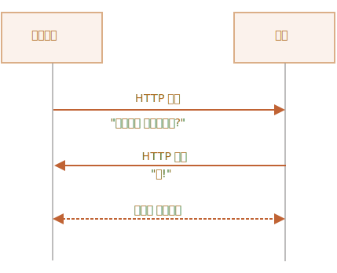
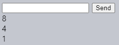

웹소켓
====

##### 웹소켓 프로토콜 <sub>([RFC6455](https://datatracker.ietf.org/doc/html/rfc6455) 명세서)</sub>
- 데이터 교환 시
  - 서버 · 브라우저 간 연결 유지
- 데이터 전달
  - '패킷 <sub>(packet)</sub>' 형태
- 양방향 전송
  - 연결 중단 X
  - 추가 HTTP 요청 X

##### 지속적인 데이터 교환 발생 서비스 유용
- 온라인 게임
- 주식 트레이딩 시스템
- 기타 등등

### 간단한 예시

##### 웹소켓 연결 생성
- `new WebSocket` <sub>(생성자)</sub>
  - `ws` <sub>(특수 프로토콜)</sub> 사용
```javascript
let socket = new WebSocket("ws://javascript.info");
```

##### `ws` · `wss` <sub>(프로토콜)</sub>
- HTTP · HTTPS <sub>(프로토콜)</sub> 관계 유사

<br />

 **`wss` <sub>(프로토콜)</sub> 항상 사용 권장**

##### `ws` <sub>(프로토콜)</sub>
- 데이터 전송 시 암호화 X
  - 데이터 그대로 노출
- 아주 오래된 프락시 서버
  - 웹소켓 인지 불가능
  - '이상한' 헤더 포함 요청 판단
    - 연결 종료

##### `wss` <sub>(프로토콜 · 보안성 · 신뢰성 ↑)</sub>
- 데이터 전송 시 보안 계층 통과
  - TSL <sub>(Transport Layer Security)</sub>
  - 암호화 <sub>(송신자)</sub>
  - 복호화 <sub>(수신자)</sub>
- 프락시 서버
  - 패킷 내부 열람 불가능

<br />

##### 이벤트 <sub>(4개)</sub>
- `open`
  - 연결 정상 생성
- `message`
  - 데이터 수신
- `error`
  - 에러
- `close`
  - 연결 종료

##### 연결 생성 후 데이터 전송
- `send(data)` <sub>(메서드)</sub>
```javascript
let socket = new WebSocket("wss://javascript.info/article/websocket/demo/hello");

socket.onopen = function(e) {
  alert("[open] 연결이 만들어졌습니다.");
  alert("데이터를 서버에 전송해봅시다.");

  socket.send("My name is Bora");
};

socket.onmessage = function(event) {
  alert(`[message] 서버로부터 전송받은 데이터: ${event.data}`);
};

socket.onclose = function(event) {
  if (event.wasClean) {
    alert(`[close] 연결이 정상적으로 종료되었습니다(code=${event.code} reason=${event.reason})`);
  } else {

    /* event.code == 1006
     非HTTP 에러
     - 프로세스 문제 발생
     - 네트워크 장애 발생
     - 기타 등등
     */
    alert('[close] 연결이 죽었습니다.');
  }
};

socket.onerror = function(error) {
  alert(`[error]`);
};
```
```javascript
/* server.js (간이 Node.js 서버) */
const http = require('http');
const ws = require('ws');

const wss = new ws.Server({ noServer: true });

function accept(req, res) {

  // 웹소켓 요청 외 제외
  if (!req.headers.upgrade || req.headers.upgrade.toLowerCase() != 'websocket') {
    res.end();
    return;
  }

  // 연결 설정
  // - keep-alive
  // - Upgrade
  if (!req.headers.connection.match(/\bupgrade\b/i)) {
    res.end();
    return;
  }

  wss.handleUpgrade(req, req.socket, Buffer.alloc(0), onConnect);
}

function onConnect(ws) {
  ws.on('message', function (message) {
    let name = message.match(/([\p{Alpha}\p{M}\p{Nd}\p{Pc}\p{Join_C}]+)$/gu) || "Guest";

    ws.send(`Hello from server, ${name}!`);

    setTimeout(() => ws.close(1000, "Bye!"), 5000);
  });
}

if (!module.parent) {
  http.createServer(accept).listen(8080);
} else {
  exports.accept = accept;
}
```

##### 이벤트 발생 순서
1. `open`
2. `message`
3. `close`

### 웹소켓 핸드셰이크

##### 소켓 생성 <sub>(`new WebSocket(url)`)</sub>
- 즉시 연결 시작

##### 연결 유지 중 진행과정
1. 브라우저 → 서버 <sub>(요청)</sub>
    - 웹소켓 지원 여부 질의 <sub>(헤더)</sub>
2. 브라우저 ← 서버 <sub>(응답)</sub>
    - 긍정 응답
3. 브라우저 ↔ 서버 <sub>(통신)</sub>
    - HTTP <sub>(프로토콜)</sub> X
    - 웹소켓 <sub>(프로토콜)</sub> 사용



#### 클라이언트 최초 요청 전송 <sub>(요청 헤더)</sub>
```javascript
// 연결 생성
new WebSocket("wss://javascript.info/chat")
```
```http
// 최초 요청 헤더
GET /chat
Host: javascript.info
Origin: https://javascript.info
Connection: Upgrade
Upgrade: websocket
Sec-WebSocket-Key: Iv8io/9s+lYFgZWcXczP8Q==
Sec-WebSocket-Version: 13
```

##### `Origin`
- 클라이언트 오리진
  - `https://javascript.info`
- 서버
  - 소켓 통신 여부 결정
- 웹소켓 객체
  - 크로스 오리진 요청 기본 지원
- 웹소켓 통신 전용 헤더 · 제약 無
- 구식 서버 웹소켓 통신 미지원
  - 호환성 문제 無

##### `Connection: Upgrade`
- 클라이언트 측 특정 신호 전송
  - "프로토콜 변경 요구"

##### `Upgrade: websocket`
- 클라이언트 측 요청 프로토콜
  - 'websocket'

##### `Sec-WebSocket-Key`
- 브라우저 생성 키 <sub>(보안 용도)</sub>
  - 서버 측 웹소켓 <sub>(프로토콜)</sub> 지원 여부 확인
- 무작위 생성
  - 프락시 캐싱 방지

##### `Sec-WebSocket-Version`
- 웹소켓 <sub>(프로토콜)</sub> 버전
  - `13`

<br />

 **웹소켓 핸드셰이크 모방 불가능**

##### 헤더 설정 기본 불가능 <sub>(순수 JS)</sub>
- HTTP 요청 <sub>(유사 헤더 포함)</sub> 모방 불가능
  - `XMLHttpRequest` <sub>(객체)</sub>
  - `fetch` <sub>(메서드)</sub>

<br />

#### 서버 최초 응답 전송 <sub>(응답 헤더)</sub>

##### 클라이언트 측 웹소켓 통신 요청 최초 수신
- 통신 동의 시 `101` <sub>(상태 코드)</sub> 응답 전송
```http
101 Switching Protocols
Upgrade: websocket
Connection: Upgrade
Sec-WebSocket-Accept: hsBlbuDTkk24srzEOTBUlZAlC2g=
```

##### `Sec-WebSocket-Accept`
- `Sec-WebSocket-Key` <sub>(최초 요청 헤더)</sub> 값
  - 특별 알고리즘 적용
- 서버 측 웹소켓 <sub>(프로토콜)</sub> 지원 여부
  - 브라우저 실질적 확인

##### 핸드셰이크 종료 후 데이터 전송 시작
- HTTP <sub>(프로토콜)</sub> X
- 웹소켓 <sub>(프로토콜)</sub> 사용

#### 확장 · 서브 프로토콜 헤더 <sub>(웹소켓 통신 추가 지원)</sub>

##### `Sec-WebSocket-Extensions`
- 웹소켓 <sub>(프로토콜)</sub> 기능 확장
- 자동 생성 <sub>(브라우저)</sub>
- 임의값 나열
  - 데이터 전송 관련
  - 웹소켓 <sub>(프로토콜)</sub> 기능 확장 관련
- `deflate-frame` <sub>(헤더 값)</sub>
  - 데이터 압축 <sub>(deflate)</sub> 지원 <sub>(브라우저)</sub>

##### `Sec-WebSocket-Protocol`
- 서브 프로토콜 사용해 데이터 전송
- 프로토콜명 나열
  - 해당 프로토콜 준수 데이터 전송
- `soap, wamp` <sub>(헤더 값)</sub>
  - [SOAP](https://en.wikipedia.org/wiki/SOAP) <sub>(프로토콜)</sub>
  - WAMP <sub>(프로토콜)</sub>
- [IANA 카탈로그](https://www.iana.org/assignments/websocket/websocket.xml)
  - 웹소켓 지원 서브 프로토콜 목록
  - 사용 예정 데이터 포맷 확인 <sub>(개발자)</sub>

##### 추가 지원 요청 헤더 설정 <sub>(클라이언트)</sub>
- `new WebSocket` <sub>(생성자)</sub> 2번째 매개변수
```javascript
// 서브 프로토콜 (SOAP · WAMP) 설정
let socket = new WebSocket("wss://javascript.info/chat", ["soap", "wamp"]);
```

##### 추가 지원 응답 헤더 값 <sub>(서버)</sub>
- 지원 가능 확장 · 프로토콜

##### 확장 · 서브 프로토콜 헤더 예시
- 요청 헤더
```http
GET /chat
Host: javascript.info
Upgrade: websocket
Connection: Upgrade
Origin: https://javascript.info
Sec-WebSocket-Key: Iv8io/9s+lYFgZWcXczP8Q==
Sec-WebSocket-Version: 13

// 요청 확장
Sec-WebSocket-Extensions: deflate-frame

// 요청 서브 프로토콜
Sec-WebSocket-Protocol: soap, wamp
```
- 응답 헤더
```http
101 Switching Protocols
Upgrade: websocket
Connection: Upgrade
Sec-WebSocket-Accept: hsBlbuDTkk24srzEOTBUlZAlC2g=

// 서버 지원 확장
Sec-WebSocket-Extensions: deflate-frame

// 서버 지원 서브 프로토콜
Sec-WebSocket-Protocol: soap
```

### 데이터 전송

##### 웹소켓 통신
- '프레임' <sub>(데이터 조각)</sub> 사용
  - 서버 · 클라이언트 양측 전송 가능

##### 프레임 구분 <sub>(내부 데이터 종류)</sub>
- 텍스트 프레임
  - 텍스트 데이터
- 이진 데이터 프레임
  - 이진 데이터
- 핑 · 퐁 프레임
  - 연결 유지 확인용 프레임
  - 자동 생성 · 전송
- 연결 종료 프레임
- 기타 등등

##### `send(body)` <sub>(브라우저 웹소켓 객체 메서드)</sub>
- 텍스트 · 이진 데이터만 전송 가능
- `body`
  - 문자열
  - `Blob` <sub>(객체)</sub>
  - `ArrayBuffer` <sub>(객체)</sub>
- 데이터 종류 따라 특별 설정 無

##### 데이터 수신
- 텍스트
  - 항상 문자열
- 이진 데이터 <sub>(포맷 선택 가능)</sub>
  - `Blob` <sub>(객체)</sub>
  - `ArrayBuffer` <sub>(객체)</sub>

##### `binaryType` <sub>(프로퍼티)</sub>
- 수신 이진 데이터 포맷 명시
  - `"blob"` <sub>(기본값 · `Blob` 객체)</sub>
  - `"arraybuffer"` <sub>(`ArrayBuffer` 객체)</sub>

##### `Blob` <sub>(고차원 이진 객체)</sub>
- 태그 <sub>(`<a>` · `` 등)</sub> 바로 통합 가능
  - 기본값 적절

##### `ArrayBuffer` <sub>(객체)</sub>
- 개별 바이트 접근 용이
```javascript
socket.binaryType = "arraybuffer";
socket.onmessage = (event) => {
  /* event.data
   텍스트
   - 문자열
   이진 데이터
   - ArrayBuffer (객체)
};
```

### 전송 제한

##### 앱 내 데이터 전송량 多 · 느린 네트워크 상황
- 앱 측 `send(data)` <sub>(메서드)</sub> 계속 호출 가능
  - 메모리 내 데이터 쌓임 <sub>(버퍼)</sub>
  - 적정 네트워크 속도 도달 시 송신

##### `bufferedAmount` <sub>(프로퍼티)</sub>
- 메모리 내 쌓인 바이트 크기
  - 송신 대기 중인 현재 시점
- 소켓 전송 사용 가능 여부 확인
```javascript
// 100ms마다 소켓 확인
// - 쌓여있는 바이트 부재 시만 데이터 추가 전송
setInterval(() => {
  if (socket.bufferedAmount == 0) {
    socket.send(moreData());
  }
}, 100);
```

### 연결 닫기

##### 연결 주체 <sub>(브라우저 · 서버)</sub> 중 한쪽
- '연결 종료 프레임' 전송
  - 코드 <sub>(숫자)</sub>
  - 사유 <sub>(문자)</sub>
```javascript
socket.close([code], [reason]);
```
- `[code]`
  - 특수 코드
  - 연결 닫을 때 사용
- `[reason]` <sub>(문자열)</sub>
  - 연결 닫는 사유 설명

##### 반대쪽 `close` <sub>(이벤트)</sub> 핸들러
- 코드 · 사유 확인
```javascript
// 닫기 요청 주체
socket.close(1000, "Work complete");

// 닫기 응답 주체
socket.onclose = event => {
  // event.code === 1000
  // event.reason === "작업 완료"
};
```

##### 일부 코드 <sub>([RFC6455, §7.4.1](https://datatracker.ietf.org/doc/html/rfc6455#section-7.4.1))</sub>

- `1000` <sub>(기본값 · 자주 사용)</sub>
  - 정상 종료
- `1006` <sub>(자주 사용)</sub>
  - 연결 유실 <sub>(연결 종료 프레임 X)</sub>
  - 코드 수동 설정 불가능 시 사용
- `1001`
  - 연결 주체 중 한쪽 종료
    - 서버 셧다운
    - 브라우저 페이지 종료
    - 기타 등등
- `1009`
  - 메시지 너무 커서 처리 불가능
- `1011`
  - 서버 측 비정상 에러 발생
- 기타 등등

##### 웹소켓 코드 ≠ HTTP 코드
- `1000` 미만 값
  - 예약 값 <sub>(설정 시 에러)</sub>
```javascript
// 연결 유실
socket.onclose = event => {
  // event.code     === 1006
  // event.reason   === ""
  // event.wasClean === false (연결 종료 프레임 X)
};
```

### 연결 상태

##### `readyState` <sub>(프로퍼티 · 연결 상태)</sub>

|값|상태|
|---|---|
|`0`|연결 중|
|`1`|연결 성립 후 통신 중|
|`2`|연결 종료 중|
|`3`|연결 종료|

### 채팅 앱 만들기

##### 앱 구성
- 브라우저 웹소켓 API
- Node.js 웹소켓 모듈

##### HTML
- `<form>`
  - 메시지 전송
- `<div>`
  - 수신 메시지 표시
```html
<!-- 전송 메시지 폼 (form) -->
<form name="publish">
  <input type="text" name="message">
  <input type="submit" value="전송">
</form>

<!-- 수신 메시지 표시 (div) -->
<div id="messages"></div>
```

##### JS 기능 구현
1. 연결 생성
2. 폼 제출 <sub>(메시지 전송)</sub>
    - `send(message)` <sub>(메서드)</sub>
3. 메시지 수신 처리
    - `<div id="messages">`
      - 수신 메시지 추가
```javascript
let socket = new WebSocket("wss://javascript.info/article/websocket/chat/ws");

// 폼 메시지 전송
document.forms.publish.onsubmit = function() {
  let outgoingMessage = this.message.value;

  socket.send(outgoingMessage);
  return false;
};

// 메시지 수신 · <div id="messages"> 내 표시
socket.onmessage = function(event) {
  let message = event.data;
  let messageElem = document.createElement('div');

  messageElem.textContent = message;
  document.getElementById('messages').prepend(messageElem);
}
```

##### 서버 코드 <sub>(Node.js)</sub> 알고리즘
1. 소켓 그룹 생성
```javascript
clients = new Set();
```
2. 생성된 개별 연결
    - 소켓 그룹 내 추가
    - `message` <sub>(이벤트)</sub> 리스너 설정
      - 메시지 수신 처리
```javascript
clients.add(socket);
```
3. 메시지 수신
    - 소켓 그룹 순회 · 메시지 전달
4. 연결 종료
    - 소켓 그룹 내 해당 연결 제거
```javascript
clients.delete(socket);
```

##### 서버
```javascript
const ws = new require('ws');
const wss = new ws.Server({noServer: true});

const clients = new Set();

http.createServer((req, res) => {
  …
  // 웹소켓 연결 처리
  wss.handleUpgrade(req, req.socket, Buffer.alloc(0), onSocketConnect);
  …
});

function onSocketConnect(ws) {
  clients.add(ws);

  ws.on('message', function(message) {

    // 메시지 최대 길이
    message = message.slice(0, 50);

    for (let client of clients) {
      client.send(message);
    }
  });

  ws.on('close', function() {
    clients.delete(ws);
  });
}
```



<br />

요약
====

##### 웹소켓
- 브라우저 · 서버 간 지속적인 연결 유지
  - 현대 방식

##### 특징
- 크로스 오리진 한계 無
- 광범위한 브라우저 지원
- 데이터 송 · 수신
  - 문자열
  - 이진 데이터

##### 메서드
- `send(data)`
- `close([code], [reason])`

##### 이벤트
- `open`
- `message`
- `error`
- `close`

##### 웹소켓 자체 미구현 기능
- 재연결
- 인증
- 다수 고차원 동작
- 기타 등등

##### 자체 미구현 기능 해결
1. 서버 · 클라이언트 라이브러리 사용
2. 직접 구현

##### 웹소켓 → 기존 프로젝트 통합 <sub>(일부 방법)</sub>
- 웹소켓 · HTTP 서버 병행 구동
  - 단일 DB 공유
- 요청 수신 시 도메인 구분
  - `wss://ws.site.com` <sub>(서브도메인)</sub>
    - 웹소켓 서버
  - `https://site.com`
    - HTTP 서버
- 기타 통합 방법 有

[데이터 프레이밍 공식 문서](https://datatracker.ietf.org/doc/html/rfc6455#section-5)
