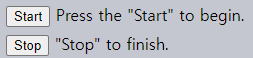

SSE <sub>(Server-Sent Events)</sub>
====

##### [SSE](https://html.spec.whatwg.org/multipage/comms.html#the-eventsource-interface) <sub>(Server-Sent Events)</sub> 명세서
- `EventSource` <sub>(내장 클래스)</sub>
  - 서버 연결 유지
  - 서버 이벤트 수신

##### 지속적인 연결
- 웹소켓 유사

##### 웹소켓 vs `EventSource` <sub>(클래스)</sub>
||웹소켓|`EventSource` <sub>(클래스)</sub>|
|---|---|---|
|방향|양방향 <sub>(서버 ↔ 클라이언트)</sub>|단방향 <sub>(서버 → 클라이언트)</sub>|
|데이터|- 텍스트<br />- 이진 데이터|텍스트|
|프로토콜|웹소켓 <sub>(프로토콜)</sub>|일반 HTTP|

##### `EventSource` <sub>(클래스)</sub>
- 웹소켓 대비 기능 부족
  - 중 · 소규모 앱 적용 시 충분

##### 간단한 사용법 <sub>(사용 이유)</sub>
- 데이터 스트림 수신 <sub>(`EventSource`)</sub>
  - 채팅 메시지
  - 가격
  - 기타 등등
- 자동 재연결 지원
  - 웹소켓 직접 구현 필요 기능
- 일반 HTTP <sub>(프로토콜)</sub>
  - 별도 프로토콜 불필요

### 메시지 수신

##### 객체 생성 <sub>(`new EventSource(url)`)</sub>
- `url` 연결 <sub>(브라우저)</sub>
- 연결 유지 <sub>(이벤트 대기)</sub>

##### 서버 응답
- `200` <sub>(코드)</sub>
- `Content-Type: text/event-stream` <sub>(헤더)</sub>

##### 서버 연결 유지 · 특정 형식 메시지 전송
```http
data: Message 1

data: Message 2

data: Message 3
data: of two lines
```

##### 메시지 형식
- `data:` + 메시지 텍스트
  - `:` <sub>(콜론)</sub> 다음 공백 선택적
    - `data:…`
    - `data: …`
- 메시지 구분
  - `\n\n`
- 새 줄 <sub>(`\n`)</sub> 표시
  - 즉시 `data:` 1개 더 전송

##### 복잡한 메시지 <sub>(실무)</sub>
- 보통 JSON 인코딩 후 전송
- 새 줄 <sub>(`n`)</sub> 표시
  - JSON 내 포함 인코딩
  - 새 줄 전용 `data:` 불필요
```javascript
data: {"user":"Jay","message":"Line\n New line"}
```

##### `data:` 1개 → 메시지 1개
- 각 메시지
  - `message` <sub>(이벤트)</sub> 발생
```javascript
let eventSource = new EventSource("/events/subscribe");

// onmessage (프로퍼티)
eventSource.onmessage = function(event) {
  `New message: ${event.data}`;
  …
};

// addEventListener (메서드)
eventSource.addEventListener('message', function(event) {
  `New message: ${event.data}`;
  …
});
```

#### 크로스 오리진 요청

##### `EventSource` <sub>(클래스)</sub>
- 크로스 오리진 요청 지원
  - 모든 url 사용 가능
```javascript
let source = new EventSource("https://another-site.com/events");
```

##### 외부 서버
- 수신 헤더
  - `Origin`
- 필수 송신 헤더
  - `Access-Control-Allow-Origin`

##### 인증 정보 전달
- `withCredentials` <sub>(옵션)</sub> 설정
```javascript
let source = new EventSource("https://another-site.com/events", {
  withCredentials: true
});
```

### 재연결

##### `EventSource` <sub>(객체)</sub>
- 생성 시 즉시 서버 연결
- 연결 문제 발생 시 재연결 진행
- 모두 자동 실행
  - 편의성 ↑

##### 재연결 사이 짧은 지연 발생
- 기본 수초

##### `retry:` <sub>(ms)</sub>
- 재연결 시 권장 지연시간 <sub>(서버 응답)</sub>
- 단독 · 메시지 함께 전송 가능
```http
retry: 15000
data: Hello, I set the reconnection delay to 15 seconds
```

##### 재연결 시 권장 지연시간 · 그 이상 대기 <sub>(브라우저)</sub>
- OS 단계 네트워크 종료 감지 후
  - 연결 생성 대기 필요 <sub>(재연결 전)</sub>

##### 연결 중단
- 서버 재연결 중단
  - `204` <sub>(상태 코드)</sub> 응답
- 브라우저 연결 종료
  - `close()` <sub>(메서드)</sub> 호출
```javascript
let eventSource = new EventSource(…);
…
eventSource.close();
```

##### 이 외 재연결 중단
- 원인
  - 부적절한 `Content-Type` <sub>(응답 헤더)</sub>
  - 특정 상태 코드 <sub>(응답)</sub> 외
    - `301`
    - `307`
    - `200`
    - `204`
- 결과
  1. `error` <sub>(이벤트)</sub> 발생
  2. 재연결 미실행 <sub>(브라우저)</sub>

<br />

 **주의**

##### 연결 종료 시 복구 X
- 새 연결 생성 <sub>(새 `EventSource` 객체 생성)</sub>

<br />

### 메시지 ID

##### 문제 발생해 연결 종료 시
- 양측 특정 메시지 수신 여부 불명확
  - `id` 필드 사용 <sub>(메시지 수신 여부 확인)</sub>
```http
data: Message 1
id: 1

data: Message 2
id: 2

data: Message 3
data: of two lines
id: 3
```

##### 메시지 <sub>(`id:` 포함)</sub> 수신 시 동작 <sub>(브라우저)</sub>
1. `lastEventId` <sub>(프로퍼티)</sub> 값 할당
2. 재연결 시 `Last-Event-ID` <sub>(헤더)</sub> 값 설정
   - 서버 해당 ID 다음 메시지 재전송

<br />

 **`data:` 다음 `id:`**

##### `data:` 다음 줄 `id:` 추가 <sub>(서버)</sub>
- `lastEventId` <sub>(프로퍼티)</sub> 값 갱신
  - 메시지 수신 후 수행

<br />

### `readyState` <sub>(프로퍼티 · 연결 상태)</sub>

##### 값 <sub>(3가지)</sub>
```javascript
// [재]연결중
EventSource.CONNECTING = 0;

// 연결 완료
EventSource.OPEN = 1;

// 연결 종료
EventSource.CLOSED = 2;
```

##### 객체 생성 · 연결 문제 발생 시 연결 상태
- 항상 `EventSource.CONNECTING` <sub>(`0`)</sub>

### 이벤트 타입

##### `EventSource` <sub>(객체)</sub> 기본 이벤트
- `message`
  - 메시지 수신
  - `event.data` <sub>(수신 데이터)</sub>
- `open`
  - 연결 생성 완료
- `error`
  - 연결 생성 불가능
  - ex\) 서버 `500` <sub>(상태 코드)</sub> 응답

##### 기타 <sub>(커스텀)</sub> 이벤트 발생 가능
- `event:`
  - `data:` 이전 줄 위치
```http
event: join
data: Bob

data: Hello

event: leave
data: Bob
```

##### 기타 <sub>(커스텀)</sub> 이벤트 처리 <sub>(핸들러 설정)</sub>
- `onmessage` <sub>(프로퍼티)</sub> X
- `addEventListener` <sub>(메서드)</sub> 사용
```javascript
eventSource.addEventListener('join', event => {
  `Joined ${event.data}`;
});

eventSource.addEventListener('message', event => {
  `Said: ${event.data}`;
});

eventSource.addEventListener('leave', event => {
  `Left ${event.data}`;
});
```

### 전체 예시

##### 서버
- 특정 메시지 전송 후 연결 종료
  - `1`
  - `2`
  - `3`
  - `bye`

##### 브라우저
- 자동 재연결 실행

##### 결과



```html
<!-- index.html -->
<!DOCTYPE html>
<html>

<head></head>

<body>
  <button onclick="start()">Start</button> Press the "Start" to begin.
  <div id="logElem" style="margin: 6px 0"></div>
  <button onclick="stop()">Stop</button> "Stop" to finish.

  <script>
    let eventSource;

    // Start 버튼
    function start() {

      // IE · 구식 브라우저 미지원
      if (!window.EventSource) {
        "The browser doesn't support EventSource.";

        return;
      }

      eventSource = new EventSource('digits');

      eventSource.onopen = function(e) {
        log("Event: open");
      };

      eventSource.onerror = function(e) {
        log("Event: error");

        if (this.readyState == EventSource.CONNECTING) {
          log(`Reconnecting (readyState=${this.readyState})…`);
        } else {
          log("Error has occured.");
        }
      };

      eventSource.addEventListener('bye', function(e) {
        log("Event: bye, data: " + e.data);
      });

      eventSource.onmessage = function(e) {
        log("Event: message, data: " + e.data);
      };
    }

    // Stop 버튼
    function stop() {
      eventSource.close();

      log("eventSource.close()");
    }

    function log(msg) {
      logElem.innerHTML += msg + "<br>";
      document.documentElement.scrollTop = 99999999;
    }
  </script>
</body>

</html>
```
```javascript
/* server.js */
let http = require('http');
let url = require('url');
let querystring = require('querystring');

function onDigits(req, res) {
  res.writeHead(200, {
    'Content-Type': 'text/event-stream; charset=utf-8',
    'Cache-Control': 'no-cache'
  });

  let i = 0;
  let timer = setInterval(write, 1000);

  write();

  function write() {
    i++;

    if (i == 4) {
      res.write('event: bye\ndata: bye-bye\n\n');
      clearInterval(timer);
      res.end();
      return;
    }

    res.write('data: ' + i + '\n\n');
  }
}

function accept(req, res) {
  if (req.url == '/digits') {
    onDigits(req, res);
    return;
  }

  fileServer.serve(req, res);
}

if (!module.parent) {
  http.createServer(accept).listen(8080);
} else {
  exports.accept = accept;
}
```

<br />

요약
====

##### `EventSource` <sub>(내장 클래스)</sub>
- 지속적인 연결 자동 실행
- 서버 측 메시지 전달 수단

##### 기능
- 자동 재연결
  - 지연시간 <sub>(`retry:`)</sub> 설정 가능
- 메시지 ID <sub>(식별자)</sub>
  - `Last-Event-ID` <sub>(헤더)</sub> 값 <sub>(재연결 시)</sub>
    - 마지막 수신 메시지 ID
- 현재 상태 확인
  - `readyState` <sub>(프로퍼티)</sub>

##### 웹소켓
- 비교적 저수준 작업
- 일부 내장 기능 無 <sub>(구현 가능)</sub>

##### `EventSource` <sub>(클래스)</sub>
- 비교적 부족한 기능
  - 대다수 앱 적용 시 충분
- 대다수 모던 브라우저 지원 <sub>(IE 제외)</sub>

##### 문법
```javascript
let source = new EventSource(url, [credentials]);
```

##### `[credentials]` <sub>(`boolean`)</sub>
- 크로스 오리진 인증 정보 전송 여부

##### 크로스 오리진 보안
- 대체로 타 네트워크 메서드 동일
  - ex\) `fetch` <sub>(메서드)</sub> 등

#### `EventSource` <sub>(객체)</sub> 프로퍼티

##### `readyState`
- 현재 연결 상태
```javascript
// [재]연결중
EventSource.CONNECTING = 0;

// 연결 완료
EventSource.OPEN = 1;

// 연결 종료
EventSource.CLOSED = 2;
```

##### `lastEventId`
- 마지막 수신 메시지 `id`
- 재연결 시 `Last-Event-ID` <sub>(헤더)</sub> 값

#### 메서드

##### `close()`
- 연결 종료

#### 이벤트

##### `message`
- 메시지 수신
- `event.data` <sub>(수신 데이터)</sub>

##### `open`
- 연결 생성 완료

##### `error`
- 에러 <sub>(연결 생성 불가능)</sub>
  - 연결 유실 <sub>(재연결 실행)</sub>
  - 치명적인 에러 발생
- `readyState` <sub>(프로퍼티)</sub>
  - 재연결 여부 확인 가능

##### 서버 커스텀 이벤트명 설정
- `event:`
- 커스텀 이벤트 핸들러 설정 <sub>(클라이언트)</sub>
  - `on<event>` <sub>(프로퍼티)</sub> X
  - `addEventListener` <sub>(메서드)</sub> 사용

#### 서버 응답 형식

##### 메시지 구분자
- `\n\n`

#### 메시지 필드

##### `data:`
- 메시지 본문
- 연속된 다수 `data`
  - 단일 메시지 간주
  - 구분자
    - `\n`

##### `id:` <sub>(본문 다음 줄)</sub>
- `lastEventId` <sub>(프로퍼티)</sub> 값 갱신
  - 재연결 시 `Last-Event-ID` <sub>(헤더)</sub> 값

##### `retry:`
- 재연결 시 권장 지연시간 <sub>(서버 응답)</sub>
- JS 조작 X

##### `event:` <sub>(본문 이전 줄)</sub>
- 이벤트명

##### 메시지 내 다수 필드 포함 가능 <sub>(순서 무관)</sub>
- `id` <sub>(필드)</sub>
  - 보통 마지막 줄 위치
