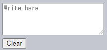

`[local·session]Storage`
====

##### 웹 스토리지 <sub>(storage)</sub> 객체
- 브라우저 내 키 · 값 쌍 저장
- 데이터 유지 기능 제공
  - 페이지 새로 고침 <sub>(`sessionStorage` 객체)</sub>
  - 브라우저 재실행 <sub>(`localStorage` 객체)</sub>

#### 웹 스토리지 객체 특징 <sub>(쿠키 대비)</sub>

##### 네트워크 요청 시 서버 미전송
- 더 많은 자료 저장 가능
  - 최소 2MB · 이상 <sub>(대다수 브라우저)</sub>
- 구성 방식 설정 가능

##### HTTP 헤더 통해 스토리지 객체 조작 <sub>(서버)</sub> 불가능
- 모든 웹 스토리지 객체 조작
  - JS 내 수행

##### 오리진 <sub>(도메인 · 프로토콜 · 포트)</sub> 종속
- 타 프로토콜 · 서브도메인
  - 데이터 접근 불가능

##### 메서드 · 프로퍼티
- `setItem(key, value)`
  - 키 · 값 <sub>(`key · value`)</sub> 쌍 저장
- `getItem(key)`
  - 키 <sub>(`key`)</sub> 해당 값 접근
- `removeItem(key)`
  - 키 <sub>(`key`)</sub> 해당 값 제거
- `clear()`
  - 전체 제거
- `key(index)`
  - 인덱스 <sub>(`index`)</sub> 해당 키 접근
- `length`
  - 저장 항목 개수

##### `Map` <sub>(내장 객체)</sub> 유사 <sub>(차이점 有)</sub>
- 요소 조작 메서드 지원 <sub>(유사점)</sub>
  - `[g·s]etItem`
  - `removeItem`
- 인덱스 사용해 키 접근 가능
  - `key(index)`

### `localStorage` <sub>(객체)</sub>

##### 주요 기능
- 동일 오리진 내 모든 탭 · 창
  - 데이터 공유
- 브라우저 · OS 재시작 시
  - 데이터 유지

#### 데이터 유지 확인

##### 1. 값 저장
```javascript
localStorage.setItem('test', 1);
```

##### 2. 저장 값 확인
- 브라우저 재시작
- 타 창 내 해당 페이지 열기
```javascript
/* 타 창 내 해당 (값 저장) 페이지 */
localStorage.getItem('test'); // 1
```

##### 동일 오리진 <sub>(도메인 · 포트 · 프로토콜)</sub> 내 모든 창
- `localStorage` <sub>(객체)</sub> 공유 <sub>(url 경로 무관)</sub>
  - 창 사이 데이터 저장 · 접근 가능

### 일반 객체 방식 사용

##### 일반 객체 방식 사용 가능
```javascript
// 값 저장
localStorage.test = 2;

// 값 접근
localStorage.test; // 2

// 값 제거
delete localStorage.test;
```

#### 하위 호환성 유지 목적 <sub>(지양)</sub>

##### 1. 객체 내부 프로퍼티 키 사용 가능
- `length` · `toString` · 내장 메서드 등
  - `[g·s]etItem` 정상 작동
- 일반 객체 취급 시 에러 발생 가능
```javascript
let key = 'length';

// 내부 프로퍼티 키 사용 시 에러
localStorage[key] = 5; // TypeError: Cannot assign to read only property 'length' …
```

##### 2. `storage` <sub>(이벤트)</sub> 미발생
- 저장 데이터 수정 시 발생
- 일반 객체 방식 취급 시 미발생

### 키 순회

##### 전체 키 · 값 쌍 접근
- `iterable` <sub>(객체)</sub> X
- 배열 취급
```javascript
for (let i = 0; i < localStorage.length; i++) {
  let key = localStorage.key(i);
  `${key}: ${localStorage.getItem(key)}`;
}
```

##### `for…in` <sub>(반복문)</sub> 사용 가능
- 불필요 내장 필드 출력
```javascript
for (let key in localStorage) {
  key; // …, getItem, setItem, …
}
```
- `hasOwnProperty` <sub>(메서드)</sub>
  - 프로토타입 상속 필드 제외
```javascript
for (let key in localStorage) {

  // 내장 필드 ([g·s]etItem 등) 생략
  if (!localStorage.hasOwnProperty(key)) {
    continue;
  }

  `${key}: ${localStorage.getItem(key)}`;
}
```

##### `Object.keys(…)`
- 객체 내 정의 키만 반환
- 프로토타입 상속 키 무시
```javascript
let keys = Object.keys(localStorage);

for (let key of keys) {
  `${key}: ${localStorage.getItem(key)}`;
}
```

### 문자열만 사용

#### `localStorage` <sub>(객체)</sub> 키 · 값 자료형

##### 문자열 사용 필수
- 타 자료형 <sub>(숫자 · 객체 등)</sub>
  - `string` 자동 형 변환
```javascript
localStorage.user = {name: "John"};

localStorage.user; // [object Object]
```
- `JSON`
  - 객체 형태 저장 가능
```javascript
localStorage.user = JSON.stringify({name: "John"});
…
let user = JSON.parse(localStorage.user);
user.name; // John
```
- 스토리지 객체 전체 문자열 변환 가능
  - 디버깅 등 용도
```javascript
JSON.stringify(localStorage, null, 2);
```

### `sessionStorage` <sub>(객체)</sub>

##### `localStorage` <sub>(객체)</sub> 비해 사용 빈도 ↓
- 프로퍼티 · 메서드 동일
- 훨씬 제한적인 사용법

##### 현재 탭 내에서만 유지
- 타 탭 내 동일 페이지
  - 데이터 공유 X
- 탭 내 다수 `iframe`
  - 데이터 공유 <sub>(동일 오리진 취급)</sub>

##### 저장 데이터 유지성
- 페이지 새로 고침
  - 데이터 유지
- 탭 닫고 새로 열기
  - 데이터 유실

#### 데이터 유지 확인

##### 1. 값 저장
```javascript
sessionStorage.setItem('test', 1);
```

##### 2. 저장 값 확인
- 해당 페이지 새로 고침
- 타 탭 내 해당 페이지 접속 후 실행
  - `null` 반환
```javascript
/* 해당 (값 저장) 페이지 새로 고침 */
sessionStorage.getItem('test'); // 1
```
```javascript
/* 타 탭 내 해당 (값 저장) 페이지 */
sessionStorage.getItem('test'); // null
```

##### 오리진 · 브라우저 탭 종속
- 낮은 사용 빈도 이유

### [`storage`](https://html.spec.whatwg.org/multipage/#the-storage-event) <sub>(이벤트)</sub>

##### 발생 시점
- 웹 스토리지 객체 내 데이터 갱신

##### 프로퍼티
- `key`
  - 변경된 데이터 키
  - `null` <sub>(`clear()` 호출 시)</sub>
- `oldValue`
  - 이전 값
  - `null` <sub>(새 키 추가 시)
- `newValue`
  - 새 값
  - `null` <sub>(키 제거 시)</sub>
- `url`
  - 갱신 발생 문서 url
- `storageArea`
  - 갱신 발생 객체
    - `localStorage`
    - `sessionStorage`

##### 발생 대상
- 이벤트 발생 스토리지 X
- 스토리지 접근 가능한 모든 `window` <sub>(전역 객체)</sub>

##### 창 2개 <sub>(동일 사이트 접속)</sub>
- `localStorage` <sub>(객체)</sub> 공유
- 둘 다 `storage` <sub>(이벤트)</sub> 수신
  - 각 창 내 데이터 갱신 공유
```javascript
// 타 문서 · 동일 스토리지 갱신 반영
// - 데이터 갱신 공유

// window.addEventListener('storage', () => {
window.onstorage = event => {
  if (event.key != 'now') {
    return;
  }

  event.key + ':' + event.newValue + " at " + event.url;
};

localStorage.setItem('now', Date.now());
```

#### 이벤트 객체 추가 프로퍼티

##### `url`
- 데이터 갱신 발생 문서 url

##### `storageArea`
- 실제 데이터 수정 발생 스토리지 참조
  - 스토리지 종류 무관
- `storage` <sub>(이벤트)</sub>
  - 두 스토리지 갱신 시 모두 발생
    - `localStorage` <sub>(객체)</sub>
    - `sessionStorage` <sub>(객체)</sub>

#### 동일 오리진 내 창 사이 메시지 교환

##### [브로드캐스트 채널 API](https://developer.mozilla.org/en-US/docs/Web/API/Broadcast_Channel_API) <sub>(모던 브라우저 지원)</sub>
- 풍부한 기능
- 대중화 부족

##### `localStorage` <sub>(객체)</sub> 기반 다수 폴리필
- 브로드캐스트 채널 API 단점 극복
- 브라우저 종류 무관

<br />

요약
====

##### 웹 스토리지 객체 <sub>(`[local·session]Storage`)</sub>
- 브라우저 내 키 · 값 쌍 저장

##### 특징
- 키 · 값 자료형
  - 문자열만 가능
- 제한 용량
  - 최소 2MB 이상 <sub>(브라우저별 상이)</sub>
- 데이터 유지
- 오리진 <sub>(도메인 · 포트 · 프로토콜)</sub> 종속

||`localStorage` <sub>(객체)</sub>|`sessionStorage` <sub>(객체)</sub>|
|---|---|---|
|공유|창 · 탭 <sub>(동일 오리진)</sub>|탭 · `iframe` <sub>(동일 오리진)</sub>|
|유지|브라우저 재실행|페이지 새로 고침|
|유실||브라우저 · 탭 종료|

##### API
- `setItem(key, value)`
  - 키 · 값 <sub>(`key · value`)</sub> 쌍 저장
- `getItem(key)`
  - 키 <sub>(`key`)</sub> 해당 값 접근
- `removeItem(key)`
  - 키 <sub>(`key`)</sub> 해당 값 제거
- `clear()`
  - 전체 제거
- `key(index)`
  - 인덱스 <sub>(`index`)</sub> 해당 키 접근
- `length`
  - 저장 항목 개수
- `Object.keys(…)`
  - 전체 키 접근
- 일반 객체 방식 키 접근 <sub>(≒ 객체 내 프로퍼티)</sub>
  - `storage` <sub>(이벤트)</sub> 미발생

#### `storage` <sub>(이벤트)</sub>

##### 스토리지 내 데이터 갱신 메서드 호출 시 발생
- `setItem`
- `removeItem`
- `clear`

##### 이벤트 객체 내 정보
- 연산 관련 데이터 전체
  - `key`
  - `oldValue`
  - `newValue`
- `url` <sub>(문서 url)</sub>
- `storageArea` <sub>(스토리지 객체)</sub>

##### 발생 위치
- 이벤트 생성 위치 X
- 스토리지 접근 가능한 모든 `window` <sub>(객체)</sub>
  - `localStorage` <sub>(전역)</sub>
  - `sessionStorage` <sub>(탭 내)</sub>

<br />

##  과제

### 양식 필드 자동 저장

##### `textarea` <sub>(필드)</sub> 작성
- 변화 발생 시 값 자동 저장
- 사용자 실수로 페이지 종료 시
  - 재시작 후 종료 당시 상태 원복



<br />


[정답](https://plnkr.co/edit/QJ3jYf9Ximu0BUjQ?p=preview)
