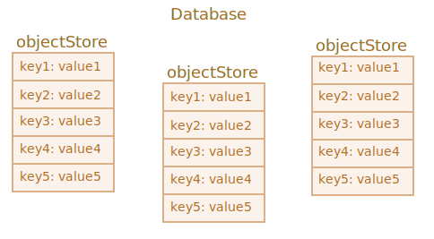

`indexedDB`
====

##### 브라우저 내장 DB
- `localStorage` <sub>(객체)</sub> 보다 강력

##### 기능
- 거의 모든 값 저장 가능
- 다양한 키 타입 가능
- 트랜잭션 지원 <sub>(신뢰성 ↑)</sub>
- 키 범위 질의 · 인덱스 지원
- `localStorage` <sub>(객체)</sub> 보다 큰 용량 저장 가능

##### 용도
- 일반적인 클라이언트 - 서버 앱 X <sub>(과분)</sub>
- 오프라인 앱
  - 타 기술 함께 사용 <sub>(`ServiceWorkers` 등)</sub>

##### [내장 `IndexedDB` 인터페이스](https://www.w3.org/TR/IndexedDB)
- 이벤트 기반

##### `async` · `await` 사용 가능
- `Promise` <sub>(객체)</sub> 기반 래퍼 객체 필요
  - ex\) [jakearchibald/idb](https://github.com/jakearchibald/idb)
- 편의성 ↑
- 불완전한 래퍼 객체
  - 모든 부분 대체 불가능

### DB 연결

##### `open` <sub>(메서드)</sub>
- DB 연결

##### 문법
```javascript
let openRequest = indexedDB.open(name, version);
```
- `name` <sub>(문자열)</sub>
  - DB명
- `version` <sub>(양의 정수)</sub>
  - `1` <sub>(기본값)</sub>
- 반환 값
  - `IDBOpenDBRequest` <sub>(객체)</sub>

##### 다수 DB 연결 가능
- 동일 오리진 <sub>(도메인 · 프로토콜 · 포트)</sub> 종속
- 상이 오리진 접근 불가능

#### `IDBOpenDBRequest` <sub>(객체)</sub>

##### `success` <sub>(이벤트)</sub>
- DB 연결 성공

##### `error` <sub>(이벤트)</sub>
- DB 연결 실패

##### `upgradeneeded` <sub>(이벤트)</sub>
- DB <sub>(구식 버전)</sub> 연결 성공

##### `result` <sub>(프로퍼티)</sub>
- DB 객체

#### 내장 스키마 버전 관리 기능

##### 서버 DB
- 해당 기능 無

##### 클라이언트 측 DB
- 브라우저 내 데이터 저장
  - 개발자 DB 접근 제한
- 새 앱 출시 후 사용자 방문 시
  - DB 갱신 필요

### `upgradeneeded` <sub>(이벤트)</sub>

##### 발생 조건
- 로컬 DB 버전 \< `open` <sub>(메서드)</sub> 명시 버전
  - 버전 비교 후 DB 갱신 필요
- DB 無 <sub>(버전 == `0`)</sub>
  - 초기화 실행 필요

#### 이벤트 처리 예시

##### 앱 1번째 출시
- DB 버전
  - `1`
- `upgradeneeded` <sub>(이벤트)</sub> 핸들러
  - 초기화 수행
```javascript
let openRequest = indexedDB.open("store", 1);

openRequest.onupgradeneeded = function() {

  // 클라이언트 내 DB 부재 시 실행
  // … 초기화 수행 …
};

openRequest.onerror = function() {
  console.error("Error", openRequest.error);
};

openRequest.onsuccess = function() {
  let db = openRequest.result;

  // … DB 작업 수행 …
};
```

##### 앱 2번째 출시
- DB 버전
  - `2`
- `upgradeneeded` <sub>(이벤트)</sub> 핸들러
  - DB 갱신 수행
```javascript
let openRequest = indexedDB.open("store", 2);

openRequest.onupgradeneeded = function(event) {

  // 기존 DB (無 · 버전 2 미만)
  let db = openRequest.result;

  // 기존 DB 버전
  switch (event.oldVersion) {

    // DB 無
    case 0:
      // … 초기화 수행 …

    // 구식 DB
    case 1:
      // … 갱신 수행 …
  }
};
```

##### DB 제거
```javascript
// deleteRequest.on[success·error] (핸들러)
// - DB 제거 추적
let deleteRequest = indexedDB.deleteDatabase(name);
```

<br />

 **구식 DB 연결 불가능**

##### 기존 DB 버전 \> `open` <sub>(메서드)</sub> 명시 버전
- 에러
  - `onerror` <sub>(핸들러)</sub> 실행

##### 발생 빈도 ↓
- ex\) 사용자 측 구식 JS 코드 로드 <sub>(프락시 캐시 등)</sub>
  - 구식 코드 · 최신 DB
- 버전 확인 후 페이지 다시 로드 안내
- 적절한 HTTP 캐싱 헤더 사용
  - 구식 코드 로드 방지

<br />

#### 병렬 갱신 문제

##### 문제 상황 가정
1. 사용자 사이트 방문 <sub>(탭 ①)</sub>
   - DB 버전
     - `1`
2. 새 버전 앱 출시
   - 코드 최신화
3. 동 사용자 사이트 방문 <sub>(탭 ②)</sub>
   - DB 버전
     - `2`

##### 두 탭 DB 공유 <sub>(동일 사이트 · 오리진)</sub>
- 2가지 버전 존재 불가능
  - 구식 버전 DB 연결 종료 필요

##### `versionchange` <sub>(이벤트)</sub>
- 구식 DB 객체 대상 발생
- 핸들러 설정
  - 구식 DB 연결 종료
  - 페이지 다시 로드 안내 <sub>(최신 코드 로드)</sub>
- 핸들러 미설정 시 <sub>(구식 DB 연결 유지)</sub>
  - 최신 DB 연결 불가능
  - `blocked` <sub>(이벤트)</sub> 발생
```javascript
let openRequest = indexedDB.open("store", 2);

openRequest.onupgradeneeded = …;
openRequest.onerror = …;

openRequest.onsuccess = function() {
  let db = openRequest.result;

  // 구식 DB 핸들러 설정
  db.onversionchange = function() {

    // 구식 DB 연결 종료
    db.close();

    "Database is outdated, please reload the page.";
  };

  // … DB 작업 수행 …
};

/* onversionchange (이벤트) 처리 후
 기존 연결 (동일 DB 대상)
 - 미종료 시 핸들러 실행
 - 종료 시 핸들러 미실행
 */
openRequest.onblocked = function() {…};
```

##### 과정
1. 연결 성공 <sub>(`onsuccess` 핸들러 실행)</sub>
   - `onversionchange` <sub>(핸들러)</sub> 설정
     - 병렬 갱신 처리
2. `onblocked` <sub>(핸들러)</sub> 설정
   - 구식 DB 연결 미종료 처리
   - 기존 연결 부재 시 미실행

##### 다양한 추가 처리 동작
- 구식 DB 연결 종료 지연 <sub>(일정 시간)</sub>
  - 종료 전 사용자 정보 저장 제안
- 구식 DB 연결 유지
  1. 새 최신 DB 연결 막힘
  2. 새 탭 내 사용자 기존 탭 종료 제안

### 객체 저장소

##### `indexedDB` 핵심 개념
- 데이터 저장 위치
- DB 내 다수 저장소 사용 가능
- 거의 모든 타입 저장 가능
  - 원시값
  - 복잡한 객체
  - 기타 등등
- 타 DB 상응 개념
  - 테이블 <sub>(RDBMS)</sub>
  - 컬렉션 <sub>(NOSQL)</sub>

##### [표준 직렬화 알고리즘](https://html.spec.whatwg.org/multipage/infrastructure.html#section-structuredserializeforstorage)
- `indexedDB` 내 객체 복제 · 저장 시 사용
- `JSON.stringify` 유사 <sub>(보다 더 강력)</sub>
  - 더 다양한 타입 저장 가능

##### 저장 불가능 타입
- 순환참조 객체 <sub>(직렬화 불가능)</sub>
- 기타 등등

##### 고유 키 필요 <sub>(저장소 내 모든 값 대상)</sub>
- 키 타입
  - `number`
  - `string`
  - `Date` <sub>(객체)</sub>
  - 이진 데이터
  - 배열
- 고유 식별자 <sub>(키 이용한 다양한 처리 가능)</sub>
  - 값 검색
  - 값 제거
  - 값 갱신



##### 키 설정
- 저장소 내 값 추가 시 설정
  - `localStorage` <sub>(객체)</sub> 유사
- 객체 저장 시 설정 가능 키
  - 프로퍼티 키 <sub>(편의성 ↑)</sub>
  - 자동 증가 키

#### 객체 저장소 생성

##### 문법
- 동기 동작
```javascript
db.createObjectStore(name[, keyOptions]);
```

##### `name` <sub>(문자열)</sub>
- 저장소명

##### `[keyOptions]` <sub>(객체 · 둘 중 하나 전달)</sub>
- `keyPath` <sub>(문자열)</sub>
  - 객체 내 프로퍼티 <sub>(키 용도)</sub> 경로
    - ex\) `id` 등
- `autoIncrement` <sub>(`boolean`)</sub>
  - 자동 증가 키 사용 여부
- 미전달 시 명시적인 키 설정 필요

##### `id` <sub>(프로퍼티)</sub> 키 설정
```javascript
/*
 {
   id: …,
   …
 }
 */
db.createObjectStore('books', {keyPath: 'id'});
```

##### 객체 저장소 생성 · 수정 시점
- DB 버전 갱신 시만 가능 <sub>(기술적 한계)</sub>
  - `upgradeneeded` <sub>(이벤트)</sub> 핸들러

#### DB 버전 갱신 시 주요 접근법 <sub>(2가지)</sub>

##### 1. 버전별 갱신 함수 구현
- ex\)
  - `1` → `2`
  - `2` → `3`
  - `3` → `4`
  - …
- `upgradeneeded` <sub>(이벤트)</sub> 핸들러
  1. 버전 비교
     - ex\) `2` <sub>(구식)</sub> · `4` <sub>(최신)</sub>
  2. 단계별 갱신 함수 실행
     1. `2` → `3`
     2. `3` → `4`

##### 2. DB 검사
- `objectStoreNames` <sub>(프로퍼티)</sub>
  - 기존 객체 저장소명 목록
  - [DOMStringList](https://html.spec.whatwg.org/multipage/common-dom-interfaces.html#domstringlist)
    - `contains(name)` <sub>(메서드)</sub>
      - 저장소 유무 여부 확인
- 저장소 유무 여부 확인 후 갱신
- 소용량 DB 용이

##### DB 검사 후 갱신 <sub>(2번째 접근법)</sub>
```javascript
let openRequest = indexedDB.open("db", 2);

// DB 생성 · 갱신 (버전 미확인)
openRequest.onupgradeneeded = function() {
  let db = openRequest.result;

  // books (객체 저장소) 부재 시 생성
  if (!db.objectStoreNames.contains('books')) {
    db.createObjectStore('books', {keyPath: 'id'});
  }
};
```

##### `books` <sub>(객체 저장소)</sub> 제거
```javascript
db.deleteObjectStore('books');
```
