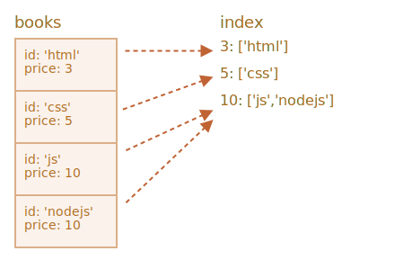

### 에러 처리

##### 쓰기 요청 실패 가능성 有
- 트랜잭션 관련 에러
- 트랜잭션 외 에러
  - 저장 용량 초과
  - 네트워크 에러
  - 기타 등등

##### 요청 실패 발생 시
- 트랜잭션 자동 취소
  - 모든 변경사항 취소

##### 요청 실패 처리
- ex\) 요청 재전송 등 <sub>(트랜잭션 취소 X)</sub>
- `request.onerror` <sub>(핸들러)</sub> 내
  - `event.preventDefault()` 호출
    - 트랜잭션 취소 방지

##### `""ConstraintError"` <sub>(에러)</sub> 처리
- `add` <sub>(메서드)</sub>
  - 키 중복 시 에러 발생
```javascript
let transaction = db.transaction("books", "readwrite");

let book = { id: 'js', price: 10 };

let request = transaction.objectStore("books").add(book);

request.onerror = function(event) {
  // ConstraintError occurs when an object with the same id already exists
  if (request.error.name == "ConstraintError") {
    console.log("Book with such id already exists"); // handle the error
    event.preventDefault(); // don't abort the transaction
    // use another key for the book?
  } else {
    // unexpected error, can't handle it
    // the transaction will abort
  }
};

transaction.onabort = function() {
  console.log("Error", transaction.error);
};
```

### Event delegation
Do we need onerror/onsuccess for every request? Not every time. We can use event delegation instead.

**IndexedDB events bubble: `request` → `transaction` → `database`**.

All events are DOM events, with capturing and bubbling, but usually only bubbling stage is used.

So we can catch all errors using `db.onerror` handler, for reporting or other purposes:
```javascript
db.onerror = function(event) {
  let request = event.target; // the request that caused the error

  console.log("Error", request.error);
};
```

…But what if an error is fully handled? We don't want to report it in that case.

We can stop the bubbling and hence `db.onerror` by using `event.stopPropagation()` in `request.onerror`.
```javascript
request.onerror = function(event) {
  if (request.error.name == "ConstraintError") {
    console.log("Book with such id already exists"); // handle the error
    event.preventDefault(); // don't abort the transaction
    event.stopPropagation(); // don't bubble error up, "chew" it
  } else {
    // do nothing
    // transaction will be aborted
    // we can take care of error in transaction.onabort
  }
};
```

### Searching by keys
There are two main types of search in an object store:
1. By a key or a key range. That is: by `book.id` in our "books" storage.
2. By another object field, e.g. `book.price`.

First let's deal with the keys and key ranges `(1)`.

Methods that involve searching support either exact keys or so-called "range queries" – [IDBKeyRange](https://www.w3.org/TR/IndexedDB/#keyrange) objects that specify a "key range".

Ranges are created using following calls:
`IDBKeyRange.lowerBound(lower, [open])` means: `≥lower` (or `>lower` if `open` is `true`)
`IDBKeyRange.upperBound(upper, [open])` means: `≤upper` (or `<upper` if `open` is `true`)
`IDBKeyRange.bound(lower, upper, [lowerOpen], [upperOpen])` means: between `lower` and `upper`. If the open flags is true, the corresponding key is not included in the range.
`IDBKeyRange.only(key)` – a range that consists of only one `key`, rarely used.

All searching methods accept a `query` argument that can be either an exact key or a key range:
- `store.get(query)` – search for the first value by a key or a range.
- `store.getAll([query], [count])` – search for all values, limit by `count` if given.
- store.getKey(query) – search for the first key that satisfies the query, usually a range.
- `store.getAllKeys([query], [count])` – search for all keys that satisfy the query, usually a range, up to `count` if given.
- `store.count([query])` – get the total count of keys that satisfy the query, usually a range.

For instance, we have a lot of books in our store. Remember, the `id` field is the key, so all these methods can search by `id`.

Request examples:
```javascript
// get one book
books.get('js')

// get books with 'css' <= id <= 'html'
books.getAll(IDBKeyRange.bound('css', 'html'))

// get books with id < 'html'
books.getAll(IDBKeyRange.upperBound('html', true))

// get all books
books.getAll()

// get all keys: id > 'js'
books.getAllKeys(IDBKeyRange.lowerBound('js', true))
```

<br />

 **Object store is always sorted**

Object store sorts values by key internally.

So requests that return many values always return them in sorted by key order.

<br />

### Searching by any field with an index
To search by other object fields, we need to create an additional data structure named "index".

An index is an "add-on" to the store that tracks a given object field. For each value of that field, it stores a list of keys for objects that have that value. There will be a more detailed picture below.

The syntax:
```javascript
objectStore.createIndex(name, keyPath, [options]);
```

- `name` – index name,
- `keyPath` – path to the object field that the index should track (we're going to search by that field),
- `option` – an optional object with properties:
  - `unique` – if true, then there may be only one object in the store with the given value at the `keyPath`. The index will enforce that by generating an error if we try to add a duplicate.
  - `multiEntry` – only used if the value on `keyPath` is an array. In that case, by default, the index will treat the whole array as the key. But if `multiEntry` is true, then the index will keep a list of store objects for each value in that array. So array members become index keys.

In our example, we store books keyed by `id`.

Let's say we want to search by `price`.

First, we need to create an index. It must be done in `upgradeneeded`, just like an object store:
```javascript
openRequest.onupgradeneeded = function() {
  // we must create the index here, in versionchange transaction
  let books = db.createObjectStore('books', {keyPath: 'id'});
  let index = books.createIndex('price_idx', 'price');
};
```

- The index will track `price` field.
- The price is not unique, there may be multiple books with the same price, so we don't set `unique` option.
- The price is not an array, so `multiEntry` flag is not applicable.

Imagine that our `inventory` has 4 books. Here's the picture that shows exactly what the `index` is:



As said, the index for each value of `price` (second argument) keeps the list of keys that have that price.

The index keeps itself up to date automatically, we don't have to care about it.

Now, when we want to search for a given price, we simply apply the same search methods to the index:
```javascript
let transaction = db.transaction("books"); // readonly
let books = transaction.objectStore("books");
let priceIndex = books.index("price_idx");

let request = priceIndex.getAll(10);

request.onsuccess = function() {
  if (request.result !== undefined) {
    console.log("Books", request.result); // array of books with price=10
  } else {
    console.log("No such books");
  }
};
```

We can also use `IDBKeyRange` to create ranges and looks for cheap/expensive books:
```javascript
// find books where price <= 5
let request = priceIndex.getAll(IDBKeyRange.upperBound(5));
```

Indexes are internally sorted by the tracked object field, `price` in our case. So when we do the search, the results are also sorted by `price`.

### Deleting from store
The `delete` method looks up values to delete by a query, the call format is similar to `getAll`:
- `delete(query)` – delete matching values by query.

For instance:
```javascript
// delete the book with id='js'
books.delete('js');
```

If we'd like to delete books based on a price or another object field, then we should first find the key in the index, and then call `delete`:
```javascript
// find the key where price = 5
let request = priceIndex.getKey(5);

request.onsuccess = function() {
  let id = request.result;
  let deleteRequest = books.delete(id);
};
```

To delete everything:
```javascript
books.clear(); // clear the storage.
```
