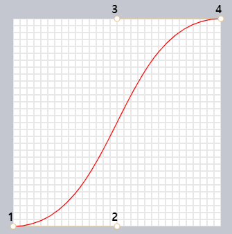
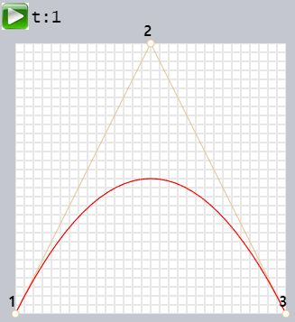
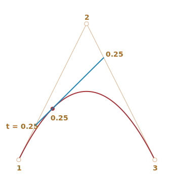
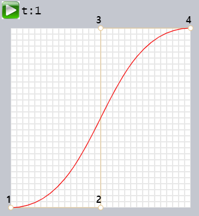
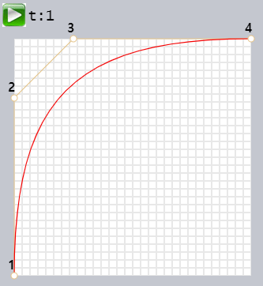
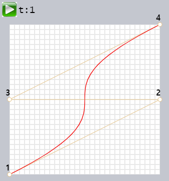
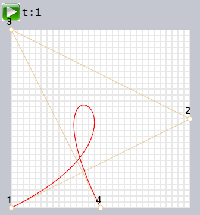
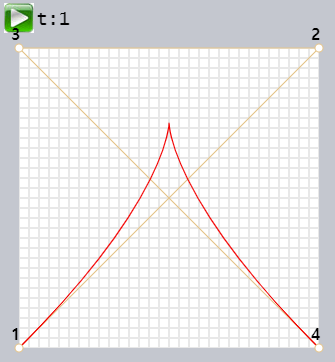

[베지어 곡선](https://ko.wikipedia.org/wiki/%EB%B2%A0%EC%A7%80%EC%97%90_%EA%B3%A1%EC%84%A0)
==========

##### 컴퓨터 그래픽 내 특별 곡선
- CSS 애니메이션 등
  - 도형 그릴 때 사용

### 조절점 (베지어 곡선 정의)

##### 조절점 개수 제한 X
- 2개

- 3개

- 4개

##### 특징
1. 조절점 위치
    - 항상 곡선 위 X
2. 곡선 차수
    - 조절점 개수 - 1
      - 2개 (직선)
      - 3개 (2차 곡선)
      - 4개 (3차 곡선)
      - 기타 등등
3. 곡선 위치
    - 항상 [convex hull](https://en.wikipedia.org/wiki/Convex_hull) (볼록 껍질) 내부

##### 교차 검사 최적화 (컴퓨터 그래픽스)
- convex hull 특징 이용
  - 곡선 교차 여부 결정
  - 상대적 단순 형태 (검사 용이)
    - 삼각형
    - 사각형
    - 기타 등등

##### 조절점 이동 → 베지어 곡선 재조정
- 직관적인 당연한 방식

##### 베지어 곡선 생성 방향
- 조절점 연결선
  - 1 ~ 2
  - 3 ~ 4

##### 예시

### [카스텔조 알고리즘](https://en.wikipedia.org/wiki/De_Casteljau%27s_algorithm)

##### 특징
- 베지어 곡선 정의 공식 정확히 일치
- 곡선 생성 과정 시각화 시 도움

#### 조절점 3개 예시

#### 알고리즘 과정

##### 1. 조절점 찍기
- 1 · 2 · 3

##### 2. 조절점 연결 (🟤갈색선🟤 생성)
- 1 ~ 2
- 2 ~ 3

##### 3. `t` (매개변수) 값 증가
- `0` → `1`

##### 3.1. 추가 작업 (`t` 값 사용)
- 각 🟤갈색선🟤 시작점에서 `t`와 비례하는 위치에 점을 찍습니다. 선분이 두 개이기 때문에 점 두 개가 만들어집니다.

  예를 들어 설명하면 다음과 같습니다. `t`가 `0`일 땐 두 점이 선분의 시작인 조절점 1과 2에 위치합니다. `t`가 `0.25`일 땐 조절점 1에서 조절점 1과 2를 이은 선분의 길이에 25%를 곱한 값만큼 떨어진 곳에 점이 위치합니다. `t`가 `0.5`일 땐 선분의 중간, `1`일 땐 선분의 끝에 점이 위치합니다.

- 추가작업을 통해 만든 두 점을 연결합니다. 그림에선 🔵파란선🔵에 해당합니다.

|`t = 0.25`|`t = 0.5`|
|---|---|
|||

4. 이제 🔵파란색🔵 선분에서 `t` 값과 비례하는 위치에 점 하나를 찍습니다. `t`가 `0.25`일 때(좌측 그림)는 파란 선분의 4분의 1지점에 🔴빨간점🔴을, `t`가 `0.5`일 때(우측 그림)는 선분의 가운데에 🔴빨간점🔴을 찍습니다.

5. `t`가 `0`에서 `1`로 증가하면서 당연히 점도 계속 추가됩니다. 이때 이 점들이 바로 베지어 곡선(빨간색 포물선)을 만듭니다.

지금까진 조절점이 3개인 경우를 살펴보았는데, 조절점이 4개일 때 역시 같은 방식으로 곡선이 만들어집니다.

조절점이 네개 일때 데모를 살펴봅시다.

조절점이 4개인 경우 카스텔조 알고리즘은 다음과 같습니다.
- 조절점 1과 2, 2와 3, 3과 4를 연결하는 선분을 만듭니다. 총 3개의 🟤갈색 선분🟤이 만들어집니다.
- `t`를 `0`부터 시작해 `1`까지 증가시키면서 각 선분에 다음과 같은 작업을 합니다.
  - 선분 시작점에서 `t`에 비례하는 위치에 점을 찍습니다. 이 점들을 연결해 두 개의 🟢녹색선🟢을 만듭니다.
  - 두 개의 녹색 선분 위에 `t`에 비례하는 위치에 점을 찍습니다. 이 두 점을 연결 🔵파란색🔵 선을 그립니다.
  - 파란색 선에서 `t`에 비례하는 위치에 점(🔴빨간점🔴)을 만듭니다.
- 이 점이 모여 곡선이 만들어집니다.

카스텔조 알고리즘은 재귀적이기 때문에 조절점 개수에 상관없이 일반화가 가능합니다.

N개의 조절점이 있을 때 알고리즘은 다음과 같습니다.

1. N개의 조절점을 연결해 N-1개의 선분을 만듭니다.
2. `0`부터 시작해 `1`이 될 때까지 `t`를 조금씩 증가시키면서 각 선분에서 `t`만큼 비례한 곳에 점을 찍고, 그 선을 연결합니다. 이때 N-2개의 선분이 만들어집니다
3. 점이 하나만 남을 때까지 2를 반복합니다.

이렇게 만들어진 점들이 모여 곡선이 됩니다.

**데모를 중간중간 정지 시켜 선분과 곡선이 어떻게 만들어지는지 직접 확인해보세요.**

`y=1/t` 형태를 띠는 곡선:

갈지자가 되게 조절점을 찍어도 곡선을 만들 수 있습니다.

예시처럼 고리 모양 베지어 곡선을 만들 수도 있습니다.

뾰족한 베지어 곡선도 물론 만들 수 있습니다.

알고리즘이 잘 이해가 안 간다면 위쪽 데모를 실행하고, 중간중간 정지 시켜 어떻게 곡선이 만들어지는지 살펴보세요.

재귀성을 띄는 알고리즘 덕분에 우리는 다양한 차수의 베지어 곡선을 얼마든지 만들 수 있습니다. 조절점이 5개, 6개 혹은 그 이상 있는 곡선을 만들 수 있죠. 그렇지만 실무에선 많은 개수의 조절점은 그다지 잘 쓰이지 않습니다. 조절점은 보통 2~3개이고, 이 조절점을 사용해 만든 곡선을 이어붙여 복잡한 그림을 그리게 됩니다. 이런 방식을 사용하면 개발과 계산 모두 간단해집니다.

 

 **조절점은 '통과하는' 곡선은 어떻게 그리나요?**

베지어 곡선 모양은 조절점을 사용해 정의되는데, 지금까진 곡선 양 끝을 제외하고 조절점이 곡선 위에 있는 경우는 없었습니다.

그런데 작업을 하다 보면 가끔 _몇몇 점을 통과_ 하는 곡선을 그려야 하는 경우가 생깁니다. 점 전부가 부드러운 하나의 곡선 위에 있어야 하는 것이죠. 이런 작업을 [보간(interpolation)](https://en.wikipedia.org/wiki/Interpolation)이라 부르는데 여기선 보간에 대해선 다루지 않겠습니다.

참고로 보간에는 [라그랑즈 다항식(Lagrange polynomial)](https://en.wikipedia.org/wiki/Lagrange_polynomial)을 비롯한 다양한 수학 공식을 사용할 수 있습니다. 컴퓨터 그래픽스에서는 많은 점을 잇는 부드러운 곡선을 만들 때 [스플라인 보간(spline interpolation)](https://en.wikipedia.org/wiki/Spline_interpolation)을 자주 사용합니다.

 

### 수학
베지어 곡선은 하나의 수학 공식을 사용해 설명 가능합니다.

사실 이 공식을 알 필요는 없습니다. 대다수의 사람은 공식 없이 마우스로 점을 움직여 원하는 형태의 곡선을 만듭니다. 그렇지만 수학을 좋아하는 분들을 위해 베지어 곡선을 만들 때 사용되는 식을 소개해보겠습니다.

조절점 Pi의 좌표에 대하여 첫 번째 조절점의 좌표를 P1 = (x1, y1), 두 번째 조절점의 좌표를 P2 = (x2, y2) 등이라 정의했을 때, 베지어 곡선을 이루는 점의 좌표들은 `[0,1]`사이의 매개변수 `t`값에 의해 결정됩니다.

- 조절점이 2개일 때:
  - `P` = (1-t)P1 + tP2
- 조절점이 3개일 때:
  - `P` = (1−t)2P1 + 2(1−t)tP2 + t2P3
- 조절점이 4개일 때:
  - `P` = (1−t)3P1 + 3(1−t)2tP2 +3(1−t)t2P3 + t3P4

위 식들은 벡터 방정식입니다. 따라서 곡선을 이루는 점의 좌표를 얻을 때 `P` 대신 `x`와 `y`를 넣으면 됩니다.

조절점이 3개인 경우를 예로 들어봅시다. 곡선은 각 점의 좌표 `(x,y)`를 사용해 만들어집니다.
- `x` = (1−t)2x1 + 2(1−t)tx2 + t2x3
- `y` = (1−t)2y1 + 2(1−t)ty2 + t2y3

x1과 y1, x2와 y2, x3과 y3엔 세 조절점의 `x`, `y` 좌표를 넣고 `t`를 `0` 에서 `1`로 증가시키면서 도출한 값들을 사용해 곡선을 만듭니다.

조절점이 `(0,0)`, `(0.5, 1)`, `(1, 0)`인 경우, 방정식은 다음과 같습니다.
- `x` = (1−t)2 * 0 + 2(1−t)t * 0.5 + t2 * 1 = (1-t)t + t2 = t
- `y` = (1−t)2 * 0 + 2(1−t)t * 1 + t2 * 0 = 2(1-t)t = –2t2 + 2t

`0`부터 시작해 `1`이 될 때까지 `t`를 증가 시켜 무수히 많은 `(x,y)` 조합을 만들고, 이를 연결해 곡선을 만들면 됩니다.

 

## 요약
베지어 곡선은 조절점을 사용해 정의할 수 있습니다.

여기선 두 가지 방식을 사용해 베지어 곡선을 만들어 보았습니다.
1. 카스텔조 알고리즘을 사용해 직접 그려보기
2. 수학 공식 사용하기

베지어 곡선은 다음과 같은 장점이 있습니다.
- 마우스만으로 부드러운 곡선을 그릴 수 있다.
- 베지어 곡선을 조합해 복잡한 도형을 만들 수 있다.

베지어 곡선의 용도는 다양합니다.
- 컴퓨터 그래픽스, 모델링, 벡터 그래픽 에디터에서 사용하고, 폰트를 만들 때 역시 베지어 곡선을 사용합니다.
- canvas 요소나 SVG 포맷을 사용해 웹 개발을 할 때 사용합니다. 참고로 위에서 살펴본 '생동감 있는' 데모는 SVG를 사용해 만들었습니다. [demo.svg](https://ko.javascript.info/article/bezier-curve/demo.svg?p=0,0,1,0.5,0,0.5,1,1&animate=1)를 새 창에서 열고 개발자도구를 열어 직접 살펴봅시다. 데모가 조절점의 x, y 좌표가 매개변수인 하나의 SVG 문서 인 것을 확인할 수 있습니다.
- CSS 애니메이션의 경로와 속도를 조절할 때 사용합니다.
