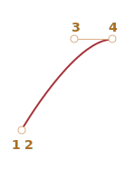

CSS 애니메이션
====

##### 등장 배경
- 애니메이션 관련 프로퍼티 정의
- 프로퍼티 값 통해 애니메이션 효과 정의
  - 값 변경 → 해당 값 애니메이션 표현

### CSS 트랜지션

##### `background-color` 값 변경
- 3초간 서서히 변화
```css
.animated {
  transition-property: background-color;
  transition-duration: 3s;
}
```

##### 버튼 클릭 시 버튼 배경색 변화
- 3초간 서서히 변화
```html
<button id="color">클릭</button>

<style>
  #color {
    transition-property: background-color;
    transition-duration: 3s;
  }
</style>

<script>
  color.onclick = function() {
    this.style.backgroundColor = 'red';
  };
</script>
```


##### CSS 트랜지션 프로퍼티
- `transition-property`
- `transition-duration`
- `transition-timing-function`
- `transition-delay`
- `transition` <sub>(통합 선언)</sub>

##### `transition` 예시
- `font-size` 3초 변화
- `color` 2초 변화
```html
<button id="growing">클릭</button>

<style>
  #growing {
    transition: font-size 3s, color 2s;
  }
</style>

<script>
  growing.onclick = function() {
    this.style.fontSize = '36px';
    this.style.color = 'red';
  };
</script>
```


### `transition-property`

##### 애니메이션 효과 적용 대상 프로퍼티 목록 정의
- `left`
- `margin-left`
- `height`
- `color`
- 기타 등등

##### 프로퍼티 애니메이션 효과 적용 가능 유무
- [흔히 사용되는 대다수 프로퍼티](https://developer.mozilla.org/en-US/docs/Web/CSS/CSS_animated_properties)
  - 적용 가능
- 일부 프로퍼티
  - 적용 불가능

### `transition-duration`

##### 애니메이션 효과 지속 시간 설정
- [CSS 시간 형식](https://www.w3.org/TR/css3-values/#time) 준수
  - `s` <sub>(초)</sub>
  - `ms` <sub>(ms)</sub>

### `transition-delay`

#### 애니메이션 효과 시작 전 지연시간 설정

##### 음수 가능
- 중간부터 애니메이션 효과 표시

##### 1초 후 애니메이션 효과 적용
```css
transition-delay: 1s;
```

##### 1초 후 1초간 애니메이션 효과 지속
```css
transition-duration: 2s;
transition-delay: -1s;
```

### 화면 내 숫자 <sub>(0 ~ 9)</sub> 자연스럽게 표시
- `transition-delay` 정의 X

##### 결과


```html
<!-- index.html -->
<!doctype html>
<html>

<head>
  <meta charset="UTF-8">
  <link rel="stylesheet" href="style.css">
</head>

<body>
  아래 숫자를 클릭하세요.

  <div id="digit">
    <div id="stripe">0123456789</div>
  </div>

  <script src="script.js"></script>
</body>

</html>
```
```javascript
/* script.js */
// 애니메이션 효과 적용
// - 숫자 요소 (stripe) 클릭 시
//   - CSS 클래스 (.animate) 추가
stripe.onclick = function() {
  stripe.classList.add('animate');
};
```
```css
/* style.css */
#digit {
  width: .5em;
  overflow: hidden;
  font: 32px monospace;
  cursor: pointer;
}

#stripe {
  display: inline-block
}

#stripe.animate {

  /* 숫자 좌측 이동 */
  transform: translate(-90%);

  transition-property: transform;
  transition-duration: 9s;
  transition-timing-function: linear;
}
```

#### `transition-delay` 음수 적용

##### 적용 과정 <sub>(JS 코드)</sub>
1. 초 <sub>(현재 시간)</sub> 추출
2. `-` <sub>(음수 기호)</sub> 추가
3. `transition-delay` 값 지정

##### 숫자 <sub>(현재 시간 초)</sub> 표시 후 애니메이션 효과 적용
- ex\) 2020.09.12 PM 12:17:06 <sub>(현재 일시)</sub>
  - 6 ~ 9 <sub>(애니메이션 효과 표시)</sub>

##### 결과


```html
<!-- index.html -->
<!doctype html>
<html>

<head>
  <meta charset="UTF-8">
  <link rel="stylesheet" href="style.css">
</head>

<body>
  아래 숫자를 클릭하세요.

  <div id="digit">
    <div id="stripe">0123456789</div>
  </div>

  <script src="script.js"></script>
</body>

</html>
```
```javascript
/* script.js */
stripe.onclick = function() {
  let sec = new Date().getSeconds() % 10;

   // ex) sec == 6
   // - transitionDelay: -6s
   //   - 6 ~ 9 (애니메이션 효과 적용)
  stripe.style.transitionDelay = '-' + sec + 's';

  stripe.classList.add('animate');
};
```
```css
/* style.css */
#digit {
  width: .5em;
  overflow: hidden;
  font: 32px monospace;
  cursor: pointer;
}

#stripe {
  display: inline-block
}

#stripe.animate {
  transform: translate(-90%);
  transition-property: transform;
  transition-duration: 9s;
  transition-timing-function: linear;
}
```

### `transition-timing-function`

##### timing 함수 설정
- 시간 흐름 따라 애니메이션 효과 분배 설정
  - ex\) 초반 천천히 · 후반 빠르게

##### 프로퍼티 값 <sub>(2가지)</sub>
1. 베지어 곡선 <sub>(자주 사용)</sub>
2. 단계

### 베지어 곡선

##### 조절점 4개 · 특정 조건 충족 필요
1. 1번째 조절점
   - (0, 0)
2. 마지막 <sub>(4번째)</sub> 조절점
   - (1, 1)
3. 중간 <sub>(2 · 3번째)</sub> 조절점
   - (x, y)
     - x <sub>(0 ~ 1)</sub>
     - y <sub>(제약 無)</sub>

##### 정의 형태 <sub>(CSS)</sub>
- `cubic-bezier(x2, y2, x3, y3)`
  - 1 · 4번째 조절점 고정
  - 2 · 3번째 조절점만 지정

##### 시간 흐름 따라 애니메이션 효과 속도 표시
- x 축 <sub>(시간)</sub>
  - 0 <sub>(시작)</sub>
  - 1 <sub>(종료)</sub>
- y 축 <sub>(프로세스 완성도)</sub>
  - 0 <sub>(시작 값)</sub>
  - 1 <sub>(최종값)</sub>

##### `cubic-bezier(0, 0, 1, 1)` <sub>(일정한 속도)</sub>
- 가장 간단한 timing 함수
- 시간 <sub>(x)</sub> 흐름 따라 애니메이션 완성도 <sub>(y)</sub> 이동


### 기차 이동 <sub>(클릭 시 이동 · 좌 → 우)</sub>
```html
<!-- index.html -->
<!doctype html>
<html>

<head>
  <meta charset="UTF-8">
  <link rel="stylesheet" href="style.css">
</head>

<body>
  <!-- 클릭 시 left: 450px -->
  
</body>

</html>
```
```css
/* style.css */
.train {
  position: relative;
  cursor: pointer;
  width: 177px;
  height: 160px;
  left: 0; /* → 450px (JS) */

  /* timing 함수 (베지어 곡선) */
  transition: …;
}
```

##### 일정한 속도
- `cubic-bezier(0, 0, 1, 1)`

##### 결과


```css
/* style.css */
.train {
  …
  transition: left 5s cubic-bezier(0, 0, 1, 1);
}
```

##### 점점 느리게 <sub>(빠른 초반 · 느린 후반)</sub>
- `cubic-bezier(0, 0.5, 0.5 ,1)`


##### 결과


```css
/* style.css */
.train {
  …
  transition: left 5s cubic-bezier(0, .5, .5, 1);
}
```

#### 내장 곡선

##### `ease` <sub>(기본값)</sub>
- `(0.25, 0.1, 0.25, 1)`


##### `ease-in`
- `(0.42, 0, 1, 1)`


##### `ease-out`
- `(0, 0, 0.58, 1)`



##### `ease-in-out`
- `(0.42, 0, 0.58, 1)`


##### `linear`
- `(0, 0, 1, 1)`


##### 점점 느리게 <sub>(빠른 초반 · 느린 후반)</sub>
- ~`cubic-bezier(0, 0.5, 0.5 ,1)`~
- `ease-out`
```css
.train {
  …
/*transition: left 5s cubic-bezier(0, .5, .5, 1); */
  transition: left 5s ease-out;
}
```

#### 지정 범위 초과 적용

##### 중간 조절점 내 y <sub>(좌표)</sub>
- 제약 無
- 음수 · 매우 큰 값 가능
  - 완만한 · 가파른 곡선 형성
    - 정상 범위 벗어난 애니메이션

##### 음수 값 적용 시 기차 이동 순서
- `(0.5, -1, 0.5, 2)`
1. 좌 ← 우
   - `left` ≒ `90px`
2. 좌 → 우
   - `left` ≒ `420px`
3. 좌 ← 우
   - `left` == `400px`

##### 결과


```html
<!-- index.html -->
…
<body>
  <!-- 클릭 시 left: 400px -->
  
</body>
…
```
```css
/* style.css */
.train {
  …
  left: 100px; /* → 400px (JS) */
  transition: left 5s cubic-bezier(.5, -1, .5, 2);
}
```


#### 정상 범위 <sub>(0 ~ 1)</sub> 초과

#####  2번째 조절점
- y <sub>(좌표)</sub> 값 \< 0
  - `left` 값 \< `100px` <sub>(시작 값)</sub>

##### 3번째 조절점
- y <sub>(좌표)</sub> 값 \> 1
  - `left` 값 \> `400px` <sub>(종료 값)</sub>

##### 초과 정도
- 小
  - 부드러운 변형
- 大
  - 급격한 변형

##### 다양한 베지어 곡선 생성 툴 有
- ex\) [cubic-bezier.com](http://cubic-bezier.com/)
