### 단계 <sub>(step)</sub>
- 애니메이션 다수 단계로 나누기

#### `steps(n[, start · end])` <sub>(timing 함수)</sub>

##### `n` <sub>(숫자)</sub>
- 단계 수
- 전체 프로세스 → n단계 <sub>(나눠 적용)</sub>
- 시간 간격 → n단계 <sub>(자동 나누기)</sub>

##### `[start · end]`
- `[start]`
  - 시간 간격 이전 시작 <sub>(바로 시작)</sub>
- `[end]`
  - 시간 간격 이후 시작 <sub>(1박자 후 시작)</sub>

### 숫자 표시

#### 애니메이션 미적용

##### 결과

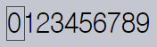

```html
<!-- index.html -->
<!DOCTYPE html>
<html>

<head>
  <meta charset="utf-8">
  <link rel="stylesheet" href="style.css">
</head>

<body>
  <div id="digit">
    <div id="stripe">0123456789</div>
  </div>
</body>

</html>
```
```css
/* style.css */
#digit {
  border: 1px solid red;
  width: 1.2em;
}

#stripe {
  display: inline-block;
  font: 32px monospace;
}
```

#### 애니메이션 적용 <sub>(숫자 하나씩 증가)</sub>
- 빨간 박스 외부 숫자 숨기기
- 단계별 숫자 목록 좌측 이동
  - 9단계 <sub>(0 ~ 9)</sub>
```css
#stripe.animate  {
  transform: translate(-90%);

  /* 둘 중 하나 */
  transition: transform 9s steps(9, start);
  transition: transform 9s steps(9, end);
}
```

##### 결과

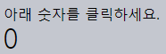

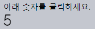

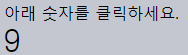

```html
<!-- index.html -->
<!DOCTYPE html>
…
<body>
  아래 숫자를 클릭하세요.

  <div id="digit">
    <div id="stripe">0123456789</div>
  </div>

  <script>
    digit.onclick = function() {
      stripe.classList.add('animate');
    }
  </script>
</body>
…
```
```css
/* style.css */
#digit {
  width: .5em;
  overflow: hidden;
  font: 32px monospace;
  cursor: pointer;
}

#stripe {
  display: inline-block
}

#stripe.animate {
  transform: translate(-90%);
  transition-property: transform;
  transition-duration: 9s;

  /* 둘 중 하나 */
  transition: transform 9s steps(9, start);
  transition: transform 9s steps(9, end);

}
```

#### `steps(9, start · end)`

##### `9` <sub>(1번째 인수)</sub>
- 전체 프로세스
  - 9단계 나눠 적용 <sub>(10%씩 진행)</sub>
- 시간 간격
  - 9단계 나눠 진행 <sub>(자동 · 1초 간격)</sub>

##### `start · end` <sub>(2번째 인수)</sub>
- `start`
  - 숫자 클릭 시 효과 바로 시작

|초|진행률|
|:---:|:---:|
|`0s`|`-10%`|
|`1s`|`-20%`|
|…|…|
|`8s`|`-90%`|
|`9s`|`-90%`|

- `end`
  - 숫자 클릭 시 1초 후 시작

|초|진행률|
|:---:|:---:|
|`0s`|`0%`|
|`1s`|`-10%`|
|…|…|
|`8s`|`-80%`|
|`9s`|`-90%`|

#### 내장 값 <sub>(애니메이션 효과 거의 無 · 드물게 사용)</sub>
- `step-start` <sub>(`steps(1, start)`)</sub>
  - 1번째 단계 바로 시작
  - 1번째 단계만 실행
- `step-end` <sub>(`steps(1, end)`)</sub>
  - 마지막 한 단계만 실행

### `transitionend` <sub>(이벤트)</sub>

##### CSS 애니메이션 종료 시 자동 발생
- 애니메이션 조합 시 유용
- 종료 후 실행 예정 JS 코드 지정 가능

### 배 이동

##### 클릭 시 우 · 좌 이동
- 왕복 시 우측 더 이동

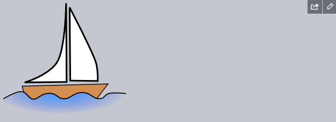

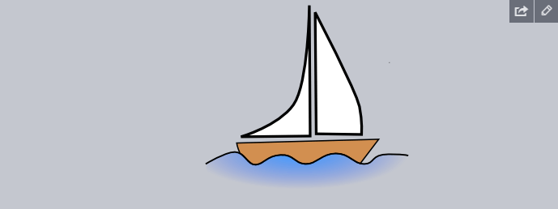


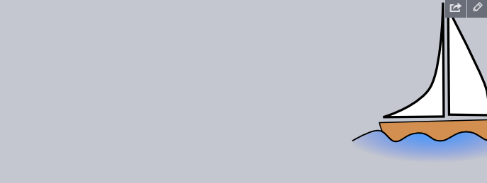

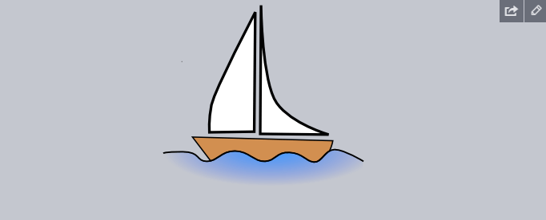


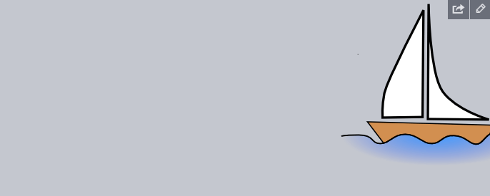


##### 각 트랜지션 종료 시
- `go` <sub>(함수)</sub> 실행
  - 방향 뒤집기 동작 <sub>(새 애니메이션 시작)</sub>
```javascript
boat.onclick = function() {
  …
  let times = 1;

  function go() {
    if (times % 2) {

      // 우측 이동
      boat.classList.remove('back');
      boat.style.marginLeft = 100 * times + 200 + 'px';

    } else {

      // 좌측 이동
      boat.classList.add('back');
      boat.style.marginLeft = 100 * times - 200 + 'px';
    }
  }

  go();

  boat.addEventListener('transitionend', function() {
    times++;
    go();
  });
};
```

#### 특수 프로퍼티 <sub>(트랜지션 관련 이벤트)</sub>

##### `propertyName`
- 애니메이션 완료된 CSS 프로퍼티
- 동시 다수 CSS 프로퍼티
  - 애니메이션 효과 적용 시 사용

##### `elapsedTime`
- 애니메이션 효과 진행 소모 시간 <sub>(초)</sub>
  - `transition-delay` 無 가정

### `@keyframes`

##### CSS 문법
- 다수 단순 애니메이션 동시 실행

##### 설정 요소
- 애니메이션 이름
- 이동 대상
- 이동 시간
- 이동 위치

##### `animation`
- 애니메이션 적용
- 추가 매개변수 지정

##### 진행률 인디케이터 이동
```html
<div class="progress"></div>

<style>
  /* 애니메이션 이름 */
  @keyframes go-left-right {

    /* 시작 위치 */
    from { left: 0px; }

    /* 종료 위치 */
    to { left: calc(100% - 50px); }
  }

  .progress {

  /* 커스텀 애니메이션 (go-left-right) 적용
    지속 시간
    - 3초 (3s)
    반복 횟수
    - 무한 (infinite)
    방향
    - 매번 바뀜 (alternate)
    */
    animation: go-left-right 3s infinite alternate;

    position: relative;
    border: 2px solid green;
    width: 50px;
    height: 20px;
    background: lime;
</style>
}
```


##### 주 용도
- 지속적인 정적 형태 이동 <sub>(특정 요소)</sub>

##### 관련 정보
- `@keyframes` 관련글
- [명세서](https://drafts.csswg.org/css-animations/)

<br />

요약
====

##### CSS 애니메이션
- 다양한 변화 적용 <sub>(다수 CSS 프로퍼티)</sub>
- 전환 효과 용이

#### CSS 애니메이션 장단점 <sub>(vs JS 애니메이션)</sub>

##### 장점
- 간단한 애니메이션 간단히 수행
- 빠른 속도
- CPU 소모량 ↓

##### 단점
- 유연성 ↓
  - 특수 애니메이션 로직 구현 불가능
    - ex\) 요소 '폭발' 등
- 애니메이션 관련 새 요소 생성 불가능

<br />

##  과제

### 비행기 애니메이션 효과 적용 <sub>(CSS)</sub> ①

##### 애니메이션 효과 <sub>(이미지 클릭 시 적용)</sub>
- 크기 변화
  - `40x24px` → `400x240px` <sub>(10배 확대)</sub>
- 소요 시간
  - 3초
- 효과 종료 시
  - `완료!` <sub>(문자열)</sub> 경고 창 출력
- 실행 중 사진 클릭 시
  - 애니메이션 계속 진행


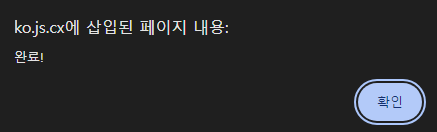

<br />


```css
#flyjet {
  transition: all 3s;
}

/* .growing (CSS 클래스) 추가 (JS) */
#flyjet.growing {
  width: 400px;
  height: 240px;
}
```

##### `transitionend` <sub>(이벤트)</sub>
- 각 프로퍼티별 1번씩 발생 <sub>(총합 2번)</sub>
  - 추가 확인 필요

[정답](https://plnkr.co/edit/HeeLKlv1EX8SK2ic?p=preview)

<hr />

### 비행기 애니메이션 효과 적용 <sub>(CSS)</sub> ②

##### 이전 과제 <sub>(비행기 애니메이션)</sub> 크기 변화 수정
1. `40x24px`
2. `400x240px` 초과
3. `400x240px`


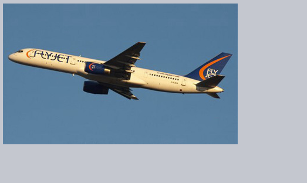

<br />


##### 적절한 베지어 곡선 지정
- 애니메이션 실행 도중
  - y <sub>(좌표)</sub> 값 \> 1

##### `cubic-bezier(0.25, 1.5, 0.75, 1.5)`


[정답](https://plnkr.co/edit/BBDJVbBUSGupTslE?p=preview)

<hr />

### 원 <sub>(도형)</sub> 에니메이션 효과 적용 <sub>(CSS)</sub>

##### `showCircle(cx, cy, radius)` <sub>(함수)</sub> 작성
- 원 <sub>(도형)</sub> 크기 ↑
- `cx` · `cy`
  - 원 <sub>(도형)</sub> 중심 <sub>(상대 좌표)</sub>
- `radius`
  - 원 <sub>(도형)</sub> 반지름

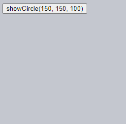

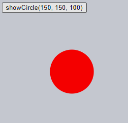

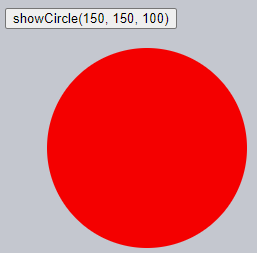

<br />


[정답](https://plnkr.co/edit/MisyfHMxqGMq6Ijv?p=preview)
