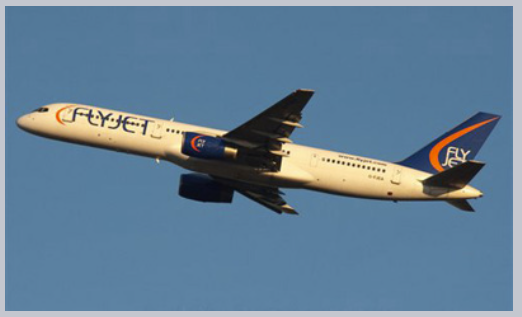

#### 단계

##### `steps(n[, start · end])`<sub>(timing 함수)</sub>
- 애니메이션 여러 단계 나누기

### 숫자 표시

#### 애니메이션 미적용

##### 결과


```html
<!-- index.html -->
<!DOCTYPE html>
<html>

<head>
  <meta charset="utf-8">
  <link rel="stylesheet" href="style.css">
</head>

<body>
  <div id="digit">
    <div id="stripe">0123456789</div>
  </div>
</body>

</html>
```
```css
/* style.css */
#digit {
  border: 1px solid red;
  width: 1.2em;
}

#stripe {
  display: inline-block;
  font: 32px monospace;
}
```

##### 숫자 하나씩 증가
- 빨간 박스 외부 숫자 숨기기
- 단계별 숫자 목록 좌측 이동
- 9단계 <sub>(0 ~ 9)</sub>

```css
#stripe.animate  {
  transform: translate(-90%);
  transition: transform 9s steps(9, start);
}
```

##### 결과


```html
<!-- index.html -->
<!DOCTYPE html>
<html>

<head>
  <meta charset="utf-8">
  <link rel="stylesheet" href="style.css">
</head>

<body>
  아래 숫자를 클릭하세요.

  <div id="digit">
    <div id="stripe">0123456789</div>
  </div>

  <script>
    digit.onclick = function() {
      stripe.classList.add('animate');
    }
  </script>
</body>

</html>
```
```css
/* style.css */
#digit {
  width: .5em;
  overflow: hidden;
  font: 32px monospace;
  cursor: pointer;
}

#stripe {
  display: inline-block
}

#stripe.animate {
  transform: translate(-90%);
  transition-property: transform;
  transition-duration: 9s;
  transition-timing-function: steps(9, start);
}
```

#### `steps(9, start)`

##### 1번째 인수 <sub>(`9`)</sub>
- 단계 수
- 전체 프로세스
  - 9단계 나눠 적용 <sub>(10%씩 진행)</sub>
- 시간 간격
  - 자동 9단계 나눠 진행 <sub>(1초 간격)</sub>
되는 것을 확인할 수 있습니다. 이때 시간 간격도 자동으로 9단계로 나뉘기 때문에 1초 간격으로 숫자가 증가하게 됩니다.

##### 2번째 인수 <sub>(`start`)</sub>
- `start`
  - 시간 간격 이전 시작 <sub>(바로 시작)</sub>
  - 숫자 클릭 시 효과 바로 시작

|초|진행률|
|:---:|:---:|
|`0s`|`-10%`|
|`1s`|`-20%`|
|…|…|
|`8s`|`-90%`|
|`9s`|`-90%`|

- `end`
  - 시간 간격 이후 시작 <sub>(각 1초 후 시작)</sub>
  - 숫자 클릭 후 1초 후 시작

|초|진행률|
|:---:|:---:|
|`0s`|`0%`|
|`1s`|`-10%`|
|…|…|
|`8s`|`-80%`|
|`9s`|`-90%`|


##### 결과


```css
/* style.css */
…

#stripe.animate {
  …
  transition-timing-function: steps(9, end);
}
```

참고로 다음과 같은 내장 값을 사용해 timing 함수를 지정할 수도 있습니다.
- `step-start` – `steps(1, start)`와 같습니다. 따라서 애니메이션의 첫 단계가 바로 시작되고 첫 번째 단계만 실행됩니다. 마치 애니메이션 효과가 없는 것처럼 보입니다.
- `step-end` – `steps(1, end)`와 같습니다. `transition-duration`의 끝에 애니메이션이 한 단계만 진행됩니다.

위 값들을 사용하면 움직이는 효과를 볼 수 없기 때문에 거의 사용되지 않습니다.

### `transitionend` <sub>(이벤트)</sub>
CSS 애니메이션이 끝나면 `transitionend` 이벤트가 자동 트리거됩니다.

`transitionend` 이벤트는 애니메이션이 끝났을 때 무언가를 하고 싶은 경우 많이 사용됩니다. 애니메이션 여러 개를 조합할 때도 자주 쓰이죠.

예를 들어봅시다. 아래 예시에서 배를 클릭하면 배가 우측, 좌측으로 움직이는데 한번 왕복할 때마다 우측으로 더 멀리 이동합니다.


트랜지션이 종료될 때마다 방향을 뒤집는 함수 go가 다시 실행되면서 새로운 애니메이션이 시작되는 것이죠.

```javascript
boat.onclick = function() {
  //...
  let times = 1;

  function go() {
    if (times % 2) {
      // 우측으로 가기
      boat.classList.remove('back');
      boat.style.marginLeft = 100 * times + 200 + 'px';
    } else {
      // 좌측으로 가기
      boat.classList.add('back');
      boat.style.marginLeft = 100 * times - 200 + 'px';
    }

  }

  go();

  boat.addEventListener('transitionend', function() {
    times++;
    go();
  });
};
```

트렌지션과 관련된 이벤트는 몇 가지 특수 프로퍼티를 지원합니다.
- `event.propertyName`
  - 애니메이션이 완료된 프로퍼티로, 동시에 여러 개의 프로퍼티에 애니메이션 효과를 줄 때 사용할 수 있습니다.
- `event.elapsedTime`
  - `transition-delay`가 없다는 가정하에 애니메이션 효과에 걸린 시간(초)을 나타냅니다.

### `keyframes`
CSS 문법인 `@keyframes`을 사용하면 간단한 애니메이션 여러 개를 한꺼번에 실행시킬 수 있습니다.

`@keyframes`엔 애니메이션 '이름'과 무엇을, 언제, 어디서 움직일지를 설정할 수 있습니다. `@keyframes`에 적절한 값을 넣은 후엔 `animation` 프로퍼티를 사용해 원하는 요소에 커스텀 애니메이션을 적용할 수 있습니다. 물론 추가 매개변수도 지정할 수 있습니다.

주석에 설명을 달아놓은 예시를 살펴봅시다.
```html
<div class="progress"></div>

<style>
  @keyframes go-left-right {        /* 애니메이션 이름 지정: "go-left-right" */
    from { left: 0px; }             /* left 0px 부터 애니메이션 시작 */
    to { left: calc(100% - 50px); } /* left 값이 100%-50px 될 때까지 애니메이션 적용 */
  }

  .progress {
    animation: go-left-right 3s infinite alternate;
    /* 해당 요소에 커스텀 애니메이션 'go-left-right' 적용
       지속 시간은 3초,
       반복 횟수는 무한(infinite)
       방향은 매번 바뀜
    */

    position: relative;
    border: 2px solid green;
    width: 50px;
    height: 20px;
    background: lime;
  }
</style>
```


`@keyframes`을 다루는 글이나 [명세서](https://drafts.csswg.org/css-animations/)를 읽으면 더 많은 정보를 찾을 수 있으니 참고해보시기 바랍니다.

참고로 사이트에 있는 특정 요소를 계속 정적인 형태로 움직이지 않는 한은 `@keyframes`를 쓸 일은 많지 않을 겁니다.

<br />

## 요약
CSS 애니메이션을 사용하면 하나 또는 여러 CSS 프로퍼티를 부드럽게(부드럽지 않게도 가능) 변화시킬 수 있습니다.

CSS 애니메이션은 전환이 필요한 대다수의 경우에 큰 도움을 줍니다. 자바스크립트를 사용해도 전환 효과를 줄 수 있긴 한데 이에 대해선 다음 챕터에서 다룰 예정입니다.

참고로 CSS 애니메이션은 자바스크립트 애니메이션과 비교해 다음과 같은 장단점이 있습니다.

- 장점
  - 간단한 애니메이션을 간단히 수행함
  - 빠르고 CPU를 많이 소모하지 않음
- 단점
  - 자바스크립트 애니메이션보다 덜 유연함. 요소의 '폭발' 같은 특수한 애니메이션 로직을 구현할 수 없음
  - 자바스크립트를 사용하면 프로퍼티의 변화뿐만 아니라, 애니메이션에 필요한 새로운 요소를 만들 수 있는데, CSS만으로는 불가능함

사실 대다수 애니메이션은 이번 챕터에 설명한 CSS 프로퍼티를 사용해 구현할 수 있습니다. 여기에 더하여 `transitionend` 이벤트를 사용해 애니메이션이 끝난 후에 실행시킬 자바스크립트 코드를 지정할 수도 있죠.

하지만 좀 더 복잡한 케이스를 다루려면 자바스크립트 애니메이션을 알아야 하므로 다음 챕터에선 이를 다뤄보겠습니다.

<br />

##  과제

### 비행기에 애니메이션 효과주기 (CSS) 1
아래 비행기 사진을 클릭하여 어떤 애니메이션 효과가 구현되어 있는지 살펴봅시다.


- 사진을 클릭하면 크기가 `40x24px` 에서 `400x240px`로 확대됩니다(10배 확대).
- 해당 효과는 3초가 소요됩니다.
- 효과가 끝나면 얼럿 창에 '완료!'가 출력됩니다.
- 애니메이션이 실행되는 동안에는 사진을 클릭해도 애니메이션이 중단되지 않습니다.

<br />


CSS to animate both `width` and `height`:
```css
/* original class */

#flyjet {
  transition: all 3s;
}

/* JS adds .growing */
#flyjet.growing {
  width: 400px;
  height: 240px;
}

```
Please note that `transitionend` triggers two times – once for every property. So if we don't perform an additional check then the message would show up 2 times.

[샌드박스를 열어 정답을 확인해보세요.](https://plnkr.co/edit/HeeLKlv1EX8SK2ic?p=preview)

<hr />

### 비행기에 애니메이션 효과주기 (CSS) 2
Modify the solution of the previous task to make the plane grow more than its original size 400x240px (jump out), and then return to that size.

Here's how it should look (click on the plane):





Take the solution of the previous task as the source.
<br />


We need to choose the right Bezier curve for that animation. It should have `y>1` somewhere for the plane to "jump out".

For instance, we can take both control points with `y>1`, like: `cubic-bezier(0.25, 1.5, 0.75, 1.5)`.

The graph:


[샌드박스를 열어 정답을 확인해보세요.](https://plnkr.co/edit/BBDJVbBUSGupTslE?p=preview)

<hr />

### Animated circle
Create a function `showCircle(cx, cy, radius)` that shows an animated growing circle.
- `cx`,`cy` are window-relative coordinates of the center of the circle,
- `radius` is the radius of the circle.

Click the button below to see how it should look like:


The source document has an example of a circle with right styles, so the task is precisely to do the animation right.

<br />


[샌드박스를 열어 정답을 확인해보세요.](https://plnkr.co/edit/MisyfHMxqGMq6Ijv?p=preview)
