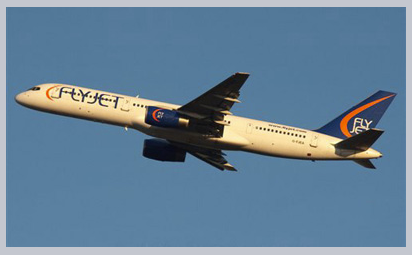

#### 단계

##### `steps(n[, start · end])`<sub>(timing 함수)</sub>
- 애니메이션 여러 단계 나누기

### 숫자 표시

#### 애니메이션 미적용

##### 결과


```html
<!-- index.html -->
<!DOCTYPE html>
<html>

<head>
  <meta charset="utf-8">
  <link rel="stylesheet" href="style.css">
</head>

<body>
  <div id="digit">
    <div id="stripe">0123456789</div>
  </div>
</body>

</html>
```
```css
/* style.css */
#digit {
  border: 1px solid red;
  width: 1.2em;
}

#stripe {
  display: inline-block;
  font: 32px monospace;
}
```

##### 숫자 하나씩 증가
- 빨간 박스 외부 숫자 숨기기
- 단계별 숫자 목록 좌측 이동
- 9단계 <sub>(0 ~ 9)</sub>

```css
#stripe.animate  {
  transform: translate(-90%);
  transition: transform 9s steps(9, start);
}
```

##### 결과


```html
<!-- index.html -->
<!DOCTYPE html>
<html>

<head>
  <meta charset="utf-8">
  <link rel="stylesheet" href="style.css">
</head>

<body>
  아래 숫자를 클릭하세요.

  <div id="digit">
    <div id="stripe">0123456789</div>
  </div>

  <script>
    digit.onclick = function() {
      stripe.classList.add('animate');
    }
  </script>
</body>

</html>
```
```css
/* style.css */
#digit {
  width: .5em;
  overflow: hidden;
  font: 32px monospace;
  cursor: pointer;
}

#stripe {
  display: inline-block
}

#stripe.animate {
  transform: translate(-90%);
  transition-property: transform;
  transition-duration: 9s;
  transition-timing-function: steps(9, start);
}
```

#### `steps(9, start)`

##### 1번째 인수 <sub>(`9`)</sub>
- 단계 수
- 전체 프로세스
  - 9단계 나눠 적용 <sub>(10%씩 진행)</sub>
- 시간 간격
  - 자동 9단계 나눠 진행 <sub>(1초 간격)</sub>
되는 것을 확인할 수 있습니다. 이때 시간 간격도 자동으로 9단계로 나뉘기 때문에 1초 간격으로 숫자가 증가하게 됩니다.

##### 2번째 인수 <sub>(`start`)</sub>
- `start`
  - 시간 간격 이전 시작 <sub>(바로 시작)</sub>
  - 숫자 클릭 시 효과 바로 시작

|초|진행률|
|:---:|:---:|
|`0s`|`-10%`|
|`1s`|`-20%`|
|…|…|
|`8s`|`-90%`|
|`9s`|`-90%`|

- `end`
  - 시간 간격 이후 시작 <sub>(각 1초 후 시작)</sub>
  - 숫자 클릭 후 1초 후 시작

|초|진행률|
|:---:|:---:|
|`0s`|`0%`|
|`1s`|`-10%`|
|…|…|
|`8s`|`-80%`|
|`9s`|`-90%`|


##### 결과


```css
/* style.css */
…

#stripe.animate {
  …
  transition-timing-function: steps(9, end);
}
```

#### 내장 값 <sub>(애니메이션 효과 거의 無 · 드물게 사용</sub>
- `step-start`<sub>(`steps(1, start)`)</sub>
  - 1번째 단계 바로 시작
  - 1번째 단계만 실행
- `step-end` <sub>(`steps(1, end)`)</sub>
  - 끝 한 단계만 진행

### `transitionend` <sub>(이벤트)</sub>

##### CSS 애니메이션 종료 시 자동 발생
- 애니메이션 조합 시 유용
- 종료 후 실행 예정 JS 코드 지정 가능

### 배 이동

##### 클릭 시 우 · 좌 이동
- 왕복 시 우측 더 이동


##### 각 트랜지션 종료 시
- go <sub>(함수)</sub> 실행
  - 방향 뒤집기 <sub>(새 애니메이션 시작)</sub>

```javascript
boat.onclick = function() {
  //...
  let times = 1;

  function go() {
    if (times % 2) {

      // 우측 이동
      boat.classList.remove('back');
      boat.style.marginLeft = 100 * times + 200 + 'px';
    } else {

      // 좌측 이동
      boat.classList.add('back');
      boat.style.marginLeft = 100 * times - 200 + 'px';
    }

  }

  go();

  boat.addEventListener('transitionend', function() {
    times++;
    go();
  });
};
```

#### 특수 프로퍼티 <sub>(트렌지션 관련 이벤트)</sub>

##### `propertyName`
- 애니메이션 완료 프로퍼티
- 동시 다수 프로퍼티 애니메이션 효과 적용 용이

##### `elapsedTime`
- 애니메이션 효과 적용 소모 시간 <sub>(초)</sub>
  - `transition-delay` 無 가정

### `@keyframes`

##### CSS 문법
- 다수 단순 애니메이션 동시 실행

##### 설정 요소
- 애니메이션 이름
- 이동 대상
- 이동 시간
- 이동 위치

##### 애니메이션 적용
- `animation` <sub>(프로퍼티)</sub> 사용
- 추가 매개변수 지정

##### 진행률 인디케이터 이동
```html
<div class="progress"></div>
```
```css
/* 애니메이션 이름 */
@keyframes go-left-right {

  /* 시작 */
  from { left: 0px; }

  /* 종료 */
  to { left: calc(100% - 50px); }
}

.progress {

 /* 커스텀 애니메이션 ('go-left-right') 적용
  지속 시간
  - 3초
  반복 횟수
  - 무한 (infinite)
  방향
  - 매번 바뀜 (alternate)
  */
  animation: go-left-right 3s infinite alternate;

  position: relative;
  border: 2px solid green;
  width: 50px;
  height: 20px;
  background: lime;
}
```


##### 주 용도
- 지속적인 정적 형태 이동 <sub>(특정 요소)</sub>

##### 관련 정보
- `@keyframes` 관련글
- [명세서](https://drafts.csswg.org/css-animations/)

<br />

## 요약

##### CSS 애니메이션
- CSS 프로퍼티 다양한 변화
- 전환 필요 시 용이

#### CSS 애니메이션 장단점 <sub>(vs JS 애니메이션)</sub>

##### 장점
- 간단한 애니메이션 간단히 수행
- 빠른 속도
- CPU 소모량 少

##### 단점
- 유연성 ↓ <sub>(특수 애니메이션 로직 구현 X)</sub>
  - ex\) 요소 '폭발'
- 애니메이션 관련 새 요소 생성 X

<br />

##  과제

### 비행기에 애니메이션 효과주기 (CSS) 1
아래 비행기 사진을 클릭하여 어떤 애니메이션 효과가 구현되어 있는지 살펴봅시다.





- 사진을 클릭하면 크기가 `40x24px` 에서 `400x240px`로 확대됩니다(10배 확대).
- 해당 효과는 3초가 소요됩니다.
- 효과가 끝나면 얼럿 창에 '완료!'가 출력됩니다.
- 애니메이션이 실행되는 동안에는 사진을 클릭해도 애니메이션이 중단되지 않습니다.

<br />


CSS to animate both `width` and `height`:
```css
/* original class */

#flyjet {
  transition: all 3s;
}

/* JS adds .growing */
#flyjet.growing {
  width: 400px;
  height: 240px;
}

```
Please note that `transitionend` triggers two times – once for every property. So if we don't perform an additional check then the message would show up 2 times.

[샌드박스를 열어 정답을 확인해보세요.](https://plnkr.co/edit/HeeLKlv1EX8SK2ic?p=preview)

<hr />

### 비행기에 애니메이션 효과주기 (CSS) 2
Modify the solution of the previous task to make the plane grow more than its original size 400x240px (jump out), and then return to that size.

Here's how it should look (click on the plane):


Take the solution of the previous task as the source.
<br />


We need to choose the right Bezier curve for that animation. It should have `y>1` somewhere for the plane to "jump out".

For instance, we can take both control points with `y>1`, like: `cubic-bezier(0.25, 1.5, 0.75, 1.5)`.

The graph:


[샌드박스를 열어 정답을 확인해보세요.](https://plnkr.co/edit/BBDJVbBUSGupTslE?p=preview)

<hr />

### Animated circle
Create a function `showCircle(cx, cy, radius)` that shows an animated growing circle.
- `cx`,`cy` are window-relative coordinates of the center of the circle,
- `radius` is the radius of the circle.

Click the button below to see how it should look like:


The source document has an example of a circle with right styles, so the task is precisely to do the animation right.

<br />


[샌드박스를 열어 정답을 확인해보세요.](https://plnkr.co/edit/MisyfHMxqGMq6Ijv?p=preview)
