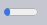
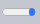
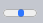
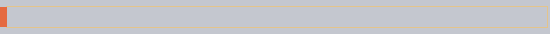

JS 애니메이션
====

##### CSS 애니메이션 능가
- 복잡한 경로 이동
  - 다양한 timing 함수 <sub>(베지어 곡선 외)</sub> 사용
- `canvas` <sub>(요소)</sub> 애니메이션 효과 적용
- 기타 등등

### `setInterval` <sub>(메서드)</sub> 사용하기

##### 일련의 프레임 연속 <sub>(애니메이션 구현 방식 중 하나)</sub>
- HTML · CSS
  - 연속된 아주 작은 값 변화

#### `style.left` 값 변화 <sub>(`0px` → `100px`)</sub>

##### 일반적인 값 수정
- 순간이동

##### `setInterval` <sub>(메서드)</sub> 사용
- `2px` 당 초단기 지연 적용
  - ex\) `20ms` <sub>(초당 50번)</sub>
  - 부드러운 이동 효과 발생
- 영화 상영 원리 유사
  - 초당 24프레임 <sub>(부드러운 움직임)</sub>

##### 코드 구조
```javascript
// 20ms 당 2px 이동
// - 초당 50프레임
let timer = setInterval(function() {
  if (애니메이션 완료) {
    clearInterval(timer);
  } else {
    style.left (프로퍼티) 값 2px씩 증가
  }
}, 20);
```

##### 실제 코드
```javascript
// 시작 시간
let start = Date.now();

let timer = setInterval(function() {

  // 경과 시간 계산
  let timePassed = Date.now() - start;

  // 2초 후 애니메이션 종료
  if (timePassed > 2000) {
    clearInterval(timer);
    return;
  }

  // 해당 경과 시간
  // - left 값 2px 증가
  draw(timePassed);

}, 20);

// 0초 → 2000초
// - 0px → 400px (left 값)
function draw(timePassed) {
  train.style.left = timePassed / 5 + 'px';
}
```

##### 결과


```html
<!-- index.html -->
<!DOCTYPE HTML>
<html>

<head>
  <style>
    #train {
      position: relative;
      cursor: pointer;
    }
  </style>
</head>

<body>
  

  <script>
    train.onclick = function() {
      let start = Date.now();

      let timer = setInterval(function() {
        let timePassed = Date.now() - start;

        if (timePassed > 2000) {
          clearInterval(timer);
          return;
        }

        train.style.left = timePassed / 5 + 'px';
      }, 20);
    }
  </script>
</body>

</html>
```

### `requestAnimationFrame` <sub>(함수)</sub>

#### 다수 애니메이션 동시 실행 상황

##### 각 애니메이션 개별 실행 <sub>(`setInterval` 메서드)</sub>
- 지연시간
  - 명시 시간 <sub>(`20ms`)</sub> 미만 <sub>(더 자주 실행)</sub>
- 각 애니메이션
  - 실행 시작 시간 상이 <sub>(지연 간격 정렬 X)</sub>
  - 독립적인 실행 · 지연시간
```javascript
/* 개별 시작 */
// 지연 간격 정렬 X
setInterval(animate1, 20);
setInterval(animate2, 20);
setInterval(animate3, 20);

/* 동시 시작 */
// 도중 애니메이션 추가 불가능
setInterval(function() {
  animate1();
  animate2();
  animate3();
}, 20);
```

##### 개별 애니메이션 그룹화 필요
- 브라우저 · CPU 부담 ↓
- 부드러운 동작 적용

#### [Animation timing](https://www.w3.org/TR/animation-timing/) <sub>(명세)</sub>

##### `requestAnimationFrame` <sub>(함수)</sub> 제공
```javascript
let requestId = requestAnimationFrame(callback);
```
- `callback` <sub>(함수)</sub> 실행 시점 조정
  - 최근접 지연 간격 맞춰 실행
- `callback` <sub>(함수)</sub> 내 요소 변화 발생 시
  - 타 애니메이션 효과 함께 그룹화
    - 타 `callback` <sub>(함수)</sub>
    - 타 CSS 애니메이션
- 각 애니메이션
  - 실행 시작 시간 동일 <sub>(지연 간격 정렬)</sub>

##### 반환 값 <sub>(`requestId`)</sub>
- 해당 `callback` <sub>(함수)</sub> 실행 취소 시 사용
```javascript
// 해당 callback (함수) 실행 취소
cancelAnimationFrame(requestId);
```

##### `callback` <sub>(함수)</sub> 인수 <sub>(1개)</sub>
- 페이지 로드 시작 후 경과 시간 <sub>(μs · 마이크로초)</sub>
- [`performance.now()`](https://developer.mozilla.org/en-US/docs/Web/API/Performance/now) 값 동일

##### `callback` <sub>(함수)</sub> 실행 시작 시점
- 보통 거의 즉시 시작
- 예외 경우 <sub>(즉시 시작 X)</sub>
  - CPU 과부화
  - 노트북 배터리 방전 직전
  - 기타 등등

##### `requestAnimationFrame` <sub>(함수)</sub> 실행 간격
- 보통 10 ~ 20ms
```javascript
let prev = performance.now();
let times = 0;

requestAnimationFrame(function measure(time) {
  document.body.insertAdjacentHTML("beforeEnd", Math.floor(time - prev) + " ");
  prev = time;

  if (times++ < 10) {
    requestAnimationFrame(measure);
  }
});
```

### 구조화된 애니메이션

##### 범용 애니메이션 함수 작성
- `requestAnimationFrame` <sub>(함수)</sub> 기반

##### `animate({duration, timing, draw})`
```javascript
/* animate.js */
function animate({duration, timing, draw}) {
  let start = performance.now();

  requestAnimationFrame(function animate(time) {

    // 0 → 1
    let timeFraction = (time - start) / duration;

    if (timeFraction > 1) {
      timeFraction = 1;
    }

    // 현재 애니메이션 완성도 (진행률) 계산
    let progress = timing(timeFraction)

    // 그리기 (애니메이션 효과 적용)
    draw(progress);

    if (timeFraction < 1) {
      requestAnimationFrame(animate);
    }
  });
}
```

#### `animate` <sub>(함수)</sub> 매개변수

##### `duration`
- 애니메이션 총 적용 시간 <sub>(ms)</sub>
  - ex\) `1000`

##### `timing(timeFraction)` <sub>(timing 함수)</sub>
- `transition-timing-function` 유사
- `timeFraction`
  - 부분 경과 시간
    - `0` <sub>(시작)</sub>
    - `1` <sub>(종료)</sub>
- 반환 값
  - 애니메이션 완성도 <sub>(진행률)</sub>
    - y <sub>(베지어 곡선)</sub> 유사
- ex\) 직선 timing 함수
  - 일정한 속도
```javascript
// transition-timing-function: linear 유사
function linear(timeFraction) {
  return timeFraction;
}
```


##### `draw(progress)` <sub>(함수)</sub>
- `progress`
  - 애니메이션 완성도 <sub>(진행률)</sub>
    - `0` <sub>(시작)</sub>
    - `1` <sub>(종료)</sub>
- 동작
  - 애니메이션 그리기
  - 요소 이동
  - 기타 등등
```javascript
function draw(progress) {
  train.style.left = progress + 'px';
}
```

##### 요소 애니메이션 적용 <sub>(`animate` 함수)</sub>
- `width` 값 증가
  - `0` → `100%`

##### 결과






```html
<!-- index.html -->
<!DOCTYPE HTML>
<html>

<head>
  <meta charset="utf-8">
  <style>
    progress {
      width: 5%;
    }
  </style>
  <script src="animate.js"></script>
</head>

<body>
  <progress id="elem"></progress>

  <script>
    elem.onclick = function() {
      animate({
        duration: 1000,
        timing: function(timeFraction) {
          return timeFraction;
        },
        draw: function(progress) {
          elem.style.width = progress * 100 + '%';
        }
      });
    };
  </script>
</body>

</html>
```

##### 무궁무진한 기능
- 다양한 timing 함수 <sub>(베지어 곡선 외)</sub> 사용
- 다양한 애니메이션 동작 구현
- 새 요소 생성
- 기타 등등

### timing 함수

#### x<sup>n</sup> <sub>(제곱 · 애니메이션 속도 ↑)</sub>

##### x<sup>2</sup> <sub>(포물선 곡선)</sub>
```javascript
function quad(timeFraction) {
  return Math.pow(timeFraction, 2);
}
```


##### x<sup>5</sup> <sub>(n 값 ↑ · 애니메이션 속도 ↑↑)</sub>


#### 호 <sub>(활 모양)</sub>
```javascript
function circ(timeFraction) {
  return 1 - Math.sin(Math.acos(timeFraction));
}
```


#### 활 쏘기

##### 효과 구성 <sub>(2가지)</sub>
1. 활 당기기
2. 쏘기

##### 추가 매개변수 <sub>(`a`)</sub>
- 탄성 계수
  - 활 당기기 거리
```javascript
function back(a, timeFraction) {
  return Math.pow(timeFraction, 2) * ((a + 1) * timeFraction - a);
}
```

##### `a = 1.5`





#### 반동

##### 추가 특수 계수 <sub>(`a` · `b`)</sub> 사용
```javascript
function bounce(timeFraction) {
  for (let a = 0, b = 1, result; 1; a += b, b /= 2) {
    if (timeFraction >= (7 - 4 * a) / 11) {
      return -Math.pow((11 - 6 * a - 11 * timeFraction) / 4, 2) + Math.pow(b, 2);
    }
  }
}
```


#### 탄력

##### 추가 매개변수 <sub>(`a`)</sub>
- 초기 범위 설정
```javascript
function elastic(a, timeFraction) {
  return Math.pow(2, 10 * (timeFraction - 1)) * Math.cos(20 * Math.PI * a / 3 * timeFraction);
}
```

##### `a = 1.5`


