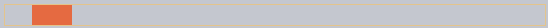
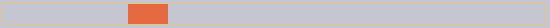
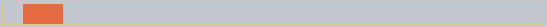

JS 애니메이션
=====================

##### CSS 애니메이션 능가
- 복잡한 경로 이동
  - 베지어 곡선 외 timing 함수 사용
- `canvas` <sub>(요소)</sub> 애니메이션 효과 적용
- 기타 등등

### `setInterval` 사용

##### 일련의 프레임 연속
- HTML · CSS 프로퍼티
  - 아주 작은 변화 발생 연속

#### `style.left` 변화 <sub>(`0px` → `100px`)</sub>

##### 일반 코드
- 순간이동

##### `setInterval` 사용
- `2px` 당 초단기 지연 발생 <sub>(초당 50번 등)</sub>
  - 부드러운 움직임 효과 발생
- 영화 상영 원리 유사
  - 초당 24프레임 <sub>(부드러운 움직임)</sub>


The pseudo-code can look like this:
```javascript
let timer = setInterval(function() {
  if (animation complete) clearInterval(timer);
  else increase style.left by 2px
}, 20); // change by 2px every 20ms, about 50 frames per second
```

More complete example of the animation:
```javascript
let start = Date.now(); // remember start time

let timer = setInterval(function() {
  // how much time passed from the start?
  let timePassed = Date.now() - start;

  if (timePassed >= 2000) {
    clearInterval(timer); // finish the animation after 2 seconds
    return;
  }

  // draw the animation at the moment timePassed
  draw(timePassed);

}, 20);

// as timePassed goes from 0 to 2000
// left gets values from 0px to 400px
function draw(timePassed) {
  train.style.left = timePassed / 5 + 'px';
}
```

Click for the demo:

##### 결과


```html
<!-- index.html -->
<!DOCTYPE HTML>
<html>

<head>
  <style>
    #train {
      position: relative;
      cursor: pointer;
    }
  </style>
</head>

<body>

  

  <script>
    train.onclick = function() {
      let start = Date.now();

      let timer = setInterval(function() {
        let timePassed = Date.now() - start;

        train.style.left = timePassed / 5 + 'px';

        if (timePassed > 2000) clearInterval(timer);

      }, 20);
    }
  </script>

</body>

</html>
```

### Using requestAnimationFrame
Let's imagine we have several animations running simultaneously.

If we run them separately, then even though each one has `setInterval(..., 20)`, then the browser would have to repaint much more often than every `20ms`.

That's because they have different starting time, so "every 20ms" differs between different animations. The intervals are not aligned. So we'll have several independent runs within `20ms`.

In other words, this:
```javascript
setInterval(function() {
  animate1();
  animate2();
  animate3();
}, 20)
```

…Is lighter than three independent calls:
```javascript
setInterval(animate1, 20); // independent animations
setInterval(animate2, 20); // in different places of the script
setInterval(animate3, 20);
```

These several independent redraws should be grouped together, to make the redraw easier for the browser and hence load less CPU load and look smoother.

There's one more thing to keep in mind. Sometimes when CPU is overloaded, or there are other reasons to redraw less often (like when the browser tab is hidden), so we really shouldn't run it every `20ms`.

But how do we know about that in JavaScript? There's a specification [Animation timing](https://www.w3.org/TR/animation-timing/) that provides the function `requestAnimationFrame`. It addresses all these issues and even more.

The syntax:
```javascript
let requestId = requestAnimationFrame(callback)
```

That schedules the `callback` function to run in the closest time when the browser wants to do animation.

If we do changes in elements in `callback` then they will be grouped together with other `requestAnimationFrame` callbacks and with CSS animations. So there will be one geometry recalculation and repaint instead of many.

The returned value `requestId` can be used to cancel the call:
```javascript
// cancel the scheduled execution of callback
cancelAnimationFrame(requestId);
```

The `callback` gets one argument – the time passed from the beginning of the page load in microseconds. This time can also be obtained by calling [performance.now()](https://developer.mozilla.org/en-US/docs/Web/API/Performance/now).

Usually `callback` runs very soon, unless the CPU is overloaded or the laptop battery is almost discharged, or there's another reason.

The code below shows the time between first 10 runs for `requestAnimationFrame`. Usually it's 10-20ms:
```javascript
<script>
  let prev = performance.now();
  let times = 0;

  requestAnimationFrame(function measure(time) {
    document.body.insertAdjacentHTML("beforeEnd", Math.floor(time - prev) + " ");
    prev = time;

    if (times++ < 10) requestAnimationFrame(measure);
  })
</script>
```

### Structured animation
Now we can make a more universal animation function based on `requestAnimationFrame`:
```javascript
function animate({timing, draw, duration}) {

  let start = performance.now();

  requestAnimationFrame(function animate(time) {
    // timeFraction goes from 0 to 1
    let timeFraction = (time - start) / duration;
    if (timeFraction > 1) timeFraction = 1;

    // calculate the current animation state
    let progress = timing(timeFraction)

    draw(progress); // draw it

    if (timeFraction < 1) {
      requestAnimationFrame(animate);
    }

  });
}
```

Function `animate` accepts 3 parameters that essentially describes the animation:
- `duration`
  - Total time of animation. Like, 1000.
- `timing(timeFraction)`
  - Timing function, like CSS-property `transition-timing-function` that gets the fraction of time that passed (`0` at start, `1` at the end) and returns the animation completion (like `y` on the Bezier curve).

For instance, a linear function means that the animation goes on uniformly with the same speed:
```javascript
function linear(timeFraction) {
  return timeFraction;
}
```

It's graph:


That's just like `transition-timing-function: linear`. There are more interesting variants shown below.

- `draw(progress)`

The function that takes the animation completion state and draws it. The value `progress=0` denotes the beginning animation state, and `progress=1` – the end state.

This is that function that actually draws out the animation.

It can move the element:
```javascript
function draw(progress) {
  train.style.left = progress + 'px';
}
```

…Or do anything else, we can animate anything, in any way.

Let's animate the element `width` from `0` to `100%` using our function.

Click on the element for the demo:

##### 결과


```html
<!-- index.html -->
<!DOCTYPE HTML>
<html>

<head>
  <meta charset="utf-8">
  <style>
    progress {
      width: 5%;
    }
  </style>
  <script src="animate.js"></script>
</head>

<body>

  <progress id="elem"></progress>

  <script>
    elem.onclick = function() {
      animate({
        duration: 1000,
        timing: function(timeFraction) {
          return timeFraction;
        },
        draw: function(progress) {
          elem.style.width = progress * 100 + '%';
        }
      });
    };
  </script>

</body>

</html>
```
```javascript
/* animate.js */
function animate({duration, draw, timing}) {

  let start = performance.now();

  requestAnimationFrame(function animate(time) {
    let timeFraction = (time - start) / duration;
    if (timeFraction > 1) timeFraction = 1;

    let progress = timing(timeFraction)

    draw(progress);

    if (timeFraction < 1) {
      requestAnimationFrame(animate);
    }

  });
}
```

The code for it:
```javascript
animate({
  duration: 1000,
  timing(timeFraction) {
    return timeFraction;
  },
  draw(progress) {
    elem.style.width = progress * 100 + '%';
  }
});
```

Unlike CSS animation, we can make any timing function and any drawing function here. The timing function is not limited by Bezier curves. And `draw` can go beyond properties, create new elements for like fireworks animation or something.

### Timing functions
We saw the simplest, linear timing function above.

Let's see more of them. We'll try movement animations with different timing functions to see how they work.

#### Power of n
If we want to speed up the animation, we can use `progress` in the power `n`.

For instance, a parabolic curve
```javascript
function quad(timeFraction) {
  return Math.pow(timeFraction, 2)
}
```

The graph:


See in action (click to activate):


…Or the cubic curve or event greater `n`. Increasing the power makes it speed up faster.

Here's the graph for `progress` in the power `5`:


#### The arc
Function:
```javascript
function circ(timeFraction) {
  return 1 - Math.sin(Math.acos(timeFraction));
}
```
The graph:


#### Back: bow shooting
This function does the "bow shooting". First we "pull the bowstring", and then "shoot".

Unlike previous functions, it depends on an additional parameter `x`, the "elasticity coefficient". The distance of "bowstring pulling" is defined by it.

The code:
```javascript
function back(x, timeFraction) {
  return Math.pow(timeFraction, 2) * ((x + 1) * timeFraction - x)
}
```
**The graph for `x = 1.5`:**


For animation we use it with a specific value of `x`. Example for `x = 1.5:`

#### Bounce
Imagine we are dropping a ball. It falls down, then bounces back a few times and stops.

The `bounce` function does the same, but in the reverse order: "bouncing" starts immediately. It uses few special coefficients for that:
```javascript
function bounce(timeFraction) {
  for (let a = 0, b = 1, result; 1; a += b, b /= 2) {
    if (timeFraction >= (7 - 4 * a) / 11) {
      return -Math.pow((11 - 6 * a - 11 * timeFraction) / 4, 2) + Math.pow(b, 2)
    }
  }
}
```

In action:








#### Elastic animation
One more "elastic" function that accepts an additional parameter `x` for the "initial range".
```javascript
function elastic(x, timeFraction) {
  return Math.pow(2, 10 * (timeFraction - 1)) * Math.cos(20 * Math.PI * x / 3 * timeFraction)
}
```

**The graph for `x=1.5`:**


In action for `x=1.5`:





