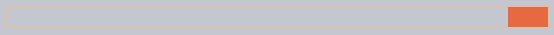
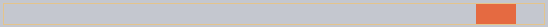
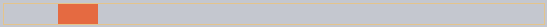
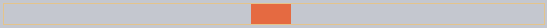
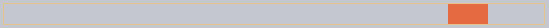
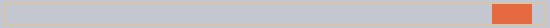
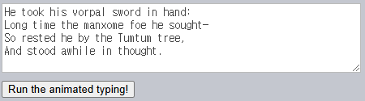
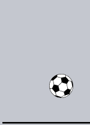

### 역적용 <sub>(`ease[*]`)</sub>

|`ease[*]`|적용|
|:---:|:---:|
|`easeIn`|정|
|`easeOut`|역|

#### `easeOut`

##### timing 함수 역적용 식
```javascript
1 - timing(1 - timeFraction)
```

##### `makeEaseOut(timing)` <sub>(함수)</sub>
- `timing`
  - 일반 timing 함수
- 반환 값
  - 래퍼 함수 <sub>(timing 함수 역적용)</sub>
```javascript
function makeEaseOut(timing) {
  return function(timeFraction) {
    return 1 - timing(1 - timeFraction);
  }
}
```

##### 반동 <sub>(timing 함수)</sub> 역적용
- 반동 효과
  - 끝 부분 크게 적용
```javascript
let bounceEaseOut = makeEaseOut(bounce);
```

##### 결과








```html
<!-- index.html -->
<!DOCTYPE HTML>
<html>

<head>
  <meta charset="utf-8">
  <link rel="stylesheet" href="style.css">
  <script src="https://js.cx/libs/animate.js"></script>
</head>

<body>
  <div id="path">
    <div id="brick"></div>
  </div>

  <script>
    function makeEaseOut(timing) {
      return function(timeFraction) {
        return 1 - timing(1 - timeFraction);
      }
    }

    function bounce(timeFraction) {
      for (let a = 0, b = 1, result; 1; a += b, b /= 2) {
        if (timeFraction >= (7 - 4 * a) / 11) {
          return -Math.pow((11 - 6 * a - 11 * timeFraction) / 4, 2) + Math.pow(b, 2);
        }
      }
    }

    let bounceEaseOut = makeEaseOut(bounce);

    brick.onclick = function() {
      animate({
        duration: 3000,
        timing: bounceEaseOut,
        draw: function(progress) {
          brick.style.left = progress * 500 + 'px';
        }
      });
    };
  </script>
</body>

</html>
```
```css
/* style.css */
#brick { width: 40px; height: 20px; background: #EE6B47; position: relative; cursor: pointer; }
#path { outline: 1px solid #E8C48E; width: 540px; height: 20px; }
```


##### `bounce` <sub>(반동 함수)</sub> 적용

|선 색상|적용|
|:---:|:---:|
|🟠주황색🟠|일반 <sub>(`easeIn`)</sub>|
|🔵파란색🔵|역 <sub>(`easeOut`)</sub>|

#### `easeInOut`

##### 효과 적용 시점
- 처음 · 끝 부분

##### 애니메이션 상태 계산 예시
```javascript
// 애니메이션 첫 절반
if (timeFraction <= 0.5) {
  return timing(2 * timeFraction) / 2;

// 애니메이션 끝 절반
} else {
  return (2 - timing(2 * (1 - timeFraction))) / 2;
}
```

##### `makeEaseInOut` <sub>(함수)</sub>
- 인수
  - 일반 timing 함수
- 반환 값
  - 래퍼 함수 <sub>(timing 함수 처음 · 끝 적용)</sub>
```javascript
function makeEaseInOut(timing) {
  return function(timeFraction) {
    if (timeFraction < .5)
      return timing(2 * timeFraction) / 2;
    else
      return (2 - timing(2 * (1 - timeFraction))) / 2;
  }
}
```

##### `bounce` <sub>(반동 timing 함수)</sub> 처음 · 끝 적용
- 반동 효과
  - 처음 · 끝 부분 크게 적용
```javascript
bounceEaseInOut = makeEaseInOut(bounce);
```

##### 결과














```html
<!-- index.html -->
<!DOCTYPE HTML>
<html>

<head>
  <meta charset="utf-8">
  <link rel="stylesheet" href="style.css">
  <script src="https://js.cx/libs/animate.js"></script>
</head>

<body>
  <div id="path">
    <div id="brick"></div>
  </div>

  <script>
    function makeEaseInOut(timing) {
      return function(timeFraction) {
        if (timeFraction < .5)
          return timing(2 * timeFraction) / 2;
        else
          return (2 - timing(2 * (1 - timeFraction))) / 2;
      }
    }

    function bounce(timeFraction) {
      for (let a = 0, b = 1, result; 1; a += b, b /= 2) {
        if (timeFraction >= (7 - 4 * a) / 11) {
          return -Math.pow((11 - 6 * a - 11 * timeFraction) / 4, 2) + Math.pow(b, 2)
        }
      }
    }

    let bounceEaseInOut = makeEaseInOut(bounce);

    brick.onclick = function() {
      animate({
        duration: 3000,
        timing: bounceEaseInOut,
        draw: function(progress) {
          brick.style.left = progress * 500 + 'px';
        }
      });
    };
  </script>
</body>

</html>
```
```css
/* style.css */
#brick { width: 40px; height: 20px; background: #EE6B47; position: relative; cursor: pointer; }
#path { outline: 1px solid #E8C48E; width: 540px; height: 20px; }
```

##### `ease[In·Out]` 조합
- 처음 절반
  - `easeIn` <sub>(정)</sub>
- 끝 절반
  - `easeOut` <sub>(역)</sub>


##### `circ` <sub>(timing 함수)</sub>

|선 색상|적용|
|:---:|:---:|
|🟠주황색🟠|정 <sub>(`easeIn`)</sub>|
|🟢연두색🟢|역 <sub>(`easeOut`)</sub>|
|🔵하늘색🔵|조합 <sub>(`easeInOut`)</sub>|

### 흥마로운 `draw`

##### 다양한 동작 효과 가능 <sub>(단순 요소 이동 X)</sub>
- ex\) 튀는 텍스트 타이핑 등

##### 결과



```html
<!-- index.html -->
<!DOCTYPE HTML>
<html>

<head>
  <meta charset="utf-8">
  <link rel="stylesheet" href="style.css">
  <script src="https://js.cx/libs/animate.js"></script>
</head>

<body>
  <textarea id="textExample" rows="5" cols="60">
    He took his vorpal sword in hand:
    Long time the manxome foe he sought—
    So rested he by the Tumtum tree,
    And stood awhile in thought.
  </textarea>

  <button onclick="animateText(textExample)">Run the animated typing!</button>

  <script>
    function animateText(textArea) {
      let text = textArea.value;
      let to = text.length;
      let from = 0;

      animate({
        duration: 5000,
        timing: bounce,
        draw: function(progress) {
          let result = (to - from) * progress + from;
          textArea.value = text.substr(0, Math.ceil(result));
        }
      });
    }

    function bounce(timeFraction) {
      for (let a = 0, b = 1, result; 1; a += b, b /= 2) {
        if (timeFraction >= (7 - 4 * a) / 11) {
          return -Math.pow((11 - 6 * a - 11 * timeFraction) / 4, 2) + Math.pow(b, 2);
        }
      }
    }
  </script>
</body>

</html>
```
```css
/* style.css */
textarea { display: block; border: 1px solid #BBB; color: #444; font-size: 110%; }
button { margin-top: 10px; }
```

<br />

요약
====

##### JS 애니메이션
- CSS 애니메이션 능가
- 상세 조절 가능
- `requestAnimationFrame` <sub>(함수)</sub> 필수

##### `requestAnimationFrame` <sub>(내장 함수)</sub>
- 다수 애니메이션 지연 간격 정렬화
- 해당 페이지 백그라운드 동작 시
  - 애니메이션 효과 미적용 <sub>(자원 소모 X)</sub>

##### `animate` <sub>(헬퍼 함수)</sub>
- 범용 애니메이션 적용 함수
```javascript
function animate({duration, timing, draw}) {
  let start = performance.now();

  requestAnimationFrame(function animate(time) {

    // 0 → 1
    let timeFraction = (time - start) / duration;

    if (timeFraction > 1) {
      timeFraction = 1;
    }

    // 현재 애니메이션 완성도 (진행률) 계산
    let progress = timing(timeFraction)

    // 그리기 (애니메이션 효과 적용)
    draw(progress);

    if (timeFraction < 1) {
      requestAnimationFrame(animate);
    }
  });
}
```

#### 매개변수

##### `duration`
- 애니메이션 총 적용 시간 <sub>(ms)</sub>

##### `timing(timeFraction)` <sub>(timing 함수)</sub>
- 애니메이션 진행률 계산
- `timeFraction` <sub>(부분 경과 시간)</sub>
  - `0` <sub>(시작)</sub>
  - `1` <sub>(종료)</sub>
- 반환 값
  - 애니메이션 완성도 <sub>(진행률)</sub>
    - 보통 `0` ~ `1`

##### `draw(progress)` <sub>(함수)</sub>
- 애니메이션 그리기

##### JS 애니메이션 주 용도
- 다양한 흥미로운 효과
- 非표준 효과

##### 다양한 timing 함수 <sub>(베지어 곡선 외)</sub> 사용 가능
- 제곱
- 호 <sub>(활 모양)</sub>
- 활 쏘기
- 반동
- 탄력
- 기타 등등

##### 다양한 효과 가능
- CSS 프로퍼티 수정
- 요소 생성
- 기타 등등

<br />

##  과제

### 튕기는 공

##### 튕기는 공 애니메이션 효과 작성


<br />


##### 공 <sub>(요소)</sub> CSS 프로퍼티 사용
- `top`
  - 공 <sub>(요소)</sub> 좌상단 좌표
  - 애니메이션 효과 적용 대상
- `position: absolute`

##### 필드 CSS 프로퍼티
- `position: relative`
- 바닥 좌표
  - `field.clientHeight`

##### 필드 최하단 공 <sub>(요소)</sub> 좌표
```javascript
field.clientHeight - ball.clientHeight
```

##### 튕기는 효과
- 반동 <sub>(timing 함수)</sub> 사용
  - `easeOut` <sub>(역적용)</sub> 모드
```javascript
let to = field.clientHeight - ball.clientHeight;

animate({
  duration: 2000,
  timing: makeEaseOut(bounce),
  draw(progress) {
    ball.style.top = to * progress + 'px';
  }
});
```

[정답](https://plnkr.co/edit/QI3nkpLU2F7wKX79?p=preview)

<hr />

### 튕기는 공 <sub>(우측 이동)</sub>

##### 우측으로 튕기는 공 애니메이션 효과 작성
- 우측 이동 거리
  - `100px`
- 이전 과제 참조





<br />


##### 수평 좌표 이동 방식
- 튕기기 X
- 점진적 증가 <sub>(좌 → 우)</sub>

##### `left` <sub>(공 요소 CSS)</sub>
- 공 <sub>(요소)</sub> 좌측 좌표
- 2번째 애니메이션 효과 적용 대상

##### 점진적 증가 효과
- `linear` <sub>(timing 함수)</sub>
  - 직선 함수
- `makeEaseOut(quad)`
  - x<sup>2</sup> <sub>(timing 함수)</sub> 역적용
  - 보기 더 좋음
```javascript
let height = field.clientHeight - ball.clientHeight;
let width = 100;

// 튕기는 효과 (top 프로퍼티)
animate({
  duration: 2000,
  timing: makeEaseOut(bounce),
  draw: function(progress) {
    ball.style.top = height * progress + 'px';
  }
});

// 우측 이동 효과 (left 프로퍼티)
animate({
  duration: 2000,
  timing: makeEaseOut(quad),
  draw: function(progress) {
    ball.style.left = width * progress + "px";
  }
});
```

[정답](https://plnkr.co/edit/N4KUmyLBqpFYSMee?p=preview)
