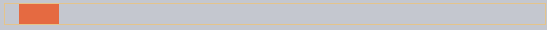

### 역적용 <sub>(`ease*`)</sub>

|`ease*`|적용|
|:---:|:---:|
|`easeIn`|일반|
|`easeOut`|역|

#### `easeOut`

##### `timingEaseOut`
- 타이밍 함수 `easeOut` <sub>(모드)</sub> 적용
```javascript
timingEaseOut(timeFraction) = 1 - timing(1 - timeFraction);
```

##### `makeEaseOut` <sub>(함수)</sub>
- 인수
  - 일반 타이밍 함수
- 반환값
  - 래퍼 함수 <sub>(타이밍 함수 역적용)</sub>
```javascript
function makeEaseOut(timing) {
  return function(timeFraction) {
    return 1 - timing(1 - timeFraction);
  }
}
```

##### `bounce` <sub>(반동 타이밍 함수)</sub> 역적용
- 반동 효과
  - 끝 부분 크게 적용
```javascript
let bounceEaseOut = makeEaseOut(bounce);
```

##### 결과


```html
<!-- index.html -->
<!DOCTYPE HTML>
<html>

<head>
  <meta charset="utf-8">
  <link rel="stylesheet" href="style.css">
  <script src="https://js.cx/libs/animate.js"></script>
</head>

<body>
  <div id="path">
    <div id="brick"></div>
  </div>

  <script>
    function makeEaseOut(timing) {
      return function(timeFraction) {
        return 1 - timing(1 - timeFraction);
      }
    }

    function bounce(timeFraction) {
      for (let a = 0, b = 1, result; 1; a += b, b /= 2) {
        if (timeFraction >= (7 - 4 * a) / 11) {
          return -Math.pow((11 - 6 * a - 11 * timeFraction) / 4, 2) + Math.pow(b, 2);
        }
      }
    }

    let bounceEaseOut = makeEaseOut(bounce);

    brick.onclick = function() {
      animate({
        duration: 3000,
        timing: bounceEaseOut,
        draw: function(progress) {
          brick.style.left = progress * 500 + 'px';
        }
      });
    };
  </script>
</body>

</html>
```
```css
/* style.css */
#brick { width: 40px; height: 20px; background: #EE6B47; position: relative; cursor: pointer; }
#path { outline: 1px solid #E8C48E; width: 540px; height: 20px; }
```


##### `bounce` <sub>(반동 함수)</sub> 적용

|선 색상|적용|
|:---:|:---:|
|🟠주황색🟠|일반 <sub>(`easeIn`)</sub>|
|🔵파란색🔵|역 <sub>(`easeOut`)</sub>|

#### `easeInOut`

##### 효과 적용 시점
- 처음 · 끝 부분

##### 애니메이션 상태 계산 예시
```javascript
// 애니메이션 첫 절반
if (timeFraction <= 0.5) {
  return timing(2 * timeFraction) / 2;

// 애니메이션 끝 절반
} else {
  return (2 - timing(2 * (1 - timeFraction))) / 2;
}
```

##### `makeEaseInOut` <sub>(함수)</sub>
- 인수
  - 일반 타이밍 함수
- 반환값
  - 래퍼 함수 <sub>(타이밍 함수 처음 · 끝 적용)</sub>
```javascript
function makeEaseInOut(timing) {
  return function(timeFraction) {
    if (timeFraction < .5)
      return timing(2 * timeFraction) / 2;
    else
      return (2 - timing(2 * (1 - timeFraction))) / 2;
  }
}
```
##### `bounce` <sub>(반동 타이밍 함수)</sub> 처음 · 끝 적용
- 반동 효과
  - 처음 · 끝 부분 크게 적용
```javascript
bounceEaseInOut = makeEaseInOut(bounce);
```

##### 결과





```html
<!-- index.html -->
<!DOCTYPE HTML>
<html>

<head>
  <meta charset="utf-8">
  <link rel="stylesheet" href="style.css">
  <script src="https://js.cx/libs/animate.js"></script>
</head>

<body>
  <div id="path">
    <div id="brick"></div>
  </div>

  <script>
    function makeEaseInOut(timing) {
      return function(timeFraction) {
        if (timeFraction < .5)
          return timing(2 * timeFraction) / 2;
        else
          return (2 - timing(2 * (1 - timeFraction))) / 2;
      }
    }

    function bounce(timeFraction) {
      for (let a = 0, b = 1, result; 1; a += b, b /= 2) {
        if (timeFraction >= (7 - 4 * a) / 11) {
          return -Math.pow((11 - 6 * a - 11 * timeFraction) / 4, 2) + Math.pow(b, 2)
        }
      }
    }

    let bounceEaseInOut = makeEaseInOut(bounce);

    brick.onclick = function() {
      animate({
        duration: 3000,
        timing: bounceEaseInOut,
        draw: function(progress) {
          brick.style.left = progress * 500 + 'px';
        }
      });
    };
  </script>
</body>

</html>
```
```css
/* style.css */
#brick { width: 40px; height: 20px; background: #EE6B47; position: relative; cursor: pointer; }
#path { outline: 1px solid #E8C48E; width: 540px; height: 20px; }
```

##### `easeIn` · `easeOut` 결합
- 처음 절반
  - `easeIn` <sub>(일반 적용)</sub>
- 끝 절반
  - `easeOut` <sub>(역 적용)</sub>


##### `circ` <sub>(타이밍 함수)</sub>

|선 색상|적용|
|:---:|:---:|
|🟠주황색🟠|일반 <sub>(`easeIn`)</sub>|
|🟢연두색🟢|역 <sub>(`easeOut`)</sub>|
|🔵하늘색🔵|처음 · 끝 <sub>(`easeInOut`)</sub>|

### More interesting "draw"
Instead of moving the element we can do something else. All we need is to write the write the proper `draw`.

Here's the animated "bouncing" text typing:

##### 결과

_**해당 이미지 찾기**_

```html
<!-- index.html -->
<!DOCTYPE HTML>
<html>

<head>
  <meta charset="utf-8">
  <link rel="stylesheet" href="style.css">
  <script src="https://js.cx/libs/animate.js"></script>
</head>

<body>

  <textarea id="textExample" rows="5" cols="60">He took his vorpal sword in hand:
Long time the manxome foe he sought—
So rested he by the Tumtum tree,
And stood awhile in thought.
  </textarea>

  <button onclick="animateText(textExample)">Run the animated typing!</button>

  <script>
    function animateText(textArea) {
      let text = textArea.value;
      let to = text.length,
        from = 0;

      animate({
        duration: 5000,
        timing: bounce,
        draw: function(progress) {
          let result = (to - from) * progress + from;
          textArea.value = text.substr(0, Math.ceil(result))
        }
      });
    }

    function bounce(timeFraction) {
      for (let a = 0, b = 1, result; 1; a += b, b /= 2) {
        if (timeFraction >= (7 - 4 * a) / 11) {
          return -Math.pow((11 - 6 * a - 11 * timeFraction) / 4, 2) + Math.pow(b, 2)
        }
      }
    }
  </script>

</body>

</html>
```
```css
/* style.css */
textarea { display: block; border: 1px solid #BBB; color: #444; font-size: 110%; }
button { margin-top: 10px; }
```

<br />

## 요약
For animations that CSS can't handle well, or those that need tight control, JavaScript can help. JavaScript animations should be implemented via `requestAnimationFrame`. That built-in method allows to setup a callback function to run when the browser will be preparing a repaint. Usually that's very soon, but the exact time depends on the browser.

When a page is in the background, there are no repaints at all, so the callback won't run: the animation will be suspended and won't consume resources. That's great.

Here's the helper `animate` function to setup most animations:
```javascript
function animate({timing, draw, duration}) {

  let start = performance.now();

  requestAnimationFrame(function animate(time) {
    // timeFraction goes from 0 to 1
    let timeFraction = (time - start) / duration;
    if (timeFraction > 1) timeFraction = 1;

    // calculate the current animation state
    let progress = timing(timeFraction);

    draw(progress); // draw it

    if (timeFraction < 1) {
      requestAnimationFrame(animate);
    }

  });
}
```

Options:
- `duration` – the total animation time in ms.
- `timing` – the function to calculate animation progress. Gets a time fraction from 0 to 1, returns the animation progress, usually from 0 to 1.
- `draw` – the function to draw the animation.

Surely we could improve it, add more bells and whistles, but JavaScript animations are not applied on a daily basis. They are used to do something interesting and non-standard. So you'd want to add the features that you need when you need them.

JavaScript animations can use any timing function. We covered a lot of examples and transformations to make them even more versatile. Unlike CSS, we are not limited to Bezier curves here.

The same is about `draw`: we can animate anything, not just CSS properties.

<br />

##  과제

### Animate the bouncing ball
Make a bouncing ball. Click to see how it should look:


<br />


To bounce we can use CSS property `top` and `position:absolute` for the ball inside the field with `position:relative`.

The bottom coordinate of the field is `field.clientHeight`. The `top` <sub>(CSS 프로퍼티)</sub> refers to the upper edge of the ball. So it should go from `0` till `field.clientHeight` - `ball.clientHeight`, that's the final lowest position of the upper edge of the ball.

To to get the "bouncing" effect we can use the timing function `bounce` in `easeOut` mode.

Here's the final code for the animation:
```javascript
let to = field.clientHeight - ball.clientHeight;

animate({
  duration: 2000,
  timing: makeEaseOut(bounce),
  draw(progress) {
    ball.style.top = to * progress + 'px'
  }
});
```

[샌드박스를 열어 정답을 확인해보세요.](https://plnkr.co/edit/QI3nkpLU2F7wKX79?p=preview)

<hr />

### Animate the ball bouncing to the right
Make the ball bounce to the right. Like this:


Write the animation code. The distance to the left is `100px`.

Take the solution of the previous task as the source.

<br />


In the previous, we had only one property to animate. Now we need one more: `elem.style.left`.

The horizontal coordinate changes by another law: it does not "bounce", but gradually increases shifting the ball to the right.

We can write one more `animate` for it.

As the time function we could use `linear`, but something like `makeEaseOut(quad)` looks much better.

The code:
```javascript
let height = field.clientHeight - ball.clientHeight;
let width = 100;

// animate top (bouncing)
animate({
  duration: 2000,
  timing: makeEaseOut(bounce),
  draw: function(progress) {
    ball.style.top = height * progress + 'px'
  }
});

// animate left (moving to the right)
animate({
  duration: 2000,
  timing: makeEaseOut(quad),
  draw: function(progress) {
    ball.style.left = width * progress + "px"
  }
});
```

[샌드박스를 열어 정답을 확인해보세요.](https://plnkr.co/edit/N4KUmyLBqpFYSMee?p=preview)
