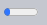
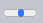
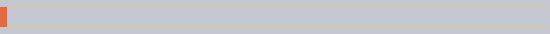
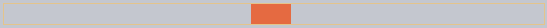
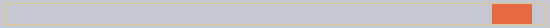

JS animations
=====================

JavaScript animations can handle things that CSS can't.

For instance, moving along a complex path, with a timing function different from Bezier curves, or an animation on a canvas.

### Using setInterval
An animation can be implemented as a sequence of frames – usually small changes to HTML/CSS properties.

For instance, changing `style.left` from `0px` to `100px` moves the element. And if we increase it in `setInterval`, changing by `2px` with a tiny delay, like 50 times per second, then it looks smooth. That's the same principle as in the cinema: 24 frames per second is enough to make it look smooth.

The pseudo-code can look like this:
```javascript
let timer = setInterval(function() {
  if (animation complete) clearInterval(timer);
  else increase style.left by 2px
}, 20); // change by 2px every 20ms, about 50 frames per second
```

More complete example of the animation:
```javascript
let start = Date.now(); // remember start time

let timer = setInterval(function() {
  // how much time passed from the start?
  let timePassed = Date.now() - start;

  if (timePassed >= 2000) {
    clearInterval(timer); // finish the animation after 2 seconds
    return;
  }

  // draw the animation at the moment timePassed
  draw(timePassed);

}, 20);

// as timePassed goes from 0 to 2000
// left gets values from 0px to 400px
function draw(timePassed) {
  train.style.left = timePassed / 5 + 'px';
}
```

Click for the demo:

##### 결과


```html
<!-- index.html -->
<!DOCTYPE HTML>
<html>

<head>
  <style>
    #train {
      position: relative;
      cursor: pointer;
    }
  </style>
</head>

<body>

  


  <script>
    train.onclick = function() {
      let start = Date.now();

      let timer = setInterval(function() {
        let timePassed = Date.now() - start;

        train.style.left = timePassed / 5 + 'px';

        if (timePassed > 2000) clearInterval(timer);

      }, 20);
    }
  </script>

</body>

</html>
```

### Using requestAnimationFrame
Let's imagine we have several animations running simultaneously.

If we run them separately, then even though each one has `setInterval(..., 20)`, then the browser would have to repaint much more often than every `20ms`.

That's because they have different starting time, so “every 20ms” differs between different animations. The intervals are not aligned. So we'll have several independent runs within `20ms`.

In other words, this:
```javascript
setInterval(function() {
  animate1();
  animate2();
  animate3();
}, 20)
```

…Is lighter than three independent calls:
```javascript
setInterval(animate1, 20); // independent animations
setInterval(animate2, 20); // in different places of the script
setInterval(animate3, 20);
```

These several independent redraws should be grouped together, to make the redraw easier for the browser and hence load less CPU load and look smoother.

There's one more thing to keep in mind. Sometimes when CPU is overloaded, or there are other reasons to redraw less often (like when the browser tab is hidden), so we really shouldn't run it every `20ms`.

But how do we know about that in JavaScript? There's a specification [Animation timing](https://www.w3.org/TR/animation-timing/) that provides the function `requestAnimationFrame`. It addresses all these issues and even more.

The syntax:
```javascript
let requestId = requestAnimationFrame(callback)
```

That schedules the `callback` function to run in the closest time when the browser wants to do animation.

If we do changes in elements in `callback` then they will be grouped together with other `requestAnimationFrame` callbacks and with CSS animations. So there will be one geometry recalculation and repaint instead of many.

The returned value `requestId` can be used to cancel the call:
```javascript
// cancel the scheduled execution of callback
cancelAnimationFrame(requestId);
```

The `callback` gets one argument – the time passed from the beginning of the page load in microseconds. This time can also be obtained by calling [performance.now()](https://developer.mozilla.org/en-US/docs/Web/API/Performance/now).

Usually `callback` runs very soon, unless the CPU is overloaded or the laptop battery is almost discharged, or there's another reason.

The code below shows the time between first 10 runs for `requestAnimationFrame`. Usually it's 10-20ms:
```javascript
<script>
  let prev = performance.now();
  let times = 0;

  requestAnimationFrame(function measure(time) {
    document.body.insertAdjacentHTML("beforeEnd", Math.floor(time - prev) + " ");
    prev = time;

    if (times++ < 10) requestAnimationFrame(measure);
  })
</script>
```

### Structured animation
Now we can make a more universal animation function based on `requestAnimationFrame`:
```javascript
function animate({timing, draw, duration}) {

  let start = performance.now();

  requestAnimationFrame(function animate(time) {
    // timeFraction goes from 0 to 1
    let timeFraction = (time - start) / duration;
    if (timeFraction > 1) timeFraction = 1;

    // calculate the current animation state
    let progress = timing(timeFraction)

    draw(progress); // draw it

    if (timeFraction < 1) {
      requestAnimationFrame(animate);
    }

  });
}
```

Function `animate` accepts 3 parameters that essentially describes the animation:
- `duration`
  - Total time of animation. Like, 1000.
- `timing(timeFraction)`
  - Timing function, like CSS-property `transition-timing-function` that gets the fraction of time that passed (`0` at start, `1` at the end) and returns the animation completion (like `y` on the Bezier curve).

For instance, a linear function means that the animation goes on uniformly with the same speed:
```javascript
function linear(timeFraction) {
  return timeFraction;
}
```

It's graph:


That's just like `transition-timing-function: linear`. There are more interesting variants shown below.

- `draw(progress)`

The function that takes the animation completion state and draws it. The value `progress=0` denotes the beginning animation state, and `progress=1` – the end state.

This is that function that actually draws out the animation.

It can move the element:
```javascript
function draw(progress) {
  train.style.left = progress + 'px';
}
```

…Or do anything else, we can animate anything, in any way.

Let's animate the element `width` from `0` to `100%` using our function.

Click on the element for the demo:

##### 결과






```html
<!-- index.html -->
<!DOCTYPE HTML>
<html>

<head>
  <meta charset="utf-8">
  <style>
    progress {
      width: 5%;
    }
  </style>
  <script src="animate.js"></script>
</head>

<body>

  <progress id="elem"></progress>

  <script>
    elem.onclick = function() {
      animate({
        duration: 1000,
        timing: function(timeFraction) {
          return timeFraction;
        },
        draw: function(progress) {
          elem.style.width = progress * 100 + '%';
        }
      });
    };
  </script>

</body>

</html>
```
```javascript
/* animate.js */
function animate({duration, draw, timing}) {

  let start = performance.now();

  requestAnimationFrame(function animate(time) {
    let timeFraction = (time - start) / duration;
    if (timeFraction > 1) timeFraction = 1;

    let progress = timing(timeFraction)

    draw(progress);

    if (timeFraction < 1) {
      requestAnimationFrame(animate);
    }

  });
}
```

The code for it:
```javascript
animate({
  duration: 1000,
  timing(timeFraction) {
    return timeFraction;
  },
  draw(progress) {
    elem.style.width = progress * 100 + '%';
  }
});
```

Unlike CSS animation, we can make any timing function and any drawing function here. The timing function is not limited by Bezier curves. And `draw` can go beyond properties, create new elements for like fireworks animation or something.

### Timing functions
We saw the simplest, linear timing function above.

Let's see more of them. We'll try movement animations with different timing functions to see how they work.

#### Power of n
If we want to speed up the animation, we can use `progress` in the power `n`.

For instance, a parabolic curve
```javascript
function quad(timeFraction) {
  return Math.pow(timeFraction, 2)
}
```

The graph:


See in action (click to activate):


…Or the cubic curve or event greater `n`. Increasing the power makes it speed up faster.

Here's the graph for `progress` in the power `5`:


#### The arc
Function:
```javascript
function circ(timeFraction) {
  return 1 - Math.sin(Math.acos(timeFraction));
}
```
The graph:


#### Back: bow shooting
This function does the “bow shooting”. First we “pull the bowstring”, and then “shoot”.

Unlike previous functions, it depends on an additional parameter `x`, the “elasticity coefficient”. The distance of “bowstring pulling” is defined by it.

The code:
```javascript
function back(x, timeFraction) {
  return Math.pow(timeFraction, 2) * ((x + 1) * timeFraction - x)
}
```
**The graph for `x = 1.5`:**





For animation we use it with a specific value of `x`. Example for `x = 1.5:`

#### Bounce
Imagine we are dropping a ball. It falls down, then bounces back a few times and stops.

The `bounce` function does the same, but in the reverse order: “bouncing” starts immediately. It uses few special coefficients for that:
```javascript
function bounce(timeFraction) {
  for (let a = 0, b = 1, result; 1; a += b, b /= 2) {
    if (timeFraction >= (7 - 4 * a) / 11) {
      return -Math.pow((11 - 6 * a - 11 * timeFraction) / 4, 2) + Math.pow(b, 2)
    }
  }
}
```

In action:


#### Elastic animation
One more “elastic” function that accepts an additional parameter `x` for the “initial range”.
```javascript
function elastic(x, timeFraction) {
  return Math.pow(2, 10 * (timeFraction - 1)) * Math.cos(20 * Math.PI * x / 3 * timeFraction)
}
```

**The graph for `x=1.5`:**


In action for `x=1.5`:


### Reversal: ease*

So we have a collection of timing functions. Their direct application is called “easeIn”.

Sometimes we need to show the animation in the reverse order. That's done with the “easeOut” transform.

#### easeOut
In the “easeOut” mode the `timing` function is put into a wrapper `timingEaseOut`:
```javascript
timingEaseOut(timeFraction) = 1 - timing(1 - timeFraction)
```

In other words, we have a “transform” function `makeEaseOut` that takes a “regular” timing function and returns the wrapper around it:
```javascript
// accepts a timing function, returns the transformed variant
function makeEaseOut(timing) {
  return function(timeFraction) {
    return 1 - timing(1 - timeFraction);
  }
}
```

For instance, we can take the `bounce` function described above and apply it:
```javascript
let bounceEaseOut = makeEaseOut(bounce);
```

Then the bounce will be not in the beginning, but at the end of the animation. Looks even better:

##### 결과


```html
<!-- index.html -->
<!DOCTYPE HTML>
<html>

<head>
  <meta charset="utf-8">
  <link rel="stylesheet" href="style.css">
  <script src="https://js.cx/libs/animate.js"></script>
</head>

<body>

  <div id="path">
    <div id="brick"></div>
  </div>

  <script>
    function makeEaseOut(timing) {
      return function(timeFraction) {
        return 1 - timing(1 - timeFraction);
      }
    }

    function bounce(timeFraction) {
      for (let a = 0, b = 1, result; 1; a += b, b /= 2) {
        if (timeFraction >= (7 - 4 * a) / 11) {
          return -Math.pow((11 - 6 * a - 11 * timeFraction) / 4, 2) + Math.pow(b, 2)
        }
      }
    }

    let bounceEaseOut = makeEaseOut(bounce);

    brick.onclick = function() {
      animate({
        duration: 3000,
        timing: bounceEaseOut,
        draw: function(progress) {
          brick.style.left = progress * 500 + 'px';
        }
      });
    };
  </script>

</body>

</html>
```
```css
/* style.css */
#brick { width: 40px; height: 20px; background: #EE6B47; position: relative; cursor: pointer; }
#path { outline: 1px solid #E8C48E; width: 540px; height: 20px; }
```

Here we can see how the transform changes the behavior of the function:


If there's an animation effect in the beginning, like bouncing – it will be shown at the end.

In the graph above the 🟠regular bounce🟠 has the red color, and the 🔵easeOut bounce🔵 is blue.
- Regular bounce – the object bounces at the bottom, then at the end sharply jumps to the top.
- After `easeOut` – it first jumps to the top, then bounces there.

#### easeInOut
We also can show the effect both in the beginning and the end of the animation. The transform is called “easeInOut”.

Given the timing function, we calculate the animation state like this:
```javascript
if (timeFraction <= 0.5) { // first half of the animation
  return timing(2 * timeFraction) / 2;
} else { // second half of the animation
  return (2 - timing(2 * (1 - timeFraction))) / 2;
}
```

The wrapper code:
```javascript
function makeEaseInOut(timing) {
  return function(timeFraction) {
    if (timeFraction < .5)
      return timing(2 * timeFraction) / 2;
    else
      return (2 - timing(2 * (1 - timeFraction))) / 2;
  }
}

bounceEaseInOut = makeEaseInOut(bounce);
```

In action, `bounceEaseInOut`:

##### 결과


```html
<!-- index.html -->
<!DOCTYPE HTML>
<html>

<head>
  <meta charset="utf-8">
  <link rel="stylesheet" href="style.css">
  <script src="https://js.cx/libs/animate.js"></script>
</head>

<body>

  <div id="path">
    <div id="brick"></div>
  </div>

  <script>
    function makeEaseInOut(timing) {
      return function(timeFraction) {
        if (timeFraction < .5)
          return timing(2 * timeFraction) / 2;
        else
          return (2 - timing(2 * (1 - timeFraction))) / 2;
      }
    }

    function bounce(timeFraction) {
      for (let a = 0, b = 1, result; 1; a += b, b /= 2) {
        if (timeFraction >= (7 - 4 * a) / 11) {
          return -Math.pow((11 - 6 * a - 11 * timeFraction) / 4, 2) + Math.pow(b, 2)
        }
      }
    }

    let bounceEaseInOut = makeEaseInOut(bounce);

    brick.onclick = function() {
      animate({
        duration: 3000,
        timing: bounceEaseInOut,
        draw: function(progress) {
          brick.style.left = progress * 500 + 'px';
        }
      });
    };
  </script>

</body>

</html>
```
```css
/* style.css */
#brick { width: 40px; height: 20px; background: #EE6B47; position: relative; cursor: pointer; }
#path { outline: 1px solid #E8C48E; width: 540px; height: 20px; }
```

The “easeInOut” transform joins two graphs into one: `easeIn` (regular) for the first half of the animation and `easeOut` (reversed) – for the second part.

The effect is clearly seen if we compare the graphs of `easeIn`, easeOu`t and `easeInOut` of the `circ` timing function:


- 🔴Red🔴 is the regular variantof `circ` (`easeIn`).
- 🟢Green🟢 – `easeOut`.
- 🔵Blue🔵 – `easeInOut`.

As we can see, the graph of the first half of the animation is the scaled down `easeIn`, and the second half is the scaled down `easeOut`. As a result, the animation starts and finishes with the same effect.

### More interesting “draw”
Instead of moving the element we can do something else. All we need is to write the write the proper `draw`.

Here's the animated “bouncing” text typing:

##### 결과








```html
<!-- index.html -->
<!DOCTYPE HTML>
<html>

<head>
  <meta charset="utf-8">
  <link rel="stylesheet" href="style.css">
  <script src="https://js.cx/libs/animate.js"></script>
</head>

<body>

  <textarea id="textExample" rows="5" cols="60">He took his vorpal sword in hand:
Long time the manxome foe he sought—
So rested he by the Tumtum tree,
And stood awhile in thought.
  </textarea>

  <button onclick="animateText(textExample)">Run the animated typing!</button>

  <script>
    function animateText(textArea) {
      let text = textArea.value;
      let to = text.length,
        from = 0;

      animate({
        duration: 5000,
        timing: bounce,
        draw: function(progress) {
          let result = (to - from) * progress + from;
          textArea.value = text.substr(0, Math.ceil(result))
        }
      });
    }

    function bounce(timeFraction) {
      for (let a = 0, b = 1, result; 1; a += b, b /= 2) {
        if (timeFraction >= (7 - 4 * a) / 11) {
          return -Math.pow((11 - 6 * a - 11 * timeFraction) / 4, 2) + Math.pow(b, 2)
        }
      }
    }
  </script>

</body>

</html>
```
```css
/* style.css */
textarea { display: block; border: 1px solid #BBB; color: #444; font-size: 110%; }
button { margin-top: 10px; }
```

<br />

## 요약
For animations that CSS can't handle well, or those that need tight control, JavaScript can help. JavaScript animations should be implemented via `requestAnimationFrame`. That built-in method allows to setup a callback function to run when the browser will be preparing a repaint. Usually that's very soon, but the exact time depends on the browser.

When a page is in the background, there are no repaints at all, so the callback won't run: the animation will be suspended and won't consume resources. That's great.

Here's the helper `animate` function to setup most animations:
```javascript
function animate({timing, draw, duration}) {

  let start = performance.now();

  requestAnimationFrame(function animate(time) {
    // timeFraction goes from 0 to 1
    let timeFraction = (time - start) / duration;
    if (timeFraction > 1) timeFraction = 1;

    // calculate the current animation state
    let progress = timing(timeFraction);

    draw(progress); // draw it

    if (timeFraction < 1) {
      requestAnimationFrame(animate);
    }

  });
}
```

Options:
- `duration` – the total animation time in ms.
- `timing` – the function to calculate animation progress. Gets a time fraction from 0 to 1, returns the animation progress, usually from 0 to 1.
- `draw` – the function to draw the animation.

Surely we could improve it, add more bells and whistles, but JavaScript animations are not applied on a daily basis. They are used to do something interesting and non-standard. So you'd want to add the features that you need when you need them.

JavaScript animations can use any timing function. We covered a lot of examples and transformations to make them even more versatile. Unlike CSS, we are not limited to Bezier curves here.

The same is about `draw`: we can animate anything, not just CSS properties.

<br />

##  과제

### Animate the bouncing ball
Make a bouncing ball. Click to see how it should look:


<br />


To bounce we can use CSS property `top` and `position:absolute` for the ball inside the field with `position:relative`.

The bottom coordinate of the field is `field.clientHeight`. The `top` <sub>(CSS 프로퍼티)</sub> refers to the upper edge of the ball. So it should go from `0` till `field.clientHeight` - `ball.clientHeight`, that's the final lowest position of the upper edge of the ball.

To to get the “bouncing” effect we can use the timing function `bounce` in `easeOut` mode.

Here's the final code for the animation:
```javascript
let to = field.clientHeight - ball.clientHeight;

animate({
  duration: 2000,
  timing: makeEaseOut(bounce),
  draw(progress) {
    ball.style.top = to * progress + 'px'
  }
});
```

[샌드박스를 열어 정답을 확인해보세요.](https://plnkr.co/edit/QI3nkpLU2F7wKX79?p=preview)

<hr />

### Animate the ball bouncing to the right
Make the ball bounce to the right. Like this:


Write the animation code. The distance to the left is `100px`.

Take the solution of the previous task as the source.

<br />


In the previous, we had only one property to animate. Now we need one more: `elem.style.left`.

The horizontal coordinate changes by another law: it does not “bounce”, but gradually increases shifting the ball to the right.

We can write one more `animate` for it.

As the time function we could use `linear`, but something like `makeEaseOut(quad)` looks much better.

The code:
```javascript
let height = field.clientHeight - ball.clientHeight;
let width = 100;

// animate top (bouncing)
animate({
  duration: 2000,
  timing: makeEaseOut(bounce),
  draw: function(progress) {
    ball.style.top = height * progress + 'px'
  }
});

// animate left (moving to the right)
animate({
  duration: 2000,
  timing: makeEaseOut(quad),
  draw: function(progress) {
    ball.style.left = width * progress + "px"
  }
});
```

[샌드박스를 열어 정답을 확인해보세요.](https://plnkr.co/edit/N4KUmyLBqpFYSMee?p=preview)
