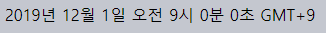
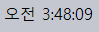
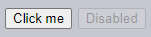
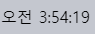

커스텀 요소
====

##### 커스텀 HTML 요소
- 커스텀 클래스 사용해 정의
- 자체 API 有
  - 메서드
  - 프로퍼티
  - 이벤트
  - 기타 등등
- 내장 HTML 요소처럼 사용 가능
  - `<easy-tabs>`
  - `<sliding-carousel>`
  - `<beautiful-upload>`
  - 기타 등등

#### 유형 <sub>(2가지)</sub>

##### 1. 자체 커스텀 요소
- 완전히 새 요소
- `HTMLElement` <sub>(추상 클래스)</sub> 상속

##### 2. 내장 커스텀 요소
- 기존 내장 요소 커스터마이징
- 내장 요소 상속
  - ex\) 버튼 <sub>(`HTMLButtonElement` 상속)</sub>

### 자체 커스텀 요소

##### 다양한 상세 정보 필요 <sub>(브라우저)</sub>
- 표시 방법
- 요소 추가 · 제거 시 동작
- 기타 등등

##### 커스텀 요소 클래스 작성 <sub>(상세 정보 제공)</sub>
- 특수 메서드 선택적 구현
```javascript
// HTMLElement (추상 클래스) 상속
class MyElement extends HTMLElement {
  constructor() {
    super();
    /* 요소 생성 완료 상태 */
  }

  connectedCallback() {
    // 문서 내 요소 추가 · 제거 후 재추가 시 호출
  }

  disconnectedCallback() {
    // 문서 내 요소 제거 · 재추가 후 제거 시 호출
  }

  static get observedAttributes() {
    // 변화 추적 대상 속성 이름 배열
    return […];
  }

  attributeChangedCallback(name, oldValue, newValue) {
    // 변화 추적중인 속성 변화 시 호출
  }

  adoptedCallback() {
    // 새 문서로 요소 이동 시 호출
    // - document.adoptNode 내 발생 (사용 빈도 ↓)
  }

  /* 기타 메서드 · 프로퍼티 */
}
```

##### 커스텀 요소 등록
```javascript
customElements.define("my-element", MyElement);
```

##### 커스텀 요소 사용
- `<my-element>` <sub>(태그)</sub> 사용 시
  - `MyElement` <sub>(객체)</sub> 생성
    - 객체 내 특수 메서드 호출
- JS 사용해 직접 생성 가능
```javascript
document.createElement('my-element');
```

<br />

 **커스텀 요소명 내 `-` <sub>(하이픈)</sub> 필수**

##### 내장 · 커스텀 요소명 충돌 방지 목적
- 유효 예시
  - `my-element`
  - `super-button`
- 무효 예시
  - `myelement`
  - `superbutton`

<br />

#### `<time-formatted>` <sub>(커스텀 요소)</sub>

##### `<time>` <sub>(내장 요소)</sub>
- 일자 · 시간 정보
- 형식 설정 기능 無

##### `<time-formatted>` <sub>(커스텀 요소)</sub> 작성
- 일자 · 시간 정보
- 형식 · 언어 자동 설정
```html
<script>
  class TimeFormatted extends HTMLElement {

    /* ① 단일 메서드 (connectedCallback) 구현
     호출 시점
     - 문서 내 추가
     - HTML 파서 감지
     Intl.DateTimeFormat
     - 내장 형식 설정자 사용 (범용 지원)
     */
    connectedCallback() {
      let date = new Date(this.getAttribute('datetime') || Date.now());

      this.innerHTML = new Intl.DateTimeFormat("default", {
        year  : this.getAttribute('year')   || undefined,
        month : this.getAttribute('month')  || undefined,
        day   : this.getAttribute('day')    || undefined,
        hou   : this.getAttribute('hour')   || undefined,
        minute: this.getAttribute('minute') || undefined,
        second: this.getAttribute('second') || undefined,
        timeZoneName: this.getAttribute('time-zone-name') || undefined,
      }).format(date);
    }
  }

  // ② 커스텀 요소 등록
  customElements.define("time-formatted", TimeFormatted);
</script>

<!-- ③ 커스텀 요소 사용 -->
<time-formatted
  datetime="2019-12-01"
  year="numeric"
  month="long"
  day="numeric"
  hour="numeric"
  minute="numeric"
  second="numeric"
  time-zone-name="short"
></time-formatted>
```



<br />

 **커스텀 요소 업그레이드**

##### 커스텀 요소 등록 전 사용
- 에러 X
- 미정의 태그
  - `:not(:defined)` <sub>(CSS)</sub>

##### `customElement.define` 호출
- 커스텀 요소 "업그레이드"
  - 각 요소별 새 인스턴스 생성
  - `connectedCallback` <sub>(메서드)</sub> 호출
  - `:defined` <sub>(CSS)</sub>

##### 커스텀 요소 정보 메서드
- `customElements.get(name)`
  - 클래스 반환
- `customElements.whenDefined(name)`
  - `Promise` <sub>(객체)</sub> 반환
    - 내부 값 無
    - 요소 정의 <sub>(등록)</sub> 완료 시 이행

<br />

 **`connectedCallback` 내 렌더링 <sub>(생성자 X)</sub>**

##### 너무 이른 생성자 호출 시점
- 요소 생성 완료
- 속성값 처리 · 할당 X <sub>(브라우저)</sub>
  - `getAttribute` <sub>(메서드)</sub> 호출 시
    - `null` 반환 <sub>(렌더링 불가능)</sub>

##### 성능 이점
- 실제 필요 시점 전까지 렌더링 지연

##### `connectedCallback` <sub>(메서드)</sub>
- 문서 내 추가 시 호출
  - 실제 페이지 구성 요소
- 타 요소 내 추가 시 미호출
  - 실제 페이지 구성 요소 X
- 분리된 별도 DOM 구성 가능
  - 요소 생성
  - 렌더링 X

<br />

### 속성 감지

##### 현재 `<time-formatted>` <sub>(태그)</sub> 구현체
- 렌더링 후 속성 변화 미반영

##### 속성 감지
- `observedAttributes()` <sub>(정적 getter)</sub>
  - 감지 대상 속성 이름 목록 <sub>(배열)</sub> 반환
- `attributeChangedCallback` <sub>(메서드)</sub>
  - 감지 대상 속성 변화 시 호출
  - 단일 속성 대상 호출 X <sub>(성능 이슈)</sub>
```html
<script>
  class TimeFormatted extends HTMLElement {

    // ① 렌더링 로직 분리 (별도 헬퍼 메서드)
    render() {
      let date = new Date(this.getAttribute('datetime') || Date.now());

      this.innerHTML = new Intl.DateTimeFormat("default", {
        year  : this.getAttribute('year')   || undefined,
        month : this.getAttribute('month')  || undefined,
        day   : this.getAttribute('day')    || undefined,
        hour  : this.getAttribute('hour')   || undefined,
        minute: this.getAttribute('minute') || undefined,
        second: this.getAttribute('second') || undefined,
        timeZoneName: this.getAttribute('time-zone-name') || undefined,
      }).format(date);
    }

    // ② 페이지 내 요소 추가 시 호출 (렌더링)
    connectedCallback() {
      if (!this.rendered) {
        this.render();
        this.rendered = true;
      }
    }

    // ③ 감지할 속성 설정 (속성멸 배열 반환)
    static get observedAttributes() {
      return [
        'datetime',
        'year',
        'month',
        'day',
        'hour',
        'minute',
        'second',
        'time-zone-name'
      ];
    }

    // ④ 감지중인 속성 변화 시 호출 (렌더링)
    attributeChangedCallback(name, oldValue, newValue) {
      this.render();
    }
  }

  customElements.define("time-formatted", TimeFormatted);
</script>

<time-formatted
  id="elem"
  hour="numeric"
  minute="numeric"
  second="numeric"
></time-formatted>

<script>
  // ⑤ 주기적인 새 속성값 할당
  setInterval(function() {
    elem.setAttribute('datetime', new Date());
  }, 1000);
</script>
```



### 렌더링 순서

##### DOM 생성 · 연결 순서 <sub>(HTML 파서)</sub>
- 부모 → 자식
- `<outer>` → `<inner>`
```html
<!-- 부모 -->
<outer>

  <!-- 자식 -->
  <inner></inner>
</outer>
```

##### 커스텀 요소 생성 시 자식 정보 접근 불가능
- ex\) `innerHTML`
```html
<script>
  customElements.define('user-info', class extends HTMLElement {
    connectedCallback() {

      // 자식 요소 (John) 접근
      this.innerHTML; // '' (빈 내용)
    }
  });
</script>

<user-info>John</user-info>
```

##### 커스텀 요소 생성 시점
- 자식 생성 · 연결 X
  - DOM 준비 완료 X
- 자식 접근 방법
  - 속성 사용 <sub>(정보 전달)</sub>
  - 접근 지연 <sub>(직접 접근)</sub>
    - 지연시간 0 `setTimeout`
```html
<script>
  customElements.define('user-info', class extends HTMLElement {
    connectedCallback() {

      // 자식 요소 (John) 접근
      setTimeout(() => this.innerHTML); // John
    }
  });
</script>

<user-info>John</user-info>
```

##### 지연시간 0 `setTimeout` <sub>(메서드)</sub>
- 비동기적 실행
  - HMTL 파싱 종료 후 실행
  - DOM 준비 완료 후 자식 접근
- 자식 커스텀 요소 내 동일 방법 사용 시
  - 부모 실행 후 자식 실행
    - 자식 정보 접근 불가능
```html
<script>
  customElements.define('user-info', class extends HTMLElement {
    connectedCallback() {
      `${this.id} connected.`;
      setTimeout(() => `${this.id} initialized.`);
    }
  });
</script>

<user-info id="outer">
  <user-info id="inner"></user-info>
</user-info>
```

##### 출력 순서
1. outer connected.
2. inner connected.
3. outer initialized. <sub>(부모 `setTimeout`)</sub>
4. inner initialized. <sub>(자식 `setTimeout`)</sub>

##### 초기화 시 지식 접근 가능 내장 콜백 無
- 필요 시 직접 구현
  - ex\) 커스텀 이벤트 디스패치 등

### 내장 커스텀 요소

##### 자체 커스텀 요소 <sub>(`<time-formatted>` 등)</sub>
- 연관 의미 체계 無
  - 검색 엔진 미인식
  - 접근 장치 처리 불가능

##### 내장 HTML 요소 확장 · 커스터마이징
- 내장 요소 클래스 상속
  - 기능 · 의미 체계 재사용

#### 버튼 <sub>(`HTMLButtonElement`)</sub> 커스터마이징

##### 1. `HTMLButtonElement` <sub>(내장 버튼 클래스)</sub> 상속
```javascript
class HelloButton extends HTMLButtonElement {
  …커스텀 요소 메서드 구현…
}
```

##### 2. 내장 커스텀 요소 등록
- `customElements.define`
  - 3번째 인수 전달 <sub>(원본 내장 요소 명시)</sub>
    - 타 내장 <sub>(버튼)</sub> 커스텀 요소 구분
```javascript
customElements.define(
  'hello-button',
  HelloButton,
  {extends: 'button'}
);
```

##### 3. 내장 커스텀 요소 사용
- 일반 내장 요소 태그 사용
- `is` <sub>(속성)</sub> 필수
  - 내장 커스텀 요소명 명시
```html
<button is="hello-button">…</button>
```

##### 전체 코드
```html
<script>
  class HelloButton extends HTMLButtonElement {
    constructor() {
      super();

      // 클릭 시 "Hello!" 경고 창 출력
      this.addEventListener('click', () => "Hello!");
    }
  }

  customElements.define(
    'hello-button',
    HelloButton,
    {extends: 'button'}
  );
</script>

<button is="hello-button">Click me</button>
<button is="hello-button" disabled>Disabled</button>
```



##### 내장 커스텀 요소
- 기존 내장 요소 동일 스타일 · 표준 특성 유지
  - ex\) `disabled` <sub>(속성)</sub> 등

##### 참고
- [HTML Living Standard](https://html.spec.whatwg.org/#custom-elements)
- [Compatiblity](https://caniuse.com/#feat=custom-elements)

<br />

요약
====

#### 커스텀 요소 유형 <sub>(2가지)</sub>

##### 1. 자체 커스텀 요소
- 새 태그
- `HTMLElement` <sub>(추상 클래스)</sub> 확장
```javascript
class MyElement extends HTMLElement {
  constructor() { super(); … }
  connectedCallback() {…}
  disconnectedCallback() { …  }
  static get observedAttributes() { return […]; }
  attributeChangedCallback(name, oldValue, newValue) {…}
  adoptedCallback() {…}
}

customElements.define('my-element', MyElement);
/* <my-element> */
```

##### 2. 내장 커스텀 요소
- 기존 내장 요소 확장
- 추가 설정 필요
  - 3번째 인수 <sub>(`customElements.define`)</sub>
  - `is="…"` <sub>(기존 내장 요소 속성)</sub>
```javascript
class MyButton extends HTMLButtonElement {…}

customElements.define(
  'my-button',
  MyButton,
  {extends: 'button'}
);

/* <button is="my-button"> */
```

<br />

##### 범용성
- 다수 브러우저 지원
- Edge
  - [폴리필](https://github.com/webcomponents/polyfills/tree/master/packages/webcomponentsjs) 필요

##  과제

### `<live-timer>` <sub>(커스텀 요소)</sub>

##### `<live-timer>` <sub>(커스텀 요소)</sub> 작성
1. `<time-formatted>` <sub>(커스텀 요소 · 튜토리얼)</sub>
   - 내부적 사용
   - 기능 중복 X
2. 매초 tick 갱신
3. `tick` <sub>(커스텀 이벤트)</sub> 생성 <sub>(모든 tick 대상)</sub>
   - 현재 일시 정보 포함 <sub>(`event.detail`)</sub>
```html
<live-timer id="elem"></live-timer>

<script>
  elem.addEventListener('tick', event => event.detail);
</script>
```

##### 데모


<br />


#### 참고사항 <sub>(2가지)</sub>

##### 1. 요소 제거 시 타이머 <sub>(`setInterval` 반환 값)</sub> 제거 필수
- 타이머 미제거 시
  - 계속 tick 카운트
  - 메모리 낭비

##### 2. `elem.date` <sub>(커스텀 요소 프로퍼티)</sub>
- 현재 일시
- 모든 클래스 메서드 · 프로퍼티
  - → 요소 메서드 · 프로퍼티

[정답](https://plnkr.co/edit/6811D6dLLQHBeW1z?p=preview)
