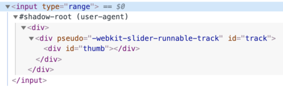

Shadow DOM
====

##### 캡슐화 기능
- 컴포넌트 자체 DOM 트리
  - 자체 스타일 규칙
  - 기타 등등
- 외부에서 접근 불가능

### 내장 shadow DOM

##### 브라우저 내부 전용 DOM · CSS
- 일반적으로 숨겨짐
  - 개발자 도구 사용해 참조 가능

##### `<input type="range">`


- `#shadow-root`
  - 브라우저 내장 shdow DOM



##### 내장 shadow DOM 요소
- 일반 JS 코드 · 선택자 접근 불가능
- 일반적인 자식 요소 X
- 강력한 캡슐화 기법

##### `pseudo` <sub>(속성)</sub>
- 非표준
- 역사적 이유
- 하위 요소 스타일 적용
```html
<style>
  /* 슬라이더 배경색 설정 (빨간색) */
  input::-webkit-slider-runnable-track {
    background: red;
  }
</style>

<input type="range">
```


##### 연대순 역사적 진행과정
1. 브라우저 내부 전용 DOM 구조 실험
2. Shadow DOM 표준화
    - 개발자 사용 가능

### Shadow 트리

#### DOM 요소 내 하위 DOM 트리 종류 <sub>(2가지)</sub>

##### 1. Light 트리
- 일반 하위 DOM 트리
- HTML 자식 노드 구성

##### 2. Shadow 트리
- 숨겨진 하위 DOM 트리
- HTML 내 미반영

##### 한 요소 내 2가지 하위 트리 존재 시
- Shadow 트리만 렌더링
- 2가지 트리 조합 가능

##### 커스텀 요소 내 shadow 트리 용도
- 컴포넌트 내부 숨기기
- 컴포넌트 자체 전용 스타일 적용

##### `<show-hello>` <sub>(커스텀 요소)</sub>
- 내부 DOM 숨기기
```html
<script>
  customElements.define('show-hello', class extends HTMLElement {
    connectedCallback() {
      const shadow = this.attachShadow({mode: 'open'});
      shadow.innerHTML = `
        <p>
          Hello, ${this.getAttribute('name')}
        </p>
      `;
    }
  });
</script>

<show-hello name="John"></show-hello>
```


- `#shadow-root`
  - 컴포넌트 내부 내용 보유


### `attachShadow({mode: …})`
- Shadow 트리 생성

##### 한계 <sub>(2가지)</sub>
1. 요소당 shadow root 1개만 생성 가능
2. 특정 요소만 shadow 트리 생성 가능
    - 커스텀 요소
    - `article`
    - `aside`
    - `blockquote`
    - `body`
    - `div`
    - `footer`
    - `h1…h6`
    - `header`
    - `main`
    - `nav`
    - `p`
    - `section`
    - `span`

#### `mode` <sub>(옵션 · 캡슐화 레벨 설정 · 문자열)</sub>

##### Shadow root 접근 공개 여부 설정
- `shadowRoot` <sub>(요소 프로퍼티)</sub>

##### `open`
- 접근 공개

##### `closed`
- 접근 비공개
  - `shadowRoot == null`
- 유일한 shadow DOM 접근 방법
  - `attachShadow` <sub>(메서드)</sub> 반환 값 <sub>(참조)</sub>
    - 클래스 내부 위치
- 브라우저 내장 shadow 트리 기본 설정 옵션
  - 접근 방법 無

##### [Shadow root](https://dom.spec.whatwg.org/#shadowroot)
- `attachShadow` <sub>(메서드)</sub> 반환 값 <sub>(참조)</sub>
- 요소 유사
  - `innerHTML` <sub>(프로퍼티)</sub>
  - DOM 메서드 <sub>(`append` 등)</sub>
  - 기타 등등

##### Shadow root 보유 요소
- _"Shadow tree host"_ <sub>(명칭)</sub>
- `shadowRoot.host` <sub>(요소 프로퍼티 내 프로퍼티)</sub>
```javascript
/* attachShadow({mode: 'open'}); */

// true
alert(elem.shadowRoot.host === elem);
```

### 캡슐화

#### 주요 문서로부터 철저히 분리

##### 1. 문서 <sub>(Light DOM)</sub> 내 JS 선택자 통해 접근 불가능
- ex\) `querySelector` 등
- Shadow DOM 요소 내 `id` <sub>(속성)</sub> 값
  - Light DOM 요소 내 속성값 중복 가능
  - Shadow 트리 내에서만 중복 방지 필요

##### 2. 자체 스타일시트 보유
- 외부 <sub>(Light DOM)</sub> DOM 스타일 규칙 미적용
```html
<style>
  /* #elem (요소) 내 shadow 트리 미적용 */
  p { color: red; }
</style>

<div id="elem"></div>

<script>
  elem.attachShadow({mode: 'open'});

  // Shadow 트리 내 자체 전용 스타일
  elem.shadowRoot.innerHTML = `
    <style>
      p { font-weight: bold; }
    </style>

    <p>Hello, John!</p>
  `;

  // <p> (Shadow DOM 요소)
  // - Shadow 트리 내 쿼리에만 요소 검색 성공

  // 0
  alert(document.querySelectorAll('p').length);

  // 1
  alert(elem.shadowRoot.querySelectorAll('p').length);
</script>
```

##### 참고
- [DOM](https://dom.spec.whatwg.org/#shadow-trees)
- [Compatibility](https://caniuse.com/#feat=shadowdomv1)
- 기타 다수 명세서
  - ex\) [DOM Parsing](https://w3c.github.io/DOM-Parsing/#the-innerhtml-mixin)
    - Shadow root 내 `innerHTML`

<br />

요약
====

#### Shadow DOM <sub>(컴포넌트 자체 내부 DOM)</sub>

##### 1. 생성
```javascript
/* elem (요소) 내 shadow DOM 생성 */

// mode (옵션)
//  - shadowRoot (요소 프로퍼티) 접근 공개 여부 설정
let shadowRoot = elem.attachShadow({mode: "open"|"closed"});
```

##### 2. 조작
- `shadowRoot` <sub>(요소 프로퍼티)</sub> 대상 수행
  - `innerHTML` <sub>(프로퍼티)</sub>
  - DOM 메서드
  - 기타 등등

##### Shadow DOM 요소 특징
1. `id` <sub>(속성)</sub> 값 자체 범위 보유
2. 문서 <sub>(Light DOM)</sub> 내 JS 선택자 검색 불가능
    - ex\) `querySelector` 등
3. 문서 <sub>(Light DOM)</sub> 내 스타일 규칙 미적용
    - Shadow 트리 내 자체 스타일 규칙

##### 렌더링 규칙
- Shadow DOM 존재 시 렌더링
  - 일반 자식 노드 <sub>(Light DOM)</sub> 렌더링 X
