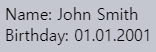
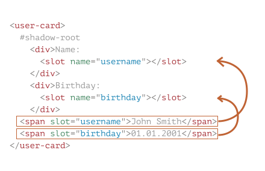
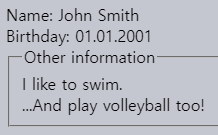
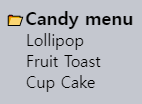

Shadow DOM `slot` · 합성
====

##### 다양한 컴포넌트 내용 렌더링 필요
- `<select>` <sub>(브라우저 내장 요소)</sub>
  - `<option>` <sub>(요소)</sub> 항목 요구
- `<custom-tabs>` <sub>(커스텀 요소)</sub>
  - 탭 내용 전달 요구
- `<custom-menu>` <sub>(커스텀 요소)</sub>
  - 메뉴 항목 요구
- 기타 등등

##### `<custom-menu>` <sub>(커스텀 요소)</sub>
- 컴포넌트 내 내용 <sub>(제목 · 항목)</sub> 렌더링
- 메뉴 이벤트 처리
- 기타 등등
```html
<custom-menu>
  <title>Candy menu</title>
  <item>Lollipop</item>
  <item>Fruit Toast</item>
  <item>Cup Cake</item>
</custom-menu>
```

#### 직접 구현

##### 필요 작업
- 요소 내용 분석
- DOM 노드 동적 복사 · 재정렬

##### 한계
- 요소 이동 <sub>(Light DOM → Shadow DOM)</sub>
  - 문서 <sub>(Light DOM)</sub> 내 CSS 스타일 미적용
- 코드 작업량 ↑

##### `<slot>` <sub>(요소)</sub> 사용
- Light DOM 내용 자동 삽입

### 기명 `slot`

##### `<user-card>` <sub>(커스텀 요소)</sub>
- Shadow DOM 내 `<slot>` <sub>(요소)</sub> 2개
  - Light DOM 내용 <sub>(상응 요소)</sub> 삽입
```html
<script>
  customElements.define('user-card', class extends HTMLElement {
    connectedCallback() {
      this.attachShadow({mode: 'open'});
      this.shadowRoot.innerHTML = `
        <div>Name:
          <slot name="username"></slot>
        </div>
        <div>Birthday:
          <slot name="birthday"></slot>
        </div>
      `;
    }
  });
</script>

<user-card>
  <span slot="username">John Smith</span>
  <span slot="birthday">01.01.2001</span>
</user-card>
```



##### `<slot name="X">` <sub>(Shadow DOM 요소)</sub>
- 삽입 지점 정의
- `<… slot="X">` <sub>(Light DOM 요소)</sub> 렌더링 위치

##### '합성' 작업 수행 <sub>(브라우저)</sub>
1. Light DOM 검색
   - `<… slot="…">` <sub>(요소)</sub>
2. Shadow DOM 내 렌더링
   - 상응 `<slot name="…">` <sub>(요소)</sub>

##### '합성' 작업 후 DOM <sub>(가상)</sub> 구조 <sub>(실제 '합성' 작업 결과 X)</sub>
- `#shadow-root` 내 shadow DOM 생성
- 요소 내 2가지 <sub>(Light · Shadow)</sub> DOM 有
```html
<user-card>
  #shadow-root
    <div>Name:
      <slot name="username"></slot>
    </div>
    <div>Birthday:
      <slot name="birthday"></slot>
    </div>
  <span slot="username">John Smith</span>
  <span slot="birthday">01.01.2001</span>
</user-card>
```

##### `slot` 매칭 <sub>(렌더링 목적)</sub>
1. 각 `<slot name="…">` <sub>(Shadow DOM 요소)</sub>
2. Light DOM 내 상응 요소 검색 <sub>(브라우저)</sub>
   - `<slot name="…">` <sub>(Shadow DOM)</sub>
   - `<………… slot="…">` <sub>(Light DOM)</sub>



#### 평탄화 DOM

##### '합성' 작업 결과 명칭
- 렌더링 · 이벤트 처리 목적
- 가상 · 가시적 개념
```html
<user-card>
  #shadow-root
    <div>Name:
      <slot name="username">
        <!-- slot 내 내용 삽입 -->
        <span slot="username">John Smith</span>
      </slot>
    </div>
    <div>Birthday:
      <slot name="birthday">
        <span slot="birthday">01.01.2001</span>
      </slot>
    </div>
</user-card>
```

##### 실제 DOM 노드 위치 이동 X
- `querySelectorAll` 실행 결과 확인
  - 각 노드 위치 변경 X
```javascript
// <span> (Light DOM 노드)
// - <user-card> (커스텀 요소) 내 위치 그대로 유지

// 2
document.querySelectorAll('user-card span').length;
```

##### Shadow DOM 내 `<slot>` <sub>(요소)</sub> 삽입 시 파생
- 브라우저 렌더링 대상
  - 스타일 상속 · 이벤트 전파 시 사용
- JS
  - 파생된 평탄화 DOM 미인식
  - 기존 DOM 구조 그대로 인식

<br />

 **최상위 자식 요소들만 `slot` <sub>(속성)</sub> 사용 가능**

##### `slot` <sub>(속성)</sub>
- 최상위 <sub>(_"Shadow host"_ 직계)</sub> 자식 요소들
  - 사용 가능
- 자손 요소들
  - 속성 무시

##### 2번째 `<span>` <sub>(자손 요소)</sub> 내 `slot` <sub>(속성)</sub> 무시
- 촤상위 <sub>(`<user-card>` 직계)</sub> 자식 요소 X
```html
<user-card>
  <span slot="username">John Smith</span>
  <div>
    <!-- slot (속성) 무시 (렌더링 X) -->
    <span slot="birthday">01.01.2001</span>
  </div>
</user-card>
```

<br />

##### 다수 동일 `slot` <sub>(속성)</sub> 값 요소들 <sub>(Light DOM)</sub>
- 동일 `<slot>` <sub>(요소)</sub> 내 전부 렌더링
```html
<user-card>
  <span slot="username">John</span>
  <span slot="username">Smith</span>
</user-card>

↓↓↓

<user-card>
  #shadow-root
    <div>Name:
      <slot name="username">
        <span slot="username">John</span>
        <span slot="username">Smith</span>
      </slot>
    </div>
    <div>Birthday:
      <slot name="birthday"></slot>
    </div>
</user-card>
```

### `slot` 예비 내용

##### `<slot>` <sub>(요소)</sub> 내 노드
- 기본값 역할 수행
- 상응 `slot` <sub>(속성)</sub> 요소 <sub>(Light DOM)</sub>
  - 부재 시 렌더링

##### `Anonymous` <sub>(`<slot>` 요소 내 내용 · 텍스트)</sub>
- `slot="username"` <sub>(속성)</sub> 요소 <sub>(Light DOM)</sub>
  - 부재 시 렌더링
```html
<div>Name:
  <slot name="username">Anonymous</slot>
</div>
```

### 기본 `slot`

##### 1번째 무기명 `<slot>` <sub>(`name` 속성 부재 요소)</sub>
- 모든 `slot` <sub>(속성)</sub> 부재 요소 <sub>(Light DOM)</sub> 렌더링

##### `<user-card>` 내 기본 <sub>(1번째 무기명)</sub> `<slot>` <sub>(요소)</sub>
- `<fieldset>` 내 `<legend>` 다음 위치
- `<div>` <sub>(Light DOM · `slot` 속성 無)</sub> 2개 렌더링
```html
<script>
  customElements.define('user-card', class extends HTMLElement {
    connectedCallback() {
      this.attachShadow({mode: 'open'});
      this.shadowRoot.innerHTML = `
        <div>Name:
          <slot name="username"></slot>
        </div>
        <div>Birthday:
          <slot name="birthday"></slot>
        </div>
        <fieldset>
          <legend>Other information</legend>
          <slot></slot>
        </fieldset>
      `;
    }
  });
</script>

<user-card>
  <div>I like to swim.</div>
  <span slot="username">John Smith</span>
  <span slot="birthday">01.01.2001</span>
  <div>…And play volleyball too!</div>
</user-card>

↓↓↓

<user-card>
  #shadow-root
    <div>Name:
      <slot name="username">
        <span slot="username">John Smith</span>
      </slot>
    </div>
    <div>Birthday:
      <slot name="birthday">
        <span slot="birthday">01.01.2001</span>
      </slot>
    </div>
    <fieldset>
      <legend>Other information</legend>
      <slot>
        <div>I like to swim.</div>
        <div>…And play volleyball too!</div>
      </slot>
    </fieldset>
</user-card>
```



### `<custom-menu>` <sub>(커스텀 요소)</sub>

##### Shadow DOM
- `<template>` <sub>(템플릿 요소)</sub> 사용
```html
<template id="tmpl">
  <style> /* 스타일 */ </style>

  <div class="menu">
    <slot name="title"></slot>

    <ul>
      <slot name="item"></slot>
    </ul>
  </div>
</template>
```

##### Light DOM
```html
<custom-menu>
  <span slot="title">Candy menu</span>
  <li slot="item">Lollipop</li>
  <li slot="item">Fruit Toast</li>
  <li slot="item">Cup Cake</li>
</custom-menu>
```

##### `slot` 매칭
1. `"title"`
   - `<slot name="title">`
   - `<span slot="title">`
2. `"item"`
   - `<slot name="item">` <sub>(목록 형성)</sub>
   - `<li slot="item">` <sub>(3개)</sub>

##### 평탄화 DOM
- 부자연스러운 DOM 노드 구조 무관
  - ex\) `ul` \> `slot` \> `li`
```html
<custom-menu>
  #shadow-root
    <style> /* 스타일 */ </style>

    <div class="menu">
      <slot name="title">
        <span slot="title">Candy menu</span>
      </slot>
      <ul>
        <slot name="item">
          <li slot="item">Lollipop</li>
          <li slot="item">Fruit Toast</li>
          <li slot="item">Cup Cake</li>
        </slot>
      </ul>
    </div>
</custom-menu>
```

##### `click` 핸들러 설정
- 메뉴 목록 열기 · 닫기
```html
<script>
  customElements.define('custom-menu', class extends HTMLElement {
    connectedCallback() {
      this.attachShadow({mode: 'open'});

      // 템플릿 요소 복제 · 추가 (Shadow DOM)
      let tmplClone = tmpl.content.cloneNode(true);
      this.shadowRoot.append(tmplClone);

      // click 핸들러 설정
      // - Light DOM 노드 선택 불가능
      // - <slot> (요소) 선택
      this.shadowRoot.querySelector('slot[name="title"]').onclick = () => {

        // 메뉴 열기 · 닫기
        this.shadowRoot.querySelector('.menu').classList.toggle('closed');
      };
    }
  });
</script>
```




### `slot` 갱신

##### `<slot>` <sub>(요소)</sub> 감시 <sub>(브라우저)</sub>
- `<slot>` <sub>(요소)</sub> 변경 발생 시 렌더링 갱신

##### `<slot>` <sub>(요소)</sub> 내 매칭 요소 <sub>(Light DOM)</sub>
- 복사 X
- 렌더링만 수행 <sub>(기존 위치 유지)</sub>
  - 변경 사항 즉시 반영

#### `slotchange` <sub>(이벤트)</sub>

##### `<slot>` <sub>(요소)</sub> 내 렌더링 요소 변화 시 발생
- `<… slot="…">` <sub>(Light DOM 요소)</sub> 자체
  - 추가 · 제거 · 대체
```html
<ul>
  <slot name="item">
  </slot>
</ul>

↓↓↓ <!-- 추가 -->

<ul>
  <slot name="item">
    <li slot="item">Lollipop</li>
    <li slot="item">Fruit Toast</li>
    <li slot="item">Cup Cake</li>
  </slot>
</ul>

↓↓↓ <!-- 제거 -->

<ul>
  <slot name="item">
    <li slot="item">Lollipop</li>
    <li slot="item">Fruit Toast</li>
  </slot>
</ul>

↓↓↓ <!-- 대체 -->

<ul>
  <slot name="item">
    <li slot="item">Lollipop</li>
    <!-- <li slot="item">Fruit Toast</li> -->
    <li slot="item" class="another_slot">Butter Jelly</li>
  </slot>
</ul>
```

##### 렌더링 요소 내 내용 <sub>(자식 · 자손 요소)</sub> 변화 시 미발생
- 추적 필요 시
  - `MutationObserver` 사용
```html
<ul>
  <slot name="item">
    <li slot="item">Lollipop</li>
  </slot>
</ul>

↓↓↓ <!-- <li slot="item"> (렌더링 요소) 내 내용 (자식 텍스트 노드) 변화 (이벤트 미발생) -->

<ul>
  <slot name="item">
    <li slot="item">Jelly</li>
  </slot>
</ul>
```

#### `<custom-menu>` <sub>(커스텀 요소)</sub>

##### 메뉴 항목 · 제목 변경
- 1초 후 항목 1개 추가
- 2초 후 제목 변경
```html
<custom-menu id="menu">
  <span slot="title">Candy menu</span>
</custom-menu>

<script>
  customElements.define('custom-menu', class extends HTMLElement {
    connectedCallback() {
      this.attachShadow({mode: 'open'});
      this.shadowRoot.innerHTML = `
        <div class="menu">
          <slot name="title"></slot>
          <ul>
            <slot name="item"></slot>
          </ul>
        </div>
      `;

      // slotchange (이벤트) 핸들러
      // - shadowRoot (프로퍼티) 설정 불가능
      // - 1번째 자식 요소 설정
      this.shadowRoot.firstElementChild.addEventListener('slotchange',
        e => "slotchange: " + e.target.name;
      );
    }
  });

  // 1초 후 항목 1개 추가
  setTimeout(() => {
    menu.insertAdjacentHTML('beforeEnd', '<li slot="item">Lollipop</li>');
  }, 1000);

  // 2초 후 제목 변경
  setTimeout(() => {
    menu.querySelector('[slot="title"]').innerHTML = "New menu";
  }, 2000);
</script>
```

#### `slotchange` <sub>(이벤트)</sub> 2번 발생

##### 1. 초기화 과정 <sub>(`slot` 매칭 후 내부 렌더링)</sub>
- `<slot name="item">` <sub>(Shadow DOM)</sub>
- `<span slot="title">` <sub>(Light DOM)</sub>
```html
<slot name="title"></slot>

↓↓↓

<slot name="title">
  <span slot="title">Candy menu</span>
</slot>
```

##### 2. 1 초 후 <sub>(`setTimeout` 메서드)</sub>
- 새 항목 <sub>(`<li slot="item">`)</sub> 추가
```html
<ul>
  <slot name="item"></slot>
</ul>

↓↓↓

<ul>
  <slot name="item">
    <li slot="item">Lollipop</li>
  </slot>
</ul>
```

#### 2 초 후 `<span slot="title">` 내용 변경

##### 이벤트 미발생
- `<slot>` <sub>(요소)</sub> 내 렌더링 요소
  - 자체 변화 無
  - 자식 요소 변화

### `slot` API

##### JS
- 평탄화 DOM 미인식
- 실제 DOM 구조 인식

##### `{mode: 'open'}` <sub>(옵션)</sub> 설정 시
- `slot` 관련 검색 <sub>(`slot` API)</sub> 가능

#### 메서드

##### `node.assignedSlot`
- `node` 상응 `<slot>` <sub>(요소)</sub> 반환

##### `slot.assigned[Nodes·Elements]({flatten: boolean})`
- `slot` 내부 DOM 노드 · 요소 <sub>(내부 렌더링)</sub> 반환
- `{flatten: boolean}` <sub>(`false` 기본값)</sub>
  - 평탄화 DOM 깊은 검색 여부 설정
    - 중첩 `<slot>` <sub>(중첩 컴포넌트)</sub>
    - 예비 내용 <sub>(내부 렌더링 요소 無)</sub>

##### `<custom-menu>` <sub>(커스텀 요소)</sub>
- `slotchange` <sub>(이벤트)</sub> 핸들러 설정
  - `<slot>` <sub>(요소)</sub> 내부 요소 추적
    - `slot.assignedElements`
```html
<custom-menu id="menu">
  <span slot="title">Candy menu</span>
  <li slot="item">Lollipop</li>
  <li slot="item">Fruit Toast</li>
</custom-menu>

<script>
  customElements.define('custom-menu', class extends HTMLElement {
    items = [];

    connectedCallback() {
      this.attachShadow({mode: 'open'});
      this.shadowRoot.innerHTML = `
        <div class="menu">
          <slot name="title"></slot>
          <ul>
            <slot name="item"></slot>
          </ul>
        </div>
      `;

      // <slot> (요소) 내 렌더링 요소 변화 (추가 · 제거 · 대체) 추적
      this.shadowRoot.firstElementChild.addEventListener('slotchange', e => {
        let slot = e.target;
        if (slot.name == 'item') {
          this.items = slot.assignedElements().map(elem => elem.textContent);
          "Items: " + this.items;
        }
      });
    }
  });

  // 1초 후 새 항목 추가
  setTimeout(() => {
    menu.insertAdjacentHTML('beforeEnd', '<li slot="item">Cup Cake</li>');
  }, 1000);
</script>
```

<br />

요약
====

##### Shadow · Light DOM
- 요소 내 Shadow DOM 존재 시
  - 보통 Light DOM 렌더링 X

### `slot`

##### 기능
- Shadow DOM 내 특정 위치
  - Light DOM 요소 렌더링

#### 종류

##### 기명 `slot`
- `<slot name="X">` <sub>(Shadow DOM)</sub>
- `<………… slot="X">` <sub>(Light DOM)</sub>

##### 기본 `slot`
- 1번째 무기명 `<slot>` <sub>(`name` 속성 無 요소)</sub>
  - 나머지 무기명 `<slot>` <sub>(요소)</sub> 무시
- 모든 `slot` <sub>(속성)</sub> 부재 요소 <sub>(Light DOM)</sub> 렌더링

##### 다수 동일 `slot` <sub>(속성)</sub> 요소들 <sub>(Light DOM)</sub>
- 동일 `<slot>` <sub>(요소)</sub> 내 전부 렌더링

##### `<slot>` <sub>(요소)</sub> 내 삽입 내용
- 내용 <sub>(내부 렌더링)</sub> 기본값
- 상응 `slot` <sub>(속성)</sub> 요소 <sub>(Light DOM)</sub>
  - 부재 시 렌더링

##### '합성' 작업
- `<slot>` <sub>(요소)</sub> 내 상응 요소 렌더링
  - `<slot name="X">` <sub>(Shadow DOM)</sub>
  - `<………… slot="X">` <sub>(Light DOM)</sub>
- 실제 노드 이동 X
  - 렌더링만 수행
  - 위치 변경 X <sub>(JS 관점)</sub>
- 작업 결과
  - 평탄화 DOM
```html
<slot name="X">
  <span slot="X">…</span>
</slot>
```

#### `slot` 메서드

##### `node.assignedSlot`
- `node` 상응 `<slot>` <sub>(요소)</sub> 반환

##### `slot.assigned[Nodes·Elements]({flatten: boolean})`
- `slot` 내부 DOM 노드 · 요소 <sub>(내부 렌더링)</sub> 반환
- `{flatten: boolean}` <sub>(`false` 기본값)</sub>
  - 평탄화 DOM 깊은 검색 여부 설정

### `slot` 내용 추적

#### `slotchange` <sub>(이벤트)</sub>

##### 1. 초기화 과정 중 발생
- `slot` 매칭 후 내부 렌더링

##### 2. `<slot>` <sub>(요소)</sub> 내 렌더링 요소 변화 시 발생
- `<… slot="…">` <sub>(Light DOM 요소)</sub> 자체
  - 추가 · 제거 · 대체

##### 렌더링 요소 내 내용 <sub>(자식 · 자손 요소)</sub> 변화 시 미발생
- 자체 변화 X
- 추적 필요 시
  - `MutationObserver` 사용
