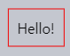
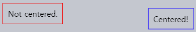
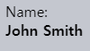
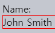
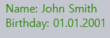

Shadow DOM 스타일
====

##### Shadow DOM 내 스타일 태그
- `<style>`
- `<link rel="stylesheet" href="…">`
  - HTTP 캐시 내 저장 <sub>(다시 다운로드 X)</sub>
    - 다수 컴포넌트 내 사용 용이

##### 일반 규칙 <sub>(예외 有)</sub>
- 컴포넌트 <sub>(Shadow DOM)</sub> 내 스타일 규칙
  - Shadow 트리만 적용
- 문서 <sub>(Light DOM)</sub> 내 스타일 규칙
  - Light 트리만 적용

### `:host` <sub>(CSS 선택자)</sub>

##### _"Shadow tree host"_ 선택
- Shadow root 보유 요소
- `shadowRoot.host` <sub>(요소 프로퍼티 내 프로퍼티)</sub>

##### `:host`
- `<custom-dialog>`
```html
<template id="tmpl">
  <style>
    /* 커스텀 요소 자제 스타일 */
    :host {
      position: fixed;
      left: 50%;
      top: 50%;
      transform: translate(-50%, -50%);
      display: inline-block;
      border: 1px solid red;
      padding: 10px;
    }
  </style>
  <slot></slot>
</template>

<script>
  customElements.define('custom-dialog', class extends HTMLElement {
    connectedCallback() {
      this.attachShadow({mode: 'open'});

      let tmplClone = tmpl.content.cloneNode(true);
      this.shadowRoot.append(tmplClone);
    }
  });
</script>

<custom-dialog>
  Hello!
</custom-dialog>
```



### 캐스케이딩

##### _"Shadow tree host"_ <sub>(커스텀 요소 자체)</sub>
- 문서 <sub>(Light DOM)</sub> 내 위치
  - 문서 <sub>(Light DOM)</sub> 스타일 규칙 적용

##### 스타일 규칙 중복 시 <sub>(`:host…` 선택자 · 문서)</sub>
- 문서 <sub>(Light DOM)</sub> 규칙 적용
- `:host…` <sub>(Shadow DOM)</sub> 규칙 무시
```html
<!-- 문서 (Light DOM) -->
<style>
  /* 커스텀 요소 패딩 제거 */
  custom-dialog {
    padding: 0;
  }
</style>
```

##### 컴포넌트 자체 스타일 규칙
- 기본값 역할
- 필요 시 문서 내 별도 컴포넌트 스타일 규칙 정의
  - 스타일 적용 편의성 ↑
- `!important` <sub>(Shadow DOM · 예외)</sub>
  - 문서 <sub>(Light DOM)</sub> 규칙 무시

### `:host(…)` <sub>(CSS 선택자)</sub>

##### `:host` 유사
- 특정 조건 <sub>(선택자)</sub> 명시 가능

##### `:host([centered])`
- `<custom-dialog centered>`
```html
<template id="tmpl">
  <style>
    :host([centered]) {
      position: fixed;
      left: 50%;
      top: 50%;
      transform: translate(-50%, -50%);
      border-color: blue;
    }

    :host {
      display: inline-block;
      border: 1px solid red;
      padding: 10px;
    }
  </style>
  <slot></slot>
</template>

<script>
  customElements.define('custom-dialog', class extends HTMLElement {
    connectedCallback() {
      this.attachShadow({mode: 'open'});

      let tmplClone = tmpl.content.cloneNode(true);
      this.shadowRoot.append(tmplClone);
    }
  });
</script>

<custom-dialog centered>
  Centered!
</custom-dialog>

<custom-dialog>
  Not centered.
</custom-dialog>
```



### `:host-context(…)` <sub>(CSS 선택자)</sub>

##### `:host` 유사
- 조상 대상 특정 조건 <sub>(선택자)</sub> 명시 가능

##### `:host-context(.dark-theme)`
- `.dark-theme` <sub>(CSS 클래스)</sub> 명시 위치
  - 커스텀 요소 자체
  - 조상 요소
```html
<!-- 조상 요소 내 .dark-theme (CSS 클래스) 有 -->
<body class="dark-theme">
  <custom-dialog>…</custom-dialog>
</body>
```

### `slot` 스타일

##### `<slot>` <sub>(요소)</sub> 내 렌더링 요소
- 문서 <sub>(Light DOM)</sub> 내 스타일 규칙 적용
- 컴포넌트 <sub>(Shadow DOM)</sub> 내 스타일 규칙 X

##### `<slot>` <sub>(요소)</sub> 내 `<span>` <sub>(요소)</sub>
```html
<!-- 문서 (Light DOM) 스타일 -->
<style>
  span {
    /* 스타일 적용 */
    font-weight: bold;
  }
</style>

<user-card>
  <div slot="username">
    <span>John Smith</span>
  </div>
</user-card>

<script>
  customElements.define('user-card', class extends HTMLElement {
    connectedCallback() {
      this.attachShadow({mode: 'open'});
      this.shadowRoot.innerHTML = `
        <!-- 컴포넌트 (Shadow DOM) 스타일 -->
        <style>
          span {
            /* 스타일 미적용 */
            background: red;
          }
        </style>
        Name:
        <slot name="username"></slot>
      `;
    }
  });
</script>
```



##### 내부 렌더링 요소 스타일 적용 방법 <sub>(2가지)</sub>
- ⓐ `<slot>` <sub>(요소)</sub> 자체 스타일 <sub>(CSS 상속)</sub>
- ⓑ `::slotted(…)` <sub>(CSS 가상 클래스)</sub>

#### 1. `<slot>` <sub>(요소)</sub> 자체 스타일 적용 <sub>(CSS 상속)</sub>
```html
<user-card>
  <div slot="username">
    <span>John Smith</span>
  </div>
</user-card>

<script>
  customElements.define('user-card', class extends HTMLElement {
    connectedCallback() {
      this.attachShadow({mode: 'open'});
      this.shadowRoot.innerHTML = `
        <!-- 컴포넌트 (Shadow DOM) 스타일 -->
        <style>
          /* <slot> (요소) 자체 스타일 */
          slot[name="username"] {
            font-weight: bold;
          }
        </style>
        Name:
        <slot name="username"></slot>
      `;
    }
  });
</script>
```


##### 한계
- 일부 CSS 프로퍼티 상속 불가능 <sub>(CSS 한계)</sub>

#### 2. `::slotted(…)` <sub>(CSS 가상 클래스)</sub>

##### 선택 조건 <sub>(2가지)</sub>
1. `::slotted`
   - `slot` 내부 렌더링 요소 <sub>(Light DOM)</sub>
     - `slot` 이름 무관
     - 요소 내용 <sub>(자식 · 자손 노드)</sub> X
2. `(…)`
   - CSS 선택자

##### `::slotted(div)`
- `<div slot="username">`
  - `div` <sub>(요소)</sub> 내용 <sub>(자식 · 자손 노드)</sub> X
```html
<user-card>
  <div slot="username">   <!-- 적용 -->
    <div>John Smith</div> <!-- 미적용 -->
  </div>
</user-card>

<script>
  customElements.define('user-card', class extends HTMLElement {
    connectedCallback() {
      this.attachShadow({mode: 'open'});
      this.shadowRoot.innerHTML = `
        <!-- 컴포넌트 (Shadow DOM) 스타일 -->
        <style>
          ::slotted(div) {
            border: 1px solid red;
          }
        </style>
        Name:
        <slot name="username"></slot>
      `;
    }
  });
</script>
```



##### 한계
- 하위 노드 선택 불가능
```css
/* 무효 CSS 선택자 */
::slotted(div span) {…}
::slotted(div) p {…}
```
- CSS 에서만 사용 가능
  - JS <sub>(`querySelector` 등)</sub> 불가능

### CSS 훅 · 커스텀 프로퍼티

##### CSS 선택자
- Shadow DOM 직접 접근 불가능
  - 해당 기능 지시자 無

##### CSS 변수 <sub>(커스텀 프로퍼티)</sub> 사용 가능
- 어디에나 명시 가능
  - Shadow DOM
  - Light DOM

##### `--user-card-field-color` <sub>(CSS 변수)</sub>
- 컴포넌트 <sub>(Shadow DOM)</sub>
  - 스타일 규칙 내 사용
- 문서 <sub>(Light DOM)</sub>
  - 커스텀 요소 스타일 내 정의
```html
<!-- 컴포넌트 (Shadow DOM) -->
<style>
  .field {
    /* 해당 CSS 변수 부재 시 black 적용 */
    color: var(--user-card-field-color, black);
  }
</style>
<div class="field">
  Name:
  <slot name="username"></slot>
</div>
<div class="field">
  Birthday:
  <slot name="birthday"></slot>
</div>
```
```html
<!-- 문서 (Light DOM) -->
<style>
  /* 커스텀 요소 스타일 내 정의 */
  user-card {
    --user-card-field-color: green;
  }
</style>
```

##### 전체 코드
```html
<!-- 문서 (Light DOM) -->
<style>
  user-card {
    --user-card-field-color: green;
  }
</style>

<!-- 컴포넌트 (Shadow DOM) -->
<template id="tmpl">
  <style>
    .field {
      color: var(--user-card-field-color, black);
    }
  </style>

  <div class="field">
    Name:
    <slot name="username"></slot>
  </div>
  <div class="field">
    Birthday:
    <slot name="birthday"></slot>
  </div>
</template>

<script>
  customElements.define('user-card', class extends HTMLElement {
    connectedCallback() {
      this.attachShadow({mode: 'open'});

      let tmplClone = tmpl.content.cloneNode(true);
      this.shadowRoot.append(tmplClone);
    }
  });
</script>

<user-card>
  <span slot="username">John Smith</span>
  <span slot="birthday">01.01.2001</span>
</user-card>
```



<br />

요약
====

##### Shadow DOM 내 스타일 태그
- `<style>`
- `<link rel="stylesheet">`

##### 컨포넌트 <sub>(Shadow DOM)</sub> 스타일 적용 대상
- Shadow 트리
- _"Shadow tree host"_ <sub>(커스텀 요소 자체)</sub>
  - `:host…` <sub>(CSS 가상 클래스)</sub>
- `slot` 내부 렌더링 요소 <sub>(Light DOM)</sub>
  - `::slotted(…)` <sub>(요소 내용 X)</sub>

##### 문서 <sub>(Light DOM)</sub> 스타일 적용 대상
- _"Shadow tree host"_ <sub>(커스텀 요소 자체)</sub>
  - 문서 <sub>(Light DOM)</sub> 내 위치
- `slot` 내부 렌더링 요소 <sub>(Light DOM)</sub>
  - 문서 <sub>(Light DOM)</sub> 내 위치

##### 스타일 규칙 중복 시 <sub>(`:host…` 선택자 · 문서)</sub>
- 문서 <sub>(Light DOM)</sub> 규칙 적용
  - `:host…` <sub>(Shadow DOM)</sub> 규칙 무시
- `!important` <sub>(Shadow DOM · 예외)</sub>
  - 문서 <sub>(Light DOM)</sub> 규칙 무시

#### CSS 변수 <sub>(커스텀 프로퍼티)</sub>

##### Shadow DOM 내 사용 가능
- 컴포넌트 스타일 훅 역할

##### 스타일 적용 과정
1. 컴포넌트 내 특정 요소 대상 사용
```html
<style>
  selector {
    property: var(--component-name-title, <default value>);
  }
</style>
```
2. 해당 CSS 변수 노출 <sub>(컴포넌트 제작자)</sub>
3. 해당 CSS 변숫값 할당 <sub>(컴포넌트 사용자)</sub>
